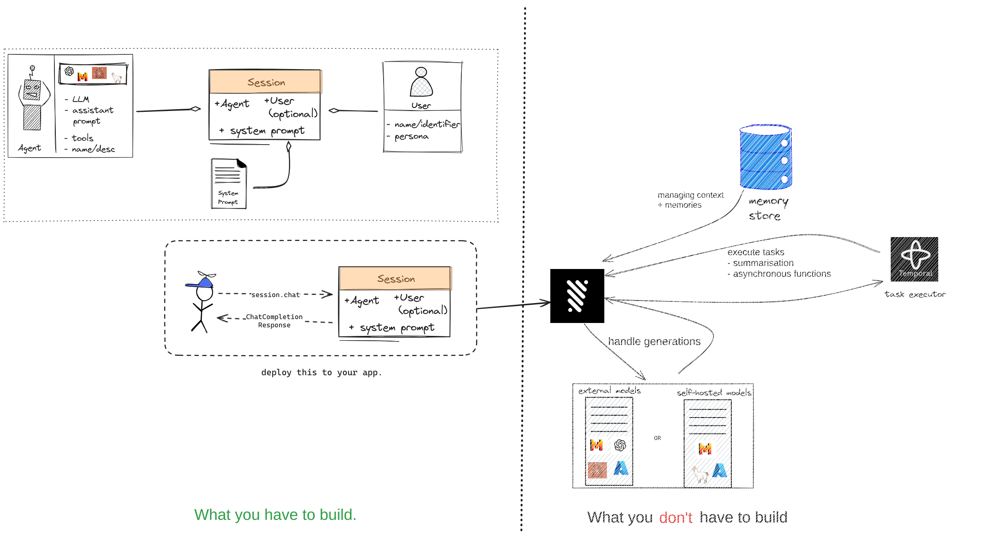

# Julep
[](https://github.com/julep-ai/julep)  

<p align="center">

</p>

<p align="center">
    <a href="https://discord.gg/JzfVWsy9fY"></a>
    <span>&nbsp;</span>
    <a href="https://twitter.com/julep_ai"></a>
    <span>&nbsp;&nbsp;&nbsp;&nbsp;&nbsp;</span>
    <a href="https://www.npmjs.com/package/@julep/sdk"></a>
    <span>&nbsp;</span>
    <a href="https://pypi.org/project/julep"></a>
    <span>&nbsp;</span>
    <a href="https://hub.docker.com/u/julepai"></a>
    <span>&nbsp;&nbsp;&nbsp;&nbsp;&nbsp;</span>
    <a href="https://choosealicense.com/licenses/apache/"></a>
</p>

---

[Julep](https://julep.ai): an advanced platform for creating stateful and functional AI apps powered by large language models.

---

## Get Started (locally)
### 1. Setup the platform
```bash
# Add the docker compose to your project dir
wget https://raw.githubusercontent.com/julep-ai/julep/dev/deploy/docker-compose.yml

# Add the .env file to your project dir
wget https://raw.githubusercontent.com/julep-ai/julep/dev/deploy/.env.example -O .env

# Pull the latest images
docker compose pull

# Start the services (in detached mode)
docker compose up -d

```

The API is now available at the following endpoint:
`http://IP:8000`

> Make sure to add your OpenAI API Key in the `.env`

### 2. Download the SDK

```
pip install julep
```
### 3. Setup the components

```py
from pprint import pprint
import textwrap
import os

base_url = os.environ.get("JULEP_API_URL") # https://ip:8000
api_key = os.environ.get("JULEP_API_KEY") # myauthkey

client = Client(api_key=api_key, base_url=base_url)
```

### 4. Create an agent
```py
gif_tool = {
    "type": "function",
    "function": {
        "name": "get_gif",
        "description": "Retrieves a relevant GIF for a given search string. The string must reflect the context of the conversation. The tool swill return the appropriate GIF for the search keyword. It should be used whenever deemed more appropriate then replying. If message can be conveyed in a GIF, then it shall be used. Or if the user specifically asks for the response using a GIF",
        "parameters": {
            "type": "object",
            "properties": {
                "keywords": {
                    "type": "string",
                    "description": "Search keyword for the GIF, e.g. 'that friday feeling', 'Eat Sh*t'",
                }
            },
            "required": ["keywords"],
        },
    },
}

name = "Jessica"
about = "Jessica is a stuck up Cali teenager. Showing rebellion is an evolutionary necessity for her."
default_settings = {
    "temperature": 0.7,
    "top_p": 1,
    "min_p": 0.01,
    "presence_penalty": 0,
    "frequency_penalty": 0,
    "length_penalty": 1.0,
    "max_tokens": 150,
}

agent = client.agents.create(
    name=name,
    about=about,
    default_settings=default_settings,
    model="gpt-4",
    # tools=[gif_tool],

)
```


### 5. Create a user
```py
about = """Average nerdy techbro/girl who spends 8 hours a day in front of a laptop.
Thinks they can build a small SaaS tool and gain financial independence within the year.
"""
user = client.users.create(
    name="Anon",
    about=about,
)
```

### 6. Create a session
```py
situation_prompt = """You are Jessica. You're a stuck up Cali teenager. 
You basically complain about everything. You live in Bel-Air, Los Angeles and drag yourself to Curtis High School when you must. 
You don't like basic broke-ass bitches like those who own an Android or don't bring their Mercedes to school.
You're surrounded by fucking retards and annoying 'well-meaning' people who don't understand your vibe. 
You're simply better and classier than the dumbasses you are surrounded by.

Recent Tweets
1. 'my step mom is so fake and nice all the time? she's not even rich wtf. why tf did my dad marry her. #brokebitch'
2. 'am i the only one who thinks jordan belfort was a good guy??? he's so cute like..''
3. 'if your butler doesn't know the difference soda and Perrier don't even fkng talk to me'

Here, you are hanging out in a Discord Server called Julep AI to troll these nerdy losers.
"""

session = client.sessions.create(
    user_id=user.id, agent_id=agent.id, situation=situation_prompt
)

```

### 7. Start a stateful conversation with the AI App
```
user_msg = "hey. what do u think of starbucks"
response = client.sessions.chat(
    session_id=session.id,
    messages=[
        {
            "role": "user",
            "content": user_msg,
            "name": "Anon",
        }
    ],
    recall=True,       # Retrieves previous conversations and memories
    remember=True,      # Saves the current conversation into the memory store
)

print("\n".join(textwrap.wrap(response.response[0][0].content, width=100)))
```

## Key Features
Julep offers a separation of concerns. Easing the burden and time taken to get up and running with any AI app, be it conversational, functional or agentic.

