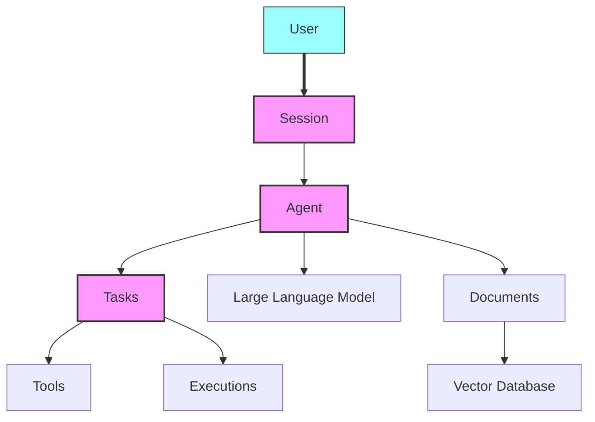

<sup>[English](README.md) | [中文翻译](README-CN.md) | [日本語翻訳](README-JA.md) | [French](README-FR.md)</sup>

<div align="center">
 
</div>

<p align="center">
  <br />
  <a href="https://docs.julep.ai" rel="dofollow"><strong>探索文档</strong></a>
  ·
  <a href="https://discord.com/invite/JTSBGRZrzj" rel="dofollow">不和谐</a>
  ·
  <a href="https://x.com/julep_ai" rel="dofollow">𝕏</a>
  ·
  <a href="https://www.linkedin.com/company/julep-ai" rel="dofollow">LinkedIn</a>
</p>


<p align="center">
    <a href="https://www.npmjs.com/package/@julep/sdk"></a>
    <span>&nbsp;</span>
    <a href="https://pypi.org/project/julep"></a>
    <span>&nbsp;</span>
    <a href="https://hub.docker.com/u/julepai"></a>
    <span>&nbsp;</span>
    <a href="https://choosealicense.com/licenses/apache/"></a>
</p>

*****

> [!注意]
> 👨‍💻 来参加 devfest.ai 活动了吗？加入我们的 [Discord](https://discord.com/invite/JTSBGRZrzj) 并查看以下详细信息。
> 
> 从 [此处](https://dashboard-dev.julep.ai) 获取您的 API 密钥。

<details>
<summary><b>🌟 贡献者和 DevFest.AI 参与者</b>（点击展开）</summary>

## 🌟 招募贡献者！

我们很高兴欢迎新贡献者加入 Julep 项目！我们创建了几个“好的第一个问题”来帮助您入门。以下是您可以做出贡献的方式：

1. 查看我们的 [CONTRIBUTING.md](https://github.com/julep-ai/julep/blob/dev/CONTRIBUTING.md) 文件以获取有关如何贡献的指南。
2. 浏览我们的 [good first issues](https://github.com/julep-ai/julep/issues?q=is%3Aissue+is%3Aopen+label%3A%22good+first+issue%22) 以找到您感兴趣的任务。
3. 如果您有任何疑问或需要帮助，请随时通过我们的 [Discord](https://discord.com/invite/JTSBGRZrzj) 频道联系我们。

您的贡献，无论大小，对我们来说都是宝贵的。让我们一起创造一些了不起的东西！🚀

### 🎉 DevFest.AI 2024 年 10 月

令人兴奋的消息！我们将参加 2024 年 10 月的 DevFest.AI！🗓️

- 在本次活动期间为 Julep 做出贡献，就有机会赢得超棒的 Julep 商品和赃物！🎁
- 与来自世界各地的开发人员一起为 AI 资源库做出贡献并参与精彩的活动。
- 非常感谢 DevFest.AI 组织这次精彩的活动！

> [!提示]
> 准备好加入这场有趣的活动了吗？**[发推文表示你正在参与](https://twitter.com/intent/tweet?text=Pumped%20to%20be%20participating%20in%20%40devfestai%20with%20%40julep_ai%20building%20%23ai%20%23agents%20%23workflows%20Let's%20gooo!%20https%3A%2F%2Fgit.new%2Fjulep)** 让我们开始编码吧！🖥️


</details>

<!-- START doctoc generated TOC please keep comment here to allow auto update -->
<!-- DON'T EDIT THIS SECTION, INSTEAD RE-RUN doctoc TO UPDATE -->
<details>
<summary><h3>📖 Table of Contents</h3></summary>

- [为什么选择 Julep 而不是 LangChain？](#%E4%B8%BA%E4%BB%80%E4%B9%88%E9%80%89%E6%8B%A9-julep-%E8%80%8C%E4%B8%8D%E6%98%AF-langchain)
  - [不同的用例](#%E4%B8%8D%E5%90%8C%E7%9A%84%E7%94%A8%E4%BE%8B)
  - [不同的外形尺寸](#%E4%B8%8D%E5%90%8C%E7%9A%84%E5%A4%96%E5%BD%A2%E5%B0%BA%E5%AF%B8)
- [Python 快速入门🐍](#python-%E5%BF%AB%E9%80%9F%E5%85%A5%E9%97%A8)
  - [步骤 1：创建代理](#%E6%AD%A5%E9%AA%A4-1%E5%88%9B%E5%BB%BA%E4%BB%A3%E7%90%86)
  - [步骤 2：创建一个生成故事和漫画的任务](#%E6%AD%A5%E9%AA%A4-2%E5%88%9B%E5%BB%BA%E4%B8%80%E4%B8%AA%E7%94%9F%E6%88%90%E6%95%85%E4%BA%8B%E5%92%8C%E6%BC%AB%E7%94%BB%E7%9A%84%E4%BB%BB%E5%8A%A1)
  - [步骤 3：执行任务](#%E6%AD%A5%E9%AA%A4-3%E6%89%A7%E8%A1%8C%E4%BB%BB%E5%8A%A1)
  - [步骤 4：与代理聊天](#%E6%AD%A5%E9%AA%A4-4%E4%B8%8E%E4%BB%A3%E7%90%86%E8%81%8A%E5%A4%A9)
- [Node.js 快速入门 🟩](#nodejs-%E5%BF%AB%E9%80%9F%E5%85%A5%E9%97%A8-)
  - [步骤 1：创建代理](#%E6%AD%A5%E9%AA%A4-1%E5%88%9B%E5%BB%BA%E4%BB%A3%E7%90%86-1)
  - [步骤 2：创建一个生成故事和漫画的任务](#%E6%AD%A5%E9%AA%A4-2%E5%88%9B%E5%BB%BA%E4%B8%80%E4%B8%AA%E7%94%9F%E6%88%90%E6%95%85%E4%BA%8B%E5%92%8C%E6%BC%AB%E7%94%BB%E7%9A%84%E4%BB%BB%E5%8A%A1-1)
  - [步骤 3：执行任务](#%E6%AD%A5%E9%AA%A4-3%E6%89%A7%E8%A1%8C%E4%BB%BB%E5%8A%A1-1)
  - [步骤 4：与代理聊天](#%E6%AD%A5%E9%AA%A4-4%E4%B8%8E%E4%BB%A3%E7%90%86%E8%81%8A%E5%A4%A9-1)
  - [心智模型](#%E5%BF%83%E6%99%BA%E6%A8%A1%E5%9E%8B)
- [概念](#%E6%A6%82%E5%BF%B5)
- [理解任务](#%E7%90%86%E8%A7%A3%E4%BB%BB%E5%8A%A1)
  - [工作流步骤的类型](#%E5%B7%A5%E4%BD%9C%E6%B5%81%E6%AD%A5%E9%AA%A4%E7%9A%84%E7%B1%BB%E5%9E%8B)
- [工具类型](#%E5%B7%A5%E5%85%B7%E7%B1%BB%E5%9E%8B)
  - [用户定义的函数](#%E7%94%A8%E6%88%B7%E5%AE%9A%E4%B9%89%E7%9A%84%E5%87%BD%E6%95%B0)
  - [`系统` 工具](#%E7%B3%BB%E7%BB%9F-%E5%B7%A5%E5%85%B7)
  - [内置“集成”](#%E5%86%85%E7%BD%AE%E9%9B%86%E6%88%90)
  - [直接 `api_call`](#%E7%9B%B4%E6%8E%A5-api_call)
- [集成](#%E9%9B%86%E6%88%90)
  - [勇敢搜索](#%E5%8B%87%E6%95%A2%E6%90%9C%E7%B4%A2)
  - [浏览器基础](#%E6%B5%8F%E8%A7%88%E5%99%A8%E5%9F%BA%E7%A1%80)
  - [向代理添加工具](#%E5%90%91%E4%BB%A3%E7%90%86%E6%B7%BB%E5%8A%A0%E5%B7%A5%E5%85%B7)
  - [管理会话和用户](#%E7%AE%A1%E7%90%86%E4%BC%9A%E8%AF%9D%E5%92%8C%E7%94%A8%E6%88%B7)
  - [文档集成与搜索](#%E6%96%87%E6%A1%A3%E9%9B%86%E6%88%90%E4%B8%8E%E6%90%9C%E7%B4%A2)
- [本地快速启动](#%E6%9C%AC%E5%9C%B0%E5%BF%AB%E9%80%9F%E5%90%AF%E5%8A%A8)
- [SDK 参考](#sdk-%E5%8F%82%E8%80%83)

</details>
<!-- END doctoc generated TOC please keep comment here to allow auto update -->

＃＃ 介绍

Julep 是一个用于创建 AI 代理的平台，这些代理可以记住过去的互动并执行复杂的任务。它提供长期记忆并管理多步骤流程。

Julep 支持创建多步骤任务，包括决策、循环、并行处理以及与众多外部工具和 API 的集成。

虽然许多人工智能应用程序仅限于简单、线性的提示链和 API 调用，并且分支很少，但 Julep 可以处理更复杂的场景。

它支持：
- 复杂、多步骤的流程
- 动态决策
- 并行执行

> [!提示]
> 想象一下，您想要构建一个 AI 代理，它不仅可以回答简单的问题，还可以处理复杂的任务，记住过去的交互，甚至可能使用其他工具或 API。这就是 Julep 的作用所在。

快速示例

想象一下一个可以执行以下操作的研究 AI 代理：
1. 选择一个主题，
2. 针对该主题提出 100 个搜索查询，
3. 同时进行网页搜索，
4. 总结结果，
5. 将摘要发送至 Discord

在 Julep 中，这将是一个单一的任务<b>80行代码</b>然后运行<b>完全托管</b>一切都是独立的。所有步骤都在 Julep 自己的服务器上执行，您无需动手。这是一个工作示例：

```yaml
name: Research Agent

# Optional: Define the input schema for the task
input_schema:
  type: object
  properties:
    topic:
      type: string
      description: The main topic to research

# Define the tools that the agent can use
tools:
- name: web_search
  type: integration
  integration:
    provider: brave
    setup:
      api_key: "YOUR_BRAVE_API_KEY"

- name: discord_webhook
  type: api_call
  api_call:
    url: "YOUR_DISCORD_WEBHOOK_URL"
    method: POST
    headers:
      Content-Type: application/json

# Special variables:
# - inputs: for accessing the input to the task
# - outputs: for accessing the output of previous steps
# - _: for accessing the output of the previous step

# Define the main workflow
main:
- prompt:
    - role: system
      content: >-
        You are a research assistant.
        Generate 100 diverse search queries related to the topic:
        {{inputs[0].topic}}

        Write one query per line.
  unwrap: true

# Evaluate the search queries using a simple python expression
- evaluate:
    search_queries: "_.split('\n')"

# Run the web search in parallel for each query
- over: "_.search_queries"
  map:
    tool: web_search
    arguments:
      query: "_"
  parallelism: 100

# Collect the results from the web search
- evaluate:
    results: "'\n'.join([item.result for item in _])"

# Summarize the results
- prompt:
    - role: system
      content: >
        You are a research summarizer. Create a comprehensive summary of the following research results on the topic {{inputs[0].topic}}.
        The summary should be well-structured, informative, and highlight key findings and insights:
        {{_.results}}
  unwrap: true

# Send the summary to Discord
- tool: discord_webhook
  arguments:
    content: >
      **Research Summary for {{inputs[0].topic}}**

      {{_}}
```

> [!提示]
> 当您想要构建能够在长期交互​​中保持上下文和状态的 AI 代理时，Julep 非常有用。它非常适合设计复杂的多步骤工作流程，并将各种工具和 API 直接集成到代理的流程中。
>
> 在此示例中，Julep 将自动管理并行执行，重试失败的步骤，重新发送 API 请求，并保持任务可靠运行直至完成。

主要特点

1. 🧠 **持久 AI 代理**：在长期交互​​中记住背景和信息。
2. 💾 **状态会话**：跟踪过去的互动以获得个性化回应。
3. 🔄 **多步骤任务**：使用循环和决策构建复杂的多步骤流程。
4. ⏳ **任务管理**：处理可以无限期运行的长时间运行的任务。
5.🛠️**内置工具**：在您的任务中使用内置工具和外部 API。
6. 🔧 **自我修复**：Julep 将自动重试失败的步骤、重新发送消息，并确保您的任务顺利运行。
7. 📚 **RAG**：使用 Julep 的文档存储构建一个用于检索和使用您自己的数据的系统。

Julep 非常适合需要超越简单的提示响应模型的 AI 用例的应用程序。

## 为什么选择 Julep 而不是 LangChain？

### 不同的用例

可以将 LangChain 和 Julep 视为 AI 开发堆栈中具有不同重点的工具。

LangChain 非常适合创建提示序列和管理与 AI 模型的交互。它拥有庞大的生态系统，包含大量预构建的集成，如果您想快速启动和运行某些功能，这会非常方便。LangChain 非常适合涉及线性提示链和 API 调用的简单用例。

另一方面，Julep 更注重构建持久的 AI 代理，这些代理可以在长期交互​​中记住事物。当您需要涉及多个步骤、决策以及在代理流程中直接与各种工具或 API 集成的复杂任务时，它会大放异彩。它从头开始设计，以管理持久会话和复杂任务。

如果您想构建一个需要执行以下操作的复杂 AI 助手，请使用 Julep：

- 跟踪几天或几周内的用户互动。
- 执行计划任务，例如发送每日摘要或监控数据源。
- 根据之前的互动或存储的数据做出决策。
- 作为其任务的一部分，与多个外部服务进行交互。

然后 Julep 提供支持所有这些的基础设施，而无需您从头开始构建。

### 不同的外形尺寸

Julep 是一个**平台**，其中包括用于描述任务的语言、用于运行这些任务的服务器以及用于与平台交互的 SDK。要使用 Julep 构建某些东西，您需要在“YAML”中编写任务描述，然后在云中运行该任务。

Julep 专为繁重、多步骤和长时间运行的任务而设计，并且对任务的复杂程度没有限制。

LangChain 是一个**库**，其中包含一些工具和一个用于构建线性提示和工具链的框架。要使用 LangChain 构建某些东西，您通常需要编写 Python 代码来配置和运行要使用的模型链。

对于涉及线性提示和 API 调用链的简单用例，LangChain 可能足够并且能够更快地实现。

＃＃＃ 总之

当您需要在无状态或短期环境中管理 AI 模型交互和提示序列时，请使用 LangChain。

当您需要一个具有高级任务功能、持久会话和复杂任务管理的状态代理的强大框架时，请选择 Julep。

＃＃ 安装

要开始使用 Julep，请使用 [npm](https://www.npmjs.com/package/@julep/sdk) 或 [pip](https://pypi.org/project/julep/) 安装它：

```bash
npm install @julep/sdk
```

或者

```bash
pip install julep
```

> [!注意]
> 从 [此处](https://dashboard-dev.julep.ai) 获取您的 API 密钥。
>
> 虽然我们处于测试阶段，但您也可以通过 [Discord](https://discord.com/invite/JTSBGRZrzj) 联系，以解除 API 密钥的速率限制。

> [!提示]
> 💻 你是“向我展示代码！”的那种人吗？我们创建了大量的烹饪书供您入门。**查看 [烹饪书](https://github.com/julep-ai/julep/tree/dev/cookbooks)** 以浏览示例。
>
> 💡 您还可以在 Julep 的基础上构建许多想法。**查看[想法列表](https://github.com/julep-ai/julep/tree/dev/cookbooks/IDEAS.md)** 以获取一些灵感。

## Python 快速入门🐍

### 步骤 1：创建代理

```python
import yaml
from julep import Julep # or AsyncJulep

client = Julep(api_key="your_julep_api_key")

agent = client.agents.create(
    name="Storytelling Agent",
    model="gpt-4o",
    about="You are a creative storytelling agent that can craft engaging stories and generate comic panels based on ideas.",
)

# 🛠️ Add an image generation tool (DALL·E) to the agent
client.agents.tools.create(
    agent_id=agent.id,
    name="image_generator",
    description="Use this tool to generate images based on descriptions.",
    integration={
        "provider": "dalle",
        "method": "generate_image",
        "setup": {
            "api_key": "your_openai_api_key",
        },
    },
)
```

### 步骤 2：创建一个生成故事和漫画的任务

让我们定义一个多步骤任务来创建一个故事并根据输入的想法生成面板漫画：

```python
# 📋 Task
# Create a task that takes an idea and creates a story and a 4-panel comic strip
task_yaml = """
name: Story and Comic Creator
description: Create a story based on an idea and generate a 4-panel comic strip illustrating the story.

main:
  # Step 1: Generate a story and outline into 4 panels
  - prompt:
      - role: system
        content: You are {{agent.name}}. {{agent.about}}
      - role: user
        content: >
          Based on the idea '{{_.idea}}', write a short story suitable for a 4-panel comic strip.
          Provide the story and a numbered list of 4 brief descriptions for each panel illustrating key moments in the story.
    unwrap: true

  # Step 2: Extract the panel descriptions and story
  - evaluate:
      story: _.split('1. ')[0].strip()
      panels: re.findall(r'\\d+\\.\\s*(.*?)(?=\\d+\\.\\s*|$)', _)

  # Step 3: Generate images for each panel using the image generator tool
  - foreach:
      in: _.panels
      do:
        tool: image_generator
        arguments:
          description: _

  # Step 4: Generate a catchy title for the story
  - prompt:
      - role: system
        content: You are {{agent.name}}. {{agent.about}}
      - role: user
        content: >
          Based on the story below, generate a catchy title.

          Story: {{outputs[1].story}}
    unwrap: true

  # Step 5: Return the story, the generated images, and the title
  - return:
      title: outputs[3]
      story: outputs[1].story
      comic_panels: "[output.image.url for output in outputs[2]]"
"""

task = client.tasks.create(
    agent_id=agent.id,
    **yaml.safe_load(task_yaml)
)
```

### 步骤 3：执行任务

```python
# 🚀 Execute the task with an input idea
execution = client.executions.create(
    task_id=task.id,
    input={"idea": "A cat who learns to fly"}
)

# 🎉 Watch as the story and comic panels are generated
for transition in client.executions.transitions.stream(execution_id=execution.id):
    print(transition)

# 📦 Once the execution is finished, retrieve the results
result = client.executions.get(execution_id=execution.id)
```

### 步骤 4：与代理聊天

开始与代理进行交互式聊天会话：

```python
session = client.sessions.create(agent_id=agent.id)

# 💬 Send messages to the agent
while (message := input("Enter a message: ")) != "quit":
    response = client.sessions.chat(
        session_id=session.id,
        message=message,
    )

    print(response)
```

> [!提示]
> 您可以在[这里](example.py)找到完整的 python 示例。


## Node.js 快速入门 🟩

### 步骤 1：创建代理

```javascript
import { Julep } from '@julep/sdk';
import yaml from 'js-yaml';

const client = new Julep({ apiKey: 'your_julep_api_key' });

async function createAgent() {
  const agent = await client.agents.create({
    name: "Storytelling Agent",
    model: "gpt-4",
    about: "You are a creative storytelling agent that can craft engaging stories and generate comic panels based on ideas.",
  });

  // 🛠️ Add an image generation tool (DALL·E) to the agent
  await client.agents.tools.create(agent.id, {
    name: "image_generator",
    description: "Use this tool to generate images based on descriptions.",
    integration: {
      provider: "dalle",
      method: "generate_image",
      setup: {
        api_key: "your_openai_api_key",
      },
    },
  });

  return agent;
}
```

### 步骤 2：创建一个生成故事和漫画的任务

```javascript
const taskYaml = `
name: Story and Comic Creator
description: Create a story based on an idea and generate a 4-panel comic strip illustrating the story.

main:
  # Step 1: Generate a story and outline into 4 panels
  - prompt:
      - role: system
        content: You are {{agent.name}}. {{agent.about}}
      - role: user
        content: >
          Based on the idea '{{_.idea}}', write a short story suitable for a 4-panel comic strip.
          Provide the story and a numbered list of 4 brief descriptions for each panel illustrating key moments in the story.
    unwrap: true

  # Step 2: Extract the panel descriptions and story
  - evaluate:
      story: _.split('1. ')[0].trim()
      panels: _.match(/\\d+\\.\\s*(.*?)(?=\\d+\\.\\s*|$)/g)

  # Step 3: Generate images for each panel using the image generator tool
  - foreach:
      in: _.panels
      do:
        tool: image_generator
        arguments:
          description: _

  # Step 4: Generate a catchy title for the story
  - prompt:
      - role: system
        content: You are {{agent.name}}. {{agent.about}}
      - role: user
        content: >
          Based on the story below, generate a catchy title.

          Story: {{outputs[1].story}}
    unwrap: true

  # Step 5: Return the story, the generated images, and the title
  - return:
      title: outputs[3]
      story: outputs[1].story
      comic_panels: outputs[2].map(output => output.image.url)
`;

async function createTask(agent) {
  const task = await client.tasks.create(agent.id, yaml.load(taskYaml));
  return task;
}
```

### 步骤 3：执行任务

```javascript
async function executeTask(task) {
  const execution = await client.executions.create(task.id, {
    input: { idea: "A cat who learns to fly" }
  });

  // 🎉 Watch as the story and comic panels are generated
  for await (const transition of client.executions.transitions.stream(execution.id)) {
    console.log(transition);
  }

  // 📦 Once the execution is finished, retrieve the results
  const result = await client.executions.get(execution.id);
  return result;
}
```

### 步骤 4：与代理聊天

```javascript
async function chatWithAgent(agent) {
  const session = await client.sessions.create({ agent_id: agent.id });

  // 💬 Send messages to the agent
  const rl = readline.createInterface({
    input: process.stdin,
    output: process.stdout
  });

  const chat = async () => {
    rl.question("Enter a message (or 'quit' to exit): ", async (message) => {
      if (message.toLowerCase() === 'quit') {
        rl.close();
        return;
      }

      const response = await client.sessions.chat(session.id, { message });
      console.log(response);
      chat();
    });
  };

  chat();
}

// Run the example
async function runExample() {
  const agent = await createAgent();
  const task = await createTask(agent);
  const result = await executeTask(task);
  console.log("Task Result:", result);
  await chatWithAgent(agent);
}

runExample().catch(console.error);
```

> [!提示]
> 您可以在[这里](example.js)找到完整的 Node.js 示例。

＃＃ 成分

Julep 由以下成分组成：

- **Julep 平台**：Julep 平台是运行您的工作流程的云服务。它包括用于描述工作流程的语言、用于运行这些工作流程的服务器以及用于与平台交互的 SDK。
- **Julep SDKs**：Julep SDKs 是一组用于构建工作流的库。目前有适用于 Python 和 JavaScript 的 SDKs，还有更多 SDKs 正在开发中。
- **Julep API**：Julep API 是一个 RESTful API，您可以使用它与 Julep 平台进行交互。

### 心智模型

<div align="center">
  
</div>

您可以将 Julep 视为一个结合了客户端和服务器端组件的平台，以帮助您构建高级 AI 代理。以下是它的可视化方法：

1. **您的申请代码：**
- 您可以在应用程序中使用 Julep SDK 来定义代理、任务和工作流。
- SDK 提供的函数和类使得设置和管理这些组件变得容易。

2. **Julep 后端服务：**
- SDK 通过网络与 Julep 后端通信。
- 后端处理任务的执行，维护会话状态，存储文档并协调工作流程。

3. **与工具和 API 集成：**
- 在您的工作流程中，您可以集成外部工具和服务。
- 后端促进这些集成，因此您的代理可以执行网络搜索、访问数据库或调用第三方 API。

简单来说：
- Julep 是一个用于构建有状态 AI 代理的平台。
- 您在代码中使用 SDK（类似工具包）来定义代理的功能。
- 后端服务（您可以将其视为引擎）运行这些定义、管理状态并处理复杂性。

## 概念

Julep 基于几个关键技术组件构建，这些组件共同协作以创建强大的 AI 工作流程：



- **代理**：由大型语言模型（LLM）支持的人工智能实体，可执行任务并与用户交互。
- **用户**：通过会话与代理交互的实体。
- **会话**：代理和用户之间的状态交互，在多个交换之间维护上下文。
- **任务**：代理可以执行的多步骤、程序化工作流，包括提示、工具调用和条件逻辑等各种类型的步骤。
- **工具**：扩展代理功能的集成，包括用户定义的函数、系统工具或第三方 API 集成。
- **文档**：与代理或用户相关的文本或数据对象，矢量化并存储以用于语义搜索和检索。
- **执行**：通过特定输入启动的任务实例，具有自己的生命周期和状态机。

有关这些概念及其相互作用的更详细说明，请参阅我们的[概念文档]（https://github.com/julep-ai/julep/blob/dev/docs/julep-concepts.md）。

## 理解任务

任务是 Julep 工作流系统的核心。它们允许您定义代理可以执行的复杂、多步骤 AI 工作流。以下是任务组件的简要概述：

- **名称和描述**：每个任务都有唯一的名称和描述，以便于识别。
- **主要步骤**：任务的核心，定义要执行的操作顺序。
- **工具**：可选集成，可在任务执行期间扩展代理的功能。

### 工作流步骤的类型

Julep 中的任务可以包含各种类型的步骤，让您可以创建复杂而强大的工作流程。以下是按类别组织的可用步骤类型的概述：

#### 常见步骤

1. **提示**：向AI模型发送消息并收到回复。
   ```yaml
   - prompt: "Analyze the following data: {{data}}"
   ```

2. **工具调用**：执行集成的工具或API。
   ```yaml
   - tool: web_search
     arguments:
       query: "Latest AI developments"
   ```

3. **评估**：执行计算或处理数据。
   ```yaml
   - evaluate:
       average_score: "sum(scores) / len(scores)"
   ```

4. **等待输入**：暂停工作流程，直到收到输入。
   ```yaml
   - wait_for_input:
       info:
         message: "Please provide additional information."
   ```

5. **日志**：记录指定的值或消息。
   ```yaml
   - log: "Processing completed for item {{item_id}}"
   ```

#### 键值步骤

6. **获取**：从键值存储中检索值。
   ```yaml
   - get: "user_preference"
   ```

7. **设置**：为键值存储中的键分配一个值。
   ```yaml
   - set:
       user_preference: "dark_mode"
   ```

#### 迭代步骤

8. **Foreach**：遍历集合并对每个项目执行步骤。
   ```yaml
   - foreach:
       in: "data_list"
       do:
         - log: "Processing item {{_}}"
   ```

9. **Map-Reduce**：对集合进行映射并减少结果。
   ```yaml
   - map_reduce:
       over: "numbers"
       map:
         - evaluate:
             squared: "_ ** 2"
       reduce: "sum(results)"
   ```

10.**并行**：并行运行多个步骤。
    ```yaml
    - parallel:
        - tool: web_search
          arguments:
            query: "AI news"
        - tool: weather_check
          arguments:
            location: "New York"
    ```

#### 条件步骤

11. **If-Else**：条件执行步骤。
    ```yaml
    - if: "score > 0.8"
      then:
        - log: "High score achieved"
      else:
        - log: "Score needs improvement"
    ```

12.**Switch**：根据多种条件执行步骤。
    ```yaml
    - switch:
        - case: "category == 'A'"
          then:
            - log: "Category A processing"
        - case: "category == 'B'"
          then:
            - log: "Category B processing"
        - case: "_"  # Default case
          then:
            - log: "Unknown category"
    ```

#### 其他控制流

13. **睡眠**：暂停工作流一段指定的时间。
    ```yaml
    - sleep:
        seconds: 30
    ```

14. **返回**：从工作流返回一个值。
    ```yaml
    - return:
        result: "Task completed successfully"
    ```

15. **收益**：运行子工作流并等待其完成。
    ```yaml
    - yield:
        workflow: "data_processing_subflow"
        arguments:
          input_data: "{{raw_data}}"
    ```

16.**错误**：通过指定错误消息来处理错误。
    ```yaml
    - error: "Invalid input provided"
    ```

每种步骤类型在构建复杂的 AI 工作流中都有特定的用途。此分类有助于理解 Julep 任务中可用的各种控制流程和操作。


## 工具类型

代理可以访问许多“工具”——基础模型可以使用一组输入“调用”的任何编程接口来实现目标。例如，它可以使用“web_search(query)”工具在互联网上搜索一些信息。

与代理框架不同，julep 是管理代理执行的后端。客户端可以使用我们的 SDK 与代理进行交互。julep 负责执行任务和运行集成。

julep 中的工具可以是以下之一：

### 用户定义的函数

这些是您可以为模型提供的函数签名，类似于 [openai] 的函数调用工作方式。例如：

```yaml    
    name: Example system tool task
    description: List agents using system call

    tools:
    - name: send_notification
      description: Send a notification to the user
      type: function
      function:
        parameters:
          type: object
          properties:
            text:
              type: string
              description: Content of the notification

    main:
    - tool: send_notification
      arguments:
        content: hi
```
  
每当 julep 遇到_用户定义函数_时，它就会暂停，将控制权交还给客户端，并等待客户端运行函数调用并将结果返回给 julep。

> [!提示]
> **示例食谱**：[cookbooks/13-Error_Handling_and_Recovery.py](https://github.com/julep-ai/julep/blob/dev/cookbooks/13-Error_Handling_and_Recovery.py)

### `系统` 工具
内置工具可用于调用 julep API 本身，例如触发任务执行、附加到元数据字段等。
“系统”工具内置于后端。它们会在需要时自动执行。它们不需要客户端的任何操作。
 
例如，
  
  ```yaml
    name: Example system tool task
    description: List agents using system call

    tools:
    - name: list_agents
      description: List all agents
      type: system
      system:
        resource: agent
        operation: list
    main:
    - tool: list_agents
      arguments:
        limit: 10
  ```

> [!提示]
> **示例食谱**：[cookbooks/10-Document_Management_and_Search.py​​](https://github.com/julep-ai/julep/blob/dev/cookbooks/10-Document_Management_and_Search.py​​)
 
### 内置“集成”
Julep 带有许多内置集成（如下节所述）。`集成` 工具直接在 julep 后端执行。它们在运行时所需的任何其他参数都可以在代理/会话/用户的 `元数据` 字段中设置。

> [!提示]
> **示例食谱**：[cookbooks/01-Website_Crawler_using_Spider.ipynb](https://github.com/julep-ai/julep/blob/dev/cookbooks/01-Website_Crawler_using_Spider.ipynb)

julep 后端附带来自以下提供商的集成第三方工具：
- [composio](https://composio.dev) \*\*
- [匿名](https://anon.com) \*\*
- [langchain 工具包](https://python.langchain.com/v0.2/docs/integrations/toolkits/)。计划支持 _Github、Gitlab、Gmail、Jira、MultiOn、Slack_ 工具包。

\*\* 由于 _composio_ 和 _anon_ 是第三方提供商，因此他们的工具需要设置帐户链接。


### 直接 `api_call`

julep 还可以在工作流执行期间直接以工具调用的形式进行 api 调用。与“集成”相同，其他运行时参数从“元数据”字段加载。
  
例如，
  
  ```yaml
    name: Example api_call task
    tools:
    - type: api_call
      name: hello
      api_call:
        method: GET
        url: https://httpbin.org/get
    main:
    - tool: hello
      arguments:
        params:
          test: _.input
  ```

## 集成

Julep 支持各种集成，可以扩展您的 AI 代理的功能。以下是可用集成及其支持的参数的列表：

### 勇敢搜索

```yaml
setup:
  api_key: string  # The API key for Brave Search

arguments:
  query: string  # The search query for searching with Brave

output:
  result: string  # The result of the Brave Search
```

> [!提示]
> **示例食谱**：[cookbooks/03-SmartResearcher_With_WebSearch.ipynb](https://github.com/julep-ai/julep/blob/dev/cookbooks/03-SmartResearcher_With_WebSearch.ipynb)

### 浏览器基础

```yaml
setup:
  api_key: string       # The API key for BrowserBase
  project_id: string    # The project ID for BrowserBase
  session_id: string    # (Optional) The session ID for BrowserBase

arguments:
  urls: list[string]    # The URLs for loading with BrowserBase

output:
  documents: list       # The documents loaded from the URLs
```

＃＃＃ 电子邮件

```yaml
setup:
  host: string      # The host of the email server
  port: integer     # The port of the email server
  user: string      # The username of the email server
  password: string  # The password of the email server

arguments:
  to: string        # The email address to send the email to
  from: string      # The email address to send the email from
  subject: string   # The subject of the email
  body: string      # The body of the email

output:
  success: boolean  # Whether the email was sent successfully
```

> [!提示]
> **示例食谱**：[cookbooks/00-Devfest-Email-Assistant.ipynb](https://github.com/julep-ai/julep/blob/dev/cookbooks/00-Devfest-Email-Assistant.ipynb)

＃＃＃ 蜘蛛

```yaml
setup:
  spider_api_key: string  # The API key for Spider

arguments:
  url: string             # The URL for which to fetch data
  mode: string            # The type of crawlers (default: "scrape")
  params: dict            # (Optional) The parameters for the Spider API

output:
  documents: list         # The documents returned from the spider
```

> [!提示]
> **示例食谱**：[cookbooks/01-Website_Crawler_using_Spider.ipynb](https://github.com/julep-ai/julep/blob/dev/cookbooks/01-Website_Crawler_using_Spider.ipynb)

＃＃＃ 天气

```yaml
setup:
  openweathermap_api_key: string  # The API key for OpenWeatherMap

arguments:
  location: string                # The location for which to fetch weather data

output:
  result: string                  # The weather data for the specified location
```

> [!提示]
> **示例食谱**：[cookbooks/04-TripPlanner_With_Weather_And_WikiInfo.ipynb](https://github.com/julep-ai/julep/blob/dev/cookbooks/04-TripPlanner_With_Weather_And_WikiInfo.ipynb)

维基百科

```yaml
arguments:
  query: string           # The search query string
  load_max_docs: integer  # Maximum number of documents to load (default: 2)

output:
  documents: list         # The documents returned from the Wikipedia search
```

> [!提示]
> **示例食谱**：[cookbooks/04-TripPlanner_With_Weather_And_WikiInfo.ipynb](https://github.com/julep-ai/julep/blob/dev/cookbooks/04-TripPlanner_With_Weather_And_WikiInfo.ipynb)

这些集成可用于您的任务中，以扩展您的 AI 代理的功能。有关如何在您的工作流程中使用这些集成的详细信息，请参阅我们的 [集成文档](https://docs.julep.ai/integrations)。

其他功能

Julep 提供一系列高级功能来增强您的 AI 工作流程：

### 向代理添加工具

通过集成外部工具和 API 来扩展代理的功能：

```python
client.agents.tools.create(
    agent_id=agent.id,
    name="web_search",
    description="Search the web for information.",
    integration={
        "provider": "brave",
        "method": "search",
        "setup": {"api_key": "your_brave_api_key"},
    },
)
```

### 管理会话和用户

Julep 为持久交互提供了强大的会话管理：

```python
session = client.sessions.create(
    agent_id=agent.id,
    user_id=user.id,
    context_overflow="adaptive"
)

# Continue conversation in the same session
response = client.sessions.chat(
    session_id=session.id,
    messages=[
      {
        "role": "user",
        "content": "Follow up on the previous conversation."
      }
    ]
)
```

### 文档集成与搜索

轻松管理和搜索代理的文档：

```python
# Upload a document
document = client.agents.docs.create(
    title="AI advancements",
    content="AI is changing the world...",
    metadata={"category": "research_paper"}
)

# Search documents
results = client.agents.docs.search(
    text="AI advancements",
    metadata_filter={"category": "research_paper"}
)
```

## 本地快速启动

**要求**：
- 安装了最新的docker compose

**步骤**：
1. `git 克隆 https://github.com/julep-ai/julep.git`
2. `cd julep`
3. `docker 卷创建 cozo_backup`
4. `docker 卷创建 cozo_data`
5. `cp .env.example .env # <-- 编辑此文件`
6. `docker compose --env-file .env --profile temporary-ui --profile single-tenant --profile self-hosted-db up --build`

## SDK 参考

- [Node.js SDK]（https://github.com/julep-ai/node-sdk/blob/main/api.md）
- [Python SDK]（https://github.com/julep-ai/python-sdk/blob/main/api.md）

API 参考

浏览我们全面的 API 文档，了解有关代理、任务和执行的更多信息：

- [代理 API](https://api.julep.ai/api/docs#tag/agents)
- [任务 API](https://api.julep.ai/api/docs#tag/tasks)
- [执行 API](https://api.julep.ai/api/docs#tag/executions)


  <div align="center">
    <a href="#top">
        
    </a>
</div>

