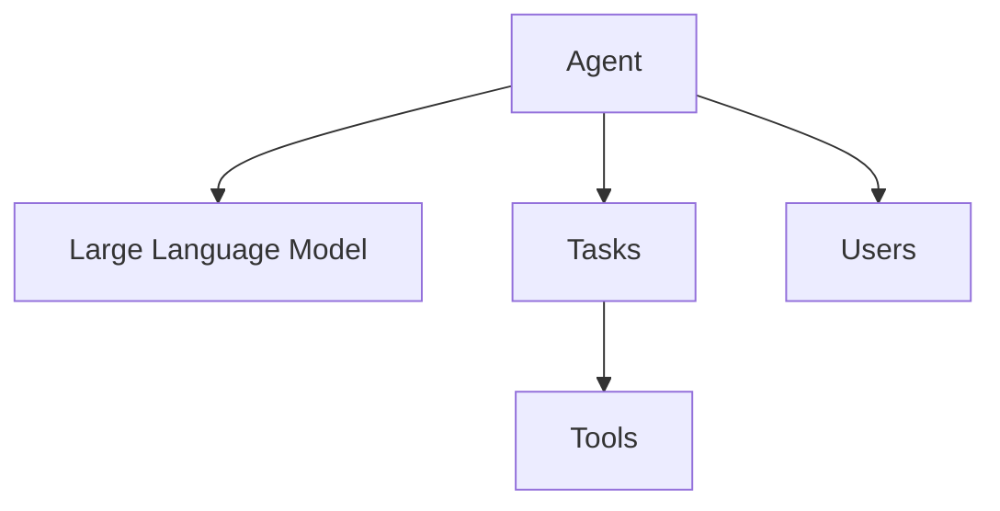
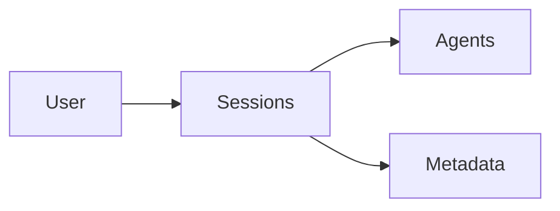
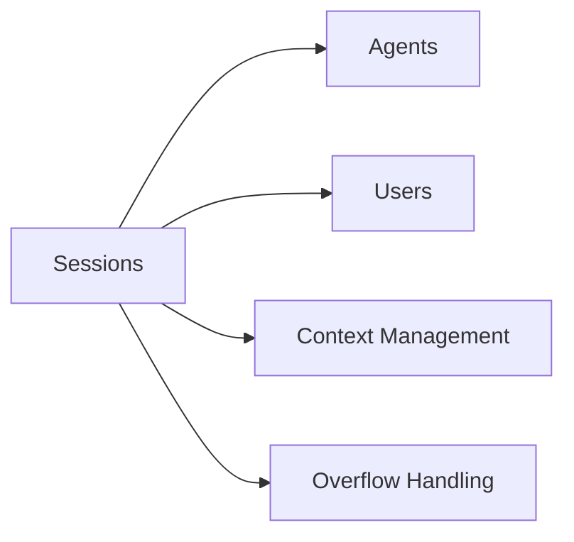
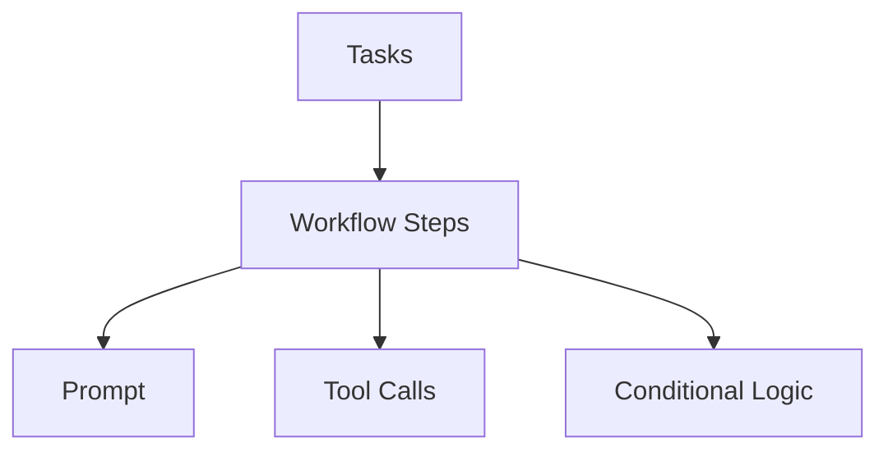
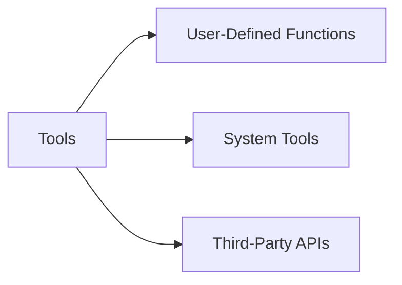
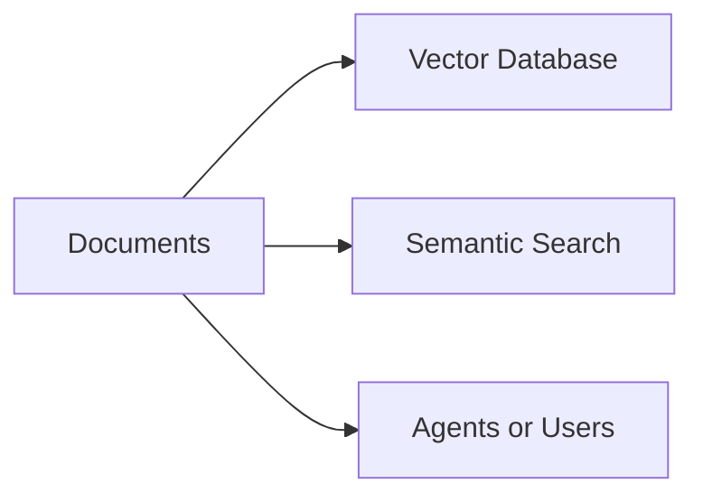
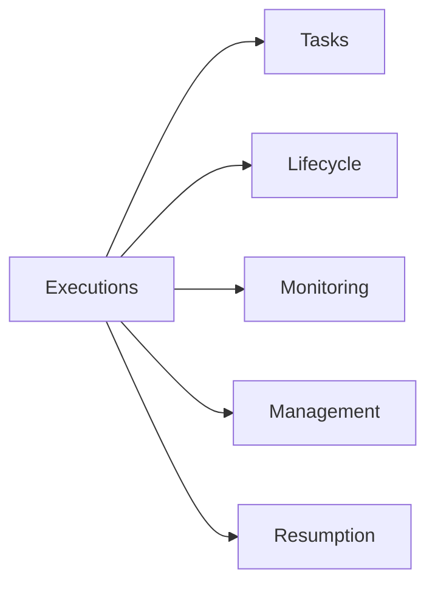

<sup>English | [中文翻译](/README-CN.md) | [日本語翻訳](/README-JP.md) | [Traduction en français](/README-FR.md)</sup>

<div align="center">
 
</div>

<p align="center">
  <br />
  <a href="https://docs.julep.ai" rel="dofollow"><strong>Explorer les documents</strong></a>
  ·
  <a href="https://discord.com/invite/JTSBGRZrzj" rel="dofollow">Discord</a>
  ·
  <a href="https://x.com/julep_ai" rel="dofollow">𝕏</a>
  ·
  <a href="https://www.linkedin.com/company/julep-ai" rel="dofollow">LinkedIn</a>
</p>


<p align="center">
    <a href="https://www.npmjs.com/package/@julep/sdk"></a>
    <span>&nbsp;</span>
    <a href="https://pypi.org/project/julep"></a>
    <span>&nbsp;</span>
    <a href="https://hub.docker.com/u/julepai"></a>
    <span>&nbsp;</span>
    <a href="https://choosealicense.com/licenses/apache/"></a>
</p>

*****

> [!NOTE]
> 👨‍💻 Vous êtes ici pour l'événement devfest.ai ? Rejoignez notre [Discord](https://discord.com/invite/JTSBGRZrzj) et consultez les détails ci-dessous.

<details>
<summary><b>🌟 Contributeurs et participants au DevFest.AI</b> (Cliquez pour agrandir)</summary>

## 🌟 Appel à contributions!

Nous sommes ravis d'accueillir de nouveaux contributeurs au projet Julep ! Nous avons créé plusieurs « bons premiers numéros » pour vous aider à démarrer. Voici comment vous pouvez contribuer :

1. Consultez notre fichier [CONTRIBUTING.md](CONTRIBUTING.md) pour obtenir des instructions sur la façon de contribuer.
2. Parcourez nos [bons premiers numéros](https://github.com/julep-ai/julep/issues?q=is%3Aissue+is%3Aopen+label%3A%22good+first+issue%22) pour trouver une tâche qui vous intéresse.
3. Si vous avez des questions ou avez besoin d'aide, n'hésitez pas à nous contacter sur notre [Discord](https://discord.com/invite/JTSBGRZrzj) chaîne.

Vos contributions, grandes ou petites, nous sont précieuses. Construisons ensemble quelque chose d'extraordinaire ! 🚀

### 🎉 DevFest.AI octobre 2024

Des nouvelles passionnantes ! Nous participons au DevFest.AI tout au long du mois d'octobre 2024 ! 🗓️

- Contribuez à Julep pendant cet événement et courez la chance de gagner de superbes produits et cadeaux Julep ! 🎁
- Rejoignez les développeurs du monde entier en contribuant aux référentiels d'IA et en participant à des événements incroyables.
- Un grand merci à DevFest.AI pour l'organisation de cette fantastique initiative !

> [!TIP]
> Prêt à vous joindre à la fête ? **[Tweetez que vous participez](https://twitter.com/intent/tweet?text=Pumped%20to%20be%20participating%20in%20%40devfestai%20with%20%40julep_ai%20building%20%23ai%20%20%23agents%20%23workflows%20Let's%20gooo!%20https%3A%2F%2Fgit.new%2Fjulep)** et commençons à coder ! 🖥️


</details>

<!-- START doctoc generated TOC please keep comment here to allow auto update -->
<!-- DON'T EDIT THIS SECTION, INSTEAD RE-RUN doctoc TO UPDATE -->
<details>
<summary><h3>📖 Table of Contents</h3></summary>

- [Introduction](#introduction)
- [Exemple rapide](#quick-example)
- [Caractéristiques principales](#key-features)
- [Pourquoi Julep vs. LangChain ?](#why-julep-vs-langchain)
  - [Différents cas d'utilisation](#different-use-cases)
  - [Facteur de forme différent](#different-form-factor)
  - [En résumé](#in-summary)
- [Installation](#installation)
- [Démarrage rapide de Python 🐍](#python-quick-start-)
  - [Étape 1 : Créer un agent](#step-1-create-an-agent)
  - [Étape 2 : Créer une tâche qui génère une histoire et une bande dessinée](#step-2-create-a-task-that-generates-a-story-and-comic-strip)
  - [Étape 3 : Exécuter la tâche](#step-3-execute-the-task)
  - [Étape 4 : Discutez avec l'agent](#step-4-chat-with-the-agent)
- [Démarrage rapide de Node.js 🟩](#nodejs-quick-start-)
  - [Étape 1 : Créer un agent](#step-1-create-an-agent-1)
  - [Étape 2 : Créer une tâche qui génère une histoire et une bande dessinée](#step-2-create-a-task-that-generates-a-story-and-comic-strip-1)
  - [Étape 3 : Exécuter la tâche](#step-3-execute-the-task-1)
  - [Étape 4 : Discutez avec l'agent](#step-4-chat-with-the-agent-1)
- [Composantes](#components)
  - [Modèle mental](#mental-model)
- [Concepts](#concepts)
- [Comprendre les tâches](#understanding-tasks)
  - [Types d'étapes du flux de travail](#types-of-workflow-steps)
- [Fonctionnalités avancées](#advanced-features)
  - [Ajout d'outils aux agents](#adding-tools-to-agents)
  - [Gestion des sessions et des utilisateurs](#managing-sessions-and-users)
  - [Intégration et recherche de documents](#document-integration-and-search)
- [Référence du SDK](#sdk-reference)
- [Référence API](#api-reference)

</details>
<!-- END doctoc generated TOC please keep comment here to allow auto update -->

## Introduction

<!-- TODO: Add a screencast -->

Julep est une plateforme permettant de créer des agents d'IA qui maintiennent l'état et exécutent des flux de travail complexes. Elle offre un contexte à long terme et orchestre des tâches en plusieurs étapes.

Julep vous permet de définir des tâches en plusieurs étapes qui peuvent inclure une logique conditionnelle, des boucles, un traitement parallèle et une intégration intégrée avec des centaines d'outils et d'API externes. En règle générale, les applications d'IA ont tendance à être linéaires et à avoir des chaînes simples d'une poignée d'invites et d'appels d'API sans beaucoup de ramifications ou de prise de décision.

> [!TIP]
> Imaginez que vous souhaitiez créer un agent d'IA capable de faire plus que simplement répondre à des requêtes simples : il doit gérer des tâches complexes, mémoriser des interactions passées et peut-être même s'intégrer à d'autres outils ou API. C'est là qu'intervient Julep.

## Exemple rapide

Imaginez un agent d’IA de recherche capable d’effectuer les opérations suivantes :
  1. Prenez un sujet,
  2. Proposez 100 requêtes de recherche pour ce sujet,
  3. Effectuez ces recherches sur le Web en parallèle,
  4. Recueillir et compiler les résultats,
  5. Proposez 5 questions de suivi,
  6. Répétez le processus avec de nouvelles requêtes,
  7. Résumer les résultats,
  8. Envoyez le résumé sur Discord

Dans Julep, il s'agirait d'une tâche unique de moins de <b>80 lignes de code</b> et exécutée de manière <b>entièrement gérée</b> de manière autonome. Voici un exemple fonctionnel :

```yaml
name: Research Agent

# Facultatif : définir le schéma d’entrée pour la tâche
input_schema:
  type: object
  properties:
    topic:
      type: string
      description: The main topic to research

# Définir les outils que l'agent peut utiliser
tools:
- name: web_search
  type: integration
  integration:
    provider: brave
    setup:
      api_key: "YOUR_BRAVE_API_KEY"

- name: discord_webhook
  type: api_call
  api_call:
    url: "YOUR_DISCORD_WEBHOOK_URL"
    method: POST
    headers:
      Content-Type: application/json

# Variables spéciales :
# - entrées : pour accéder à l'entrée de la tâche
# - sorties : pour accéder à la sortie des étapes précédentes
# - _ : pour accéder à la sortie de l'étape précédente

# Définir le flux de travail principal
main:
- prompt:
    - role: system
      content: >-
        You are a research assistant.
        Generate 100 diverse search queries related to the topic:
        {{inputs[0].topic}}

        Write one query per line.
  unwrap: true

# Évaluer les requêtes de recherche à l'aide d'une simple expression Python
- evaluate:
    search_queries: "_.split('\n')"

# Exécutez la recherche Web en parallèle pour chaque requête
- over: "_.search_queries"
  map:
    tool: web_search
    arguments:
      query: "_"
    on_error:
  parallelism: 100

# Collecter les résultats de la recherche sur le Web
- evaluate:
    results: "'\n'.join([item.result for item in _])"

# Générer des questions de suivi en fonction des résultats
- prompt:
    - role: system
      content: >-
        Based on the following research results, generate 5 follow-up questions that would deepen our understanding of {{inputs[0].topic}}:
        {{_.results}}

        Write one question per line.
  unwrap: true

- evaluate:
    follow_up_queries: "_.split('\n')"

# Exécutez la recherche Web en parallèle pour chaque requête de suivi
- over: "_.follow_up_queries"
  map:
    tool: web_search
    arguments:
      query: "_"

  parallelism: 5

- evaluate:
    all_results: "outputs[3].results + '\n'.join([item.result for item in _])"

# Résumer les résultats
- prompt:
    - role: system
      content: >
        You are a research summarizer. Create a comprehensive summary of the following research results on the topic {{inputs[0].topic}}. 
        The summary should be well-structured, informative, and highlight key findings and insights:
        {{_.all_results}}
  unwrap: true

# Envoyer le résumé sur Discord
- tool: discord_webhook
  arguments:
    content: >
      **Research Summary for {{inputs[0].topic}}**

      {{_}}
```

> [!TIP]
> Julep est vraiment utile lorsque vous souhaitez créer des agents IA capables de conserver le contexte et l'état lors d'interactions à long terme. Il est idéal pour concevoir des flux de travail complexes en plusieurs étapes et pour intégrer divers outils et API directement dans les processus de votre agent.
> 
> Dans cet exemple, Julep gérera automatiquement les exécutions parallèles, réessayera les étapes ayant échoué, renverra les requêtes d'API et maintiendra les workflows en cours d'exécution de manière fiable jusqu'à leur achèvement.

## Key Features

1. **Agents IA persistants** : conservez le contexte et l'état au cours des interactions à long terme.
2. **Sessions avec état** : mémorisez les interactions passées pour des réponses personnalisées.
3. **Flux de travail en plusieurs étapes** : créez des processus complexes en plusieurs étapes avec des boucles et une logique conditionnelle.
4. **Orchestration des tâches** : gérez les tâches de longue durée qui peuvent s'exécuter indéfiniment.
5. **Outils intégrés** : intégrez des outils intégrés et des API externes dans les flux de travail.
6. **Auto-réparation** : Julep réessaiera automatiquement les étapes ayant échoué, renverra les messages et assurera généralement le bon fonctionnement de vos flux de travail.
7. **RAG** : utilisez le magasin de documents de Julep pour créer un système RAG pour vos propres données.

Julep est idéal pour les applications qui nécessitent des cas d’utilisation de l’IA au-delà des simples modèles de réponse rapide.

## Pourquoi Julep vs. LangChain ?

### Différents cas d'utilisation

Considérez LangChain et Julep comme des outils avec des objectifs différents au sein de la pile de développement d'IA.

LangChain est idéal pour créer des séquences d'invites et gérer les interactions avec les LLM. Il dispose d'un vaste écosystème avec de nombreuses intégrations prédéfinies, ce qui le rend pratique si vous souhaitez mettre en place quelque chose rapidement. LangChain s'adapte bien aux cas d'utilisation simples qui impliquent une chaîne linéaire d'invites et d'appels d'API.

Julep, en revanche, vise davantage à créer des agents d'IA persistants capables de conserver le contexte sur des interactions à long terme. Il est idéal lorsque vous avez besoin de flux de travail complexes impliquant des tâches en plusieurs étapes, une logique conditionnelle et une intégration avec divers outils ou API directement dans le processus de l'agent. Il est conçu dès le départ pour gérer les sessions persistantes et les flux de travail complexes.

Utilisez Julep si vous imaginez créer un assistant d'IA complexe qui doit :

- Suivez les interactions des utilisateurs sur plusieurs jours ou semaines.
- Effectuez des tâches planifiées, comme l'envoi de résumés quotidiens ou la surveillance des sources de données.
- Prenez des décisions en fonction des interactions antérieures ou des données stockées.
- Interagissez avec plusieurs services externes dans le cadre de son flux de travail.

Ensuite, Julep fournit l’infrastructure pour prendre en charge tout cela sans que vous ayez à le construire à partir de zéro.

### Facteur de forme différent

Julep est une **plate-forme** qui comprend un langage pour décrire les flux de travail, un serveur pour exécuter ces flux de travail et un SDK pour interagir avec la plateforme. Pour créer quelque chose avec Julep, vous écrivez une description du flux de travail dans `YAML`, puis vous exécutez le flux de travail dans le cloud.

Julep est conçu pour les flux de travail lourds, à plusieurs étapes et de longue durée, et il n'y a aucune limite à la complexité du flux de travail.

LangChain est une **bibliothèque** qui comprend quelques outils et un framework pour créer des chaînes linéaires d'invites et d'outils. Pour créer quelque chose avec LangChain, vous écrivez généralement du code Python qui configure et exécute les chaînes de modèles que vous souhaitez utiliser.

LangChain peut être suffisant et plus rapide à mettre en œuvre pour les cas d'utilisation simples qui impliquent une chaîne linéaire d'invites et d'appels d'API.

### En résumé

Utilisez LangChain lorsque vous devez gérer les interactions LLM et les séquences d'invite dans un contexte sans état ou à court terme.

Choisissez Julep lorsque vous avez besoin d'un cadre robuste pour les agents avec état avec des capacités de workflow avancées, des sessions persistantes et une orchestration de tâches complexes.

## Installation

Pour commencer à utiliser Julep, installez-le en utilisant [npm](https://www.npmjs.com/package/@julep/sdk) ou [pip](https://pypi.org/project/julep/) :

```bash
npm install @julep/sdk
```

ou

```bash
pip install julep
```

> [!NOTE]
> ~~Obtenez votre clé API [ici](https://app.julep.ai/api-keys).~~
>  
> Pendant que nous sommes en version bêta, vous pouvez nous contacter sur [Discord](https://discord.com/invite/JTSBGRZrzj) pour obtenir votre clé API.

> [!TIP]
> 💻 Êtes-vous du genre à vouloir _montrez-moi le code !™_ ? Nous avons créé de nombreux livres de recettes pour vous aider à démarrer. **Consultez les [livres de recettes](/cookbooks)** pour parcourir les exemples.
> 
> 💡 Il existe également de nombreuses idées que vous pouvez développer à partir de Julep. **Consultez la [liste d'idées](/cookbooks/IDEAS.md)** pour vous inspirer.

## Démarrage rapide de Python 🐍

### Étape 1 : Créer un agent

```python
import yaml
from julep import Julep # or AsyncJulep

client = Julep(api_key="your_julep_api_key")

agent = client.agents.create(
    name="Storytelling Agent",
    model="gpt-4o",
    about="You are a creative storytelling agent that can craft engaging stories and generate comic panels based on ideas.",
)

# 🛠️ Ajouter un outil de génération d'images (DALL·E) à l'agent
client.agents.tools.create(
    agent_id=agent.id,
    name="image_generator",
    description="Use this tool to generate images based on descriptions.",
    integration={
        "provider": "dalle",
        "method": "generate_image",
        "setup": {
            "api_key": "your_openai_api_key",
        },
    },
)
```

### Étape 2 : Créer une tâche qui génère une histoire et une bande dessinée

Définissons une tâche en plusieurs étapes pour créer une histoire et générer une bande dessinée à panneaux à partir d'une idée d'entrée :

```python
# 📋 Tâche
# Créez une tâche qui prend une idée et crée une histoire et une bande dessinée à 4 panneaux
task_yaml = """
name: Story and Comic Creator
description: Create a story based on an idea and generate a 4-panel comic strip illustrating the story.

main:
  # Step 1: Generate a story and outline into 4 panels
  - prompt:
      - role: system
        content: You are {{agent.name}}. {{agent.about}}
      - role: user
        content: >
          Based on the idea '{{_.idea}}', write a short story suitable for a 4-panel comic strip.
          Provide the story and a numbered list of 4 brief descriptions for each panel illustrating key moments in the story.
    unwrap: true

  # Step 2: Extract the panel descriptions and story
  - evaluate:
      story: _.split('1. ')[0].strip()
      panels: re.findall(r'\\d+\\.\\s*(.*?)(?=\\d+\\.\\s*|$)', _)

  # Step 3: Generate images for each panel using the image generator tool
  - foreach:
      in: _.panels
      do:
        tool: image_generator
        arguments:
          description: _

  # Step 4: Generate a catchy title for the story
  - prompt:
      - role: system
        content: You are {{agent.name}}. {{agent.about}}
      - role: user
        content: >
          Based on the story below, generate a catchy title.

          Story: {{outputs[1].story}}
    unwrap: true

  # Step 5: Return the story, the generated images, and the title
  - return:
      title: outputs[3]
      story: outputs[1].story
      comic_panels: "[output.image.url for output in outputs[2]]"
"""

task = client.tasks.create(
    agent_id=agent.id,
    **yaml.safe_load(task_yaml)
)
```

### Étape 3 : Exécuter la tâche

```python
# 🚀 Exécuter la tâche avec une idée d'entrée
execution = client.executions.create(
    task_id=task.id,
    input={"idea": "A cat who learns to fly"}
)

# 🎉 Regardez comment l'histoire et les panneaux de bande dessinée sont générés
for transition in client.executions.transitions.stream(execution_id=execution.id):
    print(transition)

# 📦 Une fois l'exécution terminée, récupérez les résultats
result = client.executions.get(execution_id=execution.id)
```

### Étape 4 : Discuter avec l'agent

Démarrez une session de chat interactive avec l'agent :

```python
session = client.sessions.create(agent_id=agent.id)

# 💬 Envoyer des messages à l'agent
while (message := input("Enter a message: ")) != "quit":
    response = client.sessions.chat(
        session_id=session.id,
        message=message,
    )

    print(response)
``` 

> [!TIP]
> Vous pouvez trouver l'exemple Python complet [ici](example.py).


## Démarrage rapide de Node.js 🟩

### Étape 1 : Créer un agent

```javascript
import { Julep } from '@julep/sdk';
import yaml from 'js-yaml';

const client = new Julep({ apiKey: 'your_julep_api_key' });

async function createAgent() {
  const agent = await client.agents.create({
    name: "Storytelling Agent",
    model: "gpt-4",
    about: "You are a creative storytelling agent that can craft engaging stories and generate comic panels based on ideas.",
  });

  // 🛠️ Ajouter un outil de génération d'images (DALL·E) à l'agent
  await client.agents.tools.create(agent.id, {
    name: "image_generator",
    description: "Use this tool to generate images based on descriptions.",
    integration: {
      provider: "dalle",
      method: "generate_image",
      setup: {
        api_key: "your_openai_api_key",
      },
    },
  });

  return agent;
}
```

### Étape 2 : Créer une tâche qui génère une histoire et une bande dessinée

```javascript
const taskYaml = `
nom : Créateur d'histoires et de bandes dessinées
description : Créez une histoire basée sur une idée et générez une bande dessinée de 4 panneaux illustrant l'histoire.

main:
  # Étape 1 : Générez une histoire et un plan en 4 panneaux
  - rapide:
      - role: system
        contenu: Tu es {{agent.name}}. {{agent.about}}
      - role: user
        contenu: >
          Sur la base de l’idée « {{_.idea}} », écrivez une histoire courte adaptée à une bande dessinée de 4 panneaux.
          Fournissez l’histoire et une liste numérotée de 4 brèves descriptions pour chaque panneau illustrant les moments clés de l’histoire.
    déballer: vrai

  # Étape 2 : Extraire les descriptions et l'histoire des panneaux
  - évaluer:
      story: _.split('1. ')[0].trim()
      panels: _.match(/\\d+\\.\\s*(.*?)(?=\\d+\\.\\s*|$)/g)

  # Étape 3 : Générer des images pour chaque panneau à l'aide de l'outil de génération d'images
  - foreach:
      in: _.panels
      do:
        tool: image_generator
        arguments:
          description: _

  # Étape 4 : Générez un titre accrocheur pour l'histoire
  - prompt:
      - role: system
        content: You are {{agent.name}}. {{agent.about}}
      - role: user
        content: >
          Based on the story below, generate a catchy title.

          Story: {{outputs[1].story}}
    unwrap: true

  # Étape 5 : Renvoyer l'histoire, les images générées et le titre
  - return:
      title: outputs[3]
      story: outputs[1].story
      comic_panels: outputs[2].map(output => output.image.url)
`;

async function createTask(agent) {
  const task = await client.tasks.create(agent.id, yaml.load(taskYaml));
  return task;
}
```

### Étape 3 : Exécuter la tâche

```javascript
async function executeTask(task) {
  const execution = await client.executions.create(task.id, {
    input: { idea: "Un chat qui apprend à voler" }
  });

  // 🎉 Regardez comment l'histoire et les panneaux de bande dessinée sont générés
  for await (const transition of client.executions.transitions.stream(execution.id)) {
    console.log(transition);
  }

  // 📦 Une fois l'exécution terminée, récupérez les résultats
  const result = await client.executions.get(execution.id);
  return result;
}
```

### Étape 4 : Discutez avec l'agent

```javascript
async function chatWithAgent(agent) {
  const session = await client.sessions.create({ agent_id: agent.id });

  // 💬 Envoyer des messages à l'agent
  const rl = readline.createInterface({
    input: process.stdin,
    output: process.stdout
  });

  const chat = async () => {
    rl.question("Enter a message (or 'quit' to exit): ", async (message) => {
      if (message.toLowerCase() === 'quit') {
        rl.close();
        return;
      }

      const response = await client.sessions.chat(session.id, { message });
      console.log(response);
      chat();
    });
  };

  chat();
}

// Exécuter l'exemple
async function runExample() {
  const agent = await createAgent();
  const task = await createTask(agent);
  const result = await executeTask(task);
  console.log("Task Result:", result);
  await chatWithAgent(agent);
}

runExample().catch(console.error);
```

> [!TIP]
> Vous pouvez trouver l'exemple complet de Node.js [ici](example.js).

## concept

Julep s'appuie sur plusieurs composants techniques clés qui fonctionnent ensemble pour créer de puissants workflows d'IA :

### agent
Entités d'IA soutenues par des modèles de langage à grande échelle (LLM) qui effectuent des tâches et interagissent avec les utilisateurs. Les agents constituent l'unité fonctionnelle principale de Julep.



### utilisateur
Une entité qui interagit avec un agent. Les utilisateurs sont associés à des sessions et peuvent disposer de leurs propres métadonnées, permettant des interactions personnalisées.



### session
Interaction avec état entre un agent et un utilisateur. Les sessions maintiennent le contexte sur plusieurs échanges et peuvent être configurées pour différents comportements tels que la gestion du contexte et la gestion des débordements.



### tâche
Un workflow programmatique en plusieurs étapes que les agents peuvent exécuter. Les tâches définissent des opérations complexes et peuvent inclure différents types d'étapes telles que des invites, des appels d'outils et une logique conditionnelle.



### outil
Des intégrations qui étendent les capacités des agents. Les outils peuvent être des fonctions définies par l'utilisateur, des outils système ou des intégrations d'API tierces. Cela permet à l'agent d'effectuer des actions au-delà de la génération de texte.



### document
Un objet texte ou données qui peut être associé à un agent ou un utilisateur. Les documents sont vectorisés et stockés dans une base de données vectorielles qui permet la recherche et la récupération sémantiques lors des interactions entre agents.



### exécution
Instance d'une tâche démarrée avec une entrée spécifique. Les exécutions ont leurs propres cycles de vie et machines d'état, ce qui permet de surveiller, de gérer et de redémarrer les processus de longue durée.



Pour une explication détaillée de ces concepts et de leurs interactions, consultez la [documentation des concepts](https://github.com/julep-ai/julep/blob/dev/docs/julep-concepts.md) .

## Comprendre la tâche

Les tâches sont au cœur du système de workflow de Julep. Cela vous permet de définir des workflows d'IA complexes en plusieurs étapes que les agents peuvent exécuter. Voici un aperçu des composants de la tâche :

- **Nom et description** : chaque tâche a un nom et une description uniques pour une identification facile.
- **Étapes principales** : sont le cœur de la tâche et définissent la séquence d'actions à effectuer.
- **Outils** : intégration facultative qui étend les capacités de l'agent pendant l'exécution des tâches.

### Types d'étapes du flux de travail

Les tâches Julep peuvent contenir différents types d'étapes :

1. **Invite** : envoyez un message au modèle d’IA et recevez une réponse.
   ```python
   {"prompt": "Analysez les données suivantes : {{data}}"}
   ```

2. **Appel d'outil** : exécute un outil ou une API intégré.
   ```python
   {"tool": "web_search", "arguments": {"query": "Derniers développements en matière d'IA"}}
   ```

3. **Évaluer** : Effectuer des calculs ou manipuler des données.
   ```python
   {"evaluate": {"average_score": "sum(scores) / len(scores)"}}
   ```

4. **Conditional Logic**: Execute steps based on conditions.
   ```python
   {"if": "score > 0.8", "then": [...], "else": [...]}
   ```

5. **Loops**: Iterate over data or repeat steps.
   ```python
   {"foreach": {"in": "data_list", "do": [...]}}
   ```


| Nom de l'étape | Description | Saisir |
|---------|------|------|
| **Rapide** | Envoyez un message au modèle d’IA et recevez une réponse. | Texte d'invite ou modèle |
| **Appel d'outil** | Exécuter un outil intégré ou une API. | Nom de l'outil et arguments |
| **Évaluer** | Effectuer des calculs ou manipuler des données. | Expressions ou variables à évaluer |
| **Attendre l'entrée** | Suspendre le flux de travail jusqu'à ce que l'entrée soit reçue. | Toute entrée utilisateur ou système requise |
| **Enregistrer** | Enregistrer une valeur ou un message spécifié. | Message ou valeur à enregistrer |
| **Intégrer** | Intégrer du texte dans un format ou un système spécifique. | Texte ou contenu à intégrer |
| **Recherche** | Effectuer une recherche de document basée sur une requête. | Requête de recherche |
| **Obtenir** | Récupérer une valeur d'un magasin clé-valeur. | Identifiant de clé |
| **Ensemble** | Affecter une valeur à une clé dans un magasin clé-valeur. | Clé et valeur à attribuer |
| **Parallèle** | Exécutez plusieurs étapes en parallèle. | Liste des étapes à exécuter simultanément |
| **Pour chaque** | Parcourez une collection et effectuez des étapes pour chaque élément. | Collection ou liste sur laquelle itérer |
| **MapReduce** | Cartographiez une collection et réduisez les résultats en fonction d'une expression. | Collection pour cartographier et réduire les expressions |
| **si-sinon** | Exécution conditionnelle d'étapes en fonction d'une condition. | Condition à évaluer |
| **Changer** | Exécutez des étapes en fonction de plusieurs conditions, de manière similaire à une instruction switch-case. | Conditions multiples et étapes correspondantes |
| **Rendement** | Exécutez un sous-workflow et attendez sa fin. | Identifiant du sous-flux de travail et données d'entrée |
| **Erreur** | Gérez les erreurs en spécifiant un message d'erreur. | Message d'erreur ou instructions de manipulation |
| **Dormir** | Suspendre le flux de travail pendant une durée spécifiée. | Durée (secondes, minutes, etc.) |
| **Retour** | Renvoyer une valeur du workflow. | Valeur à restituer |


Pour des informations détaillées sur chaque type d’étape et une utilisation avancée, veuillez vous référer à notre [Documentation des tâches](https://docs.julep.ai/tasks).

## Fonctionnalités avancées

Julep propose une gamme de fonctionnalités avancées pour améliorer vos flux de travail d'IA :

### Ajout d'outils aux agents

Étendez les capacités de votre agent en intégrant des outils et des API externes :

```python
client.agents.tools.create(
    agent_id=agent.id,
    name="web_search",
    description="Search the web for information.",
    integration={
        "provider": "google",
        "method": "search",
        "setup": {"api_key": "your_google_api_key"},
    },
)
```

### Gestion des sessions et des utilisateurs

Julep fournit une gestion de session robuste pour les interactions persistantes :

```python
session = client.sessions.create(
    agent_id=agent.id,
    user_id="user123",
    context_overflow="adaptive"
)

# Poursuivre la conversation dans la même session
response = client.sessions.chat(
    session_id=session.id,
    message="Follow up on our previous conversation."
)
```

### Intégration et recherche de documents

Gérez et recherchez facilement des documents pour vos agents :

```python
# Télécharger un document
document = client.documents.create(
    title="AI advancements",
    content="AI is changing the world...",
    metadata={"category": "research_paper"}
)

# Rechercher des documents
results = client.documents.search(
    query="AI advancements",
    metadata_filter={"category": "research_paper"}
)
```

Pour des fonctionnalités plus avancées et une utilisation détaillée, veuillez vous référer à notre [Documentation sur les fonctionnalités avancées](https://docs.julep.ai/advanced-features).

## Référence du SDK

- [Node.js SDK](https://github.com/julep-ai/node-sdk/blob/main/api.md)
- [Python SDK](https://github.com/julep-ai/python-sdk/blob/main/api.md)

## Référence API

Explorez notre documentation complète sur l'API pour en savoir plus sur les agents, les tâches et l'exécution :

- [par intérim API](https://api.julep.ai/api/docs#tag/agents)
- [Tâche API](https://api.julep.ai/api/docs#tag/tasks)
- [mettre en œuvre API](https://api.julep.ai/api/docs#tag/executions)

## Exemples et tutoriels

Découvrez des exemples de projets et des didacticiels pour vous aider à démarrer et à vous appuyer sur les exemples fournis :

- [Exemple de projet](https://github.com/julep-ai/julep/tree/main/examples)
- [Tutoriel](https://docs.julep.ai/tutorials)

## contribuer

Nous apprécions les contributions au projet ! Découvrez comment contribuer et notre code de conduite :

- [Guide des contributions](https://github.com/julep-ai/julep/blob/main/CONTRIBUTING.md)
- [code de conduite](https://github.com/julep-ai/julep/blob/main/CODE_OF_CONDUCT.md)

## soutien et communauté

Rejoignez notre communauté pour obtenir de l'aide, poser des questions et partager vos idées :

- [Discord](https://discord.com/invite/JTSBGRZrzj)
- [GitHub 讨论](https://github.com/julep-ai/julep/discussions)
- [Twitter](https://twitter.com/julep_ai)

## licence

Ce projet utilise [Apache License 2.0](https://github.com/julep-ai/julep/blob/main/LICENSE) licence.

## Remerciements

Nous tenons à remercier tous les contributeurs et la communauté open source pour leurs précieuses ressources et contributions.
