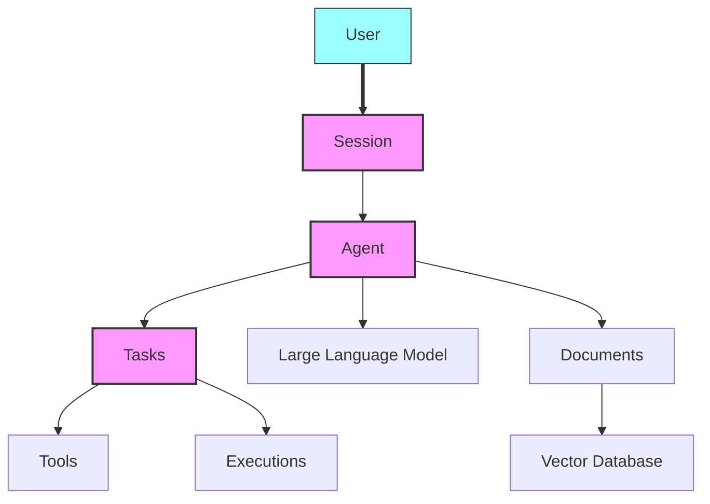

<sup>English | [中文翻译](https://github.com/julep-ai/julep/blob/dev/README-CN.md) | [日本語翻訳](https://github.com/julep-ai/julep/blob/dev/README-JP.md)</sup>

<div align="center">
 
</div>

<p align="center">
  <br />
  <a href="https://docs.julep.ai" rel="dofollow"><strong>Explorer les documents</strong></a>
  ·
  <a href="https://discord.com/invite/JTSBGRZrzj" rel="dofollow">Discorde</a>
  ·
  <a href="https://x.com/julep_ai" rel="dofollow">𝕏</a>
  ·
  <a href="https://www.linkedin.com/company/julep-ai" rel="dofollow">LinkedIn</a>
</p>


<p align="center">
    <a href="https://www.npmjs.com/package/@julep/sdk"></a>
    <span>&nbsp;</span>
    <a href="https://pypi.org/project/julep"></a>
    <span>&nbsp;</span>
    <a href="https://hub.docker.com/u/julepai"></a>
    <span>&nbsp;</span>
    <a href="https://choosealicense.com/licenses/apache/"></a>
</p>

*****

> [!REMARQUE]
> 👨‍💻 Vous êtes ici pour l'événement devfest.ai ? Rejoignez notre [Discord](https://discord.com/invite/JTSBGRZrzj) et consultez les détails ci-dessous.

<details>
<summary><b>🌟 Contributeurs et participants au DevFest.AI</b>(Cliquez pour agrandir)</summary>

## 🌟 Appel aux contributeurs !

Nous sommes ravis d'accueillir de nouveaux contributeurs au projet Julep ! Nous avons créé plusieurs « bons premiers numéros » pour vous aider à démarrer. Voici comment vous pouvez contribuer :

1. Consultez notre fichier [CONTRIBUTING.md](https://github.com/julep-ai/julep/blob/dev/CONTRIBUTING.md) pour obtenir des instructions sur la façon de contribuer.
2. Parcourez nos [bons premiers numéros](https://github.com/julep-ai/julep/issues?q=is%3Aissue+is%3Aopen+label%3A%22good+first+issue%22) pour trouver une tâche qui vous intéresse.
3. Si vous avez des questions ou avez besoin d'aide, n'hésitez pas à nous contacter sur notre chaîne [Discord](https://discord.com/invite/JTSBGRZrzj).

Vos contributions, grandes ou petites, nous sont précieuses. Construisons ensemble quelque chose d'extraordinaire ! 🚀

### 🎉 DevFest.AI octobre 2024

Des nouvelles passionnantes ! Nous participons au DevFest.AI tout au long du mois d'octobre 2024 ! 🗓️

- Contribuez à Julep pendant cet événement et obtenez une chance de gagner de superbes produits et cadeaux Julep ! 🎁
- Rejoignez des développeurs du monde entier pour contribuer aux référentiels d'IA et participer à des événements incroyables.
- Un grand merci à DevFest.AI pour l'organisation de cette fantastique initiative !

> [!TIP]
> Prêt à vous joindre à la fête ? **[Tweetez que vous participez](https://twitter.com/intent/tweet?text=Pumped%20to%20be%20participating%20in%20%40devfestai%20with%20%40julep_ai%20building%20%23ai%20%20%23agents%20%23workflows%20Let's%20gooo!%20https%3A%2F%2Fgit.new%2Fjulep)** et commençons à coder ! 🖥️

> [!REMARQUE]
> Obtenez votre clé API [ici](https://dashboard-dev.julep.ai).
>
> Pendant que nous sommes en version bêta, vous pouvez également nous contacter sur [Discord](https://discord.com/invite/JTSBGRZrzj) pour obtenir la levée des limites de débit sur votre clé API.


</details>

<!-- START doctoc generated TOC please keep comment here to allow auto update -->
<!-- DON'T EDIT THIS SECTION, INSTEAD RE-RUN doctoc TO UPDATE -->
<details>
<summary><h3>📖 Table of Contents</h3></summary>

- [Introduction](#introduction)
- [Exemple rapide](#exemple-rapide)
- [Principales caractéristiques](#principales-caract%C3%A9ristiques)
- [Pourquoi Julep vs. LangChain ?](#pourquoi-julep-vs-langchain%C2%A0)
  - [Différents cas d'utilisation](#diff%C3%A9rents-cas-dutilisation)
  - [Facteur de forme différent](#facteur-de-forme-diff%C3%A9rent)
  - [En résumé](#en-r%C3%A9sum%C3%A9)
- [Installation](#installation)
- [Démarrage rapide de Python 🐍](#d%C3%A9marrage-rapide-de-python-)
  - [Étape 1 : Créer un agent](#%C3%89tape-1%C2%A0-cr%C3%A9er-un-agent)
  - [Étape 2 : Créer une tâche qui génère une histoire et une bande dessinée](#%C3%89tape-2%C2%A0-cr%C3%A9er-une-t%C3%A2che-qui-g%C3%A9n%C3%A8re-une-histoire-et-une-bande-dessin%C3%A9e)
  - [Étape 3 : Exécuter la tâche](#%C3%89tape-3%C2%A0-ex%C3%A9cuter-la-t%C3%A2che)
  - [Étape 4 : Discuter avec l'agent](#%C3%89tape-4%C2%A0-discuter-avec-lagent)
- [Démarrage rapide de Node.js 🟩](#d%C3%A9marrage-rapide-de-nodejs-)
  - [Étape 1 : Créer un agent](#%C3%89tape-1%C2%A0-cr%C3%A9er-un-agent-1)
  - [Étape 2 : Créer une tâche qui génère une histoire et une bande dessinée](#%C3%89tape-2%C2%A0-cr%C3%A9er-une-t%C3%A2che-qui-g%C3%A9n%C3%A8re-une-histoire-et-une-bande-dessin%C3%A9e-1)
  - [Étape 3 : Exécuter la tâche](#%C3%89tape-3%C2%A0-ex%C3%A9cuter-la-t%C3%A2che-1)
  - [Étape 4 : Discuter avec l'agent](#%C3%89tape-4%C2%A0-discuter-avec-lagent-1)
- [Composants](#composants)
  - [Modèle mental](#mod%C3%A8le-mental)
- [Concepts](#concepts)
- [Comprendre les tâches](#comprendre-les-t%C3%A2ches)
  - [Types d'étapes de flux de travail](#types-d%C3%A9tapes-de-flux-de-travail)
- [Types d'outils](#types-doutils)
  - [Fonctions définies par l'utilisateur](#fonctions-d%C3%A9finies-par-lutilisateur)
  - [outils `système`](#outils-syst%C3%A8me)
  - [Intégrations intégrées](#int%C3%A9grations-int%C3%A9gr%C3%A9es)
  - [Appels directs `api_call`](#appels-directs-api_call)
- [Intégrations](#int%C3%A9grations)
  - [Recherche courageuse](#recherche-courageuse)
  - [Base de navigateur](#base-de-navigateur)
  - [E-mail](#e-mail)
  - [Araignée](#araign%C3%A9e)
  - [Météo](#m%C3%A9t%C3%A9o)
  - [Wikipédia](#wikip%C3%A9dia)
- [Autres fonctionnalités](#autres-fonctionnalit%C3%A9s)
  - [Ajout d'outils aux agents](#ajout-doutils-aux-agents)
  - [Gestion des sessions et des utilisateurs](#gestion-des-sessions-et-des-utilisateurs)
  - [Intégration et recherche de documents](#int%C3%A9gration-et-recherche-de-documents)
- [Démarrage rapide local](#d%C3%A9marrage-rapide-local)
- [Référence du SDK](#r%C3%A9f%C3%A9rence-du-sdk)
- [Référence API](#r%C3%A9f%C3%A9rence-api)

</details>
<!-- END doctoc generated TOC please keep comment here to allow auto update -->

## Introduction

Julep est une plateforme permettant de créer des agents IA qui se souviennent des interactions passées et peuvent effectuer des tâches complexes. Elle offre une mémoire à long terme et gère des processus en plusieurs étapes.

Julep permet la création de tâches en plusieurs étapes intégrant la prise de décision, les boucles, le traitement parallèle et l'intégration avec de nombreux outils et API externes.

Alors que de nombreuses applications d’IA se limitent à des chaînes simples et linéaires d’invites et d’appels d’API avec une ramification minimale, Julep est conçu pour gérer des scénarios plus complexes.

Il prend en charge :
- Processus complexes en plusieurs étapes
- Prise de décision dynamique
- Exécution parallèle

> [!TIP]
> Imaginez que vous souhaitiez créer un agent d'IA capable de faire plus que simplement répondre à des questions simples : il doit gérer des tâches complexes, se souvenir des interactions passées et peut-être même utiliser d'autres outils ou API. C'est là qu'intervient Julep.

## Exemple rapide

Imaginez un agent d’IA de recherche capable d’effectuer les opérations suivantes :
1. Prenez un sujet,
2. Proposez 100 requêtes de recherche pour ce sujet,
3. Effectuez ces recherches sur le Web en parallèle,
4. Résumez les résultats,
5. Envoyez le résumé sur Discord

Dans Julep, ce serait une tâche unique sous<b>80 lignes de code</b>et courir<b>entièrement géré</b>tout seul. Toutes les étapes sont exécutées sur les propres serveurs de Julep et vous n'avez pas besoin de lever le petit doigt. Voici un exemple fonctionnel :

```yaml
name: Research Agent

# Optional: Define the input schema for the task
input_schema:
  type: object
  properties:
    topic:
      type: string
      description: The main topic to research

# Define the tools that the agent can use
tools:
- name: web_search
  type: integration
  integration:
    provider: brave
    setup:
      api_key: "YOUR_BRAVE_API_KEY"

- name: discord_webhook
  type: api_call
  api_call:
    url: "YOUR_DISCORD_WEBHOOK_URL"
    method: POST
    headers:
      Content-Type: application/json

# Special variables:
# - inputs: for accessing the input to the task
# - outputs: for accessing the output of previous steps
# - _: for accessing the output of the previous step

# Define the main workflow
main:
- prompt:
    - role: system
      content: >-
        You are a research assistant.
        Generate 100 diverse search queries related to the topic:
        {{inputs[0].topic}}

        Write one query per line.
  unwrap: true

# Evaluate the search queries using a simple python expression
- evaluate:
    search_queries: "_.split('\n')"

# Run the web search in parallel for each query
- over: "_.search_queries"
  map:
    tool: web_search
    arguments:
      query: "_"
  parallelism: 100

# Collect the results from the web search
- evaluate:
    results: "'\n'.join([item.result for item in _])"

# Summarize the results
- prompt:
    - role: system
      content: >
        You are a research summarizer. Create a comprehensive summary of the following research results on the topic {{inputs[0].topic}}.
        The summary should be well-structured, informative, and highlight key findings and insights:
        {{_.results}}
  unwrap: true

# Send the summary to Discord
- tool: discord_webhook
  arguments:
    content: >
      **Research Summary for {{inputs[0].topic}}**

      {{_}}
```

> [!TIP]
> Julep est vraiment utile lorsque vous souhaitez créer des agents IA capables de conserver le contexte et l'état lors d'interactions à long terme. Il est idéal pour concevoir des flux de travail complexes en plusieurs étapes et pour intégrer divers outils et API directement dans les processus de votre agent.
>
> Dans cet exemple, Julep gérera automatiquement les exécutions parallèles, réessayera les étapes ayant échoué, renverra les requêtes API et maintiendra les tâches en cours d'exécution de manière fiable jusqu'à leur achèvement.

## Principales caractéristiques

1. 🧠 **Agents IA persistants** : mémorisent le contexte et les informations au cours d'interactions à long terme.
2. 💾 **Sessions avec état** : gardez une trace des interactions passées pour des réponses personnalisées.
3. 🔄 **Tâches en plusieurs étapes** : créez des processus complexes en plusieurs étapes avec des boucles et une prise de décision.
4. ⏳ **Gestion des tâches** : gérez les tâches de longue durée qui peuvent s'exécuter indéfiniment.
5. 🛠️ **Outils intégrés** : utilisez des outils intégrés et des API externes dans vos tâches.
6. 🔧 **Auto-réparation** : Julep réessaiera automatiquement les étapes ayant échoué, renverra les messages et assurera généralement le bon déroulement de vos tâches.
7. 📚 **RAG** ​​: Utilisez le magasin de documents de Julep pour créer un système permettant de récupérer et d'utiliser vos propres données.

Julep est idéal pour les applications qui nécessitent des cas d’utilisation de l’IA au-delà des simples modèles de réponse rapide.

## Pourquoi Julep vs. LangChain ?

### Différents cas d'utilisation

Considérez LangChain et Julep comme des outils avec des objectifs différents au sein de la pile de développement de l’IA.

LangChain est idéal pour créer des séquences d'invites et gérer les interactions avec les modèles d'IA. Il dispose d'un vaste écosystème avec de nombreuses intégrations prédéfinies, ce qui le rend pratique si vous souhaitez mettre en place quelque chose rapidement. LangChain s'adapte bien aux cas d'utilisation simples qui impliquent une chaîne linéaire d'invites et d'appels d'API.

Julep, en revanche, s'intéresse davantage à la création d'agents d'IA persistants capables de mémoriser des éléments au cours d'interactions à long terme. Il est particulièrement efficace lorsque vous avez besoin de tâches complexes impliquant plusieurs étapes, une prise de décision et une intégration avec divers outils ou API directement dans le processus de l'agent. Il est conçu dès le départ pour gérer les sessions persistantes et les tâches complexes.

Utilisez Julep si vous imaginez créer un assistant IA complexe qui doit :

- Suivez les interactions des utilisateurs sur plusieurs jours ou semaines.
- Exécutez des tâches planifiées, comme l'envoi de résumés quotidiens ou la surveillance de sources de données.
- Prendre des décisions basées sur des interactions antérieures ou des données stockées.
- Interagir avec plusieurs services externes dans le cadre de sa mission.

Ensuite, Julep fournit l’infrastructure pour prendre en charge tout cela sans que vous ayez à le construire à partir de zéro.

### Facteur de forme différent

Julep est une **plateforme** qui comprend un langage pour décrire les tâches, un serveur pour exécuter ces tâches et un SDK pour interagir avec la plateforme. Pour créer quelque chose avec Julep, vous écrivez une description de la tâche en YAML, puis vous exécutez la tâche dans le cloud.

Julep est conçu pour les tâches lourdes, en plusieurs étapes et de longue durée, et il n'y a aucune limite à la complexité de la tâche.

LangChain est une **bibliothèque** qui inclut quelques outils et un framework pour créer des chaînes linéaires d'invites et d'outils. Pour créer quelque chose avec LangChain, vous écrivez généralement du code Python qui configure et exécute les chaînes de modèles que vous souhaitez utiliser.

LangChain pourrait être suffisant et plus rapide à mettre en œuvre pour les cas d'utilisation simples impliquant une chaîne linéaire d'invites et d'appels d'API.

### En résumé

Utilisez LangChain lorsque vous devez gérer les interactions des modèles d’IA et les séquences d’invite dans un contexte sans état ou à court terme.

Choisissez Julep lorsque vous avez besoin d'un framework robuste pour les agents avec état avec des capacités de tâches avancées, des sessions persistantes et une gestion de tâches complexes.

## Installation

Pour commencer à utiliser Julep, installez-le en utilisant [npm](https://www.npmjs.com/package/@julep/sdk) ou [pip](https://pypi.org/project/julep/) :

```bash
npm install @julep/sdk
```

ou

```bash
pip install julep
```

> [!REMARQUE]
> Obtenez votre clé API [ici](https://dashboard-dev.julep.ai).
>
> Pendant que nous sommes en version bêta, vous pouvez également nous contacter sur [Discord](https://discord.com/invite/JTSBGRZrzj) pour obtenir la levée des limites de débit sur votre clé API.

> [!TIP]
> 💻 Êtes-vous du genre à vouloir _montrer le code !™_ ? Nous avons créé une multitude de livres de recettes pour vous aider à démarrer. **Consultez les [livres de recettes](https://github.com/julep-ai/julep/tree/dev/cookbooks)** pour parcourir les exemples.
>
> 💡 Il existe également de nombreuses idées que vous pouvez développer en plus de Julep. **Consultez la [liste d'idées](https://github.com/julep-ai/julep/tree/dev/cookbooks/IDEAS.md)** pour vous inspirer.

## Démarrage rapide de Python 🐍

### Étape 1 : Créer un agent

```python
import yaml
from julep import Julep # or AsyncJulep

client = Julep(api_key="your_julep_api_key")

agent = client.agents.create(
    name="Storytelling Agent",
    model="gpt-4o",
    about="You are a creative storytelling agent that can craft engaging stories and generate comic panels based on ideas.",
)

# 🛠️ Add an image generation tool (DALL·E) to the agent
client.agents.tools.create(
    agent_id=agent.id,
    name="image_generator",
    description="Use this tool to generate images based on descriptions.",
    integration={
        "provider": "dalle",
        "method": "generate_image",
        "setup": {
            "api_key": "your_openai_api_key",
        },
    },
)
```

### Étape 2 : Créer une tâche qui génère une histoire et une bande dessinée

Définissons une tâche en plusieurs étapes pour créer une histoire et générer une bande dessinée à panneaux basée sur une idée d'entrée :

```python
# 📋 Task
# Create a task that takes an idea and creates a story and a 4-panel comic strip
task_yaml = """
name: Story and Comic Creator
description: Create a story based on an idea and generate a 4-panel comic strip illustrating the story.

main:
  # Step 1: Generate a story and outline into 4 panels
  - prompt:
      - role: system
        content: You are {{agent.name}}. {{agent.about}}
      - role: user
        content: >
          Based on the idea '{{_.idea}}', write a short story suitable for a 4-panel comic strip.
          Provide the story and a numbered list of 4 brief descriptions for each panel illustrating key moments in the story.
    unwrap: true

  # Step 2: Extract the panel descriptions and story
  - evaluate:
      story: _.split('1. ')[0].strip()
      panels: re.findall(r'\\d+\\.\\s*(.*?)(?=\\d+\\.\\s*|$)', _)

  # Step 3: Generate images for each panel using the image generator tool
  - foreach:
      in: _.panels
      do:
        tool: image_generator
        arguments:
          description: _

  # Step 4: Generate a catchy title for the story
  - prompt:
      - role: system
        content: You are {{agent.name}}. {{agent.about}}
      - role: user
        content: >
          Based on the story below, generate a catchy title.

          Story: {{outputs[1].story}}
    unwrap: true

  # Step 5: Return the story, the generated images, and the title
  - return:
      title: outputs[3]
      story: outputs[1].story
      comic_panels: "[output.image.url for output in outputs[2]]"
"""

task = client.tasks.create(
    agent_id=agent.id,
    **yaml.safe_load(task_yaml)
)
```

### Étape 3 : Exécuter la tâche

```python
# 🚀 Execute the task with an input idea
execution = client.executions.create(
    task_id=task.id,
    input={"idea": "A cat who learns to fly"}
)

# 🎉 Watch as the story and comic panels are generated
for transition in client.executions.transitions.stream(execution_id=execution.id):
    print(transition)

# 📦 Once the execution is finished, retrieve the results
result = client.executions.get(execution_id=execution.id)
```

### Étape 4 : Discuter avec l'agent

Démarrez une session de chat interactive avec l'agent :

```python
session = client.sessions.create(agent_id=agent.id)

# 💬 Send messages to the agent
while (message := input("Enter a message: ")) != "quit":
    response = client.sessions.chat(
        session_id=session.id,
        message=message,
    )

    print(response)
```

> [!TIP]
> Vous pouvez trouver l'exemple Python complet [ici](example.py).


## Démarrage rapide de Node.js 🟩

### Étape 1 : Créer un agent

```javascript
import { Julep } from '@julep/sdk';
import yaml from 'js-yaml';

const client = new Julep({ apiKey: 'your_julep_api_key' });

async function createAgent() {
  const agent = await client.agents.create({
    name: "Storytelling Agent",
    model: "gpt-4",
    about: "You are a creative storytelling agent that can craft engaging stories and generate comic panels based on ideas.",
  });

  // 🛠️ Add an image generation tool (DALL·E) to the agent
  await client.agents.tools.create(agent.id, {
    name: "image_generator",
    description: "Use this tool to generate images based on descriptions.",
    integration: {
      provider: "dalle",
      method: "generate_image",
      setup: {
        api_key: "your_openai_api_key",
      },
    },
  });

  return agent;
}
```

### Étape 2 : Créer une tâche qui génère une histoire et une bande dessinée

```javascript
const taskYaml = `
name: Story and Comic Creator
description: Create a story based on an idea and generate a 4-panel comic strip illustrating the story.

main:
  # Step 1: Generate a story and outline into 4 panels
  - prompt:
      - role: system
        content: You are {{agent.name}}. {{agent.about}}
      - role: user
        content: >
          Based on the idea '{{_.idea}}', write a short story suitable for a 4-panel comic strip.
          Provide the story and a numbered list of 4 brief descriptions for each panel illustrating key moments in the story.
    unwrap: true

  # Step 2: Extract the panel descriptions and story
  - evaluate:
      story: _.split('1. ')[0].trim()
      panels: _.match(/\\d+\\.\\s*(.*?)(?=\\d+\\.\\s*|$)/g)

  # Step 3: Generate images for each panel using the image generator tool
  - foreach:
      in: _.panels
      do:
        tool: image_generator
        arguments:
          description: _

  # Step 4: Generate a catchy title for the story
  - prompt:
      - role: system
        content: You are {{agent.name}}. {{agent.about}}
      - role: user
        content: >
          Based on the story below, generate a catchy title.

          Story: {{outputs[1].story}}
    unwrap: true

  # Step 5: Return the story, the generated images, and the title
  - return:
      title: outputs[3]
      story: outputs[1].story
      comic_panels: outputs[2].map(output => output.image.url)
`;

async function createTask(agent) {
  const task = await client.tasks.create(agent.id, yaml.load(taskYaml));
  return task;
}
```

### Étape 3 : Exécuter la tâche

```javascript
async function executeTask(task) {
  const execution = await client.executions.create(task.id, {
    input: { idea: "A cat who learns to fly" }
  });

  // 🎉 Watch as the story and comic panels are generated
  for await (const transition of client.executions.transitions.stream(execution.id)) {
    console.log(transition);
  }

  // 📦 Once the execution is finished, retrieve the results
  const result = await client.executions.get(execution.id);
  return result;
}
```

### Étape 4 : Discuter avec l'agent

```javascript
async function chatWithAgent(agent) {
  const session = await client.sessions.create({ agent_id: agent.id });

  // 💬 Send messages to the agent
  const rl = readline.createInterface({
    input: process.stdin,
    output: process.stdout
  });

  const chat = async () => {
    rl.question("Enter a message (or 'quit' to exit): ", async (message) => {
      if (message.toLowerCase() === 'quit') {
        rl.close();
        return;
      }

      const response = await client.sessions.chat(session.id, { message });
      console.log(response);
      chat();
    });
  };

  chat();
}

// Run the example
async function runExample() {
  const agent = await createAgent();
  const task = await createTask(agent);
  const result = await executeTask(task);
  console.log("Task Result:", result);
  await chatWithAgent(agent);
}

runExample().catch(console.error);
```

> [!TIP]
> Vous pouvez trouver l'exemple complet de Node.js [ici](example.js).

## Composants

Julep est composé des éléments suivants :

- **Plateforme Julep** : la plateforme Julep est un service cloud qui exécute vos workflows. Elle comprend un langage pour décrire les workflows, un serveur pour exécuter ces workflows et un SDK pour interagir avec la plateforme.
- **SDK Julep** : les SDK Julep sont un ensemble de bibliothèques permettant de créer des workflows. Il existe des SDK pour Python et JavaScript, et d'autres sont en cours de développement.
- **API Julep** : L'API Julep est une API RESTful que vous pouvez utiliser pour interagir avec la plateforme Julep.

### Modèle mental

<div align="center">
  
</div>

Considérez Julep comme une plateforme qui combine des composants côté client et côté serveur pour vous aider à créer des agents d'IA avancés. Voici comment le visualiser :

1. **Votre code d'application :**
- Vous utilisez le SDK Julep dans votre application pour définir des agents, des tâches et des workflows.
- Le SDK fournit des fonctions et des classes qui facilitent la configuration et la gestion de ces composants.

2. **Service back-end Julep :**
- Le SDK communique avec le backend Julep via le réseau.
- Le backend gère l'exécution des tâches, maintient l'état de la session, stocke les documents et orchestre les flux de travail.

3. **Intégration avec les outils et les API :**
- Au sein de vos workflows, vous pouvez intégrer des outils et services externes.
- Le backend facilite ces intégrations, afin que vos agents puissent, par exemple, effectuer des recherches sur le Web, accéder à des bases de données ou appeler des API tierces.

En termes plus simples :
- Julep est une plateforme permettant de créer des agents d'IA avec état.
- Vous utilisez le SDK (comme une boîte à outils) dans votre code pour définir ce que font vos agents.
- Le service backend (que vous pouvez considérer comme le moteur) exécute ces définitions, gère l'état et gère la complexité.

## Concepts

Julep s'appuie sur plusieurs composants techniques clés qui fonctionnent ensemble pour créer de puissants flux de travail d'IA :



- **Agents** : entités alimentées par l'IA et soutenues par de grands modèles linguistiques (LLM) qui exécutent des tâches et interagissent avec les utilisateurs.
- **Utilisateurs** : entités qui interagissent avec les agents via des sessions.
- **Sessions** : interactions avec état entre agents et utilisateurs, maintenant le contexte sur plusieurs échanges.
- **Tâches** : flux de travail programmatiques en plusieurs étapes que les agents peuvent exécuter, y compris différents types d'étapes telles que des invites, des appels d'outils et une logique conditionnelle.
- **Outils** : intégrations qui étendent les capacités d'un agent, y compris les fonctions définies par l'utilisateur, les outils système ou les intégrations d'API tierces.
- **Documents** : Objets textes ou données associés à des agents ou utilisateurs, vectorisés et stockés pour la recherche et la récupération sémantiques.
- **Exécutions** : instances de tâches qui ont été initiées avec des entrées spécifiques, avec leur propre cycle de vie et leur propre machine d'état.

Pour une explication plus détaillée de ces concepts et de leurs interactions, veuillez vous référer à notre [Documentation sur les concepts](https://github.com/julep-ai/julep/blob/dev/docs/julep-concepts.md).

## Comprendre les tâches

Les tâches sont au cœur du système de workflow de Julep. Elles vous permettent de définir des workflows IA complexes en plusieurs étapes que vos agents peuvent exécuter. Voici un bref aperçu des composants des tâches :

- **Nom et description** : Chaque tâche a un nom et une description uniques pour une identification facile.
- **Étapes principales** : Le cœur d’une tâche, définissant la séquence d’actions à effectuer.
- **Outils** : intégrations facultatives qui étendent les capacités de votre agent pendant l'exécution des tâches.

### Types d'étapes de flux de travail

Les tâches dans Julep peuvent inclure différents types d'étapes, ce qui vous permet de créer des flux de travail complexes et puissants. Voici un aperçu des types d'étapes disponibles, organisés par catégorie :

#### Étapes courantes

1. **Invite** : envoyez un message au modèle d’IA et recevez une réponse.
   ```yaml
   - prompt: "Analyze the following data: {{data}}"
   ```

2. **Appel d'outil** : Exécutez un outil ou une API intégrée.
   ```yaml
   - tool: web_search
     arguments:
       query: "Latest AI developments"
   ```

3. **Évaluer** : Effectuer des calculs ou manipuler des données.
   ```yaml
   - evaluate:
       average_score: "sum(scores) / len(scores)"
   ```

4. **Attendre l'entrée** : mettre le flux de travail en pause jusqu'à ce que l'entrée soit reçue.
   ```yaml
   - wait_for_input:
       info:
         message: "Please provide additional information."
   ```

5. **Journal** : Enregistrer une valeur ou un message spécifié.
   ```yaml
   - log: "Processing completed for item {{item_id}}"
   ```

#### Étapes clé-valeur

6. **Get** : récupérer une valeur à partir d'un magasin clé-valeur.
   ```yaml
   - get: "user_preference"
   ```

7. **Set** : attribuez une valeur à une clé dans un magasin clé-valeur.
   ```yaml
   - set:
       user_preference: "dark_mode"
   ```

#### Étapes d'itération

8. **Foreach** : itérer sur une collection et effectuer des étapes pour chaque élément.
   ```yaml
   - foreach:
       in: "data_list"
       do:
         - log: "Processing item {{_}}"
   ```

9. **Map-Reduce** : Cartographiez une collection et réduisez les résultats.
   ```yaml
   - map_reduce:
       over: "numbers"
       map:
         - evaluate:
             squared: "_ ** 2"
       reduce: "sum(results)"
   ```

10. **Parallèle** : exécuter plusieurs étapes en parallèle.
    ```yaml
    - parallel:
        - tool: web_search
          arguments:
            query: "AI news"
        - tool: weather_check
          arguments:
            location: "New York"
    ```

#### Étapes conditionnelles

11. **If-Else** : Exécution conditionnelle des étapes.
    ```yaml
    - if: "score > 0.8"
      then:
        - log: "High score achieved"
      else:
        - log: "Score needs improvement"
    ```

12. **Switch** : exécuter des étapes en fonction de plusieurs conditions.
    ```yaml
    - switch:
        - case: "category == 'A'"
          then:
            - log: "Category A processing"
        - case: "category == 'B'"
          then:
            - log: "Category B processing"
        - case: "_"  # Default case
          then:
            - log: "Unknown category"
    ```

#### Autre flux de contrôle

13. **Veille** : met le flux de travail en pause pendant une durée spécifiée.
    ```yaml
    - sleep:
        seconds: 30
    ```

14. **Retour** : renvoie une valeur du flux de travail.
    ```yaml
    - return:
        result: "Task completed successfully"
    ```

15. **Rendement** : Exécutez un sous-flux de travail et attendez sa fin.
    ```yaml
    - yield:
        workflow: "data_processing_subflow"
        arguments:
          input_data: "{{raw_data}}"
    ```

16. **Erreur** : gérez les erreurs en spécifiant un message d’erreur.
    ```yaml
    - error: "Invalid input provided"
    ```

Chaque type d'étape remplit un objectif spécifique dans la création de workflows d'IA sophistiqués. Cette catégorisation permet de comprendre les différents flux de contrôle et opérations disponibles dans les tâches Julep.


## Types d'outils

Les agents peuvent avoir accès à un certain nombre d'« outils » : toute interface de programmation qu'un modèle de base peut « appeler » avec un ensemble d'entrées pour atteindre un objectif. Par exemple, il peut utiliser un outil « web_search(query) » pour rechercher des informations sur Internet.

Contrairement aux frameworks d'agents, Julep est un backend qui gère l'exécution des agents. Les clients peuvent interagir avec les agents à l'aide de nos SDK. Julep s'occupe de l'exécution des tâches et de l'exécution des intégrations.

Les outils du julep peuvent être l’un des suivants :

### Fonctions définies par l'utilisateur

Il s'agit de signatures de fonctions que vous pouvez attribuer au modèle pour qu'il puisse choisir, de la même manière que fonctionne l'appel de fonctions d'[openai]. Un exemple :

```yaml    
    name: Example system tool task
    description: List agents using system call

    tools:
    - name: send_notification
      description: Send a notification to the user
      type: function
      function:
        parameters:
          type: object
          properties:
            text:
              type: string
              description: Content of the notification

    main:
    - tool: send_notification
      arguments:
        content: hi
```
  
Chaque fois que julep rencontre une _fonction définie par l'utilisateur_, il s'arrête, rend le contrôle au client et attend que le client exécute l'appel de fonction et renvoie les résultats à julep.

> [!TIP]
> **Exemple de livre de recettes** : [cookbooks/13-Error_Handling_and_Recovery.py](https://github.com/julep-ai/julep/blob/dev/cookbooks/13-Error_Handling_and_Recovery.py)

### outils `système`
Outils intégrés qui peuvent être utilisés pour appeler les API julep elles-mêmes, comme déclencher l'exécution d'une tâche, ajouter à un champ de métadonnées, etc.
Les outils « système » sont intégrés au backend. Ils sont exécutés automatiquement lorsque cela est nécessaire. Ils ne nécessitent aucune action du côté client.
 
Par exemple,
  
  ```yaml
    name: Example system tool task
    description: List agents using system call

    tools:
    - name: list_agents
      description: List all agents
      type: system
      system:
        resource: agent
        operation: list
    main:
    - tool: list_agents
      arguments:
        limit: 10
  ```

> [!TIP]
> **Exemple de livre de recettes** : [cookbooks/10-Document_Management_and_Search.py](https://github.com/julep-ai/julep/blob/dev/cookbooks/10-Document_Management_and_Search.py)
 
### Intégrations intégrées
Julep est livré avec un certain nombre d'intégrations intégrées (comme décrit dans la section ci-dessous). Les outils « d'intégration » sont directement exécutés sur le backend de Julep. Tous les paramètres supplémentaires dont ils ont besoin au moment de l'exécution peuvent être définis dans les champs « métadonnées » de l'agent/session/utilisateur.

> [!TIP]
> **Exemple de livre de recettes** : [cookbooks/01-Website_Crawler_using_Spider.ipynb](https://github.com/julep-ai/julep/blob/dev/cookbooks/01-Website_Crawler_using_Spider.ipynb)

Le backend Julep est livré avec des outils tiers intégrés provenant des fournisseurs suivants :
- [composio](https://composio.dev) \*\*
- [anonyme](https://anon.com) \*\*
- [kits d'outils langchain](https://python.langchain.com/v0.2/docs/integrations/toolkits/). La prise en charge des kits d'outils _Github, Gitlab, Gmail, Jira, MultiOn, Slack_ est prévue.

\*\* Étant donné que _composio_ et _anon_ sont des fournisseurs tiers, leurs outils nécessitent la configuration d'une liaison de compte.


### Appels directs `api_call`

julep peut également effectuer directement des appels d'API lors des exécutions de workflows sous forme d'appels d'outils. Comme pour `integration`, des paramètres d'exécution supplémentaires sont chargés à partir des champs `metadata`.
  
Par exemple,
  
  ```yaml
    name: Example api_call task
    tools:
    - type: api_call
      name: hello
      api_call:
        method: GET
        url: https://httpbin.org/get
    main:
    - tool: hello
      arguments:
        params:
          test: _.input
  ```

## Intégrations

Julep prend en charge diverses intégrations qui étendent les capacités de vos agents IA. Voici une liste des intégrations disponibles et de leurs arguments pris en charge :

### Recherche courageuse

```yaml
setup:
  api_key: string  # The API key for Brave Search

arguments:
  query: string  # The search query for searching with Brave

output:
  result: string  # The result of the Brave Search
```

> [!TIP]
> **Exemple de livre de recettes** : [cookbooks/03-SmartResearcher_With_WebSearch.ipynb](https://github.com/julep-ai/julep/blob/dev/cookbooks/03-SmartResearcher_With_WebSearch.ipynb)

### Base de navigateur

```yaml
setup:
  api_key: string       # The API key for BrowserBase
  project_id: string    # The project ID for BrowserBase
  session_id: string    # (Optional) The session ID for BrowserBase

arguments:
  urls: list[string]    # The URLs for loading with BrowserBase

output:
  documents: list       # The documents loaded from the URLs
```

### E-mail

```yaml
setup:
  host: string      # The host of the email server
  port: integer     # The port of the email server
  user: string      # The username of the email server
  password: string  # The password of the email server

arguments:
  to: string        # The email address to send the email to
  from: string      # The email address to send the email from
  subject: string   # The subject of the email
  body: string      # The body of the email

output:
  success: boolean  # Whether the email was sent successfully
```

> [!TIP]
> **Exemple de livre de recettes** : [cookbooks/00-Devfest-Email-Assistant.ipynb](https://github.com/julep-ai/julep/blob/dev/cookbooks/00-Devfest-Email-Assistant.ipynb)

### Araignée

```yaml
setup:
  spider_api_key: string  # The API key for Spider

arguments:
  url: string             # The URL for which to fetch data
  mode: string            # The type of crawlers (default: "scrape")
  params: dict            # (Optional) The parameters for the Spider API

output:
  documents: list         # The documents returned from the spider
```

> [!TIP]
> **Exemple de livre de recettes** : [cookbooks/01-Website_Crawler_using_Spider.ipynb](https://github.com/julep-ai/julep/blob/dev/cookbooks/01-Website_Crawler_using_Spider.ipynb)

### Météo

```yaml
setup:
  openweathermap_api_key: string  # The API key for OpenWeatherMap

arguments:
  location: string                # The location for which to fetch weather data

output:
  result: string                  # The weather data for the specified location
```

> [!TIP]
> **Exemple de livre de recettes** : [cookbooks/04-TripPlanner_With_Weather_And_WikiInfo.ipynb](https://github.com/julep-ai/julep/blob/dev/cookbooks/04-TripPlanner_With_Weather_And_WikiInfo.ipynb)

### Wikipédia

```yaml
arguments:
  query: string           # The search query string
  load_max_docs: integer  # Maximum number of documents to load (default: 2)

output:
  documents: list         # The documents returned from the Wikipedia search
```

> [!TIP]
> **Exemple de livre de recettes** : [cookbooks/04-TripPlanner_With_Weather_And_WikiInfo.ipynb](https://github.com/julep-ai/julep/blob/dev/cookbooks/04-TripPlanner_With_Weather_And_WikiInfo.ipynb)

Ces intégrations peuvent être utilisées dans vos tâches pour étendre les capacités de vos agents IA. Pour des informations plus détaillées sur la manière d'utiliser ces intégrations dans vos workflows, veuillez consulter notre [Documentation sur les intégrations](https://docs.julep.ai/integrations).

## Autres fonctionnalités

Julep propose une gamme de fonctionnalités avancées pour améliorer vos flux de travail d'IA :

### Ajout d'outils aux agents

Étendez les capacités de votre agent en intégrant des outils et des API externes :

```python
client.agents.tools.create(
    agent_id=agent.id,
    name="web_search",
    description="Search the web for information.",
    integration={
        "provider": "brave",
        "method": "search",
        "setup": {"api_key": "your_brave_api_key"},
    },
)
```

### Gestion des sessions et des utilisateurs

Julep fournit une gestion de session robuste pour les interactions persistantes :

```python
session = client.sessions.create(
    agent_id=agent.id,
    user_id=user.id,
    context_overflow="adaptive"
)

# Continue conversation in the same session
response = client.sessions.chat(
    session_id=session.id,
    messages=[
      {
        "role": "user",
        "content": "Follow up on the previous conversation."
      }
    ]
)
```

### Intégration et recherche de documents

Gérez et recherchez facilement des documents pour vos agents :

```python
# Upload a document
document = client.agents.docs.create(
    title="AI advancements",
    content="AI is changing the world...",
    metadata={"category": "research_paper"}
)

# Search documents
results = client.agents.docs.search(
    text="AI advancements",
    metadata_filter={"category": "research_paper"}
)
```

## Démarrage rapide local

**Exigences**:
- dernier docker compose installé

**Mesures**:
1. `git clone https://github.com/julep-ai/julep.git`
2. `cd julep`
3. `docker volume create cozo_backup`
4. `docker volume create cozo_data`
5. `cp .env.example .env # <-- Modifier ce fichier`
6. `docker compose --env-file .env --profile temporal-ui --profile single-tenant --profile self-hosted-db up --build`

## Référence du SDK

- [Kit de développement logiciel Node.js](https://github.com/julep-ai/node-sdk/blob/main/api.md)
- [SDK Python](https://github.com/julep-ai/python-sdk/blob/main/api.md)

## Référence API

Explorez notre documentation API complète pour en savoir plus sur les agents, les tâches et les exécutions :

- [API des agents](https://api.julep.ai/api/docs#tag/agents)
- [API des tâches](https://api.julep.ai/api/docs#tag/tasks)
- [API d'exécution](https://api.julep.ai/api/docs#tag/executions)
