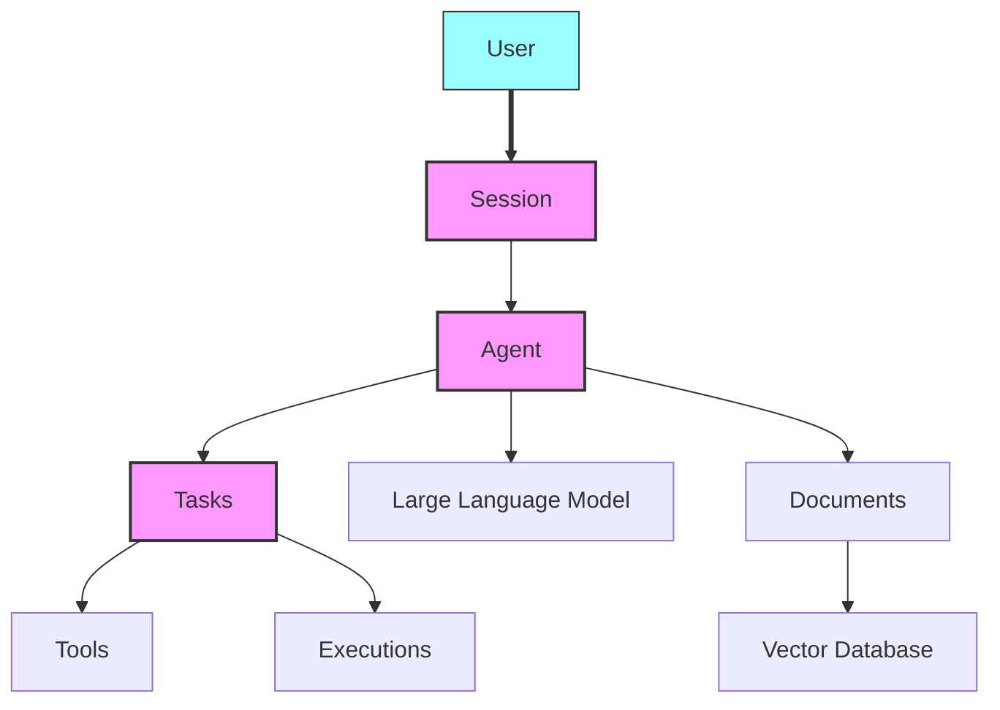

<sup>[English](README.md) | [中文翻译](README-CN.md) | [日本語翻訳](README-JA.md) | [French](README-FR.md)</sup>

<div align="center" id="top">
 
</div>

<p align="center">
  <br />
  <a href="https://docs.julep.ai" rel="dofollow"><strong>ドキュメントを見る</strong></a>
  ·
  <a href="https://discord.com/invite/JTSBGRZrzj" rel="dofollow">不和</a>
  ·
  <a href="https://x.com/julep_ai" rel="dofollow">𝕏</a>
  ·
  <a href="https://www.linkedin.com/company/julep-ai" rel="dofollow">リンクトイン</a>
</p>

<p align="center">
    <a href="https://www.npmjs.com/package/@julep/sdk"></a>
    <span>&nbsp;</span>
    <a href="https://pypi.org/project/julep"></a>
    <span>&nbsp;</span>
    <a href="https://hub.docker.com/u/julepai"></a>
    <span>&nbsp;</span>
    <a href="https://choosealicense.com/licenses/apache/"></a>
</p>

---

> [!注意]
> 👨‍💻 devfest.ai イベントに参加しませんか? [Discord](https://discord.com/invite/JTSBGRZrzj) に参加して、以下の詳細を確認してください。
>
> API キーを [こちら](https://dashboard-dev.julep.ai) から取得します。

<details>
<summary><b>🌟 貢献者とDevFest.AI参加者</b>（クリックして拡大）</summary>

## 🌟 貢献者を募集します!

Julep プロジェクトに新しい貢献者を迎えられることを嬉しく思います。プロジェクトを始めるのに役立つ「最初の良い問題」をいくつか作成しました。貢献する方法は次のとおりです。

1. 貢献方法に関するガイドラインについては、[CONTRIBUTING.md](https://github.com/julep-ai/julep/blob/dev/CONTRIBUTING.md) ファイルをご覧ください。
2. [good first issues](https://github.com/julep-ai/julep/issues?q=is%3Aissue+is%3Aopen+label%3A%22good+first+issue%22) を参照して、興味のあるタスクを見つけます。
3. ご質問やご不明な点がございましたら、[Discord](https://discord.com/invite/JTSBGRZrzj) チャンネルまでお気軽にお問い合わせください。

あなたの貢献は、大小を問わず私たちにとって貴重です。一緒に素晴らしいものを作りましょう！🚀

### 🎉 DevFest.AI 2024年10月

嬉しいニュースです！2024 年 10 月を通して DevFest.AI に参加します！🗓️

- このイベント中に Julep に貢献すると、素晴らしい Julep のグッズや景品を獲得するチャンスが得られます! 🎁
- 世界中の開発者とともに AI リポジトリに貢献し、素晴らしいイベントに参加しましょう。
- この素晴らしい取り組みを企画してくださった DevFest.AI に心から感謝します。

> [!ヒント]
> 楽しみに参加する準備はできましたか? **[参加することをツイート](https://twitter.com/intent/tweet?text=Pumped%20to%20be%20participating%20in%20%40devfestai%20with%20%40julep_ai%20building%20%23ai%20%23agents%20%23workflows%20Let's%20gooo!%20https%3A%2F%2Fgit.new%2Fjulep)**して、コーディングを始めましょう! 🖥️


</details>

<!-- START doctoc generated TOC please keep comment here to allow auto update -->
<!-- DON'T EDIT THIS SECTION, INSTEAD RE-RUN doctoc TO UPDATE -->
<h3>📖 Table of Contents</h3>

- [主な特徴](#%E4%B8%BB%E3%81%AA%E7%89%B9%E5%BE%B4)
- [簡単な例](#%E7%B0%A1%E5%8D%98%E3%81%AA%E4%BE%8B)
- [インストール](#%E3%82%A4%E3%83%B3%E3%82%B9%E3%83%88%E3%83%BC%E3%83%AB)
- [Python クイックスタート 🐍](#python-%E3%82%AF%E3%82%A4%E3%83%83%E3%82%AF%E3%82%B9%E3%82%BF%E3%83%BC%E3%83%88-)
  - [ステップ 1: エージェントを作成する](#%E3%82%B9%E3%83%86%E3%83%83%E3%83%97-1-%E3%82%A8%E3%83%BC%E3%82%B8%E3%82%A7%E3%83%B3%E3%83%88%E3%82%92%E4%BD%9C%E6%88%90%E3%81%99%E3%82%8B)
  - [ステップ2: ストーリーと漫画を生成するタスクを作成する](#%E3%82%B9%E3%83%86%E3%83%83%E3%83%972-%E3%82%B9%E3%83%88%E3%83%BC%E3%83%AA%E3%83%BC%E3%81%A8%E6%BC%AB%E7%94%BB%E3%82%92%E7%94%9F%E6%88%90%E3%81%99%E3%82%8B%E3%82%BF%E3%82%B9%E3%82%AF%E3%82%92%E4%BD%9C%E6%88%90%E3%81%99%E3%82%8B)
  - [ステップ3: タスクを実行する](#%E3%82%B9%E3%83%86%E3%83%83%E3%83%973-%E3%82%BF%E3%82%B9%E3%82%AF%E3%82%92%E5%AE%9F%E8%A1%8C%E3%81%99%E3%82%8B)
  - [ステップ4: エージェントとチャットする](#%E3%82%B9%E3%83%86%E3%83%83%E3%83%974-%E3%82%A8%E3%83%BC%E3%82%B8%E3%82%A7%E3%83%B3%E3%83%88%E3%81%A8%E3%83%81%E3%83%A3%E3%83%83%E3%83%88%E3%81%99%E3%82%8B)
- [Node.js クイックスタート 🟩](#nodejs-%E3%82%AF%E3%82%A4%E3%83%83%E3%82%AF%E3%82%B9%E3%82%BF%E3%83%BC%E3%83%88-)
  - [ステップ 1: エージェントを作成する](#%E3%82%B9%E3%83%86%E3%83%83%E3%83%97-1-%E3%82%A8%E3%83%BC%E3%82%B8%E3%82%A7%E3%83%B3%E3%83%88%E3%82%92%E4%BD%9C%E6%88%90%E3%81%99%E3%82%8B-1)
  - [ステップ2: ストーリーと漫画を生成するタスクを作成する](#%E3%82%B9%E3%83%86%E3%83%83%E3%83%972-%E3%82%B9%E3%83%88%E3%83%BC%E3%83%AA%E3%83%BC%E3%81%A8%E6%BC%AB%E7%94%BB%E3%82%92%E7%94%9F%E6%88%90%E3%81%99%E3%82%8B%E3%82%BF%E3%82%B9%E3%82%AF%E3%82%92%E4%BD%9C%E6%88%90%E3%81%99%E3%82%8B-1)
  - [ステップ3: タスクを実行する](#%E3%82%B9%E3%83%86%E3%83%83%E3%83%973-%E3%82%BF%E3%82%B9%E3%82%AF%E3%82%92%E5%AE%9F%E8%A1%8C%E3%81%99%E3%82%8B-1)
  - [ステップ4: エージェントとチャットする](#%E3%82%B9%E3%83%86%E3%83%83%E3%83%974-%E3%82%A8%E3%83%BC%E3%82%B8%E3%82%A7%E3%83%B3%E3%83%88%E3%81%A8%E3%83%81%E3%83%A3%E3%83%83%E3%83%88%E3%81%99%E3%82%8B-1)
- [コンポーネント](#%E3%82%B3%E3%83%B3%E3%83%9D%E3%83%BC%E3%83%8D%E3%83%B3%E3%83%88)
  - [メンタルモデル](#%E3%83%A1%E3%83%B3%E3%82%BF%E3%83%AB%E3%83%A2%E3%83%87%E3%83%AB)
- [コンセプト](#%E3%82%B3%E3%83%B3%E3%82%BB%E3%83%97%E3%83%88)
- [タスクを理解する](#%E3%82%BF%E3%82%B9%E3%82%AF%E3%82%92%E7%90%86%E8%A7%A3%E3%81%99%E3%82%8B)
  - [ワークフローステップの種類](#%E3%83%AF%E3%83%BC%E3%82%AF%E3%83%95%E3%83%AD%E3%83%BC%E3%82%B9%E3%83%86%E3%83%83%E3%83%97%E3%81%AE%E7%A8%AE%E9%A1%9E)
- [ツールの種類](#%E3%83%84%E3%83%BC%E3%83%AB%E3%81%AE%E7%A8%AE%E9%A1%9E)
  - [ユーザー定義の `functions`](#%E3%83%A6%E3%83%BC%E3%82%B6%E3%83%BC%E5%AE%9A%E7%BE%A9%E3%81%AE-functions)
  - [`システム` ツール](#%E3%82%B7%E3%82%B9%E3%83%86%E3%83%A0-%E3%83%84%E3%83%BC%E3%83%AB)
  - [組み込みの `integrations`](#%E7%B5%84%E3%81%BF%E8%BE%BC%E3%81%BF%E3%81%AE-integrations)
  - [直接の `api_calls`](#%E7%9B%B4%E6%8E%A5%E3%81%AE-api_calls)
- [統合](#%E7%B5%B1%E5%90%88)
- [その他の機能](#%E3%81%9D%E3%81%AE%E4%BB%96%E3%81%AE%E6%A9%9F%E8%83%BD)
  - [エージェントへのツールの追加](#%E3%82%A8%E3%83%BC%E3%82%B8%E3%82%A7%E3%83%B3%E3%83%88%E3%81%B8%E3%81%AE%E3%83%84%E3%83%BC%E3%83%AB%E3%81%AE%E8%BF%BD%E5%8A%A0)
  - [セッションとユーザーの管理](#%E3%82%BB%E3%83%83%E3%82%B7%E3%83%A7%E3%83%B3%E3%81%A8%E3%83%A6%E3%83%BC%E3%82%B6%E3%83%BC%E3%81%AE%E7%AE%A1%E7%90%86)
  - [ドキュメントの統合と検索](#%E3%83%89%E3%82%AD%E3%83%A5%E3%83%A1%E3%83%B3%E3%83%88%E3%81%AE%E7%B5%B1%E5%90%88%E3%81%A8%E6%A4%9C%E7%B4%A2)
- [ローカルクイックスタート](#%E3%83%AD%E3%83%BC%E3%82%AB%E3%83%AB%E3%82%AF%E3%82%A4%E3%83%83%E3%82%AF%E3%82%B9%E3%82%BF%E3%83%BC%E3%83%88)
- [SDK リファレンス](#sdk-%E3%83%AA%E3%83%95%E3%82%A1%E3%83%AC%E3%83%B3%E3%82%B9)
- [APIリファレンス](#api%E3%83%AA%E3%83%95%E3%82%A1%E3%83%AC%E3%83%B3%E3%82%B9)
- [Julep と LangChain を比較する理由](#julep-%E3%81%A8-langchain-%E3%82%92%E6%AF%94%E8%BC%83%E3%81%99%E3%82%8B%E7%90%86%E7%94%B1)
  - [さまざまなユースケース](#%E3%81%95%E3%81%BE%E3%81%96%E3%81%BE%E3%81%AA%E3%83%A6%E3%83%BC%E3%82%B9%E3%82%B1%E3%83%BC%E3%82%B9)
  - [異なるフォームファクタ](#%E7%95%B0%E3%81%AA%E3%82%8B%E3%83%95%E3%82%A9%E3%83%BC%E3%83%A0%E3%83%95%E3%82%A1%E3%82%AF%E3%82%BF)

<!-- END doctoc generated TOC please keep comment here to allow auto update -->

＃＃ 導入

Julep は、過去のやり取りを記憶し、複雑なタスクを実行できる AI エージェントを作成するためのプラットフォームです。長期記憶を提供し、複数ステップのプロセスを管理します。

Julep を使用すると、意思決定、ループ、並列処理、多数の外部ツールや API との統合を組み込んだ複数ステップのタスクを作成できます。

多くの AI アプリケーションは、分岐が最小限の、プロンプトと API 呼び出しの単純な線形チェーンに制限されていますが、Julep はより複雑なシナリオを処理できるように構築されています。

サポート対象:

- 複雑で多段階のプロセス
- ダイナミックな意思決定
- 並列実行

> [!ヒント]
> 単純な質問に答えるだけでなく、複雑なタスクを処理し、過去のやり取りを記憶し、場合によっては他のツールや API も使用できる AI エージェントを構築したいとします。そこで Julep の出番です。

## 主な特徴

1. 🧠 **永続的な AI エージェント**: 長期にわたるやり取りを通じてコン​​テキストと情報を記憶します。
2. 💾 **ステートフル セッション**: 過去のやり取りを追跡して、パーソナライズされた応答を提供します。
3. 🔄 **複数ステップのタスク**: ループと意思決定を使用して、複雑な複数ステップのプロセスを構築します。
4. ⏳ **タスク管理**: 無期限に実行される可能性のある長時間実行タスクを処理します。
5. 🛠️ **組み込みツール**: タスクで組み込みツールと外部 API を使用します。
6. 🔧 **自己修復**: Julep は失敗したステップを自動的に再試行し、メッセージを再送信し、一般的にタスクがスムーズに実行されるようにします。
7. 📚 **RAG**: Julep のドキュメント ストアを使用して、独自のデータを取得して使用するためのシステムを構築します。

Julep は、単純なプロンプト応答モデルを超えた AI ユースケースを必要とするアプリケーションに最適です。

## 簡単な例

次のことができる研究 AI エージェントを想像してください。

1. トピックを取り上げ、
2. そのトピックについて100個の検索クエリを考えます。
3. ウェブ検索を並行して実行する
4. 結果をまとめる
5.要約をDiscordに送信する

Julepでは、これは単一のタスクになります<b>80行のコード</b>そして走る<b>完全に管理された</b>すべては Julep のサーバー上で実行されます。すべての手順は Julep のサーバー上で実行されるため、何もする必要はありません。次に動作例を示します。

```yaml
name: Research Agent

# Optional: Define the input schema for the task
input_schema:
  type: object
  properties:
    topic:
      type: string
      description: The main topic to research

# Define the tools that the agent can use
tools:
  - name: web_search
    type: integration
    integration:
      provider: brave
      setup:
        api_key: "YOUR_BRAVE_API_KEY"

  - name: discord_webhook
    type: api_call
    api_call:
      url: "YOUR_DISCORD_WEBHOOK_URL"
      method: POST
      headers:
        Content-Type: application/json

# Special variables:
# - inputs: for accessing the input to the task
# - outputs: for accessing the output of previous steps
# - _: for accessing the output of the previous step

# Define the main workflow
main:
  - prompt:
      - role: system
        content: >-
          You are a research assistant.
          Generate 100 diverse search queries related to the topic:
          {{inputs[0].topic}}

          Write one query per line.
    unwrap: true

  # Evaluate the search queries using a simple python expression
  - evaluate:
      search_queries: "_.split('\n')"

  # Run the web search in parallel for each query
  - over: "_.search_queries"
    map:
      tool: web_search
      arguments:
        query: "_"
    parallelism: 100

  # Collect the results from the web search
  - evaluate:
      results: "'\n'.join([item.result for item in _])"

  # Summarize the results
  - prompt:
      - role: system
        content: >
          You are a research summarizer. Create a comprehensive summary of the following research results on the topic {{inputs[0].topic}}.
          The summary should be well-structured, informative, and highlight key findings and insights:
          {{_.results}}
    unwrap: true

  # Send the summary to Discord
  - tool: discord_webhook
    arguments:
      content: >
        **Research Summary for {{inputs[0].topic}}**

        {{_}}
```

この例では、Julep は並列実行を自動的に管理し、失敗したステップを再試行し、API リクエストを再送信し、タスクが完了するまで確実に実行し続けます。

## インストール

Julep を使い始めるには、[npm](https://www.npmjs.com/package/@julep/sdk) または [pip](https://pypi.org/project/julep/) を使用してインストールします。

```bash
npm install @julep/sdk
```

または

```bash
pip install julep
```

> [!注意]
> API キーを [こちら](https://dashboard-dev.julep.ai) から取得します。
>
> ベータ版では、[Discord](https://discord.com/invite/JTSBGRZrzj) に連絡して、API キーのレート制限を解除することもできます。

> [!ヒント]
> 💻 あなたは「コードを見せてください!™」タイプの人ですか? 始めるにあたって役立つクックブックを多数作成しました。**[クックブック](https://github.com/julep-ai/julep/tree/dev/cookbooks)** をチェックして、例を参照してください。
>
> 💡 Julep をベースに構築できるアイデアもたくさんあります。**[アイデアのリスト](https://github.com/julep-ai/julep/tree/dev/cookbooks/IDEAS.md)** をチェックして、インスピレーションを得てください。

## Python クイックスタート 🐍

### ステップ 1: エージェントを作成する

```python
import yaml
from julep import Julep # or AsyncJulep

client = Julep(api_key="your_julep_api_key")

agent = client.agents.create(
    name="Storytelling Agent",
    model="gpt-4o",
    about="You are a creative storytelling agent that can craft engaging stories and generate comic panels based on ideas.",
)

# 🛠️ Add an image generation tool (DALL·E) to the agent
client.agents.tools.create(
    agent_id=agent.id,
    name="image_generator",
    description="Use this tool to generate images based on descriptions.",
    integration={
        "provider": "dalle",
        "method": "generate_image",
        "setup": {
            "api_key": "your_openai_api_key",
        },
    },
)
```

### ステップ2: ストーリーと漫画を生成するタスクを作成する

入力されたアイデアに基づいてストーリーを作成し、パネル化された漫画を生成するためのマルチステップタスクを定義しましょう。

```python
# 📋 Task
# Create a task that takes an idea and creates a story and a 4-panel comic strip
task_yaml = """
name: Story and Comic Creator
description: Create a story based on an idea and generate a 4-panel comic strip illustrating the story.

main:
  # Step 1: Generate a story and outline into 4 panels
  - prompt:
      - role: system
        content: You are {{agent.name}}. {{agent.about}}
      - role: user
        content: >
          Based on the idea '{{_.idea}}', write a short story suitable for a 4-panel comic strip.
          Provide the story and a numbered list of 4 brief descriptions for each panel illustrating key moments in the story.
    unwrap: true

  # Step 2: Extract the panel descriptions and story
  - evaluate:
      story: _.split('1. ')[0].strip()
      panels: re.findall(r'\\d+\\.\\s*(.*?)(?=\\d+\\.\\s*|$)', _)

  # Step 3: Generate images for each panel using the image generator tool
  - foreach:
      in: _.panels
      do:
        tool: image_generator
        arguments:
          description: _

  # Step 4: Generate a catchy title for the story
  - prompt:
      - role: system
        content: You are {{agent.name}}. {{agent.about}}
      - role: user
        content: >
          Based on the story below, generate a catchy title.

          Story: {{outputs[1].story}}
    unwrap: true

  # Step 5: Return the story, the generated images, and the title
  - return:
      title: outputs[3]
      story: outputs[1].story
      comic_panels: "[output.image.url for output in outputs[2]]"
"""

task = client.tasks.create(
    agent_id=agent.id,
    **yaml.safe_load(task_yaml)
)
```

### ステップ3: タスクを実行する

```python
# 🚀 Execute the task with an input idea
execution = client.executions.create(
    task_id=task.id,
    input={"idea": "A cat who learns to fly"}
)

# 🎉 Watch as the story and comic panels are generated
for transition in client.executions.transitions.stream(execution_id=execution.id):
    print(transition)

# 📦 Once the execution is finished, retrieve the results
result = client.executions.get(execution_id=execution.id)
```

### ステップ4: エージェントとチャットする

エージェントとの対話型チャット セッションを開始します。

```python
session = client.sessions.create(agent_id=agent.id)

# 💬 Send messages to the agent
while (message := input("Enter a message: ")) != "quit":
    response = client.sessions.chat(
        session_id=session.id,
        message=message,
    )

    print(response)
```

完全な Python の例は [ここ](example.py) にあります。

## Node.js クイックスタート 🟩

### ステップ 1: エージェントを作成する

```javascript
import { Julep } from "@julep/sdk";
import yaml from "js-yaml";

const client = new Julep({ apiKey: "your_julep_api_key" });

async function createAgent() {
  const agent = await client.agents.create({
    name: "Storytelling Agent",
    model: "gpt-4",
    about:
      "You are a creative storytelling agent that can craft engaging stories and generate comic panels based on ideas.",
  });

  // 🛠️ Add an image generation tool (DALL·E) to the agent
  await client.agents.tools.create(agent.id, {
    name: "image_generator",
    description: "Use this tool to generate images based on descriptions.",
    integration: {
      provider: "dalle",
      method: "generate_image",
      setup: {
        api_key: "your_openai_api_key",
      },
    },
  });

  return agent;
}
```

### ステップ2: ストーリーと漫画を生成するタスクを作成する

```javascript
const taskYaml = `
name: Story and Comic Creator
description: Create a story based on an idea and generate a 4-panel comic strip illustrating the story.

main:
  # Step 1: Generate a story and outline into 4 panels
  - prompt:
      - role: system
        content: You are {{agent.name}}. {{agent.about}}
      - role: user
        content: >
          Based on the idea '{{_.idea}}', write a short story suitable for a 4-panel comic strip.
          Provide the story and a numbered list of 4 brief descriptions for each panel illustrating key moments in the story.
    unwrap: true

  # Step 2: Extract the panel descriptions and story
  - evaluate:
      story: _.split('1. ')[0].trim()
      panels: _.match(/\\d+\\.\\s*(.*?)(?=\\d+\\.\\s*|$)/g)

  # Step 3: Generate images for each panel using the image generator tool
  - foreach:
      in: _.panels
      do:
        tool: image_generator
        arguments:
          description: _

  # Step 4: Generate a catchy title for the story
  - prompt:
      - role: system
        content: You are {{agent.name}}. {{agent.about}}
      - role: user
        content: >
          Based on the story below, generate a catchy title.

          Story: {{outputs[1].story}}
    unwrap: true

  # Step 5: Return the story, the generated images, and the title
  - return:
      title: outputs[3]
      story: outputs[1].story
      comic_panels: outputs[2].map(output => output.image.url)
`;

async function createTask(agent) {
  const task = await client.tasks.create(agent.id, yaml.load(taskYaml));
  return task;
}
```

### ステップ3: タスクを実行する

```javascript
async function executeTask(task) {
  const execution = await client.executions.create(task.id, {
    input: { idea: "A cat who learns to fly" },
  });

  // 🎉 Watch as the story and comic panels are generated
  for await (const transition of client.executions.transitions.stream(
    execution.id
  )) {
    console.log(transition);
  }

  // 📦 Once the execution is finished, retrieve the results
  const result = await client.executions.get(execution.id);
  return result;
}
```

### ステップ4: エージェントとチャットする

```javascript
async function chatWithAgent(agent) {
  const session = await client.sessions.create({ agent_id: agent.id });

  // 💬 Send messages to the agent
  const rl = readline.createInterface({
    input: process.stdin,
    output: process.stdout,
  });

  const chat = async () => {
    rl.question("Enter a message (or 'quit' to exit): ", async (message) => {
      if (message.toLowerCase() === "quit") {
        rl.close();
        return;
      }

      const response = await client.sessions.chat(session.id, { message });
      console.log(response);
      chat();
    });
  };

  chat();
}

// Run the example
async function runExample() {
  const agent = await createAgent();
  const task = await createTask(agent);
  const result = await executeTask(task);
  console.log("Task Result:", result);
  await chatWithAgent(agent);
}

runExample().catch(console.error);
```

完全な Node.js の例は [ここ](example.js) にあります。

## コンポーネント

Julep は次のコンポーネントで構成されています。

- **Julep プラットフォーム**: Julep プラットフォームは、ワークフローを実行するクラウド サービスです。ワークフローを記述するための言語、ワークフローを実行するためのサーバー、プラットフォームと対話するための SDK が含まれています。
- **Julep SDK**: Julep SDK は、ワークフローを構築するためのライブラリのセットです。Python 用と JavaScript 用の SDK があり、今後さらに追加される予定です。
- **Julep API**: Julep API は、Julep プラットフォームと対話するために使用できる RESTful API です。

### メンタルモデル

<div align="center">
  
</div>

Julep は、クライアント側とサーバー側の両方のコンポーネントを組み合わせて、高度な AI エージェントの構築を支援するプラットフォームと考えてください。これを視覚化する方法は次のとおりです。

1. **アプリケーションコード:**

- アプリケーションで Julep SDK を使用して、エージェント、タスク、ワークフローを定義できます。
- SDK は、これらのコンポーネントのセットアップと管理を容易にする関数とクラスを提供します。

2. **Julep バックエンド サービス:**

- SDK はネットワーク経由で Julep バックエンドと通信します。
- バックエンドは、タスクの実行を処理し、セッション状態を維持し、ドキュメントを保存し、ワークフローを調整します。

3. **ツールとAPIとの統合:**
- ワークフロー内で、外部ツールやサービスを統合できます。
- バックエンドはこれらの統合を容易にするため、エージェントは、たとえば、Web 検索を実行したり、データベースにアクセスしたり、サードパーティの API を呼び出したりすることができます。

## コンセプト

Julep は、強力な AI ワークフローを作成するために連携するいくつかの主要な技術コンポーネントに基づいて構築されています。



- **エージェント**: タスクを実行し、ユーザーと対話する大規模言語モデル (LLM) を搭載した AI 搭載エンティティ。
- **ユーザー**: セッションを通じてエージェントと対話するエンティティ。
- **セッション**: エージェントとユーザー間のステートフルなやり取り。複数のやり取りにわたってコンテキストを維持します。
- **タスク**: プロンプト、ツール呼び出し、条件付きロジックなどのさまざまな種類のステップを含む、エージェントが実行できる複数ステップのプログラム ワークフロー。
- **ツール**: ユーザー定義関数、システム ツール、サードパーティ API 統合など、エージェントの機能を拡張する統合。
- **ドキュメント**: エージェントまたはユーザーに関連付けられたテキストまたはデータ オブジェクト。セマンティック検索と取得のためにベクトル化され、保存されます。
- **実行**: 特定の入力で開始され、独自のライフサイクルとステート マシンを持つタスクのインスタンス。

より詳細な説明については、[コンセプトのドキュメント](https://github.com/julep-ai/julep/blob/dev/docs/julep-concepts.md)を参照してください。

## タスクを理解する

タスクは Julep のワークフロー システムの中核です。タスクを使用すると、エージェントが実行できる複雑な複数ステップの AI ワークフローを定義できます。タスク コンポーネントの概要は次のとおりです。

- **名前と説明**: 各タスクには、簡単に識別できるように一意の名前と説明が付いています。
- **メインステップ**: タスクの中核であり、実行されるアクションのシーケンスを定義します。
- **ツール**: タスク実行中にエージェントの機能を拡張するオプションの統合。

### ワークフローステップの種類

Julep のタスクにはさまざまな種類のステップを含めることができるため、複雑で強力なワークフローを作成できます。利用可能なステップの種類の概要は次のとおりです。

#### 一般的な手順

<table>
<tr>
<td>名前</td> <td>について</td><td>構文</td>
</tr>
<tr>
<td>プロンプト</td>
<td>
AIモデルにメッセージを送信し、応答を受け取る

</td>

<td>

```yaml
- prompt: "Analyze the following data: {{data}}"
```

</td>
</tr>
<tr>
<td>ツールコール</td>
<td>
統合ツールまたはAPIを実行する

</td>

<td>

```yaml
- tool: web_search
  arguments:
    query: "Latest AI developments"
```

</td>
</tr>
<tr>
<td>評価する</td>
<td>
計算を実行したりデータを操作したりする

</td>

<td>

```yaml
- evaluate:
    average_score: "sum(scores) / len(scores)"
```

</td>
</tr>
<tr>
<td>入力を待つ</td>
<td>
入力を受信するまでワークフローを一時停止する

</td>

<td>

```yaml
- wait_for_input:
    info:
      message: "Please provide additional information."
```

</td>
</tr>
<tr>
<td>ログ</td>
<td>
指定された値またはメッセージをログに記録する

</td>

<td>

```yaml
- log: "Processing completed for item {{item_id}}"
```

</td>
</tr>
</table>

#### キー値ステップ

<table>
<tr>
<td>名前</td> <td>について</td><td>構文</td>
</tr>
<tr>
<td>得る</td>
<td>
キーバリューストアから値を取得する

</td>

<td>

```yaml
- get: "user_preference"
```

</td>
</tr>
<tr>
<td>セット</td>
<td>
キーバリューストア内のキーに値を割り当てる

</td>

<td>

```yaml
- set:
    user_preference: "dark_mode"
```

</td>
</tr>
</table>

#### 反復ステップ

<table>
<tr>
<td>名前</td> <td>について</td><td>構文</td>
</tr>
<tr>
<td>フォア</td>
<td>
コレクションを反復処理し、各アイテムに対して手順を実行します。

</td>

<td>

```yaml
- foreach:
    in: "data_list"
    do:
      - log: "Processing item {{_}}"
```

</td>
</tr>
<tr>
<td>マップリデュース</td>
<td>
コレクションをマップして結果を減らす

</td>

<td>

```yaml
- map_reduce:
    over: "numbers"
    map:
      - evaluate:
          squared: "_ ** 2"
    reduce: "sum(results)"
```

</td>
</tr>
<tr>
<td>平行</td>
<td>
複数のステップを並行して実行する

</td>

<td>

```yaml
- parallel:
    - tool: web_search
      arguments:
        query: "AI news"
    - tool: weather_check
      arguments:
        location: "New York"
```

</td>
</tr>
</table>

#### 条件付きステップ

<table>
<tr>
<td>名前</td> <td>について</td><td>構文</td>
</tr>
<tr>
<td>If-Else</td>
<td>
ステップの条件付き実行

</td>

<td>

```yaml
- if: "score > 0.8"
  then:
    - log: "High score achieved"
  else:
    - log: "Score needs improvement"
```

</td>
</tr>
<tr>
<td>スイッチ</td>
<td>
複数の条件に基づいてステップを実行する

</td>

<td>

```yaml
- switch:
    - case: "category == 'A'"
      then:
        - log: "Category A processing"
    - case: "category == 'B'"
      then:
        - log: "Category B processing"
    - case: "_" # Default case
      then:
        - log: "Unknown category"
```

</td>
</tr>
</table>

#### その他の制御フロー

<table>
<tr>
<td>名前</td> <td>について</td><td>構文</td>
</tr>
<tr>
<td>寝る</td>
<td>
指定した期間ワークフローを一時停止する

</td>

<td>

```yaml
- sleep:
    seconds: 30
```

</td>
</tr>
<tr>
<td>戻る</td>
<td>
ワークフローから値を返す

</td>

<td>

```yaml
- return:
    result: "Task completed successfully"
```

</td>
</tr>
<tr>
<td>収率</td>
<td>
サブワークフローを実行し、完了を待ちます

</td>

<td>

```yaml
- yield:
    workflow: "data_processing_subflow"
    arguments:
      input_data: "{{raw_data}}"
```

</td>
</tr>
</tr>
<tr>
<td>エラー</td>
<td>
エラーメッセージを指定してエラーを処理する

</td>

<td>

```yaml
- error: "Invalid input provided"
```

</td>
</tr>
</table>

各ステップ タイプは、高度な AI ワークフローを構築する上で特定の目的を果たします。この分類は、Julep タスクで使用できるさまざまな制御フローと操作を理解するのに役立ちます。

## ツールの種類

エージェントには、さまざまな「ツール」へのアクセスを許可できます。これは、基盤モデルが一連の入力を使用して「呼び出す」ことができるプログラム インターフェイスです。たとえば、インターネットで何らかの情報を検索するには、`web_search(query)` ツールを使用します。

エージェント フレームワークとは異なり、julep はエージェントの実行を管理する _バックエンド_ です。クライアントは SDK を使用してエージェントと対話できます。julep はタスクの実行と統合の実行を担当します。

julep のツールは次のいずれかになります。

### ユーザー定義の `functions`

これらは、[openai] の関数呼び出しの仕組みと同様に、モデルに選択させることができる関数シグネチャです。例:

```yaml
name: Example system tool task
description: List agents using system call

tools:
  - name: send_notification
    description: Send a notification to the user
    type: function
    function:
      parameters:
        type: object
        properties:
          text:
            type: string
            description: Content of the notification

main:
  - tool: send_notification
    arguments:
      content: hi
```

julep は、_ユーザー定義関数_ に遭遇するたびに一時停止し、クライアントに制御を戻し、クライアントが関数呼び出しを実行して結果を julep に返すのを待ちます。

> [!ヒント]
> **サンプルクックブック**: [cookbooks/13-Error_Handling_and_Recovery.py](https://github.com/julep-ai/julep/blob/dev/cookbooks/13-Error_Handling_and_Recovery.py)

### `システム` ツール

タスク実行のトリガー、メタデータ フィールドへの追加など、julep API 自体を呼び出すために使用できる組み込みツール。
`system` ツールはバックエンドに組み込まれています。必要に応じて自動的に実行されます。クライアント側からのアクションは必要ありません。

例えば、

```yaml
name: Example system tool task
description: List agents using system call

tools:
  - name: list_agents
    description: List all agents
    type: system
    system:
      resource: agent
      operation: list
main:
  - tool: list_agents
    arguments:
      limit: 10
```

> [!ヒント]
> **サンプルクックブック**: [cookbooks/10-Document_Management_and_Search.py​​](https://github.com/julep-ai/julep/blob/dev/cookbooks/10-Document_Management_and_Search.py​​)

### 組み込みの `integrations`

Julep には、いくつかの組み込み統合が付属しています (以下のセクションで説明)。`integration` ツールは、julep バックエンドで直接実行されます。実行時に必要な追加パラメータは、エージェント/セッション/ユーザーの `metadata` フィールドで設定できます。

> [!ヒント]
> **サンプルクックブック**: [cookbooks/01-Website_Crawler_using_Spider.ipynb](https://github.com/julep-ai/julep/blob/dev/cookbooks/01-Website_Crawler_using_Spider.ipynb)

julep バックエンドには、次のプロバイダーからの統合サードパーティ ツールが付属しています。

- [composio](https://composio.dev)
- [匿名](https://anon.com)
- [langchain ツールキット](https://python.langchain.com/v0.2/docs/integrations/toolkits/)

_Github、Gitlab、Gmail、Jira、MultiOn、Slack_ ツールキットのサポートが計画されています。

_composio_ と _anon_ はサードパーティプロバイダーであるため、それらのツールではアカウントリンクを設定する必要があります。

### 直接の `api_calls`

julep は、ワークフロー実行中にツール呼び出しとして直接 API 呼び出しを行うこともできます。`integration` と同様に、追加のランタイム パラメータは `metadata` フィールドから読み込まれます。

例えば、

```yaml
name: Example api_call task
tools:
  - type: api_call
    name: hello
    api_call:
      method: GET
      url: https://httpbin.org/get
main:
  - tool: hello
    arguments:
      params:
        test: _.input
```

## 統合

Julep は、AI エージェントの機能を拡張するさまざまな統合をサポートしています。利用可能な統合とサポートされている引数のリストは次のとおりです。

<table>

<tr>
<td>勇敢な検索</td>
<td>

```yaml
setup:
  api_key: string # The API key for Brave Search

arguments:
  query: string # The search query for searching with Brave

output:
  result: string # The result of the Brave Search
```

</td>

<td>

**サンプルクックブック**: [cookbooks/03-SmartResearcher_With_WebSearch.ipynb](https://github.com/julep-ai/julep/blob/dev/cookbooks/03-SmartResearcher_With_WebSearch.ipynb)

</td>
</tr>
<tr>
<td>ブラウザベース</td>
<td>

```yaml
setup:
  api_key: string # The API key for BrowserBase
  project_id: string # The project ID for BrowserBase
  session_id: string # (Optional) The session ID for BrowserBase

arguments:
  urls: list[string] # The URLs for loading with BrowserBase

output:
  documents: list # The documents loaded from the URLs
```

</td>

</tr>
<tr>
<td>メール</td>
<td>

```yaml
setup:
  host: string # The host of the email server
  port: integer # The port of the email server
  user: string # The username of the email server
  password: string # The password of the email server

arguments:
  to: string # The email address to send the email to
  from: string # The email address to send the email from
  subject: string # The subject of the email
  body: string # The body of the email

output:
  success: boolean # Whether the email was sent successfully
```

</td>

<td>

**サンプルクックブック**: [cookbooks/00-Devfest-Email-Assistant.ipynb](https://github.com/julep-ai/julep/blob/dev/cookbooks/00-Devfest-Email-Assistant.ipynb)

</td>
</tr>
<tr>
<td>スパイダー</td>
<td>

```yaml
setup:
  spider_api_key: string # The API key for Spider

arguments:
  url: string # The URL for which to fetch data
  mode: string # The type of crawlers (default: "scrape")
  params: dict # (Optional) The parameters for the Spider API

output:
  documents: list # The documents returned from the spider
```

</td>

<td>

**サンプルクックブック**: [cookbooks/01-Website_Crawler_using_Spider.ipynb](https://github.com/julep-ai/julep/blob/dev/cookbooks/01-Website_Crawler_using_Spider.ipynb)

</td>
</tr>
<tr>
<td>天気</td>
<td>

```yaml
setup:
  openweathermap_api_key: string # The API key for OpenWeatherMap

arguments:
  location: string # The location for which to fetch weather data

output:
  result: string # The weather data for the specified location
```

</td>

<td>

**サンプルクックブック**: [cookbooks/04-TripPlanner_With_Weather_And_WikiInfo.ipynb](https://github.com/julep-ai/julep/blob/dev/cookbooks/04-TripPlanner_With_Weather_And_WikiInfo.ipynb)

</td>
</tr>
</tr>
<tr>
<td>ウィキペディア</td>
<td>

```yaml
arguments:
  query: string # The search query string
  load_max_docs: integer # Maximum number of documents to load (default: 2)

output:
  documents: list # The documents returned from the Wikipedia search
```

</td>

<td>

**サンプルクックブック**: [cookbooks/04-TripPlanner_With_Weather_And_WikiInfo.ipynb](https://github.com/julep-ai/julep/blob/dev/cookbooks/04-TripPlanner_With_Weather_And_WikiInfo.ipynb)

</td>
</tr>
</table>

詳細については、[統合ドキュメント](https://docs.julep.ai/integrations)を参照してください。

## その他の機能

Julep は、AI ワークフローを強化するためのさまざまな高度な機能を提供します。

### エージェントへのツールの追加

外部ツールと API を統合してエージェントの機能を拡張します。

```python
client.agents.tools.create(
    agent_id=agent.id,
    name="web_search",
    description="Search the web for information.",
    integration={
        "provider": "brave",
        "method": "search",
        "setup": {"api_key": "your_brave_api_key"},
    },
)
```

### セッションとユーザーの管理

Julep は、永続的なインタラクションのための堅牢なセッション管理を提供します。

```python
session = client.sessions.create(
    agent_id=agent.id,
    user_id=user.id,
    context_overflow="adaptive"
)

# Continue conversation in the same session
response = client.sessions.chat(
    session_id=session.id,
    messages=[
      {
        "role": "user",
        "content": "Follow up on the previous conversation."
      }
    ]
)
```

### ドキュメントの統合と検索

エージェントのドキュメントを簡単に管理および検索できます。

```python
# Upload a document
document = client.agents.docs.create(
    title="AI advancements",
    content="AI is changing the world...",
    metadata={"category": "research_paper"}
)

# Search documents
results = client.agents.docs.search(
    text="AI advancements",
    metadata_filter={"category": "research_paper"}
)
```

## ローカルクイックスタート

**要件**：

- 最新の docker compose がインストールされている

**手順**:

1. `git clone https://github.com/julep-ai/julep.git`
2. `cd ジュレップ`
3. `docker volume create cozo_backup`
4. `docker volume create cozo_data`
5. `cp .env.example .env # <-- このファイルを編集します`
6. `docker compose --env-file .env --profile temporal-ui --profile single-tenant --profile self-hosted-db up --build`

## SDK リファレンス

- [Node.js SDK](https://github.com/julep-ai/node-sdk/blob/main/api.md)
- [Python SDK](https://github.com/julep-ai/python-sdk/blob/main/api.md)

## APIリファレンス

エージェント、タスク、実行の詳細については、包括的な API ドキュメントをご覧ください。

- [エージェント API](https://api.julep.ai/api/docs#tag/agents)
- [タスク API](https://api.julep.ai/api/docs#tag/tasks)
- [実行API](https://api.julep.ai/api/docs#tag/executions)

*****

## Julep と LangChain を比較する理由

### さまざまなユースケース

LangChain と Julep は、AI 開発スタック内で異なる重点を置いたツールと考えてください。

LangChain は、プロンプトのシーケンスを作成し、LLM とのやり取りを管理するのに最適です。多数の事前構築された統合を備えた大規模なエコシステムを備えているため、何かをすぐに起動して実行したい場合に便利です。LangChain は、プロンプトと API 呼び出しの線形チェーンを含む単純なユースケースに適しています。

一方、Julep は、長期的なインタラクションでコンテキストを維持できる永続的な AI エージェントの構築に重点を置いています。複数ステップのタスク、条件付きロジック、エージェントのプロセス内で直接さまざまなツールや API との統合を伴う複雑なワークフローが必要な場合に効果を発揮します。永続的なセッションと複雑なワークフローを管理するために、ゼロから設計されています。

以下のことが必要となる複雑な AI アシスタントの構築を考えている場合には、Julep を使用してください。

- 数日または数週間にわたってユーザーのインタラクションを追跡します。
- 毎日のサマリーの送信やデータ ソースの監視などのスケジュールされたタスクを実行します。
- 以前のやり取りや保存されたデータに基づいて決定を下します。
- ワークフローの一部として複数の外部サービスと対話します。

そして、Julep は、ゼロから構築する必要なく、これらすべてをサポートするインフラストラクチャを提供します。

### 異なるフォームファクタ

Julep は、ワークフローを記述するための言語、それらのワークフローを実行するためのサーバー、およびプラットフォームと対話するための SDK を含む **プラットフォーム** です。Julep で何かを構築するには、ワークフローの説明を `YAML` で記述し、クラウドでワークフローを実行します。

Julep は、負荷の高い、複数のステップから成る、長時間実行されるワークフロー向けに構築されており、ワークフローの複雑さに制限はありません。

LangChain は、プロンプトとツールの線形チェーンを構築するためのいくつかのツールとフレームワークを含む **ライブラリ** です。LangChain を使用して何かを構築するには、通常、使用するモデル チェーンを設定して実行する Python コードを記述します。

LangChain は、プロンプトと API 呼び出しの線形チェーンを含む単純なユースケースでは十分であり、実装も迅速です。

＃＃＃ 要約すれば

ステートレスまたは短期的なコンテキストで LLM インタラクションとプロンプト シーケンスを管理する必要がある場合は、LangChain を使用します。

高度なワークフロー機能、永続的なセッション、複雑なタスク オーケストレーションを備えたステートフル エージェント用の堅牢なフレームワークが必要な場合は、Julep を選択してください。

<div align="center">
    <a href="#top">
        
    </a>
</div>
