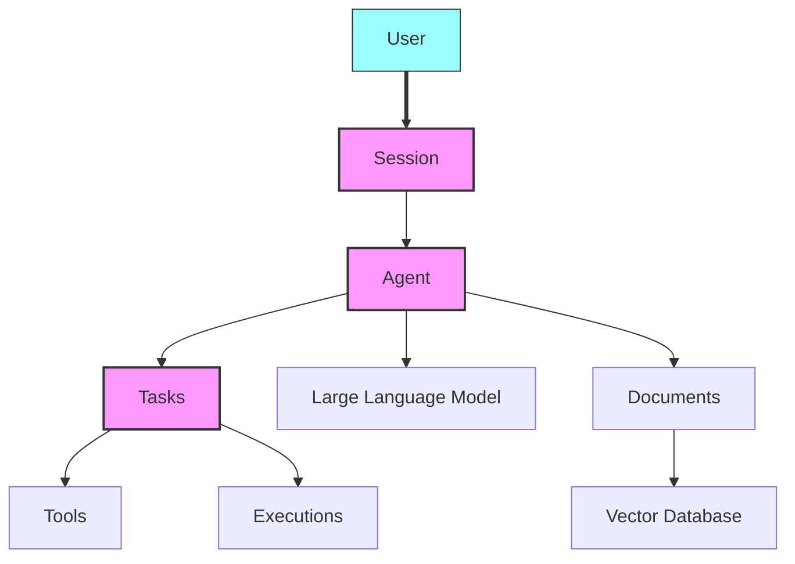
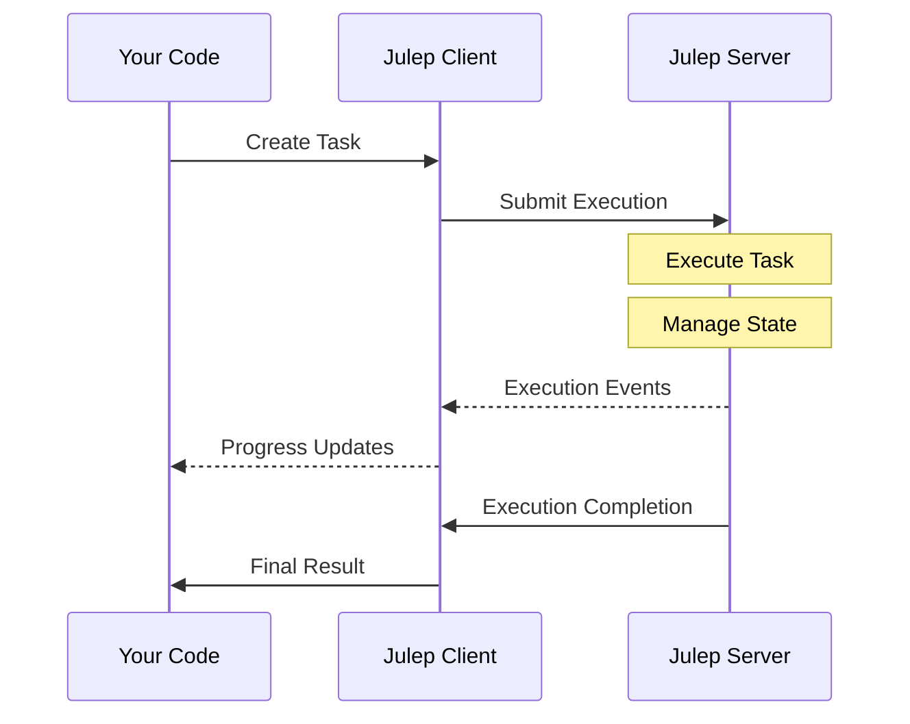

<sup>[English](README.md) | [中文翻译](README-CN.md) | [日本語翻訳](README-JA.md) | [French](README-FR.md) </sup>

<div align="center" id="top">
 
</div>

<p align="center">
  <br />
  <a href="https://docs.julep.ai" rel="dofollow">Explore Docs</a>
  ·
  <a href="https://discord.com/invite/JTSBGRZrzj" rel="dofollow">Discord</a>
  ·
  <a href="https://x.com/julep_ai" rel="dofollow">𝕏</a>
  ·
  <a href="https://www.linkedin.com/company/julep-ai" rel="dofollow">LinkedIn</a>
</p>

<p align="center">
    <a href="https://www.npmjs.com/package/@julep/sdk"></a>
    <span>&nbsp;</span>
    <a href="https://pypi.org/project/julep"></a>
    <span>&nbsp;</span>
    <a href="https://hub.docker.com/u/julepai"></a>
    <span>&nbsp;</span>
    <a href="https://choosealicense.com/licenses/apache/"></a>
</p>

---

> [!NOTE]
> 👨‍💻 Here for the devfest.ai event? Join our [Discord](https://discord.com/invite/JTSBGRZrzj) and check out the details below.
>
> Get your API key [here](https://dashboard-dev.julep.ai).

<details>
<summary><b>🌟 Contributors and DevFest.AI Participants</b> (Click to expand)</summary>

## 🌟 Call for Contributors!

We're excited to welcome new contributors to the Julep project! We've created several "good first issues" to help you get started. Here's how you can contribute:

1. Check out our [CONTRIBUTING.md](https://github.com/julep-ai/julep/blob/dev/CONTRIBUTING.md) file for guidelines on how to contribute.
2. Browse our [good first issues](https://github.com/julep-ai/julep/issues?q=is%3Aissue+is%3Aopen+label%3A%22good+first+issue%22) to find a task that interests you.
3. If you have any questions or need help, don't hesitate to reach out on our [Discord](https://discord.com/invite/JTSBGRZrzj) channel.

Your contributions, big or small, are valuable to us. Let's build something amazing together! 🚀

### 🎉 DevFest.AI October 2024

Exciting news! We're participating in DevFest.AI throughout October 2024! 🗓️

- Contribute to Julep during this event and get a chance to win awesome Julep merch and swag! 🎁
- Join developers from around the world in contributing to AI repositories and participating in amazing events.
- A big thank you to DevFest.AI for organizing this fantastic initiative!

> [!TIP]
> Ready to join the fun? **[Tweet that you are participating](https://twitter.com/intent/tweet?text=Pumped%20to%20be%20participating%20in%20%40devfestai%20with%20%40julep_ai%20building%20%23ai%20%23agents%20%23workflows%20Let's%20gooo!%20https%3A%2F%2Fgit.new%2Fjulep)** and let's get coding! 🖥️


</details>

<!-- START doctoc generated TOC please keep comment here to allow auto update -->
<!-- DON'T EDIT THIS SECTION, INSTEAD RE-RUN doctoc TO UPDATE -->
<h3>📖 Table of Contents</h3>

- [Introduction](#introduction)
- [Key Features](#key-features)
- [Quick Example](#quick-example)
- [Installation](#installation)
- [Python Quick Start 🐍](#python-quick-start-)
- [Node.js Quick Start 🟩](#nodejs-quick-start-)
  - [Step 1: Create an Agent](#step-1-create-an-agent)
- [Components](#components)
  - [Mental Model](#mental-model)
- [Concepts](#concepts)
- [Understanding Tasks](#understanding-tasks)
  - [Lifecycle of a Task](#lifecycle-of-a-task)
  - [Types of Workflow Steps](#types-of-workflow-steps)
- [Tool Types](#tool-types)
  - [User-defined `functions`](#user-defined-functions)
  - [`system` tools](#system-tools)
  - [Built-in `integrations`](#built-in-integrations)
  - [Direct `api_calls`](#direct-api_calls)
- [Integrations](#integrations)
- [Other Features](#other-features)
  - [Adding Tools to Agents](#adding-tools-to-agents)
  - [Managing Sessions and Users](#managing-sessions-and-users)
  - [Document Integration and Search](#document-integration-and-search)
- [Reference](#reference)
  - [SDK Reference](#sdk-reference)
  - [API Reference](#api-reference)
- [Local Quickstart](#local-quickstart)
- [What's the difference between Julep and LangChain etc?](#whats-the-difference-between-julep-and-langchain-etc)
  - [Different Use Cases](#different-use-cases)
  - [Different Form Factor](#different-form-factor)
  - [In Summary](#in-summary)

<!-- END doctoc generated TOC please keep comment here to allow auto update -->

## Introduction

Julep is a platform for creating AI agents that remember past interactions and can perform complex tasks. It offers long-term memory and manages multi-step processes.

Julep enables the creation of multi-step tasks incorporating decision-making, loops, parallel processing, and integration with numerous external tools and APIs.

While many AI applications are limited to simple, linear chains of prompts and API calls with minimal branching, Julep is built to handle more complex scenarios which:

- have multiple steps,
- make decisions based on model outputs,
- spawn parallel branches,
- use lots of tools, and
- run for a long time.

> [!TIP]
> Imagine you want to build an AI agent that can do more than just answer simple questions—it needs to handle complex tasks, remember past interactions, and maybe even use other tools or APIs. That's where Julep comes in. Read [Understanding Tasks](#understanding-tasks) to learn more.

## Key Features

1. 🧠 **Persistent AI Agents**: Remember context and information over long-term interactions.
2. 💾 **Stateful Sessions**: Keep track of past interactions for personalized responses.
3. 🔄 **Multi-Step Tasks**: Build complex, multi-step processes with loops and decision-making.
4. ⏳ **Task Management**: Handle long-running tasks that can run indefinitely.
5. 🛠️ **Built-in Tools**: Use built-in tools and external APIs in your tasks.
6. 🔧 **Self-Healing**: Julep will automatically retry failed steps, resend messages, and generally keep your tasks running smoothly.
7. 📚 **RAG**: Use Julep's document store to build a system for retrieving and using your own data.


> [!TIP]
> Julep is ideal for applications that require AI use cases beyond simple prompt-response models.

## Quick Example

Imagine a Research AI agent that can do the following:

1. **Take a topic**,
2. **Come up with 100 search queries** for that topic,
3. Perform those web **searches in parallel**,
4. **Summarize** the results,
5. Send the **summary to Discord**.

> [!NOTE]
> In Julep, this would be a single task under <b>80 lines of code</b> and run <b>fully managed</b> all on its own. All of the steps are executed on Julep's own servers and you don't need to lift a finger.

Here's a working example:  

```yaml
name: Research Agent

# Optional: Define the input schema for the task
input_schema:
  type: object
  properties:
    topic:
      type: string
      description: The main topic to research

# Define the tools that the agent can use
tools:
  - name: web_search
    type: integration
    integration:
      provider: brave
      setup:
        api_key: BSAqES7dj9d...  # dummy key

  - name: discord_webhook
    type: api_call
    api_call:
      url: https://eobuxj02se0n.m.pipedream.net  # dummy requestbin
      method: POST
      headers:
        Content-Type: application/json

# Special variables:
# - inputs: for accessing the input to the task
# - outputs: for accessing the output of previous steps
# - _: for accessing the output of the previous step

# Define the main workflow
main:
  - prompt:
      - role: system
        content: >-
          You are a research assistant.
          Generate 100 diverse search queries related to the topic:
          {{inputs[0].topic}}

          Write one query per line.
    unwrap: true

  # Evaluate the search queries using a simple python expression
  - evaluate:
      search_queries: "_.split('\n')"

  # Run the web search in parallel for each query
  - over: "_.search_queries"
    map:
      tool: web_search
      arguments:
        query: "_"
    parallelism: 10

  # Collect the results from the web search
  - evaluate:
      results: "'\n'.join([item.result for item in _])"

  # Summarize the results
  - prompt:
      - role: system
        content: >
          You are a research summarizer. Create a comprehensive summary of the following research results on the topic {{inputs[0].topic}}.
          The summary should be well-structured, informative, and highlight key findings and insights:
          {{_.results}}
    unwrap: true
    settings:
      model: gpt-4o-mini

  # Send the summary to Discord
  - tool: discord_webhook
    arguments:
      content: |-
        f'''
        **Research Summary for {inputs[0].topic}**

        {_}
        '''
```

In this example, Julep will automatically manage parallel executions, retry failed steps, resend API requests, and keep the tasks running reliably until completion.

> This runs in under 30 seconds and returns the following output:

<details>
<summary><b>Research Summary for AI</b> <i>(Click to expand)</i></summary>

> **Research Summary for AI**
> 
> ### Summary of Research Results on Artificial Intelligence (AI)
> 
> #### Introduction
> The field of Artificial Intelligence (AI) has seen significant advancements in recent years, marked by the development of methods and technologies that enable machines to perceive their environment, learn from data, and make decisions. The primary focus of this summary is on the insights derived from various research findings related to AI.
> 
> #### Key Findings
> 
> 1. **Definition and Scope of AI**:
>    - AI is defined as a branch of computer science focused on creating systems that can perform tasks requiring human-like intelligence, including learning, reasoning, and problem-solving (Wikipedia).
>    - It encompasses various subfields, including machine learning, natural language processing, robotics, and computer vision.
> 
> 2. **Impact and Applications**:
>    - AI technologies are being integrated into numerous sectors, improving efficiency and productivity. Applications range from autonomous vehicles and healthcare diagnostics to customer service automation and financial forecasting (OpenAI).
>    - Google's commitment to making AI beneficial for everyone highlights its potential to significantly improve daily life by enhancing user experiences across various platforms (Google AI).
> 
> 3. **Ethical Considerations**:
>    - There is an ongoing discourse regarding the ethical implications of AI, including concerns about privacy, bias, and accountability in decision-making processes. The need for a framework that ensures the safe and responsible use of AI technologies is emphasized (OpenAI).
> 
> 4. **Learning Mechanisms**:
>    - AI systems utilize different learning mechanisms, such as supervised learning, unsupervised learning, and reinforcement learning. These methods allow AI to improve performance over time by learning from past experiences and data (Wikipedia).
>    - The distinction between supervised and unsupervised learning is critical; supervised learning relies on labeled data, while unsupervised learning identifies patterns without predefined labels (Unsupervised).
> 
> 5. **Future Directions**:
>    - Future AI developments are expected to focus on enhancing the interpretability and transparency of AI systems, ensuring that they can provide justifiable decisions and actions (OpenAI).
>    - There is also a push towards making AI systems more accessible and user-friendly, encouraging broader adoption across different demographics and industries (Google AI).
> 
> #### Conclusion
> AI represents a transformative force across multiple domains, promising to reshape industries and improve quality of life. However, as its capabilities expand, it is crucial to address the ethical and societal implications that arise. Continued research and collaboration among technologists, ethicists, and policymakers will be essential in navigating the future landscape of AI.

</details>

## Installation

To get started with Julep, install it using [npm](https://www.npmjs.com/package/@julep/sdk) or [pip](https://pypi.org/project/julep/):

**Node.js**:  
```bash
npm install @julep/sdk

# or

bun add @julep/sdk
```

**Python**:  
```bash
pip install julep
```

> [!NOTE]
> Get your API key [here](https://dashboard-dev.julep.ai).
>
> While we are in beta, you can also reach out on [Discord](https://discord.com/invite/JTSBGRZrzj) to get rate limits lifted on your API key.

> [!TIP]
> 💻 Are you a _show me the code!™_ kind of person? We have created a ton of cookbooks for you to get started with. **Check out the [cookbooks](https://github.com/julep-ai/julep/tree/dev/cookbooks)** to browse through examples.
>
> 💡 There's also lots of ideas that you can build on top of Julep. **Check out the [list of ideas](https://github.com/julep-ai/julep/tree/dev/cookbooks/IDEAS.md)** to get some inspiration.

## Python Quick Start 🐍

```python
### Step 0: Setup

import time
import yaml
from julep import Julep # or AsyncJulep

client = Julep(api_key="your_julep_api_key")

### Step 1: Create an Agent

agent = client.agents.create(
    name="Storytelling Agent",
    model="claude-3.5-sonnet",
    about="You are a creative storyteller that crafts engaging stories on a myriad of topics.",
)

### Step 2: Create a Task that generates a story and comic strip

task_yaml = """
name: Storyteller
description: Create a story based on an idea.

tools:
  - name: research_wikipedia
    integration:
      provider: wikipedia
      method: search

main:
  # Step 1: Generate plot idea
  - prompt:
      - role: system
        content: You are {{agent.name}}. {{agent.about}}
      - role: user
        content: >
          Based on the idea '{{_.idea}}', generate a list of 5 plot ideas. Go crazy and be as creative as possible. Return your output as a list of long strings inside ```yaml tags at the end of your response.
    unwrap: true

  - evaluate:
      plot_ideas: load_yaml(_.split('```yaml')[1].split('```')[0].strip())

  # Step 2: Extract research fields from the plot ideas
  - prompt:
      - role: system
        content: You are {{agent.name}}. {{agent.about}}
      - role: user
        content: >
          Here are some plot ideas for a story:
          
          - {{idea}}
          

          To develop the story, we need to research for the plot ideas.
          What should we research? Write down wikipedia search queries for the plot ideas you think are interesting.
          Return your output as a yaml list inside ```yaml tags at the end of your response.
    unwrap: true
    settings:
      model: gpt-4o-mini
      temperature: 0.7

  - evaluate:
      research_queries: load_yaml(_.split('```yaml')[1].split('```')[0].strip())

  # Step 3: Research each plot idea
  - foreach:
      in: _.research_queries
      do:
        tool: research_wikipedia
        arguments:
          query: _

  - evaluate:
      wikipedia_results: 'NEWLINE.join([f"- {doc.metadata.title}: {doc.metadata.summary}" for item in _ for doc in item.documents])'

  # Step 4: Think and deliberate
  - prompt:
      - role: system
        content: You are {{agent.name}}. {{agent.about}}
      - role: user
        content: |-
          Before we write the story, let's think and deliberate. Here are some plot ideas:
          
          - {{idea}}
          
          
          Here are the results from researching the plot ideas on Wikipedia:
          {{_.wikipedia_results}}

          Think about the plot ideas critically. Combine the plot ideas with the results from Wikipedia to create a detailed plot for a story.
          Write down all your notes and thoughts.
          Then finally write the plot as a yaml object inside ```yaml tags at the end of your response. The yaml object should have the following structure:

          ```yaml
          title: "<string>"
          characters:
          - name: "<string>"
            about: "<string>"
          synopsis: "<string>"
          scenes:
          - title: "<string>"
            description: "<string>"
            characters:
            - name: "<string>"
              role: "<string>"
            plotlines:
            - "<string>"```

          Make sure the yaml is valid and the characters and scenes are not empty. Also take care of semicolons and other gotchas of writing yaml.
    unwrap: true

  - evaluate:
      plot: "load_yaml(_.split('```yaml')[1].split('```')[0].strip())"
"""

task = client.tasks.create(
    agent_id=agent.id,
    **yaml.safe_load(task_yaml)
)

### Step 3: Execute the Task

execution = client.executions.create(
    task_id=task.id,
    input={"idea": "A cat who learns to fly"}
)

# 🎉 Watch as the story and comic panels are generated
while (result := client.executions.get(execution.id)).status not in ['succeeded', 'failed']:
    print(result.status, result.output)
    time.sleep(1)

# 📦 Once the execution is finished, retrieve the results
if result.status == "succeeded":
    print(result.output)
else:
    raise Exception(result.error)
```

You can find the full python example [here](example.py).

<div align="center">
    <a href="#top">
        
    </a>&nbsp;|&nbsp;
    <a href="#-table-of-contents">
        
    </a>
</div>

## Node.js Quick Start 🟩

### Step 1: Create an Agent

```javascript
// Step 0: Setup
const dotenv = require('dotenv');
const { Julep } = require('@julep/sdk');
const yaml = require('yaml');

dotenv.config();

const client = new Julep({ apiKey: process.env.JULEP_API_KEY, environment: process.env.JULEP_ENVIRONMENT || "production" });

/* Step 1: Create an Agent */

async function createAgent() {
  const agent = await client.agents.create({
    name: "Storytelling Agent",
    model: "claude-3.5-sonnet",
    about: "You are a creative storyteller that crafts engaging stories on a myriad of topics.",
  });
  return agent;
}

/* Step 2: Create a Task that generates a story and comic strip */

const taskYaml = `
name: Storyteller
description: Create a story based on an idea.

tools:
  - name: research_wikipedia
    integration:
      provider: wikipedia
      method: search

main:
  # Step 1: Generate plot idea
  - prompt:
      - role: system
        content: You are {{agent.name}}. {{agent.about}}
      - role: user
        content: >
          Based on the idea '{{_.idea}}', generate a list of 5 plot ideas. Go crazy and be as creative as possible. Return your output as a list of long strings inside \`\`\`yaml tags at the end of your response.
    unwrap: true

  - evaluate:
      plot_ideas: load_yaml(_.split('\`\`\`yaml')[1].split('\`\`\`')[0].strip())

  # Step 2: Extract research fields from the plot ideas
  - prompt:
      - role: system
        content: You are {{agent.name}}. {{agent.about}}
      - role: user
        content: >
          Here are some plot ideas for a story:
          
          - {{idea}}
          

          To develop the story, we need to research for the plot ideas.
          What should we research? Write down wikipedia search queries for the plot ideas you think are interesting.
          Return your output as a yaml list inside \`\`\`yaml tags at the end of your response.
    unwrap: true
    settings:
      model: gpt-4o-mini
      temperature: 0.7

  - evaluate:
      research_queries: load_yaml(_.split('\`\`\`yaml')[1].split('\`\`\`')[0].strip())

  # Step 3: Research each plot idea
  - foreach:
      in: _.research_queries
      do:
        tool: research_wikipedia
        arguments:
          query: _

  - evaluate:
      wikipedia_results: 'NEWLINE.join([f"- {doc.metadata.title}: {doc.metadata.summary}" for item in _ for doc in item.documents])'

  # Step 4: Think and deliberate
  - prompt:
      - role: system
        content: You are {{agent.name}}. {{agent.about}}
      - role: user
        content: |-
          Before we write the story, let's think and deliberate. Here are some plot ideas:
          
          - {{idea}}
          

          Here are the results from researching the plot ideas on Wikipedia:
          {{_.wikipedia_results}}

          Think about the plot ideas critically. Combine the plot ideas with the results from Wikipedia to create a detailed plot for a story.
          Write down all your notes and thoughts.
          Then finally write the plot as a yaml object inside \`\`\`yaml tags at the end of your response. The yaml object should have the following structure:

          \`\`\`yaml
          title: "<string>"
          characters:
          - name: "<string>"
            about: "<string>"
          synopsis: "<string>"
          scenes:
          - title: "<string>"
            description: "<string>"
            characters:
            - name: "<string>"
              role: "<string>"
            plotlines:
            - "<string>"\`\`\`

          Make sure the yaml is valid and the characters and scenes are not empty. Also take care of semicolons and other gotchas of writing yaml.
    unwrap: true

  - evaluate:
      plot: "load_yaml(_.split('\`\`\`yaml')[1].split('\`\`\`')[0].strip())"
`;

async function createTask(agentId) {
  const task = await client.tasks.create(
    agentId,
    yaml.parse(taskYaml)
  );
  return task;
}

/* Step 3: Execute the Task */

async function executeTask(taskId) {
  const execution = await client.executions.create(taskId, {
    input: { idea: "A cat who learns to fly" }
  });

  // 🎉 Watch as the story and comic panels are generated
  while (true) {
    const result = await client.executions.get(execution.id);
    console.log(result.status, result.output);

    if (result.status === 'succeeded' || result.status === 'failed') {
      // 📦 Once the execution is finished, retrieve the results
      if (result.status === "succeeded") {
        console.log(result.output);
      } else {
        throw new Error(result.error);
      }
      break;
    }

    await new Promise(resolve => setTimeout(resolve, 1000));
  }
}

// Main function to run the example
async function main() {
  try {
    const agent = await createAgent();
    const task = await createTask(agent.id);
    await executeTask(task.id);
  } catch (error) {
    console.error("An error occurred:", error);
  }
}

main().then(() => console.log("Done")).catch(console.error);
```

You can find the full Node.js example [here](example.js).

<div align="center">
    <a href="#top">
        
    </a>&nbsp;|&nbsp;
    <a href="#-table-of-contents">
        
    </a>
</div>

## Components

Julep is made up of the following components:

- **Julep Platform**: The Julep platform is a cloud service that runs your workflows. It includes a language for describing workflows, a server for running those workflows, and an SDK for interacting with the platform.
- **Julep SDKs**: Julep SDKs are a set of libraries for building workflows. There are SDKs for Python and JavaScript, with more on the way.
- **Julep API**: The Julep API is a RESTful API that you can use to interact with the Julep platform.

### Mental Model

<div align="center">
  
</div>

Think of Julep as a platform that combines both client-side and server-side components to help you build advanced AI agents. Here's how to visualize it:

1. **Your Application Code:**

   - You can use the Julep SDK in your application to define agents, tasks, and workflows.
   - The SDK provides functions and classes that make it easy to set up and manage these components.

2. **Julep Backend Service:**

   - The SDK communicates with the Julep backend over the network.
   - The backend handles execution of tasks, maintains session state, stores documents, and orchestrates workflows.

3. **Integration with Tools and APIs:**
   - Within your workflows, you can integrate external tools and services.
   - The backend facilitates these integrations, so your agents can, for example, perform web searches, access databases, or call third-party APIs.

## Concepts

Julep is built on several key technical components that work together to create powerful AI workflows:



- **Agents**: AI-powered entities backed by large language models (LLMs) that execute tasks and interact with users.
- **Users**: Entities that interact with agents through sessions.
- **Sessions**: Stateful interactions between agents and users, maintaining context across multiple exchanges.
- **Tasks**: Multi-step, programmatic workflows that agents can execute, including various types of steps like prompts, tool calls, and conditional logic.
- **Tools**: Integrations that extend an agent's capabilities, including user-defined functions, system tools, or third-party API integrations.
- **Documents**: Text or data objects associated with agents or users, vectorized and stored for semantic search and retrieval.
- **Executions**: Instances of tasks that have been initiated with specific inputs, with their own lifecycle and state machine.


<div align="center">
    <a href="#top">
        
    </a>&nbsp;|&nbsp;
    <a href="#-table-of-contents">
        
    </a>
</div>

## Understanding Tasks

Tasks are the core of Julep's workflow system. They allow you to define complex, multi-step AI workflows that your agents can execute. Here's a brief overview of task components:

- **Name, Description and Input Schema**: Each task has a unique name and description for easy identification. An input schema (optional) that is used to validate the input to the task.
- **Main Steps**: The core of a task, defining the sequence of actions to be performed. Each step can be a prompt, tool call, evaluate, wait_for_input, log, get, set, foreach, map_reduce, if-else, switch, sleep, or return. (See [Types of Workflow Steps](#types-of-workflow-steps) for more details)
- **Tools**: Optional integrations that extend the capabilities of your agent during task execution.

### Lifecycle of a Task

You create a task using the Julep SDK and specify the main steps that the agent will execute. When you execute a task, the following lifecycle happens:



### Types of Workflow Steps

Tasks in Julep can include various types of steps, allowing you to create complex and powerful workflows. Here's an overview of the available step types:

#### Common Steps

<table>
<tr>
    <th>Name</th>
    <th>About</th>
    <th>Syntax</th>
</tr>
<tr>
<td> <b>Prompt</b> </td>
<td>
Send a message to the AI model and receive a response
<br><br><b>Note:</b> The prompt step uses Jinja templates and you can access context variables in them.
</td>

<td>

```yaml
- prompt: "Analyze the following data: {{agent.name}}"  # <-- this is a jinja template
```

```yaml
- prompt:
  - role: system
    content: "You are {{agent.name}}. {{agent.about}}"
  - role: user
    content: "Analyze the following data: {{_.data}}"
```

</td>
</tr>
<tr>
<td> <b>Tool Call</b> </td>
<td>
Execute an integrated tool or API that you have previously declared in the task.
<br><br><b>Note:</b> The tool call step uses Python expressions inside the arguments.

</td>

<td>

```yaml
- tool: web_search
  arguments:
    query: '"Latest AI developments"'  # <-- this is a python expression (notice the quotes)
    num_results: len(_.topics)         # <-- python expression to access the length of a list
```

</td>
</tr>
<tr>
<td> <b>Evaluate</b> </td>
<td>
Perform calculations or manipulate data
<br><br><b>Note:</b> The evaluate step uses Python expressions.
</td>

<td>

```yaml
- evaluate:
    average_score: sum(scores) / len(scores)
```

</td>
</tr>
<tr>
<td> <b>Wait for Input</b> </td>
<td>
Pause workflow until input is received. It accepts an `info` field that can be used by your application to collect input from the user.

<br><br><b>Note:</b> The wait_for_input step is useful when you want to pause the workflow and wait for user input e.g. to collect a response to a prompt.

</td>

<td>

```yaml
- wait_for_input:
    info:
      message: '"Please provide additional information about {_.required_info}."'  # <-- python expression to access the context variable
```

</td>
</tr>
<tr>
<td> <b>Log</b> </td>
<td>
Log a specified value or message.

<br><br><b>Note:</b> The log step uses Jinja templates and you can access context variables in them.

</td>

<td>

```yaml
- log: "Processing completed for item {{_.item_id}}"  # <-- jinja template to access the context variable
```

</td>
</tr>
</table>

#### Key-Value Steps

<table>
<tr>
<th> Name </th> <th> About </th><th>Syntax</th>
</tr>
<tr>
<td> <b>Get</b> </td>
<td>
Retrieve a value from the execution's key-value store.

</td>

<td>

```yaml
- get: user_preference
```

</td>
</tr>
<tr>
<td> <b>Set</b> </td>
<td>
Assign a value to a key in the execution's key-value store.

<br><br><b>Note:</b> The set step uses Python expressions.
</td>

<td>

```yaml
- set:
    user_preference: '"dark_mode"'  # <-- python expression
```

</td>
</tr>
</table>

#### Iteration Steps

<table>
<tr>
<th> Name </th> <th> About </th><th>Syntax</th>
</tr>
<tr>
<td> <b>Foreach</b> </td>
<td>
Iterate over a collection and perform steps for each item

</td>

<td>

```yaml
- foreach:
    in: _.data_list  # <-- python expression to access the context variable
    do:
      - log: "Processing item {{_.item}}"  # <-- jinja template to access the context variable
```

</td>
</tr>
<tr>
<td> <b>Map-Reduce</b> </td>
<td>
Map over a collection and reduce the results

</td>

<td>

```yaml
- map_reduce:
    over: _.numbers  # <-- python expression to access the context variable
    map:
      - evaluate:
          squared: "_ ** 2"
    reduce: results + [_]  # <-- (optional) python expression to reduce the results. This is the default if omitted.
```

```yaml
- map_reduce:
    over: _.topics
    map:
      - prompt: Write an essay on {{_}}
    parallelism: 10
```

</td>
</tr>
<tr>
<td> <b>Parallel</b> </td>
<td>
Run multiple steps in parallel

</td>

<td>

```yaml
- parallel:
    - tool: web_search
      arguments:
        query: '"AI news"'
    - tool: weather_check
      arguments:
        location: '"New York"'
```

</td>
</tr>
</table>

#### Conditional Steps

<table>
<tr>
<th> Name </th> <th> About </th><th>Syntax</th>
</tr>
<tr>
<td> <b>If-Else</b> </td>
<td>
Conditional execution of steps

</td>

<td>

```yaml
- if: _.score > 0.8  # <-- python expression 
  then:
    - log: High score achieved
  else:
    - error: Score needs improvement
```

</td>
</tr>
<tr>
<td> <b>Switch</b> </td>
<td>
Execute steps based on multiple conditions

</td>

<td>

```yaml
- switch:
    - case: _.category == 'A'
      then:
        - log: "Category A processing"
    - case: _.category == 'B'
      then:
        - log: "Category B processing"
    - case: _  # Default case
      then:
        - error: Unknown category
```

</td>
</tr>
</table>

#### Other Control Flow

<table>
<tr>
<th> Name </th> <th> About </th><th>Syntax</th>
</tr>
<tr>
<td> <b>Sleep</b> </td>
<td>
Pause the workflow for a specified duration

</td>

<td>

```yaml
- sleep:
    seconds: 30
    # minutes: 1
    # hours: 1
    # days: 1
```

</td>
</tr>
<tr>
<td> <b>Return</b> </td>
<td>
Return a value from the workflow

<br><br><b>Note:</b> The return step uses Python expressions.

</td>

<td>

```yaml
- return:
    result: '"Task completed successfully"'  # <-- python expression
    time: datetime.now().isoformat()  # <-- python expression
```

</td>
</tr>
<tr>
<td> <b>Yield</b> </td>
<td>
Run a subworkflow and await its completion

</td>

<td>

```yaml
- yield:
    workflow: process_data
    arguments:
      input_data: _.raw_data  # <-- python expression 
```

</td>
</tr>
</tr>
<tr>
<td> <b>Error</b> </td>
<td>
Handle errors by specifying an error message

</td>

<td>

```yaml
- error: "Invalid input provided"  # <-- Strings only
```

</td>
</tr>
</table>

Each step type serves a specific purpose in building sophisticated AI workflows. This categorization helps in understanding the various control flows and operations available in Julep tasks.

<div align="center">
    <a href="#top">
        
    </a>&nbsp;|&nbsp;
    <a href="#-table-of-contents">
        
    </a>
</div>

## Tool Types

Agents can be given access to a number of "tools" -- any programmatic interface that a foundation model can "call" with a set of inputs to achieve a goal. For example, it might use a `web_search(query)` tool to search the Internet for some information.

Unlike agent frameworks, julep is a _backend_ that manages agent execution. Clients can interact with agents using our SDKs. julep takes care of executing tasks and running integrations.

Tools in julep can be one of:
1. **User-defined `functions`**: These are function signatures that you can give the model to choose from, similar to how [openai]'s function-calling works. They need to be handled by the client. The workflow will pause until the client calls the function and gives the results back to julep.
2. **`system` tools**: Built-in tools that can be used to call the julep APIs themselves, like triggering a task execution, appending to a metadata field, etc.
3. **`integrations`**: Built-in third party tools that can be used to extend the capabilities of your agents.
4. **`api_calls`**: Direct api calls during workflow executions as tool calls.

### User-defined `functions`

These are function signatures that you can give the model to choose from, similar to how [openai]'s function-calling works. An example:

```yaml
name: Example system tool task
description: List agents using system call

tools:
  - name: send_notification
    description: Send a notification to the user
    type: function
    function:
      parameters:
        type: object
        properties:
          text:
            type: string
            description: Content of the notification

main:
  - tool: send_notification
    arguments:
      content: '"hi"'  # <-- python expression
```

Whenever julep encounters a _user-defined function_, it pauses, giving control back to the client and waits for the client to run the function call and give the results back to julep.

> [!TIP]
> **Example cookbook**: [cookbooks/13-Error_Handling_and_Recovery.py](https://github.com/julep-ai/julep/blob/dev/cookbooks/13-Error_Handling_and_Recovery.py)

### `system` tools

Built-in tools that can be used to call the julep APIs themselves, like triggering a task execution, appending to a metadata field, etc.  

`system` tools are built into the backend. They get executed automatically when needed. They do _not_ require any action from the client-side.

For example,

```yaml
name: Example system tool task
description: List agents using system call

tools:
  - name: list_agent_docs
    description: List all docs for the given agent
    type: system
    system:
      resource: agent
      subresource: doc
      operation: list

main:
  - tool: list_agents
    arguments:
      limit: 10  # <-- python expression
```

#### Available `system` resources and operations

- `agent`:
  - `list`: List all agents.
  - `get`: Get a single agent by id.
  - `create`: Create a new agent.
  - `update`: Update an existing agent.
  - `delete`: Delete an existing agent.

- `user`:
  - `list`: List all users.
  - `get`: Get a single user by id.
  - `create`: Create a new user.
  - `update`: Update an existing user.
  - `delete`: Delete an existing user.

- `session`:
  - `list`: List all sessions.
  - `get`: Get a single session by id.
  - `create`: Create a new session.
  - `update`: Update an existing session.
  - `delete`: Delete an existing session.
  - `chat`: Chat with a session.
  - `history`: Get the chat history with a session.

- `task`:
  - `list`: List all tasks.
  - `get`: Get a single task by id.
  - `create`: Create a new task.
  - `update`: Update an existing task.
  - `delete`: Delete an existing task.

- `doc` (subresource for `agent` and `user`):
  - `list`: List all documents.
  - `create`: Create a new document.
  - `delete`: Delete an existing document.
  - `search`: Search for documents.

Additional operations available for some resources:
- `embed`: Embed a resource (specific resources not specified in the provided code).
- `change_status`: Change the status of a resource (specific resources not specified in the provided code).
- `chat`: Chat with a resource (specific resources not specified in the provided code).
- `history`: Get the chat history with a resource (specific resources not specified in the provided code).
- `create_or_update`: Create a new resource or update an existing one (specific resources not specified in the provided code).

Note: The availability of these operations may vary depending on the specific resource and implementation details.

> [!TIP]
> **Example cookbook**: [cookbooks/10-Document_Management_and_Search.py](https://github.com/julep-ai/julep/blob/dev/cookbooks/10-Document_Management_and_Search.py)

### Built-in `integrations`

Julep comes with a number of built-in integrations (as described in the section below). `integration` tools are directly executed on the julep backend. Any additional parameters needed by them at runtime can be set in the agent/session/user's `metadata` fields.

See [Integrations](#integrations) for details on the available integrations.

> [!TIP]
> **Example cookbook**: [cookbooks/01-Website_Crawler_using_Spider.ipynb](https://github.com/julep-ai/julep/blob/dev/cookbooks/01-Website_Crawler_using_Spider.ipynb)


### Direct `api_calls`

julep can also directly make api calls during workflow executions as tool calls. Same as `integration`s, additional runtime parameters are loaded from `metadata` fields.

For example,

```yaml
name: Example api_call task
tools:
  - type: api_call
    name: hello
    api_call:
      method: GET
      url: https://httpbin.org/get

main:
  - tool: hello
    arguments:
      json:
        test: _.input  # <-- python expression
```

<div align="center">
    <a href="#top">
        
    </a>&nbsp;|&nbsp;
    <a href="#-table-of-contents">
        
    </a>
</div>

## Integrations

Julep supports various integrations that extend the capabilities of your AI agents. Here's a list of available integrations and their supported arguments:

<table>

<tr>
<td> <b>Brave Search</b> </td>
<td>

```yaml
setup:
  api_key: string # The API key for Brave Search

arguments:
  query: string # The search query for searching with Brave

output:
  result: string # The result of the Brave Search
```

</td>

<td>

**Example cookbook**: [cookbooks/03-SmartResearcher_With_WebSearch.ipynb](https://github.com/julep-ai/julep/blob/dev/cookbooks/03-SmartResearcher_With_WebSearch.ipynb)

</td>
</tr>
<tr>
<td> <b>BrowserBase</b> </td>
<td>

```yaml
setup:
  api_key: string # The API key for BrowserBase
  project_id: string # The project ID for BrowserBase
  session_id: string # (Optional) The session ID for BrowserBase

arguments:
  urls: list[string] # The URLs for loading with BrowserBase

output:
  documents: list # The documents loaded from the URLs
```

</td>

</tr>
<tr>
<td> <b>Email</b> </td>
<td>

```yaml
setup:
  host: string # The host of the email server
  port: integer # The port of the email server
  user: string # The username of the email server
  password: string # The password of the email server

arguments:
  to: string # The email address to send the email to
  from: string # The email address to send the email from
  subject: string # The subject of the email
  body: string # The body of the email

output:
  success: boolean # Whether the email was sent successfully
```

</td>

<td>

**Example cookbook**: [cookbooks/00-Devfest-Email-Assistant.ipynb](https://github.com/julep-ai/julep/blob/dev/cookbooks/00-Devfest-Email-Assistant.ipynb)

</td>
</tr>
<tr>
<td> <b>Spider</b> </td>
<td>

```yaml
setup:
  spider_api_key: string # The API key for Spider

arguments:
  url: string # The URL for which to fetch data
  mode: string # The type of crawlers (default: "scrape")
  params: dict # (Optional) The parameters for the Spider API

output:
  documents: list # The documents returned from the spider
```

</td>

<td>

**Example cookbook**: [cookbooks/01-Website_Crawler_using_Spider.ipynb](https://github.com/julep-ai/julep/blob/dev/cookbooks/01-Website_Crawler_using_Spider.ipynb)

</td>
</tr>
<tr>
<td> <b>Weather</b> </td>
<td>

```yaml
setup:
  openweathermap_api_key: string # The API key for OpenWeatherMap

arguments:
  location: string # The location for which to fetch weather data

output:
  result: string # The weather data for the specified location
```

</td>

<td>

**Example cookbook**: [cookbooks/04-TripPlanner_With_Weather_And_WikiInfo.ipynb](https://github.com/julep-ai/julep/blob/dev/cookbooks/04-TripPlanner_With_Weather_And_WikiInfo.ipynb)

</td>
</tr>
</tr>
<tr>
<td> <b>Wikipedia</b> </td>
<td>

```yaml
arguments:
  query: string # The search query string
  load_max_docs: integer # Maximum number of documents to load (default: 2)

output:
  documents: list # The documents returned from the Wikipedia search
```

</td>

<td>

**Example cookbook**: [cookbooks/04-TripPlanner_With_Weather_And_WikiInfo.ipynb](https://github.com/julep-ai/julep/blob/dev/cookbooks/04-TripPlanner_With_Weather_And_WikiInfo.ipynb)

</td>
</tr>
</table>

For more details, refer to our [Integrations Documentation](#integrations).

<div align="center">
    <a href="#top">
        
    </a>&nbsp;|&nbsp;
    <a href="#-table-of-contents">
        
    </a>
</div>

## Other Features

Julep offers a range of advanced features to enhance your AI workflows:

### Adding Tools to Agents

Extend your agent's capabilities by integrating external tools and APIs:

```python
client.agents.tools.create(
    agent_id=agent.id,
    name="web_search",
    description="Search the web for information.",
    integration={
        "provider": "brave",
        "method": "search",
        "setup": {"api_key": "your_brave_api_key"},
    },
)
```

### Managing Sessions and Users

Julep provides robust session management for persistent interactions:

```python
session = client.sessions.create(
    agent_id=agent.id,
    user_id=user.id,
    context_overflow="adaptive"
)

# Continue conversation in the same session
response = client.sessions.chat(
    session_id=session.id,
    messages=[
      {
        "role": "user",
        "content": "Follow up on the previous conversation."
      }
    ]
)
```

### Document Integration and Search

Easily manage and search through documents for your agents:

```python
# Upload a document
document = client.agents.docs.create(
    title="AI advancements",
    content="AI is changing the world...",
    metadata={"category": "research_paper"}
)

# Search documents
results = client.agents.docs.search(
    text="AI advancements",
    metadata_filter={"category": "research_paper"}
)
```

<div align="center">
    <a href="#top">
        
    </a>&nbsp;|&nbsp;
    <a href="#-table-of-contents">
        
    </a>
</div>

## Reference

### SDK Reference

- **Node.js** [SDK Reference](https://github.com/julep-ai/node-sdk/blob/main/api.md) | [NPM Package](https://www.npmjs.com/package/@julep/sdk)
- **Python** [SDK Reference](https://github.com/julep-ai/python-sdk/blob/main/api.md) | [PyPI Package](https://pypi.org/project/julep/)

### API Reference

Explore our API documentation to learn more about agents, tasks, and executions:

- [Agents API](https://dev.julep.ai/api/docs#tag/agents)
- [Tasks API](https://dev.julep.ai/api/docs#tag/tasks)
- [Executions API](https://dev.julep.ai/api/docs#tag/executions)

<div align="center">
    <a href="#top">
        
    </a>&nbsp;|&nbsp;
    <a href="#-table-of-contents">
        
    </a>
</div>

## Local Quickstart

**Requirements**:

- latest docker compose installed

**Steps**:

1. `git clone https://github.com/julep-ai/julep.git`
2. `cd julep`
3. `docker volume create cozo_backup`
4. `docker volume create cozo_data`
5. `cp .env.example .env  # <-- Edit this file`
6. `docker compose --env-file .env --profile temporal-ui --profile single-tenant --profile self-hosted-db up --build`

<div align="center">
    <a href="#top">
        
    </a>&nbsp;|&nbsp;
    <a href="#-table-of-contents">
        
    </a>
</div>


*****

## What's the difference between Julep and LangChain etc?

### Different Use Cases

Think of LangChain and Julep as tools with different focuses within the AI development stack.

LangChain is great for creating sequences of prompts and managing interactions with LLMs. It has a large ecosystem with lots of pre-built integrations, which makes it convenient if you want to get something up and running quickly. LangChain fits well with simple use cases that involve a linear chain of prompts and API calls.

Julep, on the other hand, is more about building persistent AI agents that can maintain context over long-term interactions. It shines when you need complex workflows that involve multi-step tasks, conditional logic, and integration with various tools or APIs directly within the agent's process. It's designed from the ground up to manage persistent sessions and complex workflows.

Use Julep if you imagine building a complex AI assistant that needs to:

- Keep track of user interactions over days or weeks.
- Perform scheduled tasks, like sending daily summaries or monitoring data sources.
- Make decisions based on prior interactions or stored data.
- Interact with multiple external services as part of its workflow.

Then Julep provides the infrastructure to support all that without you having to build it from scratch.

### Different Form Factor

Julep is a **platform** that includes a language for describing workflows, a server for running those workflows, and an SDK for interacting with the platform. In order to build something with Julep, you write a description of the workflow in `YAML`, and then run the workflow in the cloud.

Julep is built for heavy-lifting, multi-step, and long-running workflows and there's no limit to how complex the workflow can be.

LangChain is a **library** that includes a few tools and a framework for building linear chains of prompts and tools. In order to build something with LangChain, you typically write Python code that configures and runs the model chains you want to use.

LangChain might be sufficient and quicker to implement for simple use cases that involve a linear chain of prompts and API calls.

### In Summary

Use LangChain when you need to manage LLM interactions and prompt sequences in a stateless or short-term context.

Choose Julep when you need a robust framework for stateful agents with advanced workflow capabilities, persistent sessions, and complex task orchestration.

<div align="center">
    <a href="#top">
        
    </a>&nbsp;|&nbsp;
    <a href="#-table-of-contents">
        
    </a>
</div>
