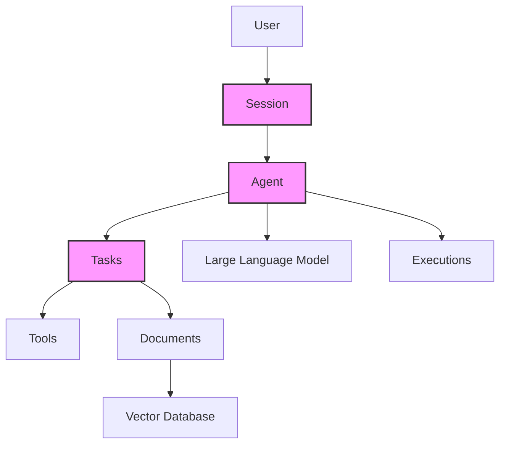

<sup>English | [中文翻译](/README-CN.md) | [日本語翻訳](/README-JP.md)</sup>

<div align="center">
 
</div>

<p align="center">
  <br />
  <a href="https://docs.julep.ai" rel="dofollow"><strong>Explore Docs</strong></a>
  ·
  <a href="https://discord.com/invite/JTSBGRZrzj" rel="dofollow">Discord</a>
  ·
  <a href="https://x.com/julep_ai" rel="dofollow">𝕏</a>
  ·
  <a href="https://www.linkedin.com/company/julep-ai" rel="dofollow">LinkedIn</a>
</p>


<p align="center">
    <a href="https://www.npmjs.com/package/@julep/sdk"></a>
    <span>&nbsp;</span>
    <a href="https://pypi.org/project/julep"></a>
    <span>&nbsp;</span>
    <a href="https://hub.docker.com/u/julepai"></a>
    <span>&nbsp;</span>
    <a href="https://choosealicense.com/licenses/apache/"></a>
</p>

*****

> [!TIP]
> 👨‍💻 Here for the devfest.ai event? Join our [Discord](https://discord.com/invite/JTSBGRZrzj) and check out the details below.

<details>
<summary><b>🌟 Contributors and DevFest.AI Participants</b></summary>

## 🌟 Call for Contributors!

We're excited to welcome new contributors to the Julep project! We've created several "good first issues" to help you get started. Here's how you can contribute:

1. Check out our [CONTRIBUTING.md](CONTRIBUTING.md) file for guidelines on how to contribute.
2. Browse our [good first issues](https://github.com/julep-ai/julep/issues?q=is%3Aissue+is%3Aopen+label%3A%22good+first+issue%22) to find a task that interests you.
3. If you have any questions or need help, don't hesitate to reach out on our [Discord](https://discord.com/invite/JTSBGRZrzj) channel.

Your contributions, big or small, are valuable to us. Let's build something amazing together! 🚀

### 🎉 DevFest.AI October 2024

Exciting news! We're participating in DevFest.AI throughout October 2024! 🗓️

- Contribute to Julep during this event and get a chance to win awesome Julep merch and swag! 🎁
- Join developers from around the world in contributing to AI repositories and participating in amazing events.
- A big thank you to DevFest.AI for organizing this fantastic initiative!

> [!TIP]
> Ready to join the fun? **[Tweet that you are participating](https://twitter.com/intent/tweet?text=Pumped%20to%20be%20participating%20in%20%40devfestai%20with%20%40julep_ai%20building%20%23ai%20%23agents%20%23workflows%20Let's%20gooo!%20https%3A%2F%2Fgit.new%2Fjulep)** and let's get coding! 🖥️


</details>

<!-- START doctoc generated TOC please keep comment here to allow auto update -->
<!-- DON'T EDIT THIS SECTION, INSTEAD RE-RUN doctoc TO UPDATE -->
<details>
<summary><b>📖 Table of Contents</b></summary>

- [Quick Intro](#quick-intro)
- [Key Features](#key-features)
- [Why Julep vs. LangChain?](#why-julep-vs-langchain)
- [Installation](#installation)
- [Python Quick Start 🐍](#python-quick-start-)
- [Node.js Quick Start 🟩](#nodejs-quick-start-)
- [Components](#components)
- [Concepts](#concepts)
- [Understanding Tasks](#understanding-tasks)
- [Advanced Features](#advanced-features)
- [SDK Reference](#sdk-reference)
- [API Reference](#api-reference)

</details>
<!-- END doctoc generated TOC please keep comment here to allow auto update -->

## Introduction

<!-- TODO: Add a screencast -->

Julep is a platform for creating AI agents that maintain state and execute complex workflows. It offers long-term context and orchestrates multi-step tasks.

Julep lets you define multi-step tasks that can include conditional logic, loops, parallel processing, and built-in integration with 100s of external tools and APIs. Typically AI applications tend to be linear and have simple chains of a handful of prompts and API calls without much branching or decision-making.


## Quick Example

Imagine a Research AI agent that can do the following:
  1. Take a topic,
  2. Come up with 100 search queries for that topic,
  3. Perform those web searches in parallel,
  4. Collect and compile the results, 
  5. Come up with 5 follow-up questions,
  6. Repeat the process with new queries,
  7. Summarize the results,
  8. Send the summary to Discord

In julep, this would be a single task under <b>80 lines of code</b> and run <b>fully managed</b> all on its own. Here's a working example:

```yaml
name: Research Agent

# Optional: Define the input schema for the task
input_schema:
  type: object
  properties:
    topic:
      type: string
      description: The main topic to research

# Define the tools that the agent can use
tools:
- name: web_search
  type: integration
  integration:
    provider: brave
    setup:
      api_key: "YOUR_BRAVE_API_KEY"

- name: discord_webhook
  type: api_call
  api_call:
    url: "YOUR_DISCORD_WEBHOOK_URL"
    method: POST
    headers:
      Content-Type: application/json

# Special variables:
# - inputs: for accessing the input to the task
# - outputs: for accessing the output of previous steps
# - _: for accessing the output of the previous step

# Define the main workflow
main:
- prompt:
    - role: system
      content: >-
        You are a research assistant.
        Generate 100 diverse search queries related to the topic:
        {{inputs[0].topic}}

        Write one query per line.
  unwrap: true

# Evaluate the search queries using a simple python expression
- evaluate:
    search_queries: "_.split('\n')"

# Run the web search in parallel for each query
- over: "_.search_queries"
  map:
    tool: web_search
    arguments:
      query: "_"
    on_error:
  parallelism: 100

# Collect the results from the web search
- evaluate:
    results: "'\n'.join([item.result for item in _])"

# Generate follow-up questions based on the results
- prompt:
    - role: system
      content: >-
        Based on the following research results, generate 5 follow-up questions that would deepen our understanding of {{inputs[0].topic}}:
        {{_.results}}

        Write one question per line.
  unwrap: true

- evaluate:
    follow_up_queries: "_.split('\n')"

# Run the web search in parallel for each follow-up query
- over: "_.follow_up_queries"
  map:
    tool: web_search
    arguments:
      query: "_"

  parallelism: 5

- evaluate:
    all_results: "outputs[3].results + '\n'.join([item.result for item in _])"

# Summarize the results
- prompt:
    - role: system
      content: >
        You are a research summarizer. Create a comprehensive summary of the following research results on the topic {{inputs[0].topic}}. 
        The summary should be well-structured, informative, and highlight key findings and insights:
        {{_.all_results}}
  unwrap: true

# Send the summary to Discord
- tool: discord_webhook
  arguments:
    content: >
      **Research Summary for {{inputs[0].topic}}**

      {{_}}
```

> [!TIP]
> Julep is really useful when you want to build AI agents that can maintain context and state over long-term interactions. It's great for designing complex, multi-step workflows and integrating various tools and APIs directly into your agent's processes.
> 
> Imagine you want to build an AI agent that can do more than just answer simple queries—it needs to handle complex tasks, remember past interactions, and maybe even integrate with other tools or APIs. That's where Julep comes in.

## Key Features

1. **Persistent AI Agents**: Persist context and state over long-term interactions.
2. **Stateful Sessions**: Remember past interactions for personalized responses.
3. **Multi-Step Workflows**: Build complex, multi-step processes with loops and conditional logic.
4. **Task Orchestration**: Manage long-running tasks that can run indefinitely.
5. **Built-in Tools**: Integrate built-in tools and external APIs into workflows.
6. **Self-Healing**: Julep will automatically retry failed steps, resend messages, and generally keep your workflows running smoothly.
7. **RAG**: Use Julep's document store to build a RAG system for your own data.

Julep is ideal for applications that require AI use cases beyond simple prompt-response models.

## Why Julep vs. LangChain?

### Different Use Cases

Think of LangChain and Julep as tools with different focuses within the AI development stack.

LangChain is great for creating sequences of prompts and managing interactions with LLMs. It has a large ecosystem with lots of pre-built integrations, which makes it convenient if you want to get something up and running quickly. LangChain fits well with simple use cases that involve a linear chain of prompts and API calls.

Julep, on the other hand, is more about building persistent AI agents that can maintain context over long-term interactions. It shines when you need complex workflows that involve multi-step tasks, conditional logic, and integration with various tools or APIs directly within the agent's process. It's designed from the ground up to manage persistent sessions and complex workflows.

Use Julep if you imagine building a complex AI assistant that needs to:

- Keep track of user interactions over days or weeks.
- Perform scheduled tasks, like sending daily summaries or monitoring data sources.
- Make decisions based on prior interactions or stored data.
- Interact with multiple external services as part of its workflow.

Then Julep provides the infrastructure to support all that without you having to build it from scratch.

### Different Form Factor

Julep is a **platform** that includes a language for describing workflows, a server for running those workflows, and an SDK for interacting with the platform. In order to build something with Julep, you write a description of the workflow in `YAML`, and then run the workflow in the cloud.

Julep is built for heavy-lifting, multi-step, and long-running workflows and there's no limit to how complex the workflow can be.

LangChain is a **library** that includes a few tools and a framework for building linear chains of prompts and tools. In order to build something with LangChain, you typically write Python code that configures and runs the model chains you want to use.

LangChain might be sufficient and quicker to implement for simple use cases that involve a linear chain of prompts and API calls.

### In Summary

Use LangChain when you need to manage LLM interactions and prompt sequences in a stateless or short-term context.

Choose Julep when you need a robust framework for stateful agents with advanced workflow capabilities, persistent sessions, and complex task orchestration.

## Installation

To get started with Julep, install it using [npm](https://www.npmjs.com/package/@julep/sdk) or [pip](https://pypi.org/project/julep/):

```bash
npm install @julep/sdk
```

or

```bash
pip install julep
```

> [!NOTE]
> ~~Get your API key [here](https://app.julep.ai/api-keys).~~
>  
> While we are in beta, you can reach out on [Discord](https://discord.com/invite/JTSBGRZrzj) to get your API key.

> [!TIP]
> 💻 Are you a _show me the code!™_ kind of person? We have created a ton of cookbooks for you to get started with. **Check out the [cookbooks](/cookbooks)** to browse through examples.
> 
> 💡 There's also lots of ideas that you can build on top of Julep. **Check out the [list of ideas](/cookbooks/IDEAS.md)** to get some inspiration.

## Python Quick Start 🐍

### Step 1: Create an Agent

```python
import yaml
from julep import Julep # or AsyncJulep

client = Julep(api_key="your_julep_api_key")

agent = client.agents.create(
    name="Storytelling Agent",
    model="gpt-4o",
    about="You are a creative storytelling agent that can craft engaging stories and generate comic panels based on ideas.",
)

# 🛠️ Add an image generation tool (DALL·E) to the agent
client.agents.tools.create(
    agent_id=agent.id,
    name="image_generator",
    description="Use this tool to generate images based on descriptions.",
    integration={
        "provider": "dalle",
        "method": "generate_image",
        "setup": {
            "api_key": "your_openai_api_key",
        },
    },
)
```

### Step 2: Create a Task that generates a story and comic strip

Let's define a multi-step task to create a story and generate a paneled comic strip based on an input idea:

```python
# 📋 Task
# Create a task that takes an idea and creates a story and a 4-panel comic strip
task_yaml = """
name: Story and Comic Creator
description: Create a story based on an idea and generate a 4-panel comic strip illustrating the story.

main:
  # Step 1: Generate a story and outline into 4 panels
  - prompt:
      - role: system
        content: You are {{agent.name}}. {{agent.about}}
      - role: user
        content: >
          Based on the idea '{{_.idea}}', write a short story suitable for a 4-panel comic strip.
          Provide the story and a numbered list of 4 brief descriptions for each panel illustrating key moments in the story.
    unwrap: true

  # Step 2: Extract the panel descriptions and story
  - evaluate:
      story: _.split('1. ')[0].strip()
      panels: re.findall(r'\\d+\\.\\s*(.*?)(?=\\d+\\.\\s*|$)', _)

  # Step 3: Generate images for each panel using the image generator tool
  - foreach:
      in: _.panels
      do:
        tool: image_generator
        arguments:
          description: _

  # Step 4: Generate a catchy title for the story
  - prompt:
      - role: system
        content: You are {{agent.name}}. {{agent.about}}
      - role: user
        content: >
          Based on the story below, generate a catchy title.

          Story: {{outputs[1].story}}
    unwrap: true

  # Step 5: Return the story, the generated images, and the title
  - return:
      title: outputs[3]
      story: outputs[1].story
      comic_panels: "[output.image.url for output in outputs[2]]"
"""

task = client.tasks.create(
    agent_id=agent.id,
    **yaml.safe_load(task_yaml)
)
```

### Step 3: Execute the Task

```python
# 🚀 Execute the task with an input idea
execution = client.executions.create(
    task_id=task.id,
    input={"idea": "A cat who learns to fly"}
)

# 🎉 Watch as the story and comic panels are generated
for transition in client.executions.transitions.stream(execution_id=execution.id):
    print(transition)

# 📦 Once the execution is finished, retrieve the results
result = client.executions.get(execution_id=execution.id)
```

### Step 4: Chat with the Agent

Start an interactive chat session with the agent:

```python
session = client.sessions.create(agent_id=agent.id)

# 💬 Send messages to the agent
while (message := input("Enter a message: ")) != "quit":
    response = client.sessions.chat(
        session_id=session.id,
        message=message,
    )

    print(response)
``` 

> [!TIP]
> You can find the full python example [here](example.py).


## Node.js Quick Start 🟩

### Step 1: Create an Agent

```javascript
import { Julep } from '@julep/sdk';
import yaml from 'js-yaml';

const client = new Julep({ apiKey: 'your_julep_api_key' });

async function createAgent() {
  const agent = await client.agents.create({
    name: "Storytelling Agent",
    model: "gpt-4",
    about: "You are a creative storytelling agent that can craft engaging stories and generate comic panels based on ideas.",
  });

  // 🛠️ Add an image generation tool (DALL·E) to the agent
  await client.agents.tools.create(agent.id, {
    name: "image_generator",
    description: "Use this tool to generate images based on descriptions.",
    integration: {
      provider: "dalle",
      method: "generate_image",
      setup: {
        api_key: "your_openai_api_key",
      },
    },
  });

  return agent;
}
```

### Step 2: Create a Task that generates a story and comic strip

```javascript
const taskYaml = `
name: Story and Comic Creator
description: Create a story based on an idea and generate a 4-panel comic strip illustrating the story.

main:
  # Step 1: Generate a story and outline into 4 panels
  - prompt:
      - role: system
        content: You are {{agent.name}}. {{agent.about}}
      - role: user
        content: >
          Based on the idea '{{_.idea}}', write a short story suitable for a 4-panel comic strip.
          Provide the story and a numbered list of 4 brief descriptions for each panel illustrating key moments in the story.
    unwrap: true

  # Step 2: Extract the panel descriptions and story
  - evaluate:
      story: _.split('1. ')[0].trim()
      panels: _.match(/\\d+\\.\\s*(.*?)(?=\\d+\\.\\s*|$)/g)

  # Step 3: Generate images for each panel using the image generator tool
  - foreach:
      in: _.panels
      do:
        tool: image_generator
        arguments:
          description: _

  # Step 4: Generate a catchy title for the story
  - prompt:
      - role: system
        content: You are {{agent.name}}. {{agent.about}}
      - role: user
        content: >
          Based on the story below, generate a catchy title.

          Story: {{outputs[1].story}}
    unwrap: true

  # Step 5: Return the story, the generated images, and the title
  - return:
      title: outputs[3]
      story: outputs[1].story
      comic_panels: outputs[2].map(output => output.image.url)
`;

async function createTask(agent) {
  const task = await client.tasks.create(agent.id, yaml.load(taskYaml));
  return task;
}
```

### Step 3: Execute the Task

```javascript
async function executeTask(task) {
  const execution = await client.executions.create(task.id, {
    input: { idea: "A cat who learns to fly" }
  });

  // 🎉 Watch as the story and comic panels are generated
  for await (const transition of client.executions.transitions.stream(execution.id)) {
    console.log(transition);
  }

  // 📦 Once the execution is finished, retrieve the results
  const result = await client.executions.get(execution.id);
  return result;
}
```

### Step 4: Chat with the Agent

```javascript
async function chatWithAgent(agent) {
  const session = await client.sessions.create({ agent_id: agent.id });

  // 💬 Send messages to the agent
  const rl = readline.createInterface({
    input: process.stdin,
    output: process.stdout
  });

  const chat = async () => {
    rl.question("Enter a message (or 'quit' to exit): ", async (message) => {
      if (message.toLowerCase() === 'quit') {
        rl.close();
        return;
      }

      const response = await client.sessions.chat(session.id, { message });
      console.log(response);
      chat();
    });
  };

  chat();
}

// Run the example
async function runExample() {
  const agent = await createAgent();
  const task = await createTask(agent);
  const result = await executeTask(task);
  console.log("Task Result:", result);
  await chatWithAgent(agent);
}

runExample().catch(console.error);
```

> [!TIP]
> You can find the full Node.js example [here](example.js).

## Components

Julep is made up of the following components:

- **Julep Platform**: The Julep platform is a cloud service that runs your workflows. It includes a language for describing workflows, a server for running those workflows, and an SDK for interacting with the platform.
- **Julep SDKs**: Julep SDKs are a set of libraries for building workflows. There are SDKs for Python and JavaScript, with more on the way.
- **Julep API**: The Julep API is a RESTful API that you can use to interact with the Julep platform.

### Mental Model

Think of Julep as a platform that combines both client-side and server-side components to help you build advanced AI agents. Here's how to visualize it:

1. **Your Application Code:**
   - You use the Julep SDK in your application to define agents, tasks, and workflows.
   - The SDK provides functions and classes that make it easy to set up and manage these components.

2. **Julep Backend Service:**
   - The SDK communicates with the Julep backend over the network.
   - The backend handles execution of tasks, maintains session state, stores documents, and orchestrates workflows.

3. **Integration with Tools and APIs:**
   - Within your workflows, you can integrate external tools and services.
   - The backend facilitates these integrations, so your agents can, for example, perform web searches, access databases, or call third-party APIs.

In simpler terms:
- Julep is a platform for building stateful AI agents.
- You use the SDK (like a toolkit) in your code to define what your agents do.
- The backend service (which you can think of as the engine) runs these definitions, manages state, and handles complexity.

## Concepts

Julep is built on several key technical components that work together to create powerful AI workflows:



- **Agents**: AI-powered entities backed by large language models (LLMs) that execute tasks and interact with users.
- **Users**: Entities that interact with agents through sessions.
- **Sessions**: Stateful interactions between agents and users, maintaining context across multiple exchanges.
- **Tasks**: Multi-step, programmatic workflows that agents can execute, including various types of steps like prompts, tool calls, and conditional logic.
- **Tools**: Integrations that extend an agent's capabilities, including user-defined functions, system tools, or third-party API integrations.
- **Documents**: Text or data objects associated with agents or users, vectorized and stored for semantic search and retrieval.
- **Executions**: Instances of tasks that have been initiated with specific inputs, with their own lifecycle and state machine.

For a more detailed explanation of these concepts and their interactions, please refer to our [Concepts Documentation](/docs/julep-concepts.md).

## Understanding Tasks

Tasks are the core of Julep's workflow system. They allow you to define complex, multi-step AI workflows that your agents can execute. Here's a brief overview of task components:

- **Name and Description**: Each task has a unique name and description for easy identification.
- **Main Steps**: The core of a task, defining the sequence of actions to be performed.
- **Tools**: Optional integrations that extend the capabilities of your agent during task execution.

### Types of Workflow Steps

Tasks in Julep can include various types of steps:

1. **Prompt**: Send a message to the AI model and receive a response.
   ```python
   {"prompt": "Analyze the following data: {{data}}"}
   ```

2. **Tool Call**: Execute an integrated tool or API.
   ```python
   {"tool": "web_search", "arguments": {"query": "Latest AI developments"}}
   ```

3. **Evaluate**: Perform calculations or manipulate data.
   ```python
   {"evaluate": {"average_score": "sum(scores) / len(scores)"}}
   ```

4. **Conditional Logic**: Execute steps based on conditions.
   ```python
   {"if": "score > 0.8", "then": [...], "else": [...]}
   ```

5. **Loops**: Iterate over data or repeat steps.
   ```python
   {"foreach": {"in": "data_list", "do": [...]}}
   ```

| Step Name          | Description                                                                                      | Input                                                |
|--------------------|--------------------------------------------------------------------------------------------------|------------------------------------------------------|
| **Prompt**         | Send a message to the AI model and receive a response.                                           | Prompt text or template                              |
| **Tool Call**      | Execute an integrated tool or API.                                                               | Tool name and arguments                              |
| **Evaluate**       | Perform calculations or manipulate data.                                                         | Expressions or variables to evaluate                |
| **Wait for Input** | Pause workflow until input is received.                                                          | Any required user or system input                    |
| **Log**            | Log a specified value or message.                                                                | Message or value to log                              |
| **Embed**          | Embed text into a specific format or system.                                                    | Text or content to embed                             |
| **Search**         | Perform a document search based on a query.                                                     | Search query                                         |
| **Get**            | Retrieve a value from a key-value store.                                                        | Key identifier                                       |
| **Set**            | Assign a value to a key in a key-value store.                                                   | Key and value to assign                              |
| **Parallel**       | Run multiple steps in parallel.                                                                  | List of steps to execute simultaneously              |
| **Foreach**        | Iterate over a collection and perform steps for each item.                                      | Collection or list to iterate over                   |
| **MapReduce**      | Map over a collection and reduce the results based on an expression.                            | Collection to map and reduce expressions             |
| **If Else**        | Conditional execution of steps based on a condition.                                           | Condition to evaluate                                |
| **Switch**         | Execute steps based on multiple conditions, similar to a switch-case statement.                  | Multiple conditions and corresponding steps          |
| **Yield**          | Run a subworkflow and await its completion.                                                     | Subworkflow identifier and input data                |
| **Error**          | Handle errors by specifying an error message.                                                   | Error message or handling instructions               |
| **Sleep**          | Pause the workflow for a specified duration.                                                    | Duration (seconds, minutes, etc.)                    |
| **Return**         | Return a value from the workflow.                                                                | Value to return                                       |

For detailed information on each step type and advanced usage, please refer to our [Task Documentation](https://docs.julep.ai/tasks).

## Advanced Features

Julep offers a range of advanced features to enhance your AI workflows:

### Adding Tools to Agents

Extend your agent's capabilities by integrating external tools and APIs:

```python
client.agents.tools.create(
    agent_id=agent.id,
    name="web_search",
    description="Search the web for information.",
    integration={
        "provider": "google",
        "method": "search",
        "setup": {"api_key": "your_google_api_key"},
    },
)
```

### Managing Sessions and Users

Julep provides robust session management for persistent interactions:

```python
session = client.sessions.create(
    agent_id=agent.id,
    user_id="user123",
    context_overflow="adaptive"
)

# Continue conversation in the same session
response = client.sessions.chat(
    session_id=session.id,
    message="Follow up on our previous conversation."
)
```

### Document Integration and Search

Easily manage and search through documents for your agents:

```python
# Upload a document
document = client.documents.create(
    title="AI advancements",
    content="AI is changing the world...",
    metadata={"category": "research_paper"}
)

# Search documents
results = client.documents.search(
    query="AI advancements",
    metadata_filter={"category": "research_paper"}
)
```

For more advanced features and detailed usage, please refer to our [Advanced Features Documentation](https://docs.julep.ai/advanced-features).

## SDK Reference

- [Node.js SDK](https://github.com/julep-ai/node-sdk/blob/main/api.md)
- [Python SDK](https://github.com/julep-ai/python-sdk/blob/main/api.md)

## API Reference

Explore our comprehensive API documentation to learn more about agents, tasks, and executions:

- [Agents API](https://api.julep.ai/api/docs#tag/agents)
- [Tasks API](https://api.julep.ai/api/docs#tag/tasks)
- [Executions API](https://api.julep.ai/api/docs#tag/executions)
