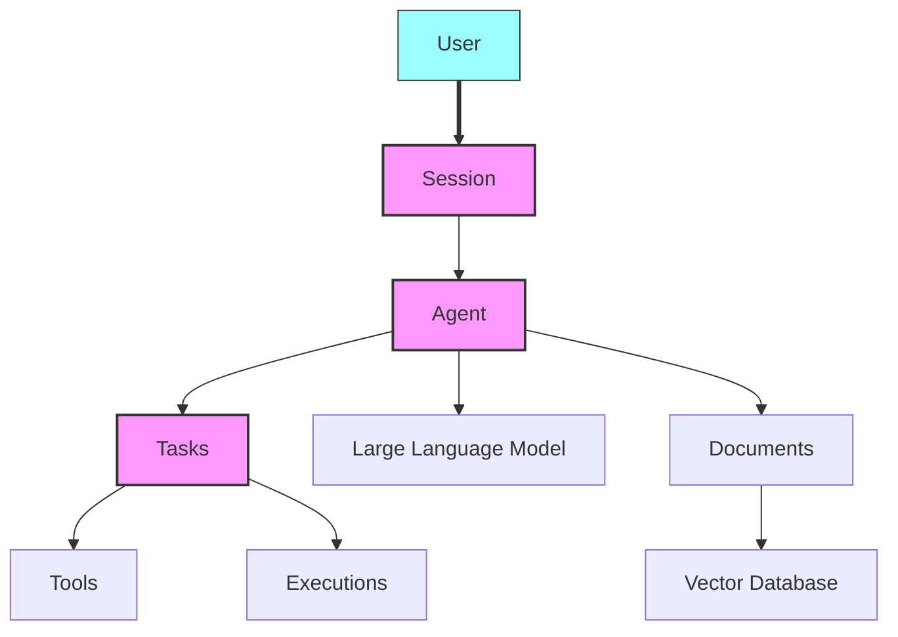

<sup>[English](README.md) | [中文翻译](README-CN.md) | [日本語翻訳](README-JA.md) | [French](README-FR.md) </sup>

<div align="center" id="top">
 
</div>

<p align="center">
  <br />
  <a href="https://docs.julep.ai" rel="dofollow"><strong>Explore Docs</strong></a>
  ·
  <a href="https://discord.com/invite/JTSBGRZrzj" rel="dofollow">Discord</a>
  ·
  <a href="https://x.com/julep_ai" rel="dofollow">𝕏</a>
  ·
  <a href="https://www.linkedin.com/company/julep-ai" rel="dofollow">LinkedIn</a>
</p>

<p align="center">
    <a href="https://www.npmjs.com/package/@julep/sdk"></a>
    <span>&nbsp;</span>
    <a href="https://pypi.org/project/julep"></a>
    <span>&nbsp;</span>
    <a href="https://hub.docker.com/u/julepai"></a>
    <span>&nbsp;</span>
    <a href="https://choosealicense.com/licenses/apache/"></a>
</p>

---

> [!NOTE]
> 👨‍💻 Here for the devfest.ai event? Join our [Discord](https://discord.com/invite/JTSBGRZrzj) and check out the details below.
>
> Get your API key [here](https://dashboard-dev.julep.ai).

<details>
<summary><b>🌟 Contributors and DevFest.AI Participants</b> (Click to expand)</summary>

## 🌟 Call for Contributors!

We're excited to welcome new contributors to the Julep project! We've created several "good first issues" to help you get started. Here's how you can contribute:

1. Check out our [CONTRIBUTING.md](https://github.com/julep-ai/julep/blob/dev/CONTRIBUTING.md) file for guidelines on how to contribute.
2. Browse our [good first issues](https://github.com/julep-ai/julep/issues?q=is%3Aissue+is%3Aopen+label%3A%22good+first+issue%22) to find a task that interests you.
3. If you have any questions or need help, don't hesitate to reach out on our [Discord](https://discord.com/invite/JTSBGRZrzj) channel.

Your contributions, big or small, are valuable to us. Let's build something amazing together! 🚀

### 🎉 DevFest.AI October 2024

Exciting news! We're participating in DevFest.AI throughout October 2024! 🗓️

- Contribute to Julep during this event and get a chance to win awesome Julep merch and swag! 🎁
- Join developers from around the world in contributing to AI repositories and participating in amazing events.
- A big thank you to DevFest.AI for organizing this fantastic initiative!

> [!TIP]
> Ready to join the fun? **[Tweet that you are participating](https://twitter.com/intent/tweet?text=Pumped%20to%20be%20participating%20in%20%40devfestai%20with%20%40julep_ai%20building%20%23ai%20%23agents%20%23workflows%20Let's%20gooo!%20https%3A%2F%2Fgit.new%2Fjulep)** and let's get coding! 🖥️


</details>

<!-- START doctoc generated TOC please keep comment here to allow auto update -->
<!-- DON'T EDIT THIS SECTION, INSTEAD RE-RUN doctoc TO UPDATE -->
<details>
<summary><h3>📖 Table of Contents</h3></summary>

- [Introduction](#introduction)
- [Quick Example](#quick-example)
- [Key Features](#key-features)
- [Why Julep vs. LangChain?](#why-julep-vs-langchain)
  - [Different Use Cases](#different-use-cases)
  - [Different Form Factor](#different-form-factor)
  - [In Summary](#in-summary)
- [Installation](#installation)
- [Python Quick Start 🐍](#python-quick-start-)
  - [Step 1: Create an Agent](#step-1-create-an-agent)
  - [Step 2: Create a Task that generates a story and comic strip](#step-2-create-a-task-that-generates-a-story-and-comic-strip)
  - [Step 3: Execute the Task](#step-3-execute-the-task)
  - [Step 4: Chat with the Agent](#step-4-chat-with-the-agent)
- [Node.js Quick Start 🟩](#nodejs-quick-start-)
  - [Step 1: Create an Agent](#step-1-create-an-agent-1)
  - [Step 2: Create a Task that generates a story and comic strip](#step-2-create-a-task-that-generates-a-story-and-comic-strip-1)
  - [Step 3: Execute the Task](#step-3-execute-the-task-1)
  - [Step 4: Chat with the Agent](#step-4-chat-with-the-agent-1)
- [Components](#components)
  - [Mental Model](#mental-model)
- [Concepts](#concepts)
- [Understanding Tasks](#understanding-tasks)
  - [Types of Workflow Steps](#types-of-workflow-steps)
- [Tool Types](#tool-types)
  - [User-defined `function`s](#user-defined-functions)
  - [`system` tools](#system-tools)
  - [Built-in `integration`s](#built-in-integrations)
  - [Direct `api_call`s](#direct-api_calls)
- [Integrations](#integrations)
- [Other Features](#other-features)
  - [Adding Tools to Agents](#adding-tools-to-agents)
  - [Managing Sessions and Users](#managing-sessions-and-users)
  - [Document Integration and Search](#document-integration-and-search)
- [Local Quickstart](#local-quickstart)
- [SDK Reference](#sdk-reference)
- [API Reference](#api-reference)

</details>
<!-- END doctoc generated TOC please keep comment here to allow auto update -->

## Introduction

Julep is a platform for creating AI agents that remember past interactions and can perform complex tasks. It offers long-term memory and manages multi-step processes.

Julep enables the creation of multi-step tasks incorporating decision-making, loops, parallel processing, and integration with numerous external tools and APIs.

While many AI applications are limited to simple, linear chains of prompts and API calls with minimal branching, Julep is built to handle more complex scenarios.

It supports:

- Intricate, multi-step processes
- Dynamic decision-making
- Parallel execution

> [!TIP]
> Imagine you want to build an AI agent that can do more than just answer simple questions—it needs to handle complex tasks, remember past interactions, and maybe even use other tools or APIs. That's where Julep comes in.

## Key Features

1. 🧠 **Persistent AI Agents**: Remember context and information over long-term interactions.
2. 💾 **Stateful Sessions**: Keep track of past interactions for personalized responses.
3. 🔄 **Multi-Step Tasks**: Build complex, multi-step processes with loops and decision-making.
4. ⏳ **Task Management**: Handle long-running tasks that can run indefinitely.
5. 🛠️ **Built-in Tools**: Use built-in tools and external APIs in your tasks.
6. 🔧 **Self-Healing**: Julep will automatically retry failed steps, resend messages, and generally keep your tasks running smoothly.
7. 📚 **RAG**: Use Julep's document store to build a system for retrieving and using your own data.

Julep is ideal for applications that require AI use cases beyond simple prompt-response models.

## Quick Example

Imagine a Research AI agent that can do the following:

1. Take a topic,
2. Come up with 100 search queries for that topic,
3. Perform those web searches in parallel,
4. Summarize the results,
5. Send the summary to Discord

In Julep, this would be a single task under <b>80 lines of code</b> and run <b>fully managed</b> all on its own. All of the steps are executed on Julep's own servers and you don't need to lift a finger. Here's a working example:

```yaml
name: Research Agent

# Optional: Define the input schema for the task
input_schema:
  type: object
  properties:
    topic:
      type: string
      description: The main topic to research

# Define the tools that the agent can use
tools:
  - name: web_search
    type: integration
    integration:
      provider: brave
      setup:
        api_key: "YOUR_BRAVE_API_KEY"

  - name: discord_webhook
    type: api_call
    api_call:
      url: "YOUR_DISCORD_WEBHOOK_URL"
      method: POST
      headers:
        Content-Type: application/json

# Special variables:
# - inputs: for accessing the input to the task
# - outputs: for accessing the output of previous steps
# - _: for accessing the output of the previous step

# Define the main workflow
main:
  - prompt:
      - role: system
        content: >-
          You are a research assistant.
          Generate 100 diverse search queries related to the topic:
          {{inputs[0].topic}}

          Write one query per line.
    unwrap: true

  # Evaluate the search queries using a simple python expression
  - evaluate:
      search_queries: "_.split('\n')"

  # Run the web search in parallel for each query
  - over: "_.search_queries"
    map:
      tool: web_search
      arguments:
        query: "_"
    parallelism: 100

  # Collect the results from the web search
  - evaluate:
      results: "'\n'.join([item.result for item in _])"

  # Summarize the results
  - prompt:
      - role: system
        content: >
          You are a research summarizer. Create a comprehensive summary of the following research results on the topic {{inputs[0].topic}}.
          The summary should be well-structured, informative, and highlight key findings and insights:
          {{_.results}}
    unwrap: true

  # Send the summary to Discord
  - tool: discord_webhook
    arguments:
      content: >
        **Research Summary for {{inputs[0].topic}}**

        {{_}}
```

In this example, Julep will automatically manage parallel executions, retry failed steps, resend API requests, and keep the tasks running reliably until completion.

## Installation

To get started with Julep, install it using [npm](https://www.npmjs.com/package/@julep/sdk) or [pip](https://pypi.org/project/julep/):

```bash
npm install @julep/sdk
```

or

```bash
pip install julep
```

> [!NOTE]
> Get your API key [here](https://dashboard-dev.julep.ai).
>
> While we are in beta, you can also reach out on [Discord](https://discord.com/invite/JTSBGRZrzj) to get rate limits lifted on your API key.

> [!TIP]
> 💻 Are you a _show me the code!™_ kind of person? We have created a ton of cookbooks for you to get started with. **Check out the [cookbooks](https://github.com/julep-ai/julep/tree/dev/cookbooks)** to browse through examples.
>
> 💡 There's also lots of ideas that you can build on top of Julep. **Check out the [list of ideas](https://github.com/julep-ai/julep/tree/dev/cookbooks/IDEAS.md)** to get some inspiration.

## Python Quick Start 🐍

### Step 1: Create an Agent

```python
import yaml
from julep import Julep # or AsyncJulep

client = Julep(api_key="your_julep_api_key")

agent = client.agents.create(
    name="Storytelling Agent",
    model="gpt-4o",
    about="You are a creative storytelling agent that can craft engaging stories and generate comic panels based on ideas.",
)

# 🛠️ Add an image generation tool (DALL·E) to the agent
client.agents.tools.create(
    agent_id=agent.id,
    name="image_generator",
    description="Use this tool to generate images based on descriptions.",
    integration={
        "provider": "dalle",
        "method": "generate_image",
        "setup": {
            "api_key": "your_openai_api_key",
        },
    },
)
```

### Step 2: Create a Task that generates a story and comic strip

Let's define a multi-step task to create a story and generate a paneled comic strip based on an input idea:

```python
# 📋 Task
# Create a task that takes an idea and creates a story and a 4-panel comic strip
task_yaml = """
name: Story and Comic Creator
description: Create a story based on an idea and generate a 4-panel comic strip illustrating the story.

main:
  # Step 1: Generate a story and outline into 4 panels
  - prompt:
      - role: system
        content: You are {{agent.name}}. {{agent.about}}
      - role: user
        content: >
          Based on the idea '{{_.idea}}', write a short story suitable for a 4-panel comic strip.
          Provide the story and a numbered list of 4 brief descriptions for each panel illustrating key moments in the story.
    unwrap: true

  # Step 2: Extract the panel descriptions and story
  - evaluate:
      story: _.split('1. ')[0].strip()
      panels: re.findall(r'\\d+\\.\\s*(.*?)(?=\\d+\\.\\s*|$)', _)

  # Step 3: Generate images for each panel using the image generator tool
  - foreach:
      in: _.panels
      do:
        tool: image_generator
        arguments:
          description: _

  # Step 4: Generate a catchy title for the story
  - prompt:
      - role: system
        content: You are {{agent.name}}. {{agent.about}}
      - role: user
        content: >
          Based on the story below, generate a catchy title.

          Story: {{outputs[1].story}}
    unwrap: true

  # Step 5: Return the story, the generated images, and the title
  - return:
      title: outputs[3]
      story: outputs[1].story
      comic_panels: "[output.image.url for output in outputs[2]]"
"""

task = client.tasks.create(
    agent_id=agent.id,
    **yaml.safe_load(task_yaml)
)
```

### Step 3: Execute the Task

```python
# 🚀 Execute the task with an input idea
execution = client.executions.create(
    task_id=task.id,
    input={"idea": "A cat who learns to fly"}
)

# 🎉 Watch as the story and comic panels are generated
for transition in client.executions.transitions.stream(execution_id=execution.id):
    print(transition)

# 📦 Once the execution is finished, retrieve the results
result = client.executions.get(execution_id=execution.id)
```

### Step 4: Chat with the Agent

Start an interactive chat session with the agent:

```python
session = client.sessions.create(agent_id=agent.id)

# 💬 Send messages to the agent
while (message := input("Enter a message: ")) != "quit":
    response = client.sessions.chat(
        session_id=session.id,
        message=message,
    )

    print(response)
```

You can find the full python example [here](example.py).

## Node.js Quick Start 🟩

### Step 1: Create an Agent

```javascript
import { Julep } from "@julep/sdk";
import yaml from "js-yaml";

const client = new Julep({ apiKey: "your_julep_api_key" });

async function createAgent() {
  const agent = await client.agents.create({
    name: "Storytelling Agent",
    model: "gpt-4",
    about:
      "You are a creative storytelling agent that can craft engaging stories and generate comic panels based on ideas.",
  });

  // 🛠️ Add an image generation tool (DALL·E) to the agent
  await client.agents.tools.create(agent.id, {
    name: "image_generator",
    description: "Use this tool to generate images based on descriptions.",
    integration: {
      provider: "dalle",
      method: "generate_image",
      setup: {
        api_key: "your_openai_api_key",
      },
    },
  });

  return agent;
}
```

### Step 2: Create a Task that generates a story and comic strip

```javascript
const taskYaml = `
name: Story and Comic Creator
description: Create a story based on an idea and generate a 4-panel comic strip illustrating the story.

main:
  # Step 1: Generate a story and outline into 4 panels
  - prompt:
      - role: system
        content: You are {{agent.name}}. {{agent.about}}
      - role: user
        content: >
          Based on the idea '{{_.idea}}', write a short story suitable for a 4-panel comic strip.
          Provide the story and a numbered list of 4 brief descriptions for each panel illustrating key moments in the story.
    unwrap: true

  # Step 2: Extract the panel descriptions and story
  - evaluate:
      story: _.split('1. ')[0].trim()
      panels: _.match(/\\d+\\.\\s*(.*?)(?=\\d+\\.\\s*|$)/g)

  # Step 3: Generate images for each panel using the image generator tool
  - foreach:
      in: _.panels
      do:
        tool: image_generator
        arguments:
          description: _

  # Step 4: Generate a catchy title for the story
  - prompt:
      - role: system
        content: You are {{agent.name}}. {{agent.about}}
      - role: user
        content: >
          Based on the story below, generate a catchy title.

          Story: {{outputs[1].story}}
    unwrap: true

  # Step 5: Return the story, the generated images, and the title
  - return:
      title: outputs[3]
      story: outputs[1].story
      comic_panels: outputs[2].map(output => output.image.url)
`;

async function createTask(agent) {
  const task = await client.tasks.create(agent.id, yaml.load(taskYaml));
  return task;
}
```

### Step 3: Execute the Task

```javascript
async function executeTask(task) {
  const execution = await client.executions.create(task.id, {
    input: { idea: "A cat who learns to fly" },
  });

  // 🎉 Watch as the story and comic panels are generated
  for await (const transition of client.executions.transitions.stream(
    execution.id
  )) {
    console.log(transition);
  }

  // 📦 Once the execution is finished, retrieve the results
  const result = await client.executions.get(execution.id);
  return result;
}
```

### Step 4: Chat with the Agent

```javascript
async function chatWithAgent(agent) {
  const session = await client.sessions.create({ agent_id: agent.id });

  // 💬 Send messages to the agent
  const rl = readline.createInterface({
    input: process.stdin,
    output: process.stdout,
  });

  const chat = async () => {
    rl.question("Enter a message (or 'quit' to exit): ", async (message) => {
      if (message.toLowerCase() === "quit") {
        rl.close();
        return;
      }

      const response = await client.sessions.chat(session.id, { message });
      console.log(response);
      chat();
    });
  };

  chat();
}

// Run the example
async function runExample() {
  const agent = await createAgent();
  const task = await createTask(agent);
  const result = await executeTask(task);
  console.log("Task Result:", result);
  await chatWithAgent(agent);
}

runExample().catch(console.error);
```

You can find the full Node.js example [here](example.js).

## Components

Julep is made up of the following components:

- **Julep Platform**: The Julep platform is a cloud service that runs your workflows. It includes a language for describing workflows, a server for running those workflows, and an SDK for interacting with the platform.
- **Julep SDKs**: Julep SDKs are a set of libraries for building workflows. There are SDKs for Python and JavaScript, with more on the way.
- **Julep API**: The Julep API is a RESTful API that you can use to interact with the Julep platform.

### Mental Model

<div align="center">
  
</div>

Think of Julep as a platform that combines both client-side and server-side components to help you build advanced AI agents. Here's how to visualize it:

1. **Your Application Code:**

   - You can use the Julep SDK in your application to define agents, tasks, and workflows.
   - The SDK provides functions and classes that make it easy to set up and manage these components.

2. **Julep Backend Service:**

   - The SDK communicates with the Julep backend over the network.
   - The backend handles execution of tasks, maintains session state, stores documents, and orchestrates workflows.

3. **Integration with Tools and APIs:**
   - Within your workflows, you can integrate external tools and services.
   - The backend facilitates these integrations, so your agents can, for example, perform web searches, access databases, or call third-party APIs.

## Concepts

Julep is built on several key technical components that work together to create powerful AI workflows:



- **Agents**: AI-powered entities backed by large language models (LLMs) that execute tasks and interact with users.
- **Users**: Entities that interact with agents through sessions.
- **Sessions**: Stateful interactions between agents and users, maintaining context across multiple exchanges.
- **Tasks**: Multi-step, programmatic workflows that agents can execute, including various types of steps like prompts, tool calls, and conditional logic.
- **Tools**: Integrations that extend an agent's capabilities, including user-defined functions, system tools, or third-party API integrations.
- **Documents**: Text or data objects associated with agents or users, vectorized and stored for semantic search and retrieval.
- **Executions**: Instances of tasks that have been initiated with specific inputs, with their own lifecycle and state machine.

For a more detailed explanation, refer to our [Concepts Documentation](https://github.com/julep-ai/julep/blob/dev/docs/julep-concepts.md).

## Understanding Tasks

Tasks are the core of Julep's workflow system. They allow you to define complex, multi-step AI workflows that your agents can execute. Here's a brief overview of task components:

- **Name and Description**: Each task has a unique name and description for easy identification.
- **Main Steps**: The core of a task, defining the sequence of actions to be performed.
- **Tools**: Optional integrations that extend the capabilities of your agent during task execution.

### Types of Workflow Steps

Tasks in Julep can include various types of steps, allowing you to create complex and powerful workflows. Here's an overview of the available step types:

#### Common Steps

<table>
<tr>
<td> Name </td> <td> About </td><td>Syntax</td>
</tr>
<tr>
<td> Prompt </td>
<td>
Send a message to the AI model and receive a response

</td>

<td>

```yaml
- prompt: "Analyze the following data: {{data}}"
```

</td>
</tr>
<tr>
<td> Tool Call </td>
<td>
Execute an integrated tool or API

</td>

<td>

```yaml
- tool: web_search
  arguments:
    query: "Latest AI developments"
```

</td>
</tr>
<tr>
<td> Evaluate </td>
<td>
Perform calculations or manipulate data

</td>

<td>

```yaml
- evaluate:
    average_score: "sum(scores) / len(scores)"
```

</td>
</tr>
<tr>
<td> Wait for Input </td>
<td>
Pause workflow until input is received

</td>

<td>

```yaml
- wait_for_input:
    info:
      message: "Please provide additional information."
```

</td>
</tr>
<tr>
<td> Log </td>
<td>
Log a specified value or message

</td>

<td>

```yaml
- log: "Processing completed for item {{item_id}}"
```

</td>
</tr>
</table>

#### Key-Value Steps

<table>
<tr>
<td> Name </td> <td> About </td><td>Syntax</td>
</tr>
<tr>
<td> Get </td>
<td>
Retrieve a value from a key-value store

</td>

<td>

```yaml
- get: "user_preference"
```

</td>
</tr>
<tr>
<td> Set </td>
<td>
Assign a value to a key in a key-value store

</td>

<td>

```yaml
- set:
    user_preference: "dark_mode"
```

</td>
</tr>
</table>

#### Iteration Steps

<table>
<tr>
<td> Name </td> <td> About </td><td>Syntax</td>
</tr>
<tr>
<td> Foreach </td>
<td>
Iterate over a collection and perform steps for each item

</td>

<td>

```yaml
- foreach:
    in: "data_list"
    do:
      - log: "Processing item {{_}}"
```

</td>
</tr>
<tr>
<td> Map-Reduce </td>
<td>
Map over a collection and reduce the results

</td>

<td>

```yaml
- map_reduce:
    over: "numbers"
    map:
      - evaluate:
          squared: "_ ** 2"
    reduce: "sum(results)"
```

</td>
</tr>
<tr>
<td> Parallel </td>
<td>
Run multiple steps in parallel

</td>

<td>

```yaml
- parallel:
    - tool: web_search
      arguments:
        query: "AI news"
    - tool: weather_check
      arguments:
        location: "New York"
```

</td>
</tr>
</table>

#### Conditional Steps

<table>
<tr>
<td> Name </td> <td> About </td><td>Syntax</td>
</tr>
<tr>
<td> If-Else </td>
<td>
Conditional execution of steps

</td>

<td>

```yaml
- if: "score > 0.8"
  then:
    - log: "High score achieved"
  else:
    - log: "Score needs improvement"
```

</td>
</tr>
<tr>
<td> Switch </td>
<td>
Execute steps based on multiple conditions

</td>

<td>

```yaml
- switch:
    - case: "category == 'A'"
      then:
        - log: "Category A processing"
    - case: "category == 'B'"
      then:
        - log: "Category B processing"
    - case: "_" # Default case
      then:
        - log: "Unknown category"
```

</td>
</tr>
</table>

#### Other Control Flow

<table>
<tr>
<td> Name </td> <td> About </td><td>Syntax</td>
</tr>
<tr>
<td> Sleep </td>
<td>
Pause the workflow for a specified duration

</td>

<td>

```yaml
- sleep:
    seconds: 30
```

</td>
</tr>
<tr>
<td> Return </td>
<td>
Return a value from the workflow

</td>

<td>

```yaml
- return:
    result: "Task completed successfully"
```

</td>
</tr>
<tr>
<td> Yield </td>
<td>
Run a subworkflow and await its completion

</td>

<td>

```yaml
- yield:
    workflow: "data_processing_subflow"
    arguments:
      input_data: "{{raw_data}}"
```

</td>
</tr>
</tr>
<tr>
<td> Error </td>
<td>
Handle errors by specifying an error message

</td>

<td>

```yaml
- error: "Invalid input provided"
```

</td>
</tr>
</table>

Each step type serves a specific purpose in building sophisticated AI workflows. This categorization helps in understanding the various control flows and operations available in Julep tasks.

## Tool Types

Agents can be given access to a number of "tools" -- any programmatic interface that a foundation model can "call" with a set of inputs to achieve a goal. For example, it might use a `web_search(query)` tool to search the Internet for some information.

Unlike agent frameworks, julep is a _backend_ that manages agent execution. Clients can interact with agents using our SDKs. julep takes care of executing tasks and running integrations.

Tools in julep can be one of:

### User-defined `functions`

These are function signatures that you can give the model to choose from, similar to how [openai]'s function-calling works. An example:

```yaml
name: Example system tool task
description: List agents using system call

tools:
  - name: send_notification
    description: Send a notification to the user
    type: function
    function:
      parameters:
        type: object
        properties:
          text:
            type: string
            description: Content of the notification

main:
  - tool: send_notification
    arguments:
      content: hi
```

Whenever julep encounters a _user-defined function_, it pauses, giving control back to the client and waits for the client to run the function call and give the results back to julep.

> [!TIP]
> **Example cookbook**: [cookbooks/13-Error_Handling_and_Recovery.py](https://github.com/julep-ai/julep/blob/dev/cookbooks/13-Error_Handling_and_Recovery.py)

### `system` tools

Built-in tools that can be used to call the julep APIs themselves, like triggering a task execution, appending to a metadata field, etc.  
`system` tools are built into the backend. They get executed automatically when needed. They do _not_ require any action from the client-side.

For example,

```yaml
name: Example system tool task
description: List agents using system call

tools:
  - name: list_agents
    description: List all agents
    type: system
    system:
      resource: agent
      operation: list
main:
  - tool: list_agents
    arguments:
      limit: 10
```

> [!TIP]
> **Example cookbook**: [cookbooks/10-Document_Management_and_Search.py](https://github.com/julep-ai/julep/blob/dev/cookbooks/10-Document_Management_and_Search.py)

### Built-in `integrations`

Julep comes with a number of built-in integrations (as described in the section below). `integration` tools are directly executed on the julep backend. Any additional parameters needed by them at runtime can be set in the agent/session/user's `metadata` fields.

> [!TIP]
> **Example cookbook**: [cookbooks/01-Website_Crawler_using_Spider.ipynb](https://github.com/julep-ai/julep/blob/dev/cookbooks/01-Website_Crawler_using_Spider.ipynb)

julep backend ships with integrated third party tools from the following providers:

- [composio](https://composio.dev)
- [anon](https://anon.com)
- [langchain toolkits](https://python.langchain.com/v0.2/docs/integrations/toolkits/)

Support for _Github, Gitlab, Gmail, Jira, MultiOn, Slack_ toolkits is planned.

Since _composio_ and _anon_ are third-party providers, their tools require setting up account linking.

### Direct `api_calls`

julep can also directly make api calls during workflow executions as tool calls. Same as `integration`s, additional runtime parameters are loaded from `metadata` fields.

For example,

```yaml
name: Example api_call task
tools:
  - type: api_call
    name: hello
    api_call:
      method: GET
      url: https://httpbin.org/get
main:
  - tool: hello
    arguments:
      params:
        test: _.input
```

## Integrations

Julep supports various integrations that extend the capabilities of your AI agents. Here's a list of available integrations and their supported arguments:

<table>

<tr>
<td> Brave Search </td>
<td>

```yaml
setup:
  api_key: string # The API key for Brave Search

arguments:
  query: string # The search query for searching with Brave

output:
  result: string # The result of the Brave Search
```

</td>

<td>

**Example cookbook**: [cookbooks/03-SmartResearcher_With_WebSearch.ipynb](https://github.com/julep-ai/julep/blob/dev/cookbooks/03-SmartResearcher_With_WebSearch.ipynb)

</td>
</tr>
<tr>
<td> BrowserBase </td>
<td>

```yaml
setup:
  api_key: string # The API key for BrowserBase
  project_id: string # The project ID for BrowserBase
  session_id: string # (Optional) The session ID for BrowserBase

arguments:
  urls: list[string] # The URLs for loading with BrowserBase

output:
  documents: list # The documents loaded from the URLs
```

</td>

</tr>
<tr>
<td> Email </td>
<td>

```yaml
setup:
  host: string # The host of the email server
  port: integer # The port of the email server
  user: string # The username of the email server
  password: string # The password of the email server

arguments:
  to: string # The email address to send the email to
  from: string # The email address to send the email from
  subject: string # The subject of the email
  body: string # The body of the email

output:
  success: boolean # Whether the email was sent successfully
```

</td>

<td>

**Example cookbook**: [cookbooks/00-Devfest-Email-Assistant.ipynb](https://github.com/julep-ai/julep/blob/dev/cookbooks/00-Devfest-Email-Assistant.ipynb)

</td>
</tr>
<tr>
<td> Spider </td>
<td>

```yaml
setup:
  spider_api_key: string # The API key for Spider

arguments:
  url: string # The URL for which to fetch data
  mode: string # The type of crawlers (default: "scrape")
  params: dict # (Optional) The parameters for the Spider API

output:
  documents: list # The documents returned from the spider
```

</td>

<td>

**Example cookbook**: [cookbooks/01-Website_Crawler_using_Spider.ipynb](https://github.com/julep-ai/julep/blob/dev/cookbooks/01-Website_Crawler_using_Spider.ipynb)

</td>
</tr>
<tr>
<td> Weather </td>
<td>

```yaml
setup:
  openweathermap_api_key: string # The API key for OpenWeatherMap

arguments:
  location: string # The location for which to fetch weather data

output:
  result: string # The weather data for the specified location
```

</td>

<td>

**Example cookbook**: [cookbooks/04-TripPlanner_With_Weather_And_WikiInfo.ipynb](https://github.com/julep-ai/julep/blob/dev/cookbooks/04-TripPlanner_With_Weather_And_WikiInfo.ipynb)

</td>
</tr>
</tr>
<tr>
<td> Wikipedia </td>
<td>

```yaml
arguments:
  query: string # The search query string
  load_max_docs: integer # Maximum number of documents to load (default: 2)

output:
  documents: list # The documents returned from the Wikipedia search
```

</td>

<td>

**Example cookbook**: [cookbooks/04-TripPlanner_With_Weather_And_WikiInfo.ipynb](https://github.com/julep-ai/julep/blob/dev/cookbooks/04-TripPlanner_With_Weather_And_WikiInfo.ipynb)

</td>
</tr>
</table>

For more details, refer to our [Integrations Documentation](https://docs.julep.ai/integrations).

## Other Features

Julep offers a range of advanced features to enhance your AI workflows:

### Adding Tools to Agents

Extend your agent's capabilities by integrating external tools and APIs:

```python
client.agents.tools.create(
    agent_id=agent.id,
    name="web_search",
    description="Search the web for information.",
    integration={
        "provider": "brave",
        "method": "search",
        "setup": {"api_key": "your_brave_api_key"},
    },
)
```

### Managing Sessions and Users

Julep provides robust session management for persistent interactions:

```python
session = client.sessions.create(
    agent_id=agent.id,
    user_id=user.id,
    context_overflow="adaptive"
)

# Continue conversation in the same session
response = client.sessions.chat(
    session_id=session.id,
    messages=[
      {
        "role": "user",
        "content": "Follow up on the previous conversation."
      }
    ]
)
```

### Document Integration and Search

Easily manage and search through documents for your agents:

```python
# Upload a document
document = client.agents.docs.create(
    title="AI advancements",
    content="AI is changing the world...",
    metadata={"category": "research_paper"}
)

# Search documents
results = client.agents.docs.search(
    text="AI advancements",
    metadata_filter={"category": "research_paper"}
)
```

## Local Quickstart

**Requirements**:

- latest docker compose installed

**Steps**:

1. `git clone https://github.com/julep-ai/julep.git`
2. `cd julep`
3. `docker volume create cozo_backup`
4. `docker volume create cozo_data`
5. `cp .env.example .env  # <-- Edit this file`
6. `docker compose --env-file .env --profile temporal-ui --profile single-tenant --profile self-hosted-db up --build`

## SDK Reference

- [Node.js SDK](https://github.com/julep-ai/node-sdk/blob/main/api.md)
- [Python SDK](https://github.com/julep-ai/python-sdk/blob/main/api.md)

## API Reference

Explore our comprehensive API documentation to learn more about agents, tasks, and executions:

- [Agents API](https://api.julep.ai/api/docs#tag/agents)
- [Tasks API](https://api.julep.ai/api/docs#tag/tasks)
- [Executions API](https://api.julep.ai/api/docs#tag/executions)

<div align="center">
    <a href="#top">
        
    </a>
</div>
