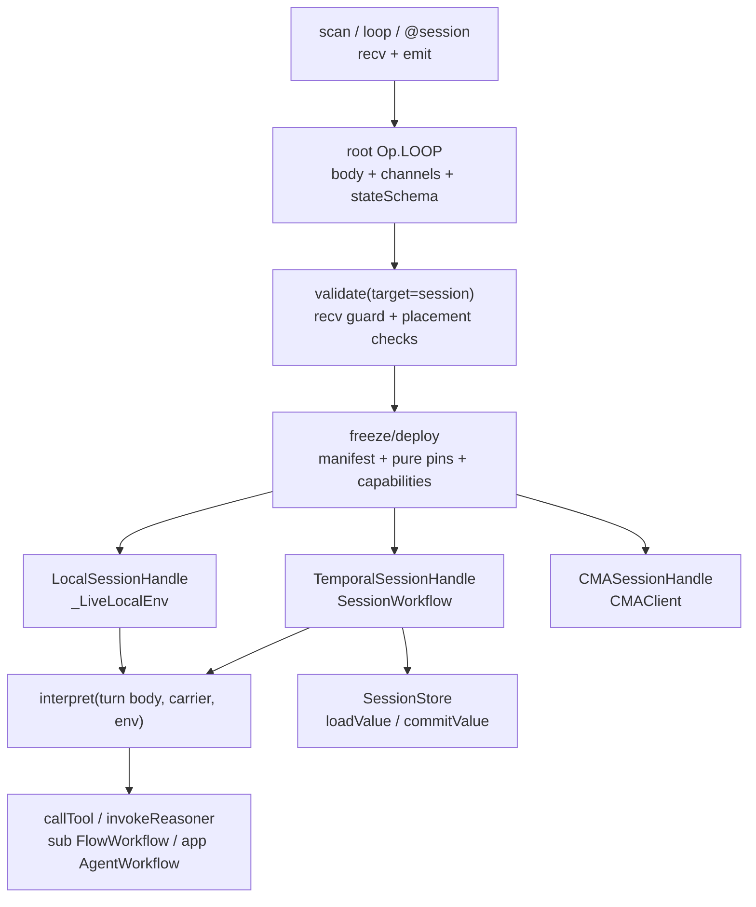
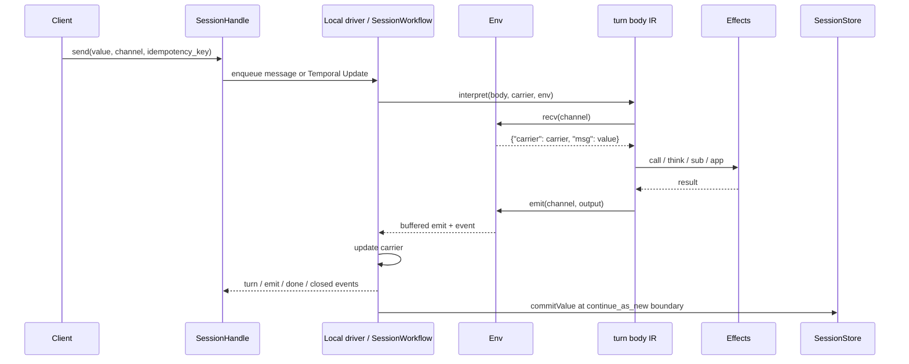
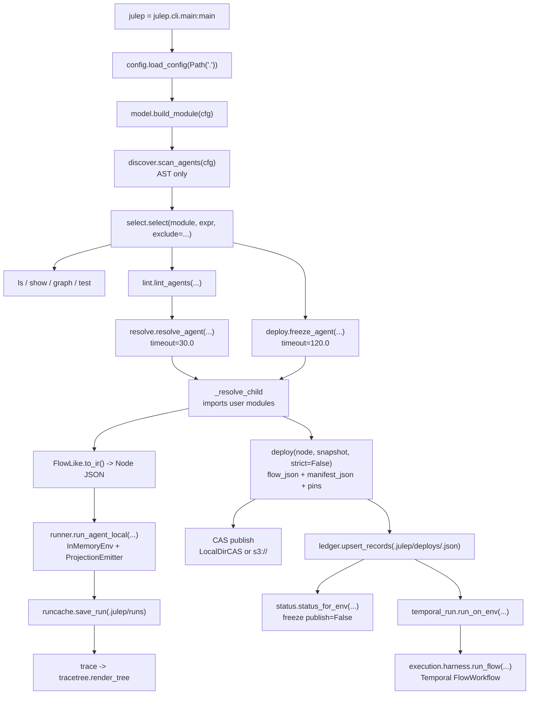

How the framework fits together, viewed from four angles: the whole system, the `@flow` compiler, the sessions runtime, and the `julep` CLI. For the design rationale behind these, see [Internals](/docs/internals/specification).

## The system

Julep turns agents into frozen, capability-bounded dataflows. You
author Python, compile it into a content-hashed IR plus manifest, then run the
same artifact locally, on Temporal, or on DBOS. A model may choose control flow
at run time, but it cannot discover new tools, widen authority, or bypass the
deployment contract.

Use this as the system map. For the normative contract, read
[the Specification](/docs/internals/specification). For the core model, read [Concepts](/docs/concepts/model).
For the docs index this page extends, read [Documentation](/docs).

#### Context And Goals

The framework exists to make agent runs inspectable, replayable, and bounded
before they touch the world.

Design constraints:

- A run is identified by a frozen artifact: `flowJson`, `manifestJson`, pinned
  pure hashes, reasoner identity, capabilities, execution policy, framework
  version, and `artifact_hash`.
- Effects are authorized statically. Capability grants gate tools, reasoners,
  model ids, memory scopes, MCP servers, network egress, subflows, approval
  requirements, budgets, and `maxCalls`.
- Workflow code is deterministic. Tool calls, provider calls, DB writes, human
  waits, timers, bundle resolution, and credential lookup live behind an injected
  `Env` / `WorkerContext`.
- Projection and trajectory capture are derived observability planes. They must
  not be required for workflow recovery.
- Temporal, DBOS, provider SDKs, CMA, OTel, Langfuse, bundle stores, and wasm are
  optional extras. The authoring, compile, and in-memory interpreter path does
  not import engine modules.

#### High-Level Design

```mermaid
flowchart TB
    A[Authoring\n@flow, DSL, typed, Agent, Session] --> B[Node IR\nfinite tree]
    B --> C[Shape analysis\nsurface_shape / closed_shape]
    B --> D[deploy(...)]
    D --> D1[freeze\nsnapshot and hash tools]
    D1 --> D2[validate\nstructure, schemas, pures]
    D2 --> D3[capabilities\nallow-lists, budget, maxCalls]
    D3 --> D4[approval gates\nhuman_gate dominance]
    D4 --> D5[race admission\nread or asserted idempotent]
    D5 --> E[Deployment\nflow_json, manifest_json, artifact_hash]

    E --> F1[Local\nDeployment.dry_run]
    E --> F2[Temporal\nFlowWorkflow / AgentWorkflow / SessionWorkflow]
    E --> F3[DBOS\njulep_flow / julep_agent]
    E --> F4[CMA\nAgent.run_on_cma / Agent.open]

    F1 --> G[interpret(node, value, env)]
    F2 --> G
    F3 --> G
    F4 --> G
    G --> H[Env boundary]
    H --> I[effects\ncallTool, invokeReasoner, compilePlan, resolveSubflow]
    H --> J[projection\nPlanned, Did, Failed]
    H --> K[trajectory\nbest-effort refs]
```

The interpreter is the common control loop. A backend changes the `Env`, not the
language. `InMemoryEnv` uses Python callables. Temporal uses workflows,
activities, child workflows, signals, updates, and continue-as-new. DBOS wraps
the same backend-neutral effects in DBOS steps. CMA is an experimental backend
for `app`-style agent execution and sessions.

#### Public API Boundary

The package API is defined in
[`julep/__init__.py`](https://github.com/julep-ai/julep-v2/blob/main/julep/__init__.py).
`_BASE_EXPORTS` are always exported. `_TEMPORAL_EXPORTS` are added to `__all__`
only when `HAVE_TEMPORAL` is true, and are loaded lazily through `__getattr__`.
DBOS exports are guarded in `julep.execution` by `HAVE_DBOS`.

The core language lives in `kinds.py`, `ir.py`, `shapes.py`, `dsl.py`,
`define.py`, `typed.py`, `agent.py`, and `session.py`. The compile pipeline is
`freeze.py`, `validate.py`, `capabilities.py`, `derived.py`, `staged.py`, and
`deploy.py`. Runtime seams are `execution/interpreter.py` for
`interpret(...)`, `Env`, and `InMemoryEnv`; `execution/effects.py` for
`WorkerContext`; `execution/harness.py`, `activities.py`, `worker.py`, and
`serve.py` for Temporal; and `execution/dbos_backend.py` for DBOS.

#### Authoring To Deployment

Use `@flow` for normal application code. The decorated function runs once at
definition time with `Handle` values. Registered tools, registered pures,
`think(...)`, `cond(...)`, `switch(...)`, `each(...)`, and `reschedule(...)`
append graph steps instead of doing runtime work.

```python
from typing import TypedDict

from julep import Reasoner, deploy, flow, think, tool


class SupportReply(TypedDict):
    reply: str


@tool(effect="read", idempotent=True)
def lookup_ticket(ticket: str) -> dict[str, str]:
    return {"ticket": ticket, "queue": "billing"}


SUPPORT_REPLY = Reasoner(
    name="support_reply",
    model="anthropic:claude-haiku-4-5-20251001",
    system="Draft one concise support reply as JSON.",
    reply=SupportReply,
)


@flow
def triage(ticket: str) -> dict[str, str]:
    hit = lookup_ticket(ticket)
    answer = think(SUPPORT_REPLY, hit)
    return hit | answer


deployment = deploy(triage, tools=[lookup_ticket], reasoners=[SUPPORT_REPLY])
```

`deploy(...)` accepts either a live snapshot or local `@tool` objects:

```python
deploy(flow, snapshot=None, *, tools=None, reasoners=None, capabilities=None,
       extra_overrides=None, strict=True, mode="strict",
       freeze_timing="deploy_time", snapshot_source=None, target="flow")
```

The gate sequence is fixed:

1. `freeze(...)`: copy the finite tree, normalize ids, bind every tool call to a
   `FrozenTool` content hash, and produce a `ToolManifest`.
2. `validate(...)`: check per-op structure, registered pures, retry annotations,
   schemas where known, session loop rules, and post-freeze call resolution.
3. `CapabilityManifest.enforce_compile(...)`: apply allow-list and contract
   assertions.
4. `check_approval_gates(...)`: require `human_gate(...)` dominance for
   dangerous or approval-required calls.
5. `check_race_admission(...)`: admit `race`, `hedge`, and `quorum` only when
   branches are read-only or asserted idempotent.

The resulting `Deployment` exposes `flow_json`, `manifest_json`,
`artifact_components`, `artifact_hash`, `surface_shape`, `dry_run(...)`,
`adry_run(...)`, `run(...)`, `refresh(...)`, and `publish(...)`.

Dev mode is local only. `deploy(..., mode="dev")` returns would-block diagnostics
in `deployment.prod_gap`; `Deployment.run(...)` rejects dev-mode artifacts before
Temporal dispatch.

#### Execution Flow

Temporal dispatch starts from `Deployment.run(...)`, which calls
`execution.harness.run_flow(...)` and starts `FlowWorkflow` with a `FlowInput`.
`FlowWorkflow` verifies pinned pures, constructs `_TemporalEnv`, and calls the
same `interpret(...)` used by the local path.

```python
result = await deployment.run(
    client,
    session_id="ticket-run-1",
    input="TICKET-42",
    task_queue="julep",
    principal={"tenant": "tenant-a", "tokenRef": "vault://support/token"},
)
```

A Temporal worker installs environment-specific capability once:

```python
from temporalio.client import Client

from julep.execution import WorkerContext
from julep.execution.worker import DEFAULT_TASK_QUEUE, build_worker

client = await Client.connect("localhost:7233")
context = WorkerContext(
    tool_urls={"lookup_ticket": "https://tools.example/lookup_ticket"},
    mcp_call=my_mcp_call,
    llm=my_llm,
    capabilities=caps,
    subflows={},
    agents={},
)
worker = build_worker(client, context, task_queue=DEFAULT_TASK_QUEUE)
await worker.run()
```

The container entrypoint is the artifact CLI:

```bash
julep worker \
  --context-factory app.worker:context \
  --address localhost:7233 \
  --namespace default \
  --task-queue julep \
  --health-port 8080
```

`WorkerServeSettings.from_env(...)` reads `WORKER_CONTEXT_FACTORY`,
`TEMPORAL_ADDRESS`, `TEMPORAL_NAMESPACE`, `TEMPORAL_TASK_QUEUE`,
`TEMPORAL_API_KEY`, `TEMPORAL_TLS`, `WORKER_GRACEFUL_SHUTDOWN_S`,
`WORKER_MAX_CONCURRENT_ACTIVITIES`, `WORKER_MAX_CONCURRENT_WORKFLOW_TASKS`, and
`WORKER_HEALTH_PORT`.

DBOS uses the same interpreter with `DbosEnv`; dispatch through
`run_flow_dbos(...)` or `run_agent_dbos(...)`. Its differences are intentional:
race-family merges are rejected at dispatch, subflows run inline, reasoner steps
do not retry, and continue-as-new is modeled as workflow ids `session`,
`session-seg1`, `session-seg2`, and so on.

#### Capabilities And Safety

`CapabilityManifest` treats absent and empty sections differently. An absent
section is unconstrained. A present-but-empty section denies all. `ToolGrant`
asserts a contract only when both `effect` and `idempotency` are present; this
is the trusted surface used by freeze and race admission.

Capability YAML/dict sections are `tools`, `reasoners`, `models`, `subflows`,
`memory`, `network`, `mcp_servers` / `mcpServers`, and `budget`. Tool grants may
carry `effect`, `idempotency`, `approval`, and `maxCalls`.

Approval is structural. A dangerous or approval-required tool must be dominated
by `human_gate(...)`; otherwise strict deploy emits `APPROVAL_UNGATED`. Inline
`app(...)` / `Agent(...)` tools cannot directly include approval-required or
dangerous tools.

Run principals are opaque references carried in workflow input. They should
contain tenant and credential references, not secrets. Workers can resolve them
to native-tool headers through `WorkerContext.principal_headers`.

#### Data Flow And Integration Points

Define-time surfaces all lower to `Node`: `@flow` goes through `dag.py`, the
combinator DSL returns `Node` directly, typed flows elaborate and disappear
before freeze, `Agent(...)` builds an `app` node and registers a `Reasoner` with
`AGENT_REPLY_SCHEMA`, and sessions compile to `Op.LOOP`.

Freeze-time inputs are explicit. Native tools come from `@tool` /
`snapshot_from_tools(...)` or a supplied `McpSnapshot`; MCP tools come from
`snapshot_from_listings(...)` or a live snapshot source; reserved tools
`__human_gate__`, `__sleep__`, `__recv__`, and `__emit__` are synthetic. Pures
are named, source-hash-pinned, and verified by `verifyPures` before durable
effects run.

Run time is one interpreter plus backend effects. `interpret(...)` records
`Planned`, evaluates through `Env`, then records `Did` or `Failed`. `callTool`
uses the deterministic activation `cid` as idempotency key. `invokeReasoner`
calls `WorkerContext.llm`. `compilePlan` parses, binds, validates, admits, and
runs staged IR. `resolveSubflow` and `resolveAgentSpec` read worker startup
registries. `human_gate(...)` becomes `submitHuman` on Temporal or
`submit_human_dbos(workflow_id, cid, value)` on DBOS.

`ProjectionEmitter` writes `ProjectionEvent` facts to `InMemoryProjection`,
`PostgresProjection`, tee sinks, or OTel span export via `to_otel_spans(...)`.
`TrajectoryRun`, `TrajectoryStep`, and `TrajectoryValue` stitch root runs, child
runs, and segment chains into exportable history; capture is best-effort, and
`julep.execution.trajectory_sql.TRAJECTORY_DDL` is host-applied.

Provider dispatch hangs off `WorkerContext.llm`, whose canonical shape is
`(reasoner, value, principal, transcript, dispatch) -> result`.
`make_llm_caller(...)` adapts it to `any-llm`; `make_resilient_llm_caller(...)`
adds deterministic fallbacks, error classification, and `CircuitBreaker`. If
that caller owns Temporal model retries, use
`ExecutionPolicy(reasoner_max_attempts=1)`. `default_resolve_qos(...)` maps
principal hints and `Ann.batchable` to `QoSTier.PRIORITY`, `STANDARD`, `FLEX`,
or `BATCH`; non-batchable batch requests clamp to `FLEX`.

#### CLI Surfaces

`julep` operates on JSON artifacts and workers:

```bash
julep artifact validate flow.json --manifest manifest.json
julep artifact freeze flow.json snapshot.json --caps caps.yaml
julep artifact inspect flow.json --manifest manifest.json --caps caps.yaml
julep artifact run-local flow.json input.json --mode dev
julep artifact graph flow.json
julep worker --context-factory app.worker:context
```

`julep` operates on Python source modules and adds no runtime:

```bash
julep ls
julep graph
julep run triage --input '"TICKET-42"'
julep lint +triage --fail-severity error
julep deploy triage --env staging
julep status --env staging
```

A single console script is declared in `pyproject.toml`:
`julep = "julep.cli.main:main"`. The lower-level artifact/worker plumbing
CLI is reachable as `python -m julep.cli.artifact`.

Install only the runtime you need:

```bash
pip install --pre julep
pip install --pre 'julep[temporal]'
pip install --pre 'julep[dbos]'
pip install --pre 'julep[providers]'
pip install --pre 'julep[cma]'
```

#### Key Decisions And Trade-Offs

- Frozen IR instead of live lookup: deploy artifacts can be reviewed, hashed,
  replayed, compared for drift, and executed without ambient tool discovery.
- Shape inference instead of declared shape: operators determine cost class.
  `surface_shape` keeps `Sub` opaque; `closed_shape` charges the sub contract.
- Dynamic structure, static effects: `stage(...)` and `app(...)` can choose
  composition, but every call must bind to already frozen and authorized tools.
- Env injection instead of engine-specific interpreters: local, Temporal, DBOS,
  and CMA reuse `interpret(...)`.
- Projection as a view, not a log of record: sinks can fail, lag, or be rebuilt
  without changing workflow correctness.
- Subflows as a firewall: values cross up; child shape, authority, and internal
  projection do not leak into the parent.
- DBOS as a constrained backend: it reuses the same IR and effects but rejects
  shapes that need cancellation semantics it does not provide.
- `julep` as porcelain: module discovery, selection, run, lint, publish, and deploy
  ledger live outside the runtime semantics.

#### See Also

- [Getting started](/docs/start/first-agent)
- [Authoring guide](/docs/guides/authoring-flows)
- [Concepts](/docs/concepts/model)
- [Capabilities and safety](/docs/guides/capabilities-and-safety)
- [Deploy to Temporal](/docs/deploy/temporal)
- [Deploy on DBOS](/docs/deploy/dbos)
- [`julep` developer CLI](/docs/guides/using-the-cli)
- [Provider resilience](/docs/guides/providers-and-resilience)
- [Specification](/docs/internals/specification)

## The @flow compiler

The `@flow` frontend is a construction pass. Your Python function runs once at
definition time with `Handle` placeholders; registered tools, registered pures,
reasoner calls, branches, fan-out, and reschedules append a single-assignment
DAG. `julep.dag.compile(...)` then lowers that DAG to the same
frozen `Node` IR used by the raw combinator DSL.

Ground-truth modules:

- [`define.py`](https://github.com/julep-ai/julep-v2/blob/main/julep/define.py): define-by-construction `@flow`.
- [`typed.py`](https://github.com/julep-ai/julep-v2/blob/main/julep/typed.py): authoring-only `Flow[In, Out]`.
- [`dag.py`](https://github.com/julep-ai/julep-v2/blob/main/julep/dag.py): effect-fenced DAG compiler.
- [`ir.py`](https://github.com/julep-ai/julep-v2/blob/main/julep/ir.py): frozen wire-format IR.
- [`dsl.py`](https://github.com/julep-ai/julep-v2/blob/main/julep/dsl.py): raw `Node` combinators.
- [`derived.py`](https://github.com/julep-ai/julep-v2/blob/main/julep/derived.py): race-family and reserved leaves.

Related docs: [Authoring Guide](/docs/guides/authoring-flows), [Concepts](/docs/concepts/model),
and [Typed Flow](/docs/internals/typed-flow-calculus).

#### Context and Goals

The framework needs ordinary Python authoring without giving workflow execution
ordinary Python semantics. A deployed flow must be durable, replayable,
content-hashed, capability-bounded, and explainable after it leaves the
authoring process.

Design constraints:
- Frozen IR contains JSON data, names, refs, contracts, and annotations, not
  closures or Python objects.
- All callable runtime effects sit behind `Tool`, `Pure`, `Reasoner`, `Sub`, or
  backend `Env` handlers.
- Types help authoring only; they do not enter `Node.to_json()`.
- Write/external/dangerous effects fence parallel DAG layers.
- Model-driven structure can only choose among already frozen and granted
  effects.
- `@flow`, typed `Flow`, and raw DSL nodes all converge before freeze.

#### High-Level Design

```mermaid
flowchart TD
    author["@flow function"] --> define["define.py\nFlowDef + Handle"]
    define --> graph["dag.py\nGraph + StepNode"]
    graph --> compile["dag.compile(...)\neffect-fenced lowering"]
    compile --> node["ir.py\nNode tree"]

    typed["typed.py\nFlowLike / Flow / as_flow"] --> dsl["dsl.py\nseq/par/call/think/..."]
    derived["derived.py\nrace/hedge/quorum/delay/..."] --> dsl
    dsl --> node

    node --> freeze["freeze.py\nnormalize ids + bind frozenHash"]
    freeze --> validate["validate.py\nDiagnostic[]"]
    validate --> caps["capabilities.py\nallow-list + approvals"]
    caps --> race["check_race_admission(...)"]
    race --> deploy["deploy.py\nDeployment"]
    deploy --> local["dry_run(...)\nInMemoryEnv"]
    deploy --> temporal["run(...)\nTemporal FlowWorkflow"]
    deploy --> dbos["run_flow_dbos(...)\nDBOS julep_flow"]
    local --> projection["projection.py\nProjectionEmitter"]
    temporal --> projection
    dbos --> projection
```

There are three authoring fronts over one IR:

- `@flow` in `define.py`, the primary surface.
- `julep.typed.Flow`, an authoring-only typed wrapper over `Node`.
- `dsl.py` and `derived.py`, the combinator kernel.

After deployment, execution sees only `Node`, `ToolManifest`, registered pure
names, reasoner names, tool refs, sub refs, and JSON values.

#### Define-By-Construction Surface

The package root exports `flow`, `think`, `cond`, `switch`, `each`, and
`reschedule` from `define.py`.

Verified API shape: `flow(fn) -> FlowDef`; `think(name, value=None, **kwargs)`
returns a raw `Node` outside `@flow` and a `Handle` inside; `cond(pred, subject,
then=..., orelse=...) -> Handle`; `switch(selector, subject, cases=...,
default=None) -> Handle`; `each(body, items=None, max_parallel=None,
reducer=None) -> Node | Handle`; `reschedule(state, after_s=None, after=None,
mark=None) -> Handle`.

`FlowDef.__init__` calls the decorated function once with `Handle` parameters.
Every successful step returns a new `Handle` whose `label` is a graph field.
`FlowDef.to_ir()` is valid only when exactly one runtime parameter remains.

Supported handle operations:

- `h1 | h2` appends `StepKind.PURE` with `ref="std.merge"`.
- `h["key"]` appends `StepKind.PURE` with `ref="std.pluck"` and static args.
- Registered `Tool` calls append `StepKind.TOOL`.
- Registered `Pure` calls append `StepKind.PURE`.
- `think(...)` appends `StepKind.THINK`.
- `cond(...)`, `switch(...)`, and `each(...)` append structured graph steps.

Step calls consume these option keywords: `name`, `retries`,
`retry_interval_s`, `backoff_rate`, and `timeout_s`. They lower to `Ann`
fields: `max_attempts`, `retry_interval_s`, `backoff_rate`, and `timeout`.
Registered pure constant kwargs become `arr(..., args=...)`; tool and `think`
constant kwargs lower through `std.bind` before the effect leaf.

Example:

```python
from typing import TypedDict

from julep import Reasoner, deploy, flow, pure, think, tool

class SupportReply(TypedDict):
    reply: str

@tool(effect="read", idempotent=True)
def lookup_ticket(ticket: str) -> dict[str, str]:
    return {"ticket": ticket, "queue": "billing", "summary": "Use the runbook."}

@pure("ticket_prompt")
def ticket_prompt(hit: dict[str, str]) -> dict[str, str]:
    return {"queue": hit["queue"], "context": hit["summary"]}

SUPPORT_REPLY = Reasoner(
    name="support_reply",
    model="anthropic:claude-haiku-4-5-20251001",
    system="Draft one concise support reply as JSON.",
    reply=SupportReply,
)

@flow
def triage(ticket: str) -> dict[str, str]:
    hit = lookup_ticket(ticket, retries=2, timeout_s=5)
    prompt = ticket_prompt(hit)
    answer = think(SUPPORT_REPLY, prompt, timeout_s=10)
    return hit | answer

deployment = deploy(triage, tools=[lookup_ticket], reasoners=[SUPPORT_REPLY])
```

The frontend rejects runtime-Python control over `Handle` values: truthiness,
iteration, equality comparisons, attribute access, unregistered callables,
tuple-unpacking handle results, rebinding graph names, foreign-scope handle
captures, non-JSON captures, secret-shaped captures, unused parameters, and
non-`Handle` returns. Errors include `SourceSpan` when source is available.

#### DAG Compiler

`dag.py` exposes `Graph`, `StepNode`, `StepKind`, `compile(graph)`, and
`compile_env(graph, initial_fields)`.

`StepKind` values:

- `TOOL`
- `THINK`
- `PURE`
- `PASSTHROUGH`
- `COND`
- `SWITCH`
- `EACH`

The compiler rejects cycles, unknown input sources, forward dependency edges,
output-name collisions, and public `__*__` output names. A linear chain lowers
to a direct `dsl.seq(...)` with no env-record shims.

Non-linear graphs lower through an explicit env record using std-family pures:
`std.init`, `std.pluck`, `std.merge`, `std.assign`, `std.collect`, `std.pack`,
`std.bind`, `std.branch_predicate`, `std.branch_selector`, `std.each_pack`, and
`std.unpack`.

Effect fencing is the central scheduling rule. A tool step is a barrier when
its contract effect is `Effect.WRITE`, `Effect.EXTERNAL`, or `Effect.DANGEROUS`.
Branches and `each` bodies inherit barrier status from nested graphs. Dependency
ready non-barrier steps may share a parallel layer; barrier steps form singleton
layers. This is why two independent `think(...)` calls can compile into one
`par`, while a write followed by a read stays sequential.

#### Typed Surface

`typed.py` carries Python type information only while authoring. Public values
include `FlowLike[In, Out]`, `Flow[In, Out]`, `SplitCapability`, `as_flow(...)`,
typed `seq(...)`, `par(branches, join=None)`, binary `alt(...)`, and typed
`each(body, max_parallel=None, reducer=None)`.

`FlowLike.__rshift__` lowers through `dsl.seq(self.to_ir(), other.to_ir())`.
`.named(ref)` registers a durable flow ref; `.renamed(ref)` intentionally
replaces it; `.as_sub(queue=None)` returns `SplitCapability`. Names do not
change emitted IR.

`flow_adapters.py` provides:

```python
def as_type(t: type[T]) -> Flow[Any, T]
def expect(f: Flow[In, Any], t: type[T]) -> Flow[In, T]
def any_edges(f: Flow[Any, Any]) -> list[AnyEdge]
```

`as_type(...)` and `expect(...)` lower to identity IR. They do not validate,
coerce, or serialize type information. `any_edges(...)` reports structural
`Any` boundaries such as `app`, `eval_plan`, and `think`.

#### IR Contract

`ir.py` is the frozen wire format. `Node` carries `op`, `id`, optional `ann`,
optional `step`, structural children, branch fields, loop fields, `controller`,
`pure`, static `args`, merge policy, app config, context policy, and source
metadata. `Node.to_json()` is the serialization boundary.

Core ops:

```text
prim, ident, arr, seq, par, each, alt, iter_up_to, eval_plan, app, loop
```

`prim` carries one of:

- `CallStep(tool: ToolRef, ctx: Optional[ContextPolicy] = None, frozen_hash: Optional[str] = None)`
- `ThinkStep(reasoner: str, ctx: Optional[ContextPolicy] = None)`
- `SubStep(ref: str, contract: SubContract)`

Tool refs are `NativeTool(name: str)` and `McpTool(server: str, tool: str)`.
`Ann(...)` carries cost/risk/cache/effect hints, `timeout_s`, retry settings,
and `batchable`. `ContextPolicy` carries explicit context scope. `SubContract`
carries the child shape and optional `SummaryPolicy`.

Serialization uses camelCase where the wire contract requires it, such as
`summaryPolicy`, `inputSchema`, `frozenHash`, `maxAttempts`, and
`retryIntervalS`. `canonical_json(...)` sorts keys and removes whitespace for
stable content hashing.

#### Gates and Diagnostics

`validate.py` exposes `Diagnostic`, `blocking(diags)`, and:

```python
def validate(
    flow: Node,
    manifest: Optional[ToolManifest] = None,
    *,
    target: Optional[str] = None,
) -> list[Diagnostic]
```

Structural checks always run. Manifest checks run after freeze. Validation
covers finite trees, duplicate ids, per-op well-formedness, registered pures,
`arr.args` JSON legality, retry annotation ranges, conservative `seq` schema
edges, context degrade warnings, and session-only `LOOP`/`recv`/`emit` placement.
`diagnostics.explain(diagnostics)` renders blocking diagnostics before warnings.

`deploy.py` accepts either a raw `Node` or any `FlowLike`:

```python
def deploy(
    flow: Node | FlowLike[Any, Any],
    snapshot: Optional[McpSnapshot] = None,
    *,
    tools: Optional[Sequence[Tool[Any, Any]]] = None,
    reasoners: Optional[Sequence[str]] = None,
    capabilities: Optional[CapabilityManifest] = None,
    extra_overrides: Optional[CapabilityOverrides] = None,
    strict: bool = True,
    mode: EnforcementMode | str = EnforcementMode.STRICT,
    freeze_timing: str = "deploy_time",
    snapshot_source: Optional[Callable[[], McpSnapshot]] = None,
    target: str = "flow",
) -> Deployment
```

Deploy gates run in order:

1. `freeze(...)` deep-copies the tree through JSON, normalizes ids, and binds
   every `CallStep` to a content-addressed `FrozenTool`.
2. `validate(...)` checks IR well-formedness and manifest edges.
3. `CapabilityManifest.enforce_compile(...)` applies grants.
4. `check_approval_gates(...)` enforces human-gate dominance.
5. `check_race_admission(...)` rejects unsafe `race`, `hedge`, and `quorum`.

Strict mode raises on blocking diagnostics. Dev mode keeps diagnostics on the
`Deployment` for local iteration.

#### Execution and Projection

`Deployment.dry_run(value, *, reasoners=None)` runs locally through
`InMemoryEnv`. `Deployment.run(client, *, session_id, input=None,
task_queue="julep", policy=None, principal=None)` runs on Temporal
through `run_flow(...)`.

The deterministic interpreter in `execution/interpreter.py` walks frozen IR and
delegates effects through an injected `Env`: `run_call`, `invoke_reasoner`,
`run_sub`, `run_agent`, `compile_plan`, `human_gate`, `sleep`, `recv`, `emit`,
`gather`, and `race_first`.

Temporal binds that `Env` in `execution/harness.py` with `FlowWorkflow`,
`AgentWorkflow`, and `SessionWorkflow`. DBOS binds it in
`execution/dbos_backend.py` with `run_flow_dbos(...)`; DBOS rejects race-family
merge kinds because it cannot cancel in-flight branches.

Projection is derived observability, not durability. `ProjectionEmitter` records
`Planned`, `Did`, and `Failed` events keyed by normalized node id and activation
`cid`. `InMemoryProjection` backs local runs and tests. `PostgresProjection` is
the append-only sink seam. Temporal exposes projection as a workflow query; DBOS
can install a process-wide sink with `set_projection_sink(...)`.

#### Key Decisions and Trade-Offs

**Define by construction, not AST interpretation.** The frontend executes normal
Python over `Handle` objects and uses AST only for names and source spans.

**Compile through `dag.py`, not directly from `define.py` to IR.** `define.py`
owns user-facing semantics. `dag.py` owns graph legality, liveness, env-record
lowering, and effect-fenced scheduling.

**Frozen IR is untyped JSON.** `Flow[In, Out]` and adapters improve authoring
without changing `Node` JSON or golden corpus expectations.

**Effects fence parallelism.** This sacrifices some concurrency to keep effect
order explicit and backend-neutral.

**Pures are named.** `arr`, `alt`, selectors, reducers, and convergence
predicates carry registry names so deploy and replay can pin source hashes.

**Constants are JSON only.** Anything copied into `arr.args`, `std.bind`, or
`each` captures must be canonical JSON. Secrets stay in environment-backed tools
or run principals.

**Race is a merge marker.** `race`, `hedge`, and `quorum` lower to `par` with
`Merge(kind=...)`, then admission checks the flattened branch group.

Rejected designs:

- Runtime Python workflow execution.
- Inline lambdas or closures in frozen IR.
- Type-driven wire-format changes.
- Optimistic parallelization across write/external/dangerous effects.
- Agent-specific tool routing outside the capability surface.

#### Operational Notes

- Add new frontend syntax through `dag.Graph` unless it is truly a raw
  combinator feature.
- Add new wire behavior in `ir.py` only when every authoring surface can lower
  to the same JSON.
- Add new execution policy to `Ann` only when an interpreter or backend consumes
  it from frozen IR.
- Add diagnostics as data in `validate.py` first, then render hints in
  `diagnostics.py`.
- For lowering changes, compare normalized `Node.to_json()` against raw DSL
  expectations, as the typed and DAG tests do.

## The sessions runtime

Sessions are root `Op.LOOP` artifacts: a finite, recv-guarded turn body plus a
runtime loop that keeps accepting messages, emitting events, and threading a
carrier. You author ordinary framework IR, validate and freeze it like a flow,
then open a `SessionHandle`.

This is the architecture view. For usage, CLI commands, and the worked provider
demo, see [Sessions](/docs/guides/sessions) and
[`examples/session_demo.py`](https://github.com/julep-ai/julep-v2/blob/main/examples/session_demo.py).

#### Context And Goals

A flow is one-shot: one input, one frozen IR run, one result. A session is the
long-lived counterpart: open once, send many messages, stream events, and keep
state across turns.

The goals are:

- keep the authored program finite and inspectable;
- make progress depend on `recv(...)`, not on an unguarded host-language loop;
- reuse `interpret(...)`, `freeze(...)`, `validate(...)`, capabilities, pure
  pins, projection emitters, and the existing effect plane;
- present one `SessionHandle` facade across local, Temporal, and CMA backends;
- keep channel I/O runtime-internal rather than exposing `recv` and `emit` as
  external tool calls.

The main constraint is linearity. `recv(...)`, `emit(...)`, and `Op.LOOP` are
fenced out of concurrent schedulers (`par`, `each`, `race`, `hedge`, `quorum`),
and the root loop body must consume input before it can emit or iterate again.

#### High-Level Design



The key split is cata-inside, ana-outside:

- inside a turn, the normal interpreter evaluates a finite IR tree;
- outside a turn, the backend feeds channels, stores carrier state, buffers
  emits, and starts the next turn.

#### Public Surface

The facade is defined in `julep/session.py`.

`SessionHandle` is the common live API: `events()`, `send(value, *,
channel=None, idempotency_key=None)`, `state()`, `open_receives()`, and
`close(reason=None)`.

`SessionEvent` normalizes backend events:

- `turn`: `turn="started"` or `turn="done"`;
- `emit`: `channel`, `seq`, `payload`;
- `error`: `reason`, `fatal`;
- `closed`: optional `reason`.

Each handle's `events()` stream is single-consumer and terminates only after a
`closed` event.

`Agent.open(session=..., backend=...)` is the public opener. Supported backends
are `"local"`, `"temporal"`, and `"cma"`. `agent.open_session(...)` is the
synchronous wrapper, but it rejects `backend="local"` because a local live
session needs an active event loop.

#### Authoring Paths

All authoring paths produce `Session(body=<root Op.LOOP>, init=..., in_channel=...,
out_channel=...)`.

##### `scan`

`scan(step_flow, init, *, in_channel="in", out_channel="out", state_schema=None)`
is the primitive state-folding API. It marks the loop with `args={"split": True}`.
The turn body returns `(next_carrier, output)`; the runtime stores
`next_carrier` and emits `output` to `out_channel`.

```python
from typing import Any

from julep import arr, recv, register_pure, scan, seq


def append_with_reply(value: dict[str, Any]) -> tuple[list[Any], dict[str, Any]]:
    carrier = list(value["carrier"] or [])
    msg = value["msg"]
    next_carrier = [*carrier, msg]
    return next_carrier, {"seen": next_carrier, "reply": f"ack:{msg}"}


register_pure("docs.sessions.append_with_reply", append_with_reply)

chat = scan(
    seq(recv("in"), arr("docs.sessions.append_with_reply")),
    init=[],
    in_channel="in",
    out_channel="out",
)
```

##### `loop`

`loop(body, *, init, in_channel="in", out_channel="out", state_schema=None)` wraps
an authored turn body without split semantics. The body result becomes the next
carrier. `emit(channel, value=None)` is a carrier-transparent tap: append output,
return input unchanged.

The CLI local wrapper uses this form with
`seq(recv("in"), arr("std.pluck", {"key": "msg"}), node, emit("out"))`.

##### `@session`

`@session` is experimental AST lifting for a narrow async loop. It compiles to
`scan(seq(recv(in_channel), arr(pure_name)), init=...)`, where `pure_name` is
source-addressed as `session.<module>.<qualname>.<hash>`.

It accepts only an `async def` with one parameter, simple pre-loop assignments, a
final `while True`, a first statement assigning `await s.recv()` to a local,
exactly one awaited `recv`, exactly one awaited `emit`, no loop-body control
flow, and no nested capture of carried locals. Otherwise it raises
`SessionCompileError` and tells you to use `scan(step, init)`.

#### IR And Validation

`julep/ir.py` adds `ChannelRef` and `Op.LOOP`:

- `Node.state_schema`: optional carrier schema;
- `Node.channels`: declared channel ports;
- `Node.body`: the finite turn body;
- `Node.args`: `{"split": True}` for `scan`.

`recv(channel, timeout_s=None)` and `emit(channel, value=None)` in
`julep/derived.py` lower to reserved native calls:

- `RECV_TOOL = "__recv__"`;
- `EMIT_TOOL = "__emit__"`;
- the channel rides on `node.prompt`;
- `recv` timeout rides on `Ann.timeout`;
- literal emit values ride on `node.args == {"value": value}`.

`julep/execution/interpreter.py` routes those reserved tools to the
environment:

- `__recv__` calls `env.recv(channel, cid, timeout_s)` and returns
  `{"carrier": value, "msg": msg}`;
- `__emit__` calls `env.emit(channel, emit_value, cid)` and returns the original
  input value.

`surface_shape(Op.LOOP)` and `closed_shape(Op.LOOP)` are both `Shape.AGENT`.

Construction and deployment enforce the session rules: loop bodies must be
recv-guarded, emit cannot precede recv, a turn path cannot contain multiple
recv operations, channel ops are banned under concurrent schedulers, `Op.LOOP`
is root-only, channel targets must be declared, and ordinary flow targets reject
`Op.LOOP`, `recv`, and `emit`.

`human_gate(...)` does not satisfy the recv guard. It is a separate reserved
tool, `__human_gate__`.

#### Runtime Data Flow



Local sessions do not use `SessionStore`. Temporal sessions use it to persist
the carrier across history truncation and load committed carrier cursors.

#### Local Backend

`LocalSessionHandle.open(...)` creates `_LiveLocalEnv` and starts an asyncio
driver over the turn body. `send(...)` appends to an in-memory FIFO and returns
`{"seq": seq, "channel": ch}`. Idempotency keys deduplicate matching payloads
and reject conflicting reuse. `channel_capacity` bounds inbound queues.
`events()` yields from an asyncio queue and evicts emitted records after emit
delivery. `state()` returns `emitted`, `carrier`, `closed`, `capacity`, and
`pending`; `open_receives()` reports parked recv channels. Non-fatal
`SessionTurnError` emits `error(fatal=False)` and continues.

`drive_session(session, *, inputs, max_turns=1000, env=None)` is the bounded
in-memory driver for tests and examples. It runs the real interpreter path and
returns `(carrier, outputs)`.

#### Temporal Backend

`Agent.open(..., backend="temporal", client=...)` deploys with
`target="session"`, checks capabilities, rejects token and wall-clock budget
dimensions, starts `SessionWorkflow.run`, and returns `TemporalSessionHandle`.

`SessionWorkflow` lives in `julep/execution/harness.py` and is
registered by `julep/execution/worker.py` in `WORKFLOWS`.
`commitValue`, `loadValue`, and the other effect activities are registered in
`ACTIVITIES`.

Temporal runtime state is carried through `SessionInput`: frozen IR, manifest,
pure pins, bundle refs, identity, channels, policy, principal, max-call limits,
budget, history threshold, capacity, carrier or store cursor, channel buffers,
ack/sequence cursors, idempotency maps, event log, and closed state.

Important invariants: workflow id must equal `session_id`; `send` and `close`
are Temporal Updates; `ack` and `ack_events` evict delivered output and event
records; `events`, `open_receives`, and `state` are workflow queries; receive
timeout retries the receive wait; `continue_as_new` happens only at a turn
boundary and commits the carrier with
`commitValue(..., value_hash=value_fingerprint(carrier))`.

`TemporalSessionHandle.events()` polls the workflow event log and lazily calls
`ack_events` after yielding. If a consumer crashes after a yield, the event can
remain in workflow state for redelivery.

#### SessionStore

`SessionStore` in `julep/execution/session_store.py` is the durable
JSON carrier contract. It is not a lock manager; Temporal supplies mutual
exclusion through one running workflow per `session_id`.

The generic path is `load_value(session_id, cursor)` and
`commit_value(session_id, base, value, value_hash)`. Values are canonical JSON;
`value_fingerprint(value)` is the SHA-256 hex digest of that canonical encoding.
Non-JSON values raise `TypeError`. `InMemorySessionStore` is idempotent for the
same `(base, value)` and raises `CursorConflict` for stale-base forks.

The typed `load(...)` and `commit(...)` methods remain as compatibility wrappers
for `AgentState`.

#### CMA Backend

`Agent.open(..., backend="cma", client=..., environment=...)` validates the
session through deployment, then returns `CMASessionHandle`.

CMA is facade-compatible, not carrier-compatible:

- it creates one hosted `CMASession` per inbound turn;
- it accepts only the configured `in_channel`;
- it does not interpret the session IR body;
- it does not thread the framework carrier between turns.

Tool-use events are serviced through the same agent-loop policy helpers for
budget, `max_rounds`, granted tools, contracts, and max-call charging. If a CMA
conversation needs memory, the caller must include that memory in each message;
`examples/session_demo.py` sends the full transcript for this backend.

#### Integration Points

Capabilities: local and Temporal sessions deploy the root `Op.LOOP` with
`target="session"`. Ungranted calls are rejected at open/deploy time where
possible. Runtime `maxCalls` violations raise the same policy errors as flow
execution, and Temporal carries call counts across turns and
`continue_as_new`.

Effects: sessions do not add a new effect layer. Temporal uses `_TemporalEnv`,
where tools run through `callTool`, reasoners through `invokeReasoner`, subflows
as child `FlowWorkflow`, and `app` nodes as child `AgentWorkflow`.

Projection: the turn body still uses `ProjectionEmitter`. In Temporal,
`SessionWorkflow` creates an in-workflow `InMemoryProjection` for deterministic
causal ids. Durable projection remains a derived observability plane, not the
carrier store. `state()` is the live session control snapshot.

Workers: `build_worker(...)` installs `SessionWorkflow` with the normal worker
activities. `serve(settings)` is the container entrypoint around that worker and
reads `WorkerServeSettings` from environment variables such as
`WORKER_CONTEXT_FACTORY`, `TEMPORAL_ADDRESS`, `TEMPORAL_NAMESPACE`, and
`TEMPORAL_TASK_QUEUE`.

DBOS: `julep/execution/dbos_backend.py` provides `run_flow_dbos(...)`
and `run_agent_dbos(...)` for frozen flows and agents. The session facade has no
`backend="dbos"` path; `Agent.open(...)` accepts only `local`, `temporal`, and
`cma`.

#### Key Decisions And Trade-Offs

Root-only `Op.LOOP`: nested sessions and sessions inside `eval_plan` or `app`
would make channel ownership and replay boundaries ambiguous, so validation
rejects them.

Recv as productivity guard: a session turn must consume input before producing
output or looping. This prevents tight replay loops and anchors backpressure to
channels.

Sequential channel operations: `recv` and `emit` under concurrent schedulers
would need ordering semantics the IR does not express. The implementation
rejects those shapes.

Explicit state over broad coroutine lifting: `scan` is the primary API because
it makes `(next_carrier, output)` explicit. `@session` stays narrow and fails
closed with `SessionCompileError`.

Temporal owns concurrency; `SessionStore` owns revision idempotency. The store
handles replay-safe commits, while the workflow id fences concurrent writers.

Yield-then-ack events: Temporal keeps event records until the client advances
past them. This costs workflow state but avoids dropping an event when the
consumer crashes after delivery.

CMA memory is caller-owned: the handle matches the event/send facade, but each
CMA turn is a fresh hosted session, so framework carrier state is not preserved.

#### Source Map

Primary files: `julep/session.py`, `ir.py`, `derived.py`,
`validate.py`, `execution/interpreter.py`, `execution/harness.py`,
`execution/session_store.py`, `execution/worker.py`, `execution/serve.py`,
`execution/cma_session.py`, `julep/session_local.py`, and
`examples/session_demo.py`.

## The julep CLI

`julep` is source-level porcelain over the existing julep runtime. Fast
commands build a module graph without importing user code; execution commands
resolve one selected agent in a subprocess, lower it to frozen IR, and reuse the
same interpreter, validator, deploy, projection, and Temporal harness as the
rest of the framework.

User-facing reference: [Using The Cli](/docs/guides/using-the-cli). This document describes the
implementation boundaries in `julep/cli/`.

#### Context And Goals

The CLI solves module-level iteration: a repo can contain many `@flow` functions
and `Agent(...)` instances, and developers need one grammar to inspect, run,
gate, test, deploy, and compare subsets of that graph.

Design constraints:

- Do not add a second runtime. `julep` feeds the frozen-IR runtime.
- Do not import user modules for list/graph/select operations.
- Import user code only when runnable IR or a deploy artifact is required.
- Treat non-local `--env` runs as immutable artifact replays, not source runs.
- Keep local iteration offline with in-memory tools, reasoners, subs, and agents.
- Keep deploy state explicit in a ledger, because the lower-level artifact store
  is content-addressed but not an env pointer.

The console entry point is:

```toml
[project.scripts]
julep = "julep.cli.main:main"
```

`julep.cli.main.main(argv: list[str] | None = None) -> int` wraps the
Typer app and returns a process exit code. It converts Typer/Click usage errors
to exit code `2` instead of leaking tracebacks.

#### High-Level Design



#### Command Surface

Source-verified commands and flags:

| Command | Implementation | Interface |
|---|---|---|
| `julep ls [selector]` | `cli.ls` | `selector`, `--exclude`. |
| `julep show <name>` | `cli.show` | Exits `2` when missing. |
| `julep graph [selector]` | `cli.graph` | `selector`, `--exclude`; emits Graphviz DOT. |
| `julep run <name>` | `cli.run` | `--input`, `--run-id`, `--env`; default env is `local`. |
| `julep deploy [selector]` | `cli.deploy` | `--exclude`, `--env`. |
| `julep status [selector]` | `cli.status` | `--exclude`, `--env`; exit `3` on drift/error. |
| `julep lint [selector]` | `cli.lint` | `--exclude`, `--fail-severity error|warning|info`. |
| `julep test [selector]` | `cli.test_cmd` | `--exclude`, `--dry-run`; selected names become pytest `-k`. |
| `julep trace <run_id>` | `cli.trace` | Reads `.julep/runs/<run_id>.json`; missing cache exits `2`. |
| `julep doctor` | `cli.doctor` | Discovery, git, Langfuse, Temporal preflight. |
| `julep chat <name>` | `chat.chat_command` | `--env`; only `local` is supported. |
| `julep trigger <name> <event>` | `trigger.trigger_command` | `--channel`; only `"in"` is supported. |
| `julep listen <name>` | `listen.listen_command` | Requires `--forward-to URL`. |

Examples using only verified flags:

```bash
julep ls tag:support --exclude result:fail
julep graph +triage
julep run triage --input '"TICKET-42"' --run-id ticket-42
julep lint +triage --fail-severity warning
julep test state:modified --dry-run
julep deploy triage --env staging
julep status triage --env staging
julep run triage --env staging --input '{"ticket":"TICKET-42"}'
julep trace ticket-42
```

#### Discovery And Selection

`discover.scan_agents(cfg: JulepConfig) -> list[AgentInfo]` parses Python files
under `cfg.src` with `ast.parse(...)` and does not import target modules. It
recognizes top-level `@flow`-decorated functions and assignments whose value is
a direct `Agent(...)` call.

`AgentInfo` carries `name`, `kind`, `file`, `line`, and `calls`. Cross-agent
edges are conservative: after collecting flow names, discovery walks each
discovered node for direct `ast.Call` nodes whose callee is an `ast.Name`. Only
calls to another discovered flow are included. `model.build_module(cfg)` merges
`cfg.tags`, sorts agents by name, and exposes `Module.by_name(name)`.

`select.select(module, expr, *, exclude="", state_ref="HEAD")` returns selected
agents sorted by name. Empty expression selects all. `name`, `tag:<tag>`,
`path:<glob>`, `state:modified`, and `result:fail` are base selectors. Space is
union, comma is intersection, and `--exclude` subtracts another expression.

Graph operators compose with any base token:

| Form | Behavior |
|---|---|
| `+a` | `a` plus upstream dependencies, where `a.calls` are upstream. |
| `a+` | `a` plus downstream dependents. |
| `+a+` | both directions. |
| `2+a` / `a+2` | depth-bounded upstream/downstream closure. |
| `@a` | downstream closure of `a`, then upstream closure of that set. |

Dangling call targets are ignored. Cycles terminate through a visited set. The
current CLI does not expose a `--state` flag; `state:modified` uses `HEAD`.

#### Resolution Boundary

Commands that need runnable IR call:

```python
resolve_agent(cfg: JulepConfig, name: str, *, timeout: float = 30.0) -> ResolvedAgent
```

The parent process runs `python -m julep.cli._resolve_child <json>`.
The child computes importable module names relative to each `src` entry, inserts
the repo root and each import root on `sys.path`, imports modules, and finds a
`FlowLike` whose `.name` or `._name` matches the target.

The child writes JSON between sentinels:

```text
__JULEP_RESOLVE_BEGIN__
{"ir": ..., "name": "..."}
__JULEP_RESOLVE_END__
```

The sentinel block tolerates arbitrary user prints during import or process
exit. Import errors, timeouts, child failures, malformed payloads, and serialized
child errors become `ResolvedAgent.error`.

#### Local Run, Trace, Lint, And Test

`julep run <name> --env local` resolves the agent and calls:

```python
run_agent_local(resolved: ResolvedAgent, value: Any, *, run_id: str) -> RunOutcome
```

The runner deserializes with `Node.from_json(...)`, clears frozen call hashes,
creates `InMemoryProjection()` and `ProjectionEmitter(...)`, builds
`InMemoryEnv(...)` with echo handlers for tools/reasoners/subs/agents, uses
`EnforcementMode.DEV`, and runs `asyncio.run(interpret(node, value, env))`.

The echo handler returns `{"output": value}` so env pures such as `std.init`,
`std.assign`, `std.collect`, and `std.merge` receive records during offline runs.

`RunOutcome` carries `run_id`, `value`, `events`, and `error`. Runtime exceptions
become `RunOutcome.error`. Successful local runs render
`tracetree.render_tree(outcome.events)`, print JSON output, and write
`.julep/runs/<run_id>.json`. Failed runs write the same cache shape with status
`error`.

`julep trace <run_id>` loads that cache, rehydrates events through
`ProjectionEvent.from_json(...)`, renders the tree, and optionally prints
`langfuse_link.trace_url(run_id)`. Missing cache exits `2` even if
`LANGFUSE_HOST` is configured.

`julep lint` resolves selected agents, deserializes `Node.from_json(...)`, and calls
`validate(...)`. Severity order is `info < warning < error`; exit `1` means at
least one finding meets `--fail-severity`, and exit `2` means resolve error.

`julep test` builds `[sys.executable, "-m", "pytest", "-q"]` and, when names are
selected, appends `["-k", " or ".join(names)]`. Pytest `-k` is substring
matching. An explicit selector that matches no agents prints `no agents matched`
and exits `0` instead of running the whole suite.

#### Deploy, Status, And Ledger

`julep deploy` freezes selected agents one at a time:

```python
freeze_agent(cfg: JulepConfig, name: str, env: str, *, publish: bool = True) -> FrozenArtifact
```

The parent calls `_resolve_child` with `action: "freeze"` or
`action: "freeze_check"`. The child imports the target, collects referenced
`Tool` objects from imported modules and `found._tools`, builds
`snapshot_from_tools(selected_tools)`, and calls `deploy(node, snapshot,
strict=False)`.

`strict=False` is not permissive publish. The child inspects
`blocking(dep.diagnostics)`, returns `{"error": dep.prod_gap_summary()}` when any
blocking diagnostic exists, and does not publish in that case.

A successful freeze returns `artifact_hash`, `flow_json`, `manifest_json`,
`bundle_ref`, and `pinned_pures`. Publishing uses `cas_from_url(cas)` for
`s3://...` URLs and `LocalDirCAS(cas)` otherwise. Local CAS publishing sets a
deterministic development signing key if `JULEP_BUNDLE_SIGNING_KEY` is unset.

The deploy ledger is `.julep/deploys/<env>.json`. Each `DeployRecord` embeds
`agent`, `artifact_hash`, `flow_json`, `manifest_json`, `bundle_ref`,
`deployed_at`, and `pinned_pures`. `upsert_records(...)` merges selected agents
into the per-env ledger and writes sorted, pretty JSON.

`julep status --env <env>` reads the ledger and current source graph. It reports
`undeployed`, `clean`, `drift`, or `error`. Drift checks call
`freeze_agent(..., publish=False)`, which computes the same hash without
creating CAS objects or uploading to S3. `status_exit_code(...)` returns `3`
when any row is `drift` or `error`, otherwise `0`.

#### Remote `run --env`

Non-local runs call:

```python
run_on_env(cfg, name, env, value, *, run_id=None, client=None, run_flow=None)
```

`EnvConfig.temporal_address` is required for non-local envs. If it is missing,
`run_on_env(...)` raises instead of falling back to live source. The agent must
already exist in `.julep/deploys/<env>.json`.

The remote path loads the ledger record and calls:

```python
run_flow(
    temporal_client,
    record.flow_json,
    record.manifest_json,
    session_id=session_id,
    input=value,
    task_queue=env.task_queue,
    bundle=record.bundle_ref,
    pinned_pures=record.pinned_pures or None,
)
```

The default remote session id is `julep-<name>-<env>-<12 hex chars>`. An explicit
`--run-id` is passed through; the CLI does not fabricate a fixed local-looking id
for cloud envs.

The framework also has `julep.execution.dbos_backend.run_flow_dbos`,
documented in [Dbos](/docs/deploy/dbos). The current `julep
--env` dispatcher is Temporal-specific for non-local envs.

#### Sessions, Projection, And Links

`julep chat`, `julep trigger`, and `julep listen` are local session commands. They resolve
an agent, then `session_local.build_session(resolved)` wraps it as:

```python
seq(recv("in"), arr("std.pluck", {"key": "msg"}), node, emit("out"))
loop(body, init=None, in_channel="in", out_channel="out")
```

`open_local_session(...)` uses the same echo handlers as `runner.py` and
`EnforcementMode.DEV`. `chat` prints emitted events as `<- <json>`, `trigger`
sends one JSON-or-raw event and rejects channels other than `"in"`, and `listen`
forwards emitted events to `--forward-to` as HTTP `POST` JSON.

The CLI uses the framework projection plane directly: local run builds
`InMemoryProjection` and `ProjectionEmitter`; `ProjectionEvent.to_json()` is the
run-cache format; `ProjectionEvent.from_json(...)` rehydrates it; and
`tracetree.render_tree(events)` calls `to_otel_spans(events)`.

`langfuse_link.trace_url(run_id)` reads `LANGFUSE_HOST` and optional
`LANGFUSE_PROJECT_ID` from the process environment. `EnvConfig.langfuse_host` is
parsed by config, but the current deep-link helper does not read it.

Projection is derived observability, not durability. Temporal durability remains
workflow history; DBOS durability remains DBOS workflow state. See
[Temporal](/docs/deploy/temporal) and
[Dbos](/docs/deploy/dbos).

#### Key Decisions And Trade-Offs

- AST scan first: cheap and side-effect-free, but dynamic dispatch is invisible.
- Subprocess resolution: isolates imports and errors, at the cost of process and
  JSON serialization overhead.
- Sentinel-delimited payloads: robust to user stdout noise.
- Selectors are graph-local: `Agent(...)` internals are not expanded by the
  selector graph.
- Local runs are dev-mode simulations: useful offline, not production effect
  tests.
- Remote runs replay the ledger: no silent fallback to current source.
- Status is read-only: `publish=False` must not mutate CAS or S3.
- The ledger duplicates artifact data intentionally so `run --env` does not need
  a fresh source import.
- DBOS is a framework backend, but not currently a `julep --env` target.
- `julep test` stays thin: selected names become a pytest `-k` expression.

#### Configuration And Failure Model

`load_config(root)` reads `[tool.julep]` from `pyproject.toml`, then overlays
`julep.toml`. Verified fields are `src`, `exclude`, `[tool.julep.tags]`,
`[tool.julep.gates].fail_severity`, and env fields `temporal_address`,
`temporal_namespace`, `task_queue`, `cas`, and `langfuse_host`.

`env.local` always exists. Its default CAS is `.julep/cas`, and it has no Temporal
address. `julep.toml` may override `env.local.cas`.

Common exit codes:

| Case | Exit |
|---|---:|
| Successful command | `0` |
| Local run runtime error, gated lint, hard doctor failure | `1` |
| Unknown env, bad JSON, missing agent, missing trace cache, CLI usage error | `2` |
| `status` drift or status freeze error | `3` |

`doctor` treats only discovery as hard-required. Missing git, unset
`LANGFUSE_HOST`, or missing `temporalio` are warnings.

#### Integration Summary

The full path is: Python source defines `@flow` or `Agent(...)`; `julep` discovers
top-level definitions with AST; commands that need IR call `FlowLike.to_ir()` in
`_resolve_child`; local run executes `Node` IR through `interpret(...)` and
`InMemoryEnv`; lint calls `validate(...)`; deploy calls `deploy(node, snapshot,
strict=False)`, publishes the admitted bundle, and records a `DeployRecord`;
remote run loads that record and calls Temporal `run_flow(...)` with
`flow_json`, `manifest_json`, `bundle`, and `pinned_pures`.

`julep` is a repo-oriented control plane for the framework, not a new execution
substrate.

<!-- ported-by julep-docs-site: concepts/architecture -->
