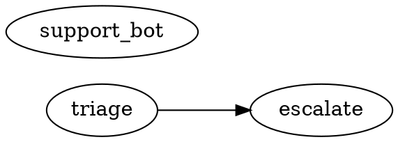

`julep` is the developer CLI for a julep Python module: run it from the
module root to discover source agents, select a graph slice, and inspect, run,
gate, trace, deploy, or drive local sessions. The console entry point is:

```toml
[project.scripts]
julep = "julep.ca.cli:main"
```

See [Using The Cli](/docs/guides/using-the-cli) for the workflow guide. This file documents
the current Typer entrypoint in `julep/ca/cli.py`.

## Global behavior

| Flag | Behavior |
|---|---|
| `--version` | Print `julep 0.1.0`; exit `0`. |
| `--help` | Print Typer/Click help. |
| `--install-completion` | Install shell completion (`add_completion=True`). |
| `--show-completion` | Print shell completion (`add_completion=True`). |

There is no `--root`; commands load config from `Path(".")`. `julep` with no
command shows help. Unknown commands and Click/Typer usage errors exit `2`
without a traceback. `julep.ca.cli.main(argv)` returns an integer.

## Selection grammar

Selection is implemented by `julep.ca.select.select(...)`. Empty
selection means all discovered agents.

| Form | Selects |
|---|---|
| `triage` | Agent named `triage`. |
| `tag:support` | Agents tagged `support` in config. |
| `path:pkg/*.py` | Agents whose source path matches the glob, relative to module root when possible. |
| `state:modified` | Agents in `.py` files from `git diff --name-only HEAD`; no CLI flag changes the ref. |
| `result:fail` | Agents whose `.ca/runs/*.json` status is not `done` or `ok`. |
| `a b` | Union. |
| `a,b` | Intersection. |
| `--exclude EXPR` | Subtract another expression. |

Graph operators compose with any base selector:

| Form | Selects |
|---|---|
| `+a` | `a` plus upstream dependencies: agents `a` calls. |
| `a+` | `a` plus downstream dependents: agents that call `a`. |
| `+a+` | Both directions. |
| `2+a` / `a+2` | Depth-bounded upstream / downstream closure. |
| `1+a+1` | Bounded both ways. |
| `@a` | `a`, its downstream closure, and upstream closure of that downstream set. |

If `escalate` calls `triage`, `triage` is upstream of `escalate`, and DOT output
uses `"triage" -> "escalate"`.

## Discovery, resolution, config

AST discovery (`scan_agents`) powers `ls`, `show`, `graph`, and selectors. It
finds top-level `@flow` functions and top-level assignments to `Agent(...)`,
skips `__init__.py`, skips syntax-error files, and records bare-name calls
between discovered flow functions.

Runnable commands resolve in a child process via
`python -m julep.ca._resolve_child`; import failures are reported as
resolver errors.

`load_config(Path("."))` reads `[tool.ca]` from `pyproject.toml`, then overlays a
sibling `ca.toml`. In `ca.toml`, omit the `tool.ca` prefix and use top-level
`src`, `exclude`, `[tags]`, `[gates]`, and `[env.<name>]`.

```toml
[tool.ca]
src = ["pkg"]
exclude = ["scratch_*.py"]
[tool.ca.tags]
triage = ["support"]
[tool.ca.gates]
fail_severity = "error"
[tool.ca.env.staging]
temporal_address = "temporal.staging:7233"
temporal_namespace = "default"
task_queue = "ca-staging"
cas = "s3://my-bucket/ca"
langfuse_host = "https://cloud.langfuse.com"
```

| Config field | Default | Used by |
|---|---|---|
| `src` | `[str(root)]` | Discovery and resolver import roots. |
| `exclude` | `[]` | Discovery exclusion globs. |
| `tags` | `{}` | `tag:` selection and display. |
| `gates.fail_severity` | `error` | Default `julep lint` threshold. |
| `env.<name>.temporal_address` | `None` | Non-local `julep run --env`. |
| `env.<name>.temporal_namespace` | `default` | Temporal client namespace. |
| `env.<name>.task_queue` | `julep` | Temporal workflow task queue. |
| `env.<name>.cas` | `None` | Deploy CAS; implicit `local` defaults to `.ca/cas`. |
| `env.<name>.langfuse_host` | `None` | Parsed, but current trace links read `LANGFUSE_HOST`. |

Implicit `local` always exists. `julep run --env local` always uses the in-memory
runner because the env name is `local`.

| Environment variable | Used by |
|---|---|
| `LANGFUSE_HOST` | `doctor`, `trace`, and Langfuse link printing. |
| `LANGFUSE_PROJECT_ID` | Changes trace links to `/project/<id>/traces/<trace-id>`. |
| `CA_BUNDLE_SIGNING_KEY` | Bundle signing seed or path; local non-S3 deploy sets a dev seed if unset. |
| `CA_PURE_NATIVE_DEPS` | Grants named pures to publish for native execution when WASM build metadata is unsupported. |

Install notes: `typer` and `click` are core dependencies; non-local `run --env` requires `julep[temporal]`; S3 CAS and missing signing dependencies require `julep[store]`.

## `julep ls`

Synopsis: `julep ls [SELECTOR] [--exclude EXPR]`

List discovered agents with name, kind, and tags.

| Arg/flag | Default | Meaning |
|---|---|---|
| `SELECTOR` | `""` | Selection expression. |
| `--exclude EXPR` | `""` | Selection expression to subtract. |

```bash
julep ls
```

```text
escalate                 flow
support_bot              agent
triage                   flow  [support]
```

Exit: `0` on success, including no matches.

## `julep show`

Synopsis: `julep show <NAME>`

Show one agent's kind, source location, tags, and cross-agent calls.

| Arg/flag | Default | Meaning |
|---|---|---|
| `NAME` | required | Agent name. |

```bash
julep show escalate
```

```text
escalate  (flow)
  source: /repo/pkg/agents.py:13
  tags:   (none)
  calls:  triage
```

Exit: `0` when found; unknown agents print `error: agent 'nope' not found` to
stderr and exit `2`.

## `julep graph`

Synopsis: `julep graph [SELECTOR] [--exclude EXPR]`

Render the selected cross-agent dependency DAG as Graphviz DOT.

| Arg/flag | Default | Meaning |
|---|---|---|
| `SELECTOR` | `""` | Selection expression. |
| `--exclude EXPR` | `""` | Selection expression to subtract. |

```bash
julep graph
```



Exit: `0`; edges are emitted only when both endpoint agents are selected.

## `julep run`

Synopsis: `julep run <NAME> [--input JSON] [--run-id RUN_ID] [--env ENV]`

Execute one agent. `local` resolves live source and runs the in-memory
interpreter with echo stubs; non-local envs replay the deployed ledger record
through Temporal.

| Arg/flag | Default | Meaning |
|---|---|---|
| `NAME` | required | Agent name. |
| `--input JSON` | `null` | JSON-encoded input. |
| `--run-id RUN_ID` | `""` | Local default `ca-<name>-local`; non-local default `ca-<name>-<env>-<12hex>`. |
| `--env ENV` | `local` | Configured environment. |

```bash
julep run triage --input '"TICKET-9"' --run-id r-cmd-1
```

```text
└─ seq#12 [ok]
   ├─ call#0 [ok]
   └─ think#3 [ok] $1.0000

output: {"output": {"hit": "TICKET-9"}}
```

```bash
julep deploy triage --env staging
julep run triage --env staging --input '{"ticket":"TICKET-9"}'
```

```text
output: {"output": "ok"}
```

Exit/errors: invalid `--input` JSON exits `2`; unknown env exits `2`; local
resolve/runtime errors print `error: ...`, cache status `error`, and exit `1`;
successful `RunOutcome` runs cache status `done`, print `output: ...`, and may
print `langfuse: ...`. Non-local `run_on_env(...)` raises if `temporal_address`,
Temporal support, or a deploy ledger record is missing; the command does not
wrap those exceptions. Cache path: `.ca/runs/<run-id>.json`.

## `julep deploy`

Synopsis: `julep deploy [SELECTOR] [--exclude EXPR] [--env ENV]`

Freeze, publish, and record selected agents for an environment.

| Arg/flag | Default | Meaning |
|---|---|---|
| `SELECTOR` | `""` | Selection expression. |
| `--exclude EXPR` | `""` | Selection expression to subtract. |
| `--env ENV` | `local` | Configured environment. |

```bash
julep deploy triage --env local
```

```text
triage  sha256:3f14bac9c12
```

Effects: publishes bundle objects to the env CAS and upserts
`.ca/deploys/<env>.json`. Each record stores `agent`, `artifact_hash`,
`flow_json`, `manifest_json`, `bundle_ref`, `pinned_pures`, and `deployed_at`.

Exit/errors: unknown env exits `2`; no selected agents prints `no agents
matched` and exits `0`; freeze/publish errors print `failed to deploy agent
'<name>': ...` and exit `1`; success exits `0`.

## `julep status`

Synopsis: `julep status [SELECTOR] [--exclude EXPR] [--env ENV]`

Show deployment status and drift for an environment.

| Arg/flag | Default | Meaning |
|---|---|---|
| `SELECTOR` | `""` | Optional filter applied after status rows are computed. |
| `--exclude EXPR` | `""` | Selection expression to subtract. |
| `--env ENV` | `local` | Configured environment. |

```bash
julep status triage --env local
```

```text
triage                   clean       sha256:3f14bac9c12...
```

States: `undeployed` means source exists without a ledger record; `clean` means
current read-only freeze hash equals deployed hash; `drift` means source is
missing or hashes differ; `error` means read-only freeze failed.

Exit/errors: unknown env exits `2`; any `drift` or `error` exits `3`; `clean`
and `undeployed` exit `0`. `status` uses `publish=False` and does not mutate
CAS. The CLI prints `name`, `state`, and deployed hash or `-`.

## `julep lint`

Synopsis: `julep lint [SELECTOR] [--exclude EXPR] [--fail-severity LEVEL]`

Resolve selected agents to IR and run structural validation.

| Arg/flag | Default | Meaning |
|---|---|---|
| `SELECTOR` | `""` | Selection expression. |
| `--exclude EXPR` | `""` | Selection expression to subtract. |
| `--fail-severity LEVEL` | config `gates.fail_severity` | `error`, `warning`, or `info`. |

```bash
julep lint +triage --fail-severity warning
```

```text
clean
```

```text
ERROR   triage: RESOLVE — agent 'triage' not found
WARNING triage: SOME_CODE — diagnostic message
```

Exit/errors: clean or below-threshold findings exit `0`; findings at or above
the threshold exit `1`; resolver errors return `RESOLVE` and exit `2`; no
matched agents prints `clean` and exits `0`.

## `julep test`

Synopsis: `julep test [SELECTOR] [--exclude EXPR] [--dry-run]`

Run `pytest` scoped to selected agent names via `-k`.

| Arg/flag | Default | Meaning |
|---|---|---|
| `SELECTOR` | `""` | Selection expression. |
| `--exclude EXPR` | `""` | Selection expression to subtract. |
| `--dry-run` | `False` | Print the pytest command without running it. |

```bash
julep test triage --dry-run
```

```text
/path/to/python -m pytest -q -k triage
```

```text
/path/to/python -m pytest -q -k escalate or support_bot or triage
```

Exit/errors: `--dry-run` exits `0`; otherwise exits with `python -m pytest -q`
return code; an explicit no-match selector prints `no agents matched` and exits
`0`. Pytest `-k` uses substring matching.

## `julep trace`

Synopsis: `julep trace <RUN_ID>`

Render a cached run's trace tree and print a Langfuse link when configured.

| Arg/flag | Default | Meaning |
|---|---|---|
| `RUN_ID` | required | Run id under `.ca/runs/`. |

```bash
julep trace r-cmd-1
```

```text
└─ seq#12 [ok]
   ├─ call#0 [ok]
   └─ think#3 [ok] $1.0000
```

```text
run 'r-err' status=error (no trace events captured)
langfuse: https://cloud.langfuse.com/api/public/traces/<trace-id>
langfuse: https://cloud.langfuse.com/project/<project-id>/traces/<trace-id>
```

Exit/errors: missing cache prints `error: no cached run '...'` to stderr and
exits `2`; existing cache entries exit `0`, even with cached status `error`.

## `julep doctor`

Synopsis: `julep doctor`

Preflight discovery, git, Langfuse, and Temporal availability.

| Arg/flag | Default | Meaning |
|---|---|---|
| none | - | - |

```bash
julep doctor
```

```text
[ok ] discovery: 3 agent(s) discovered under pkg
[ok ] git: git found
[WARN] langfuse: LANGFUSE_HOST unset (no deep links)
[WARN] temporal: temporalio missing (deploy disabled)
```

Checks: discovery requires at least one agent; git uses `shutil.which("git")`;
Langfuse checks `LANGFUSE_HOST`; Temporal checks `importlib.util.find_spec`.
Exit: `1` only when discovery fails; other failed checks are warnings.

## `julep chat`

Synopsis: `julep chat <NAME> [--env ENV]`

Open a local session REPL over an agent and stream emitted replies.

| Arg/flag | Default | Meaning |
|---|---|---|
| `NAME` | required | Agent name. |
| `--env ENV` | `local` | Only `local` is supported. |

Input lines are stripped; blank lines are ignored; each line is JSON-decoded or
sent as a raw string.

```bash
printf '"TICKET-1"\n"TICKET-2"\n' | julep chat triage
```

```text
<- {"output": {"hit": "TICKET-1"}}
<- {"output": {"hit": "TICKET-2"}}
[closed]
```

Exit/errors: unknown env exits `2`; non-local env exits `2` with `error: julep
chat currently supports only --env local`; resolver errors exit `2`; fatal
session errors and other caught exceptions exit `1`.

## `julep trigger`

Synopsis: `julep trigger <NAME> <EVENT> [--channel CHANNEL]`

Send one event to a local session and print emitted replies.

| Arg/flag | Default | Meaning |
|---|---|---|
| `NAME` | required | Agent name. |
| `EVENT` | required | JSON payload, or raw string if JSON parsing fails. |
| `--channel CHANNEL` | `in` | Only `in` is accepted. |

```bash
julep trigger triage '"TICKET-9"'
```

```text
<- {"output": {"hit": "TICKET-9"}}
```

Exit/errors: unsupported channel exits `2` before resolution; resolver errors
exit `2`; fatal session errors and other caught exceptions exit `1`.

## `julep listen`

Synopsis: `julep listen <NAME> --forward-to URL`

Open a local session, read stdin events, and forward each emitted event by HTTP
`POST`.

| Arg/flag | Default | Meaning |
|---|---|---|
| `NAME` | required | Agent name. |
| `--forward-to URL` | required | HTTP endpoint for emitted events. Emits are posted as JSON with `kind`, `channel`, `seq`, `payload`, `turn`, `reason`, and `fatal`. |

```bash
printf '"TICKET-4"\n' | julep listen triage --forward-to http://127.0.0.1/events
```

```text
-> POST http://127.0.0.1/events [202] seq=1
```

Exit/errors: missing `--forward-to` exits `2`; resolver errors exit `2`; HTTP
failures print `warning: forward failed: ...` and status `0` but do not fail by
themselves; fatal session errors and other caught exceptions exit `1`.

## Deploy/status/run `--env` flow

The env loop is ledger-driven:

1. Configure `[tool.ca.env.<name>]` or `[env.<name>]`.
2. `julep deploy <selector> --env <name>` freezes live source, publishes a signed bundle to CAS, and upserts `.ca/deploys/<name>.json`.
3. `julep status --env <name>` computes current hashes read-only and compares them with the ledger.
4. `julep run <agent> --env <name>` reads `flow_json`, `manifest_json`, `bundle_ref`, and `pinned_pures` from the ledger and passes them to `run_flow(...)`.

`julep run --env <non-local>` does not re-freeze drifted source and requires a
ledger record:

```text
agent 'triage' is not deployed to env 'staging'; run: julep deploy triage --env staging
```

```bash
julep deploy triage --env local
julep status triage --env local
julep run triage --env local --input '"TICKET-9"'
julep deploy triage --env staging
julep status triage --env staging
julep run triage --env staging --input '{"ticket":"TICKET-9"}'
```

Workers that replay `bundle_ref` records must resolve the same CAS and allow the
corresponding signing public keys. See the Temporal deployment guides linked
from [Using The Cli](/docs/guides/using-the-cli).
<!-- generated by ca-docs-matrix: ca-cli/reference -->

<!-- ported-by ca-docs-site: reference/ca-cli -->
