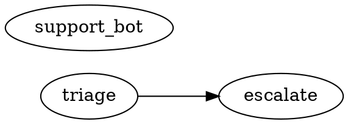

`julep` is the developer CLI for a julep Python module: run it from the
module root to discover source agents, select a graph slice, and inspect, run,
gate, trace, deploy, or drive local sessions. The console entry point is:

```toml
[project.scripts]
julep = "julep.cli.main:main"
```

See [Using The Cli](/docs/guides/using-the-cli) for the workflow guide. This file documents
the current Typer entrypoint in `julep/cli/main.py`.

## Global behavior

| Flag | Behavior |
|---|---|
| `--version` | Print the installed Julep package version; exit `0`. |
| `--help` | Print Typer/Click help. |
| `--install-completion` | Install shell completion (`add_completion=True`). |
| `--show-completion` | Print shell completion (`add_completion=True`). |

There is no `--root`; commands load config from `Path(".")`. `julep` with no
command shows help. Unknown commands and Click/Typer usage errors exit `2`
without a traceback. `julep.cli.main.main(argv)` returns an integer.

## Selection grammar

Selection is implemented by `julep.cli.select.select(...)`. Empty
selection means all discovered agents.

| Form | Selects |
|---|---|
| `triage` | Agent named `triage`. |
| `tag:support` | Agents tagged `support` in config. |
| `path:pkg/*.py` | Agents whose source path matches the glob, relative to module root when possible. |
| `state:modified` | Agents in `.py` files from `git diff --name-only HEAD`; no CLI flag changes the ref. |
| `result:fail` | Agents whose `.julep/runs/*.json` status is not `done` or `ok`. |
| `a b` | Union. |
| `a,b` | Intersection. |
| `--exclude EXPR` | Subtract another expression. |

Graph operators compose with any base selector:

| Form | Selects |
|---|---|
| `+a` | `a` plus upstream dependencies: agents `a` calls. |
| `a+` | `a` plus downstream dependents: agents that call `a`. |
| `+a+` | Both directions. |
| `2+a` / `a+2` | Depth-bounded upstream / downstream closure. |
| `1+a+1` | Bounded both ways. |
| `@a` | `a`, its downstream closure, and upstream closure of that downstream set. |

If `escalate` calls `triage`, `triage` is upstream of `escalate`, and DOT output
uses `"triage" -> "escalate"`.

## Discovery, resolution, config

AST discovery (`scan_agents`) powers `ls`, `show`, `graph`, and selectors. It
finds top-level `@flow` functions and top-level assignments to `Agent(...)`,
skips `__init__.py`, skips syntax-error files, and records bare-name calls
between discovered flow functions.

Runnable commands resolve in a child process via
`python -m julep.cli._resolve_child`; import failures are reported as
resolver errors.

`load_config(Path("."))` reads `[tool.julep]` from `pyproject.toml`, then overlays a
sibling `julep.toml`. In `julep.toml`, omit the `tool.julep` prefix and use top-level
`src`, `exclude`, `[tags]`, `[gates]`, and `[env.<name>]`.

```toml
[tool.julep]
src = ["pkg"]
exclude = ["scratch_*.py"]
application = "memory_app:application" # optional explicit Application object
llm_caller = "memory_app.llm:call"      # optional production LlmCaller for eval
[tool.julep.tags]
triage = ["support"]
[tool.julep.gates]
fail_severity = "error"
[tool.julep.env.staging]
temporal_address = "temporal.staging:7233"
temporal_namespace = "default"
task_queue = "julep-staging"
artifacts = "s3://my-bucket/julep"
langfuse_host = "https://cloud.langfuse.com"

[tool.julep.mcp.servers.memory]
url = "https://memory.example/mcp"
auth = "snapshot-token"
version = "2026.7"

[tool.julep.mcp.servers.memory.headers]
X-Tenant = "acme"

[tool.julep.pipeline.episode_summary]
ctx = "prompts/episode_summary.ctx"
lane = "summaries"

[tool.julep.pipeline.episode_summary.env]
MODEL = "anthropic:claude-haiku-4-5-20251001"
```

Reserved top-level sections are `mcp`, `pipeline`, `server`, and `redaction`;
`llm_caller` is a top-level scalar. In `julep.toml`, drop the
`tool.julep` prefix: use `[mcp.servers.<id>]`, `[pipeline.<name>]`, `[server]`,
and `[redaction]`.

MCP server keys are `url`, `auth`, `headers`, and `version`. URLs must be
absolute HTTP(S) endpoints without embedded credentials and form the live
snapshot allow-list. Pipeline keys are `ctx`, `lane`, and nested `env` string
values. Server settings are documented under
[Control plane](/docs/deploy/control-plane). Redaction keys are
`key_patterns`, `path_patterns`, and `disable_default`; worker-side file loading
uses `[tool.julep.redaction]` in `pyproject.toml`.

Unknown supported config keys are rejected. Where the table has a fixed schema,
the error includes a close-match suggestion, such as `lan` to `lane` or
`versoin` to `version`.

| Config field | Default | Used by |
|---|---|---|
| `src` | `[str(root)]` | Discovery and resolver import roots. |
| `exclude` | `[]` | Discovery exclusion globs. |
| `tags` | `{}` | `tag:` selection and display. |
| `gates.fail_severity` | `error` | Default `julep lint` threshold. |
| `application` | `None` | Explicit `module:attribute` application used by `plan`, `apply`, and unselected application-level `status`; never AST-discovered. |
| `llm_caller` | `None` | Production `module:attribute` caller used by `julep eval`; `--llm-caller` overrides it. |
| `mcp.servers.<id>` | `{}` | Validated MCP Streamable HTTP endpoints used by `--mcp-snapshot`. |
| `pipeline.<name>` | `{}` | Zero-code dotctx pipelines synthesized for `plan` and `apply`. |
| `env.<name>.temporal_address` | `None` | Non-local `julep run --env` and required application lane endpoint. |
| `env.<name>.temporal_namespace` | `default` | Temporal client/worker namespace. |
| `env.<name>.task_queue` | `julep` | Temporal workflow task queue. |
| `env.<name>.artifacts` | `None` | Deploy artifact store; implicit `local` defaults to `.julep/artifacts`. |
| `env.<name>.langfuse_host` | `None` | Parsed, but current trace links read `LANGFUSE_HOST`. |
| `env.<name>.release_store` | `None` | Application release artifact store (`s3://...` or `file://...`). |
| `env.<name>.worker_image` | `None` | Immutable `repository@sha256:...` image required by application `apply`. |
| `env.<name>.helm_chart` | `infra/helm/julep-worker` | Local chart path or digest-pinned OCI chart. |
| `env.<name>.kubernetes_namespace` | `julep` | Namespace for application lane releases. |
| `env.<name>.worker_context_factory` | `None` | Required `module:attribute` worker context factory. |
| `env.<name>.worker_service_account` | `None` | Existing Kubernetes service account used by lane workers. |
| `env.<name>.worker_priority_class` | `None` | Optional existing Kubernetes PriorityClass for lane workers; omitted from pods when unset. |
| `env.<name>.payload_encryption_secret` | `None` | Required by application deployment; existing Secret in `kubernetes_namespace` containing `keyring` and `active-key-id`. |
| `env.<name>.queues` | `{}` | Logical application lane to base Temporal task queue; releases derive immutable queue names. |
| `env.<name>.worker_environment` | `{}` | Non-secret values compiled into lane configuration and injected into workers. |
| `env.<name>.worker_secret_environment` | `{}` | Environment name to Kubernetes `secret_name`/`key` references; values are resolved only in worker pods. |

Implicit `local` always exists. `julep run --env local` always uses the in-memory
runner because the env name is `local`.

For application compilation, every `PipelineSpec.snapshot_source` is called
with a read-only mapping of `env.<name>.vars` followed by
`env.<name>.worker_environment` (the worker value wins on a duplicate key).
`worker_secret_environment` contributes references only, so its secret values
are deliberately absent from the callback mapping. A snapshot callback must
return `McpSnapshot`.

| Environment variable | Used by |
|---|---|
| `LANGFUSE_HOST` | `doctor`, `trace`, and Langfuse link printing. |
| `LANGFUSE_PROJECT_ID` | Changes trace links to `/project/<id>/traces/<trace-id>`. |
| `JULEP_BUNDLE_SIGNING_KEY` | Bundle signing seed or path; local non-S3 deploy sets a dev seed if unset. |
| `JULEP_BUNDLE_ALLOWED_SIGNERS` | Public signer allow-list used by bundle workers; for applications, configure it under `worker_environment`. |
| `JULEP_PURE_NATIVE_DEPS` | Grants named pures to publish for native execution when WASM build metadata is unsupported. |

Install notes: `typer` and `click` are core dependencies; non-local `run --env`
requires `julep[temporal]`; S3 artifact store and signing require `julep[store]`.
Application publishing and workers normally use `julep[store,temporal]` plus
pipeline-specific extras. Application reconciliation/observation shells out to
authenticated `helm`, `kubectl`, and `temporal` CLIs (`apply --publish-only`
skips Helm reconciliation).

## `julep ls`

Synopsis: `julep ls [SELECTOR] [--exclude EXPR]`

List discovered agents with name, kind, and tags.

| Arg/flag | Default | Meaning |
|---|---|---|
| `SELECTOR` | `""` | Selection expression. |
| `--exclude EXPR` | `""` | Selection expression to subtract. |

```bash
julep ls
```

```text
escalate                 flow
support_bot              agent
triage                   flow  [support]
```

Exit: `0` on success, including no matches.

## `julep show`

Synopsis: `julep show <NAME>`

Show one agent's kind, source location, tags, and cross-agent calls.

| Arg/flag | Default | Meaning |
|---|---|---|
| `NAME` | required | Agent name. |

```bash
julep show escalate
```

```text
escalate  (flow)
  source: /repo/pkg/agents.py:13
  tags:   (none)
  calls:  triage
```

Exit: `0` when found; unknown agents print `error: agent 'nope' not found` to
stderr and exit `2`.

## `julep graph`

Synopsis: `julep graph [SELECTOR] [--exclude EXPR]`

Render the selected cross-agent dependency DAG as Graphviz DOT.

| Arg/flag | Default | Meaning |
|---|---|---|
| `SELECTOR` | `""` | Selection expression. |
| `--exclude EXPR` | `""` | Selection expression to subtract. |

```bash
julep graph
```



Exit: `0`; edges are emitted only when both endpoint agents are selected.

## `julep artifact`

The `artifact` command exposes the lower-level JSON artifact CLI while preserving
its arguments, help text, and exit codes:

| Command | Purpose |
|---|---|
| `julep artifact validate <flow.json>` | Validate serialized flow IR. |
| `julep artifact freeze <flow.json> <snapshot.json>` | Freeze IR against a tool snapshot. |
| `julep artifact inspect <flow.json>` | Inspect shape, manifest, and capability data. |
| `julep artifact run-local <flow.json> <input.json>` | Run serialized IR with local stubs. |
| `julep artifact graph <flow.json>` | Emit Graphviz DOT for serialized IR. |

Run `julep artifact --help` for the full option list. The direct module fallback
is `python -m julep.cli.artifact`.

## `julep run`

Synopsis: `julep run <NAME|PATH.ctx> [--input JSON] [--run-id RUN_ID] [--env ENV]`

Execute one agent. `local` resolves live source and runs the in-memory
interpreter with echo stubs; non-local envs replay the deployed ledger record
through Temporal.

| Arg/flag | Default | Meaning |
|---|---|---|
| `NAME|PATH.ctx` | required | Agent name, or a `.ctx` package path for local evaluation. |
| `--input JSON` | `null` | JSON-encoded input. |
| `--run-id RUN_ID` | `""` | Local default `julep-<name>-local`; non-local default `julep-<name>-<env>-<12hex>`. |
| `--env ENV` | `local` | Configured environment. |

```bash
julep run triage --input '"TICKET-9"' --run-id r-cmd-1
```

```text
└─ seq#12 [ok]
   ├─ call#0 [ok]
   └─ think#3 [ok] $1.0000

output: {"output": {"hit": "TICKET-9"}}
```

```bash
julep deploy triage --env staging
julep run triage --env staging --input '{"ticket":"TICKET-9"}'
```

```text
output: {"output": "ok"}
```

Exit/errors: invalid `--input` JSON exits `2`; unknown env exits `2`; local
resolve/runtime errors print `error: ...`, cache status `error`, and exit `1`;
successful `RunOutcome` runs cache status `done`, print `output: ...`, and may
print `langfuse: ...`. Non-local `run_on_env(...)` raises if `temporal_address`,
Temporal support, or a deploy ledger record is missing; the command does not
wrap those exceptions. Cache path: `.julep/runs/<run-id>.json`.

For a `.ctx` path, the command loads dotctx, lowers it with
`reasoner_to_flow`, freezes it, and runs the local eval harness. It resolves
`$env` from the selected config environment and prints the frozen identity and
reply:

```bash
julep run prompts/summary.ctx --input '{"episode":"42"}' --env staging
```

```text
artifact sha256:...
output: {"summary":"..."}
```

## `julep deploy`

Synopsis: `julep deploy [SELECTOR] [--exclude EXPR] [--env ENV]`

Freeze, publish, and record selected agents for an environment.

| Arg/flag | Default | Meaning |
|---|---|---|
| `SELECTOR` | `""` | Selection expression. |
| `--exclude EXPR` | `""` | Selection expression to subtract. |
| `--env ENV` | `local` | Configured environment. |

```bash
julep deploy triage --env local
```

```text
triage  sha256:3f14bac9c12
```

Effects: publishes bundle objects to the env artifact store and upserts
`.julep/deploys/<env>.json`. Each record stores `agent`, `artifact_hash`,
`flow_json`, `manifest_json`, `bundle_ref`, `pinned_pures`, and `deployed_at`.

Exit/errors: unknown env exits `2`; no selected agents prints `no agents
matched` and exits `0`; freeze/publish errors print `failed to deploy agent
'<name>': ...` and exit `1`; success exits `0`.

## `julep plan`

Synopsis: `julep plan [--env ENV] [--json] [--mcp-snapshot]`

Compile the explicit `[tool.julep].application`, configured dotctx pipelines,
or both against the selected environment, observe deployed lanes, and report
artifact, MCP-schema, worker-image, release, deployment-config, Helm/KEDA, and
Temporal runtime drift. The command is read-only.

| Flag | Default | Meaning |
|---|---|---|
| `--env ENV` | `local` | Configured application environment. |
| `--json` | false | Emit the complete machine-readable plan. |
| `--mcp-snapshot` | false | Fetch configured MCP `tools/list` schemas before compiling. Requires `julep[mcp]`. |

Configured `[tool.julep.pipeline.<name>]` dotctx pipelines are appended to the
code application before compilation. If no code application exists, Julep
synthesizes one from those pipelines. A name collision with a code pipeline is
an error.

Read-only application commands require a 64-hex public signer in
`env.<name>.worker_environment.JULEP_BUNDLE_ALLOWED_SIGNERS`, unless
`JULEP_BUNDLE_SIGNING_KEY` is available as a local fallback.

Exit/errors: unknown env exits `2`; invalid application/configuration or an
observation failure exits `1`; success exits `0`. Drift is reported in output
and does not change plan's success exit code.

## `julep apply`

Synopsis: `julep apply --env ENV [--publish-only] [--mcp-snapshot]`

Compile and publish a signed, immutable application release. By default it then
reconciles one digest-pinned Helm release and release-specific Temporal task
queue per logical lane, runs the chart's worker smoke test, and records local
applied state. It never switches application traffic.

| Flag | Default | Meaning |
|---|---|---|
| `--env ENV` | required | Configured application environment. |
| `--publish-only` | false | Publish release artifacts without Helm reconciliation or local applied-state recording. |
| `--mcp-snapshot` | false | Fetch configured MCP `tools/list` schemas before publishing. Requires `julep[mcp]`. |

An explicit `snapshot=` in application code remains authoritative. The CLI
flag applies the configured server snapshot to pipelines without native tools.
Dotctx pipelines are published in schema-v2 releases with their package content
and renderer declarations, so generic workers can execute them.

`JULEP_BUNDLE_SIGNING_KEY` is required even with `--publish-only`; it must be a
64-hex Ed25519 private seed or a path to a file containing one. If
`JULEP_BUNDLE_ALLOWED_SIGNERS` is configured for workers, its comma-separated
64-hex public keys must include the publishing key. An omitted allow-list is
derived from the publishing key and injected into the worker configuration.

Exit/errors: unknown env exits `2`; compile, signing, artifact store, configuration, or
reconciliation failures exit `1`; success exits `0` and prints the release,
artifact, lane releases/queues, and `traffic unchanged`.

## `julep status`

Synopsis: `julep status [SELECTOR] [--exclude EXPR] [--env ENV] [--remote] [--api-url URL] [--api-key KEY] [--limit N]`

Show deployment status and drift for an environment. When
`[tool.julep].application` is configured and neither a selector nor `--exclude` is
provided, this is application status: it aggregates the immutable release,
Helm Deployment, KEDA ScaledObject, and Temporal workflow/activity queue state
for each lane. Supplying a selector or `--exclude` deliberately selects the
legacy per-agent deploy-ledger path described below.

| Arg/flag | Default | Meaning |
|---|---|---|
| `SELECTOR` | `""` | Optional filter applied after status rows are computed. |
| `--exclude EXPR` | `""` | Selection expression to subtract. |
| `--env ENV` | `local` | Configured environment. |
| `--remote` | false | Read `GET /v1/runs` instead of local application or ledger state. |
| `--api-url URL` | `JULEP_API_URL` | Remote control-plane base URL. |
| `--api-key KEY` | `JULEP_API_KEY` or unset | Remote bearer key. |
| `--limit N` | `50` | Maximum remote rows, `1..100`. |

```bash
julep status triage --env local
```

```text
triage                   clean       sha256:3f14bac9c12...
```

Legacy states: `undeployed` means source exists without a ledger record; `clean` means
current read-only freeze hash equals deployed hash; `drift` means source is
missing or hashes differ; `error` means read-only freeze failed.

Exit/errors: unknown env exits `2`; application observation/configuration
failures exit `1`; application drift or unhealthy/unknown lane state exits `3`.
On the legacy path, any `drift` or `error` exits `3`, while `clean` and
`undeployed` exit `0`. Status is read-only. Legacy output prints `name`, state,
and deployed hash; application output prints release and per-lane health,
backlog, and running counts.

Remote output prints run id, status, pipeline, and application. Remote API
errors exit `1`; missing API URL or httpx exits `2`.

## `julep serve api`

Synopsis: `julep serve api [--host HOST] [--port PORT] [--migrate]`

Build and run the FastAPI control plane from `ServerSettings.from_env()`.

| Flag | Default | Meaning |
|---|---|---|
| `--host HOST` | `JULEP_SERVER_HOST` or `127.0.0.1` | Uvicorn listen host. |
| `--port PORT` | `JULEP_SERVER_PORT` or `8080` | Uvicorn listen port. |
| `--migrate` | false | Apply the execution-store schema before serving. |

Requires `julep[server]` and `JULEP_EXECUTION_STORE_DSN`. Configuration or
optional-dependency failures exit `2`. See
[Control plane](/docs/deploy/control-plane).

## `julep db migrate`

Synopsis: `julep db migrate [--dsn DSN]`

Apply every numbered, idempotent projection-store migration. `--dsn` defaults
to `JULEP_EXECUTION_STORE_DSN`; omitting both exits `2`.

## `julep db sweep`

Synopsis: `julep db sweep --older-than SECONDS [--dsn DSN]`

Delete projection rows for terminal runs older than the non-negative threshold.
The operator owns retention policy. The DSN resolution matches `db migrate`.

## `julep schedule apply|ls|rm`

Schedules are declared under `[tool.julep.schedule.<name>]` or
`[schedule.<name>]` with `cron`, `flow`, optional `input`, `env`, and `paused`.

| Command | Synopsis | Behavior |
|---|---|---|
| `apply` | `julep schedule apply [--env ENV]` | Create or update configured Temporal cron schedules. |
| `ls` | `julep schedule ls [--env ENV]` | Compare configured and server schedules; exits `3` on drift. |
| `rm` | `julep schedule rm <NAME> [--env ENV]` | Remove the deterministic schedule id. |

`ENV` defaults to `local`, but the selected environment must configure
`temporal_address`.

## `julep worker`

Synopsis: `julep worker [--smoke-test-seconds SECONDS]`

Run the Temporal worker described entirely by its environment contract
(`WORKER_CONTEXT_FACTORY`, Temporal connection, task queue, artifact store, codec, and
bundle signer variables).

| Flag | Default | Meaning |
|---|---|---|
| `--smoke-test-seconds SECONDS` | `0` | Zero runs continuously. A positive value verifies Temporal connectivity, polls for that many seconds, then drains and exits. |

Negative values are rejected as usage errors. The Helm application chart uses
positive smoke mode on a release-specific empty queue before `apply` succeeds.

## `julep lint`

Synopsis: `julep lint [SELECTOR] [--exclude EXPR] [--fail-severity LEVEL]`

Resolve selected agents to IR and run structural validation.

| Arg/flag | Default | Meaning |
|---|---|---|
| `SELECTOR` | `""` | Selection expression. |
| `--exclude EXPR` | `""` | Selection expression to subtract. |
| `--fail-severity LEVEL` | config `gates.fail_severity` | `error`, `warning`, or `info`. |

```bash
julep lint +triage --fail-severity warning
```

```text
clean
```

```text
ERROR   triage: RESOLVE — agent 'triage' not found
WARNING triage: SOME_CODE — diagnostic message
```

Exit/errors: clean or below-threshold findings exit `0`; findings at or above
the threshold exit `1`; resolver errors return `RESOLVE` and exit `2`; no
matched agents prints `clean` and exits `0`.

## `julep test`

Synopsis: `julep test [SELECTOR] [--exclude EXPR] [--dry-run]`

Run `pytest` scoped to selected agent names via `-k`.

| Arg/flag | Default | Meaning |
|---|---|---|
| `SELECTOR` | `""` | Selection expression. |
| `--exclude EXPR` | `""` | Selection expression to subtract. |
| `--dry-run` | `False` | Print the pytest command without running it. |

```bash
julep test triage --dry-run
```

```text
/path/to/python -m pytest -q -k triage
```

```text
/path/to/python -m pytest -q -k escalate or support_bot or triage
```

Exit/errors: `--dry-run` exits `0`; otherwise exits with `python -m pytest -q`
return code; an explicit no-match selector prints `no agents matched` and exits
`0`. Pytest `-k` uses substring matching.

## `julep trace`

Synopsis: `julep trace <RUN_ID> [--remote] [--api-url URL] [--api-key KEY]`

Render a cached run's trace tree and print a Langfuse link when configured.

| Arg/flag | Default | Meaning |
|---|---|---|
| `RUN_ID` | required | Run id under `.julep/runs/`. |
| `--remote` | false | Read paginated projection events from the remote API. |
| `--api-url URL` | `JULEP_API_URL` | Remote control-plane base URL. |
| `--api-key KEY` | `JULEP_API_KEY` or unset | Remote bearer key. |

```bash
julep trace r-cmd-1
```

```text
└─ seq#12 [ok]
   ├─ call#0 [ok]
   └─ think#3 [ok] $1.0000
```

```text
run 'r-err' status=error (no trace events captured)
langfuse: https://cloud.langfuse.com/api/public/traces/<trace-id>
langfuse: https://cloud.langfuse.com/project/<project-id>/traces/<trace-id>
```

Exit/errors: missing cache prints `error: no cached run '...'` to stderr and
exits `2`; existing cache entries exit `0`, even with cached status `error`.
Remote mode renders API projection events. If none exist, it prints the remote
run status. API errors exit `1`.

## `julep eval`

Synopsis: `julep eval <CTX_PATH> [--env ENV] [--limit N] [--tag TAG] [--sample-name NAME] [--json PATH] [--baseline PATH] [--llm-caller MODULE:ATTR]`

Run a `.ctx` package's `eval.py` suite and enforce its threshold and optional
baseline.

| Flag | Default | Meaning |
|---|---|---|
| `--env ENV` | `local` | Config environment used for `$env` resolution. |
| `--limit N` | `-1` | Maximum samples; `-1` means all. |
| `--tag TAG` | none | Any-match tag filter; repeatable. |
| `--sample-name NAME` | none | Exact sample filter; repeatable. |
| `--json PATH` | unset | Write the JSON report. |
| `--baseline PATH` | unset | Compare with a prior report. |
| `--llm-caller MODULE:ATTR` | `[tool.julep] llm_caller` | Resolve a production `LlmCaller`; the flag wins. |

Exit `0` means pass, `2` means below threshold, `3` means regression against
the baseline, and `4` means a broken eval configuration or unknown environment.

## `julep doctor`

Synopsis: `julep doctor`

Preflight discovery, git, Langfuse, and Temporal availability.

| Arg/flag | Default | Meaning |
|---|---|---|
| none | - | - |

```bash
julep doctor
```

```text
[ok ] discovery: 3 agent(s) discovered under pkg
[ok ] git: git found
[WARN] langfuse: LANGFUSE_HOST unset (no deep links)
[WARN] temporal: temporalio missing (deploy disabled)
```

Checks: discovery requires at least one agent; git uses `shutil.which("git")`;
Langfuse checks `LANGFUSE_HOST`; Temporal checks `importlib.util.find_spec`.
Exit: `1` only when discovery fails; other failed checks are warnings.

## `julep chat`

Synopsis: `julep chat <NAME> [--env ENV]`

Open a local session REPL over an agent and stream emitted replies.

| Arg/flag | Default | Meaning |
|---|---|---|
| `NAME` | required | Agent name. |
| `--env ENV` | `local` | Only `local` is supported. |

Input lines are stripped; blank lines are ignored; each line is JSON-decoded or
sent as a raw string.

```bash
printf '"TICKET-1"\n"TICKET-2"\n' | julep chat triage
```

```text
<- {"output": {"hit": "TICKET-1"}}
<- {"output": {"hit": "TICKET-2"}}
[closed]
```

Exit/errors: unknown env exits `2`; non-local env exits `2` with `error: julep
chat currently supports only --env local`; resolver errors exit `2`; fatal
session errors and other caught exceptions exit `1`.

## `julep trigger`

Synopsis: `julep trigger <NAME> <EVENT> [--channel CHANNEL]`

Send one event to a local session and print emitted replies.

| Arg/flag | Default | Meaning |
|---|---|---|
| `NAME` | required | Agent name. |
| `EVENT` | required | JSON payload, or raw string if JSON parsing fails. |
| `--channel CHANNEL` | `in` | Only `in` is accepted. |

```bash
julep trigger triage '"TICKET-9"'
```

```text
<- {"output": {"hit": "TICKET-9"}}
```

Exit/errors: unsupported channel exits `2` before resolution; resolver errors
exit `2`; fatal session errors and other caught exceptions exit `1`.

## `julep listen`

Synopsis: `julep listen <NAME> --forward-to URL`

Open a local session, read stdin events, and forward each emitted event by HTTP
`POST`.

| Arg/flag | Default | Meaning |
|---|---|---|
| `NAME` | required | Agent name. |
| `--forward-to URL` | required | HTTP endpoint for emitted events. Emits are posted as JSON with `kind`, `channel`, `seq`, `payload`, `turn`, `reason`, and `fatal`. |

```bash
printf '"TICKET-4"\n' | julep listen triage --forward-to http://127.0.0.1/events
```

```text
-> POST http://127.0.0.1/events [202] seq=1
```

Exit/errors: missing `--forward-to` exits `2`; resolver errors exit `2`; HTTP
failures print `warning: forward failed: ...` and status `0` but do not fail by
themselves; fatal session errors and other caught exceptions exit `1`.

## Deploy/status/run `--env` flow

The env loop is ledger-driven:

1. Configure `[tool.julep.env.<name>]` or `[env.<name>]`.
2. `julep deploy <selector> --env <name>` freezes live source, publishes a signed bundle to artifact store, and upserts `.julep/deploys/<name>.json`.
3. `julep status --env <name>` computes current hashes read-only and compares them with the ledger.
4. `julep run <agent> --env <name>` reads `flow_json`, `manifest_json`, `bundle_ref`, and `pinned_pures` from the ledger and passes them to `run_flow(...)`.

`julep run --env <non-local>` does not re-freeze drifted source and requires a
ledger record:

```text
agent 'triage' is not deployed to env 'staging'; run: julep deploy triage --env staging
```

```bash
julep deploy triage --env local
julep status triage --env local
julep run triage --env local --input '"TICKET-9"'
julep deploy triage --env staging
julep status triage --env staging
julep run triage --env staging --input '{"ticket":"TICKET-9"}'
```

Workers that replay `bundle_ref` records must resolve the same artifact store and allow the
corresponding signing public keys. See the Temporal deployment guides linked
from [Using The Cli](/docs/guides/using-the-cli).
<!-- generated by julep-docs-matrix: julep-cli/reference -->

<!-- ported-by julep-docs-site: reference/julep-cli -->
