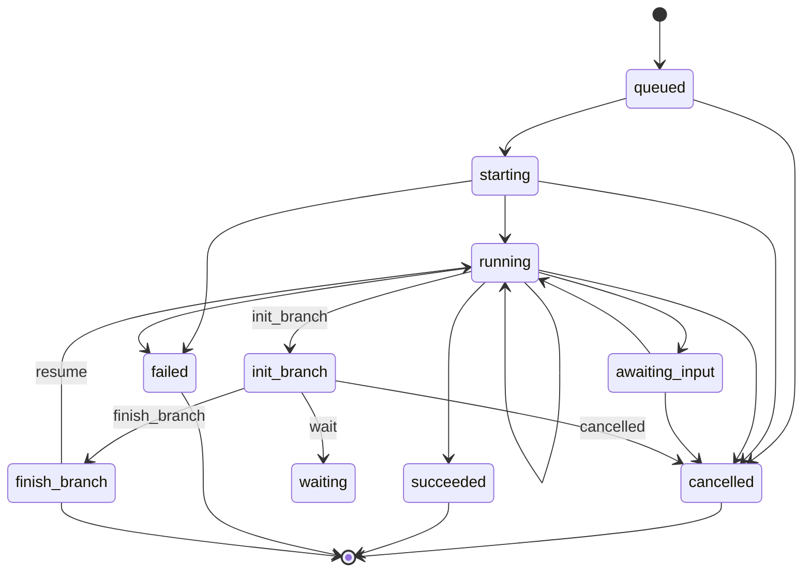

# Execution State Machine in Julep

*****
> ### This docs site is currently under construction although this github README below should suffice for now.

*****

In Julep, an Execution represents an instance of a Task that has been started with some input. The Execution follows a specific state machine model, ensuring consistent and predictable behavior throughout its lifecycle.

## Execution States

An Execution can be in one of the following states:

1. **queued**: The execution is waiting to start
2. **starting**: The execution is in the process of starting
3. **running**: The execution is actively running
4. **awaiting_input**: The execution is suspended and waiting for input to resume
5. **succeeded**: The execution has completed successfully
6. **failed**: The execution has failed
7. **cancelled**: The execution has been cancelled by the user

## State Transitions

The valid transitions between execution states are as follows:

- `queued` → `starting`
- `starting` → `running`, `awaiting_input`, `cancelled`, `succeeded`, `failed`
- `running` → `running`, `awaiting_input`, `cancelled`, `succeeded`, `failed`
- `awaiting_input` → `running`, `cancelled`
- `cancelled`, `succeeded`, `failed` → (terminal states, no further transitions)

## Transition Types

Executions can go through various transition types:

- `init`: Initializes the execution
- `init_branch`: Starts a new branch in the execution
- `finish`: Completes the execution successfully
- `finish_branch`: Completes a branch in the execution
- `wait`: Pauses the execution, waiting for input
- `resume`: Resumes a paused execution
- `error`: Indicates an error occurred
- `step`: Represents a step in the execution process
- `cancelled`: Indicates the execution was cancelled

## State Machine Diagram

This state machine ensures that executions in Julep follow a consistent and predictable flow, allowing for complex workflows while maintaining clear status tracking. It provides a robust framework for managing long-running tasks, handling interruptions, and recovering from failures.