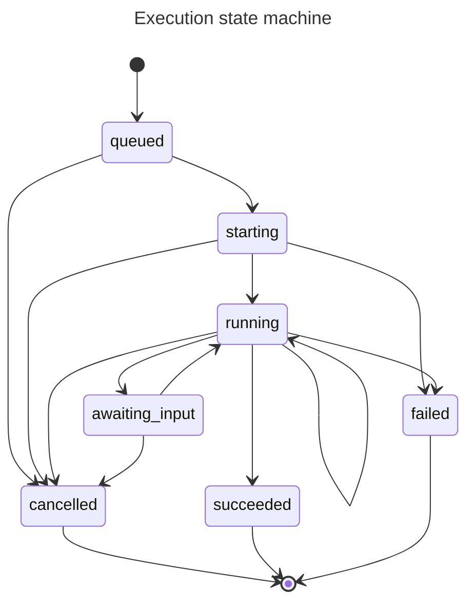

# Julep Concepts

<details>
  <summary>
    <h4>Table of Contents</h4>
  </summary>

- [Agent](#agent)
  - [Agent Endpoints](#agent-endpoints)
- [User](#user)
  - [User Endpoints](#user-endpoints)
- [Session](#session)
  - [Session Endpoints](#session-endpoints)
  - [metadata precedence order](#metadata-precedence-order)
  - [Context overflow](#context-overflow)
  - [Default system template](#default-system-template)
- [Multi-agent sessions](#multi-agent-sessions)
  - [Multiple users and agents in a session](#multiple-users-and-agents-in-a-session)
- [Chat](#chat)
  - [Chat Endpoints](#chat-endpoints)
- [Tool](#tool)
  - [Tool Endpoints](#tool-endpoints)
  - [Partial application of arguments to tools](#partial-application-of-arguments-to-tools)
  - [Resolving parameters with the same name](#resolving-parameters-with-the-same-name)
- [Doc](#doc)
  - [Doc Endpoints](#doc-endpoints)
- [Task](#task)
  - [Example task definition](#example-task-definition)
  - [Types of workflow steps](#types-of-workflow-steps)
    - [Tool Call](#tool-call)
    - [Prompt](#prompt)
    - [Evaluate](#evaluate)
    - [Wait for input](#wait-for-input)
    - [Log](#log)
    - [Embed](#embed)
    - [Search](#search)
    - [Set](#set)
    - [Get](#get)
    - [Foreach](#foreach)
    - [Map-reduce](#map-reduce)
    - [Parallel](#parallel)
    - [Switch](#switch)
    - [If-else](#if-else)
    - [Sleep](#sleep)
    - [Return](#return)
    - [Yield](#yield)
    - [Error](#error)
- [Execution](#execution)
  - [Execution State Machine](#execution-state-machine)
  - [Execution Endpoints](#execution-endpoints)
  - [Execution Models](#execution-models)
  - [Execution State Transitions](#execution-state-transitions)
  </details>

---

**New feature announced! _🌟Tasks🌟_**

<div>
    <a href="https://www.loom.com/share/c5cda67936254465aaff4548245b3e13">
      <p>Building Autonomous Agents with Julep - Watch Video</p>
    </a>
    <a href="https://www.loom.com/share/c5cda67936254465aaff4548245b3e13">
      
    </a>
  </div>

---

## Agent

An Agent in Julep is the main orchestrator (or protagonist) of your application. These are backed by foundation models like GPT4 or Claude which use the agent's interaction history to figure out what to do/say next. Using agents in Julep, you can:

- Interact with an agent in long-lived [sessions](#session).
- Add system, integration or user-defined [tools](#tool) that the agent can use.
- Add agent-level [documents](#doc) that are auto-retrieved using semantic search inside [sessions](#session).
- Define multi-step work flows that combine complex integrations using [tasks](#task). Tasks are [executed](#execution) in the background, can recover from failures and manage many sub-tasks in parallel.

> **(Upcoming Feature)** Access the [memories](#memory) that the agent makes about [users](#user) in the background as the user interacts with it inside sessions. These memories are going to be scoped per user in order to maintain clear distinctions.

At a high level, this is what defines an `Agent` (some properties omitted):

| **Field**          | **Description**                                                 |
| :----------------- | :-------------------------------------------------------------- |
| `name`             | The "name" of the Agent.                                        |
| `about`            | About the Agent: What it does, any guardrails, personality etc. |
| `model`            | Which model to use for this Agent (required).                   |
| `instructions`     | Instructions that this agent must follow (string or string[]).  |
| `default_settings` | Default settings for all sessions created by this agent.        |

Important to keep in mind: These fields are optional except for `model`. They are available inside sessions and task prompts as `jinja` templates. `Session`s, `Task`s etc. come with minimal default templates. You can override them with your own prompt templates throughout julep!

### Agent Endpoints

The Agent API provides the following endpoints:

1. List Agents (paginated): `GET /agents`
2. Create a new Agent: `POST /agents`
3. Create or update an Agent: `PUT /agents/{id}`
4. Update an existing Agent by id (overwrites existing values): `PUT /agents/{id}`
5. Update an existing Agent by id (merges with existing values): `PATCH /agents/{id}`
6. Delete Agent by id: `DELETE /agents/{id}`
7. Get an Agent by id: `GET /agents/{id}`

Additionally, there are related endpoints for managing agent documents, tools, and tasks:

8. Agent Documents endpoints: `GET /agents/{id}/docs`
9. Search Docs owned by an Agent: `GET /agents/{id}/search`
10. Agent Tools endpoints: `GET /agents/{id}/tools`
11. Tasks endpoints: `GET /agents/{id}/tasks`
12. Create or Update Tasks endpoints: `PUT /agents/{parent_id}/tasks`

#### Curl Examples

Here are some curl command examples for the main Agent endpoints:

1. List Agents (paginated):

```bash
curl -X GET "https://dev.julep.ai/api/agents?limit=10&offset=0" \
     -H "Authorization: Bearer YOUR_API_KEY"
```

2. Create a new Agent:

```bash
curl -X POST "https://dev.julep.ai/api/agents" \
     -H "Authorization: Bearer YOUR_API_KEY" \
     -H "Content-Type: application/json" \
     -d '{
           "name": "MyNewAgent",
           "about": "This is a new agent",
           "model": "gpt-4-turbo",
           "instructions": ["Be helpful", "Be concise"]
         }'
```

3. Get an Agent by id:

```bash
curl -X GET "https://dev.julep.ai/api/agents/YOUR_AGENT_ID" \
     -H "Authorization: Bearer YOUR_API_KEY"
```

4. Update an existing Agent by id (PUT):

```bash
curl -X PUT "https://dev.julep.ai/api/agents/YOUR_AGENT_ID" \
     -H "Authorization: Bearer YOUR_API_KEY" \
     -H "Content-Type: application/json" \
     -d '{
           "name": "UpdatedAgentName",
           "about": "This is an updated agent description",
           "model": "gpt-4-turbo",
           "instructions": ["New instruction 1", "New instruction 2"]
         }'
```

5. Update an existing Agent by id (PATCH):

```bash
curl -X PATCH "https://dev.julep.ai/api/agents/YOUR_AGENT_ID" \
     -H "Authorization: Bearer YOUR_API_KEY" \
     -H "Content-Type: application/json" \
     -d '{
           "name": "PartiallyUpdatedAgentName"
         }'
```

6. Delete Agent by id:

```bash
curl -X DELETE "https://dev.julep.ai/api/agents/YOUR_AGENT_ID" \
     -H "Authorization: Bearer YOUR_API_KEY"
```

Remember to replace `YOUR_API_KEY` with your actual Julep API key and `YOUR_AGENT_ID` with the specific agent ID you're working with.

---

## User

You can associate sessions with `User`s. julep uses them to scope `memories` formed by agents. They are optional but, in addition to memories, can be useful to attach meta data that can be referenced by other sessions or task executions.

A `User` consists of:

| **Field** | **Description**              |
| :-------- | :--------------------------- |
| `name`    | The name of the user.        |
| `about`   | Information about this user. |

### User Endpoints

The User API provides the following endpoints:

1. List Users (paginated): `GET /users`
2. Create a new User: `POST /users`
3. Create or update a User: `PUT /users/{id}`
4. Update an existing User by id (overwrites existing values): `PUT /users/{id}`
5. Update an existing User by id (merges with existing values): `PATCH /users/{id}`
6. Delete User by id: `DELETE /users/{id}`
7. Get a User by id: `GET /users/{id}`

Additionally, there are related endpoints for managing user documents:

8. User Documents endpoints: `GET /users/{id}/docs`
9. Search Docs owned by a User: `GET /users/{id}/search`

#### Curl Examples

Here are some curl command examples for the main User endpoints:

1. List Users (paginated):

```bash
curl -X GET "https://dev.julep.ai/api/users?limit=10&offset=0" \
     -H "Authorization: Bearer YOUR_API_KEY"
```

2. Create a new User:

```bash
curl -X POST "https://dev.julep.ai/api/users" \
     -H "Authorization: Bearer YOUR_API_KEY" \
     -H "Content-Type: application/json" \
     -d '{
           "name": "John Doe",
           "about": "A new user"
         }'
```

3. Get a User by id:

```bash
curl -X GET "https://dev.julep.ai/api/users/YOUR_USER_ID" \
     -H "Authorization: Bearer YOUR_API_KEY"
```

4. Update an existing User by id (PUT):

```bash
curl -X PUT "https://dev.julep.ai/api/users/YOUR_USER_ID" \
     -H "Authorization: Bearer YOUR_API_KEY" \
     -H "Content-Type: application/json" \
     -d '{
           "name": "John Updated",
           "about": "An updated user description"
         }'
```

5. Update an existing User by id (PATCH):

```bash
curl -X PATCH "https://dev.julep.ai/api/users/YOUR_USER_ID" \
     -H "Authorization: Bearer YOUR_API_KEY" \
     -H "Content-Type: application/json" \
     -d '{
           "about": "Partially updated user description"
         }'
```

6. Delete User by id:

```bash
curl -X DELETE "https://dev.julep.ai/api/users/YOUR_USER_ID" \
     -H "Authorization: Bearer YOUR_API_KEY"
```

Remember to replace `YOUR_API_KEY` with your actual Julep API key and `YOUR_USER_ID` with the specific user ID you're working with.

---

## Session

`Session` is the main workhorse for julep apps:

- You interact with agents inside sessions. You can create multiple sessions per agent.
- Each session maintains its own context for sending to the agent's model.
- A session can have _one or more_ agents and _zero or more_ users associated with it.
- You can control what happens when the history exceeds the context window limit using `context_overflow` setting.

A `Session` consists of:

| **Field**          | **Description**                                                                                                                                                        |
| :----------------- | :--------------------------------------------------------------------------------------------------------------------------------------------------------------------- |
| `agent(s)`         | Agents associated with this session. At least one is required.                                                                                                         |
| `user(s)`          | The users associated with this session. Optional.                                                                                                                      |
| `situation`        | The system prompt used for the session. Default prompt is shown below.                                                                                                 |
| `render_templates` | Whether to render system and assistant message content as jinja templates. Defaults to true.                                                                           |
| `token_budget`     | The number of tokens to keep the context window under. Defaults to null which is equivalent to the model's context window limit.                                       |
| `context_overflow` | Controls behavior for when context size exceeds the `token_budget`. Can be one of `null`, `"truncate"`, or `"adaptive"`. Defaults to `null` which raises an exception. |

### Session Endpoints

The Session API provides the following endpoints:

1. List Sessions (paginated): `GET /sessions`
2. Create a new Session: `POST /sessions`
3. Get a Session by id: `GET /sessions/{id}`
4. Update an existing Session by id: `PUT /sessions/{id}`
5. Delete Session by id: `DELETE /sessions/{id}`
6. Get Session Messages: `GET /sessions/{id}/messages`
7. Create a new Message in a Session: `POST /sessions/{id}/messages`
8. Get Session Tools: `GET /sessions/{id}/tools`

#### Curl Examples

Here are some curl command examples for the main Session endpoints:

1. List Sessions (paginated):

```bash
curl -X GET "https://dev.julep.ai/api/sessions?limit=10&offset=0" \
     -H "Authorization: Bearer YOUR_API_KEY"
```

2. Create a new Session:

```bash
curl -X POST "https://dev.julep.ai/api/sessions" \
     -H "Authorization: Bearer YOUR_API_KEY" \
     -H "Content-Type: application/json" \
     -d '{
           "agent_id": "YOUR_AGENT_ID",
           "user_id": "YOUR_USER_ID",
           "situation": "Custom situation for this session",
           "token_budget": 4000,
           "context_overflow": "truncate"
         }'
```

3. Get a Session by id:

```bash
curl -X GET "https://dev.julep.ai/api/sessions/YOUR_SESSION_ID" \
     -H "Authorization: Bearer YOUR_API_KEY"
```

4. Update an existing Session by id:

```bash
curl -X PUT "https://dev.julep.ai/api/sessions/YOUR_SESSION_ID" \
     -H "Authorization: Bearer YOUR_API_KEY" \
     -H "Content-Type: application/json" \
     -d '{
           "situation": "Updated situation for this session",
           "token_budget": 5000,
           "context_overflow": "adaptive"
         }'
```

5. Delete Session by id:

```bash
curl -X DELETE "https://dev.julep.ai/api/sessions/YOUR_SESSION_ID" \
     -H "Authorization: Bearer YOUR_API_KEY"
```

6. Get Session Messages:

```bash
curl -X GET "https://dev.julep.ai/api/sessions/YOUR_SESSION_ID/messages" \
     -H "Authorization: Bearer YOUR_API_KEY"
```

7. Create a new Message in a Session:

```bash
curl -X POST "https://dev.julep.ai/api/sessions/YOUR_SESSION_ID/messages" \
     -H "Authorization: Bearer YOUR_API_KEY" \
     -H "Content-Type: application/json" \
     -d '{
           "role": "user",
           "content": "Hello, how can you help me today?"
         }'
```

8. Get Session Tools:

```bash
curl -X GET "https://dev.julep.ai/api/sessions/YOUR_SESSION_ID/tools" \
     -H "Authorization: Bearer YOUR_API_KEY"
```

Remember to replace `YOUR_API_KEY`, `YOUR_AGENT_ID`, `YOUR_USER_ID`, and `YOUR_SESSION_ID` with your actual Julep API key and the specific IDs you're working with.

### `metadata` precedence order

In julep, the following objects can have `metadata` added to them:

- `Agent`
- `User`
- `Session`
- `Doc`
- `Task`
- `Execution`

Whenever multiple objects with the same `metadata` field are present in a scope, the value takes the following precedence (from highest to lowest):

- In a session: `session > user > agent`
- During a task execution: `execution > task > agent`

### Context overflow

Whenever the context size grows beyond the `token_budget` or the model's input limit, the backend figures out what to do next based on the `context_overflow` setting:

- `null`: Raise an exception. The client is responsible for creating a new session or clearing the history for the current one.
- `"truncate"`: Truncate the context from the top except the for system prompt until the size falls below the budget. Raises an error if system prompt and last message combined exceed the budget.
- `"adaptive"`: Whenever the context size reaches `75%` of the `token_budget`, a background task is created to compress the information by summarizing, merging and clipping messages in the context. This is done on a best effort basis. Requests might fail if the context wasn't compressed enough or on time.

### Default system template

```jinja

You are {{agent.name}}.{{" "}}



About you: {{agent.about}}.{{" "}}



You are talking to a user
  {{" "}} and their name is {{user.name}}
    . About the user: {{user.about}}..
  


{{"\n\n"}}


Instructions:{{"\n"}}
  
    {{agent.instructions}}{{"\n"}}
  
    
      - {{instruction}}{{"\n"}}
    
  
  {{"\n"}}



Tools:{{"\n"}}
  
    
      - {{tool.function.name}}
      : {{tool.function.description}}{{"\n"}}
    
      - {{ 0/0 }} {# Error: Other tool types aren't supported yet. #}
    
  
{{"\n\n"}}



Relevant documents:{{"\n"}}
  
    {{doc.title}}{{"\n"}}
    
      {{doc.content}}{{"\n"}}
    
      
        {{snippet}}{{"\n"}}
      
    
    {{"---"}}
  

```

## Multi-agent sessions

There are different types of sessions based on the number of agents and users:

- Single agent: No user, single user, or multiple users
- Multiple agents: No user, single user, or multiple users

### Multiple users and agents in a session

A session can have more than one agents or users. The session's behavior changes depending on this.

**No user**: No user data is retrieved. _(Upcoming)_ Memories are not mined from the session.

**One or more users**: Docs, metadata, memories etc. are retrieved for all the users in the session. You can add messages for each user by referencing them by their name in the `ChatML` messages. _(Upcoming)_ Memories mined in the background are added to the corresponding user's scope.

**One agent**: Works as expected.

**Multiple agents**: When a message is received by the session, each agent is called one after another in the order they were defined in the session. You can also specify which `agent` to use in a request, in which case, just that agent will be used.

---

## Chat

The Chat feature in Julep allows for dynamic interaction with agents through a flexible and powerful API. It supports various settings, streaming responses, and integration with tools and documents.

### Chat Input

When sending a request to the chat endpoint, you can include the following key components:

1. **Messages**: An array of input messages representing the conversation so far.
2. **Tools**: (Advanced) Additional tools provided for this specific interaction.
3. **Tool Choice**: Specifies which tool the agent should use.
4. **Memory Access Options**: Controls how the session accesses history and memories.
5. **Chat Settings**: Various settings to control the behavior of the chat.

### Chat Settings

Chat settings allow fine-grained control over the generation process:

- `model`: Identifier of the model to be used.
- `stream`: Indicates if the server should stream the response as it's generated.
- `stop`: Up to 4 sequences where the API will stop generating further tokens.
- `seed`: For deterministic sampling.
- `max_tokens`: The maximum number of tokens to generate.
- `logit_bias`: Modify the likelihood of specified tokens appearing in the completion.
- `response_format`: Control the format of the response (e.g., JSON object).
- `agent`: Agent ID to use (for multi-agent sessions).

Additional settings are available for fine-tuning the output, such as `temperature`, `top_p`, `frequency_penalty`, and `presence_penalty`.

### Chat Response

The chat response can be either streamed or returned as a complete message:

1. **Streamed Response**:

   - Content-Type: `text/event-stream`
   - Body: A stream of `ChatOutputChunk` objects.

2. **Complete Response**:
   - Content-Type: `application/json`
   - Body: A `MessageChatResponse` object containing the full generated message(s).

Both response types include:

- `usage`: Token usage statistics.
- `jobs`: Background job IDs spawned from this interaction.
- `docs`: Documents referenced for this request (for citation purposes).

### Finish Reasons

The API provides information about why the model stopped generating tokens:

- `stop`: Natural stop point or provided stop sequence reached.
- `length`: Maximum number of tokens specified in the request was reached.
- `content_filter`: Content was omitted due to a flag from content filters.
- `tool_calls`: The model called a tool.

### Advanced Features

1. **Tool Integration**: The chat API allows for the use of tools, enabling the agent to perform actions or retrieve information during the conversation.

2. **Multi-agent Sessions**: You can specify different agents within the same session using the `agent` parameter in the chat settings.

3. **Response Formatting**: Control the output format, including options for JSON responses with specific schemas.

4. **Memory and Recall**: Configure how the session accesses and stores conversation history and memories.

5. **Document References**: The API returns information about documents referenced during the interaction, useful for providing citations or sources.

By leveraging these features, developers can create sophisticated, context-aware chat interactions that integrate seamlessly with other Julep components like tools, documents, and background tasks.

### Chat Endpoints

The main chat endpoint is:

- Generate a response: `POST /sessions/{id}/chat`

This endpoint allows you to send messages to an agent and receive responses.

#### Curl Example

Here's a basic curl command to interact with the chat endpoint:

```bash
curl -X POST "https://dev.julep.ai/api/sessions/{SESSION_ID}/chat" \
     -H "Authorization: Bearer YOUR_API_KEY" \
     -H "Content-Type: application/json" \
     -d '{
           "messages": [
             {
               "role": "user",
               "content": "Hello, can you help me with a task?"
             }
           ],
           "stream": false,
           "max_tokens": 150
         }'
```

Remember to replace `{SESSION_ID}` with your actual session ID and `YOUR_API_KEY` with your Julep API key.

---

## Tool

Agents can be given access to a number of "tools" -- any programmatic interface that a foundation model can "call" with a set of inputs to achieve a goal. For example, it might use a `web_search(query)` tool to search the Internet for some information.

Unlike agent frameworks, julep is a _backend_ that manages agent execution. Clients can interact with agents using our SDKs. julep takes care of executing tasks and running integrations.

Tools in julep can be one of:

1. User-defined `function`s  
   These are function signatures that you can give the model to choose from, similar to how [openai]'s function-calling works. An example:

   ```yaml
   name: send_text_message
   description: Send a text message to a recipient.
   parameters:
     type: object
     properties:
     	to:
     		type: string
     		description: Phone number of recipient.
     	text:
     		type: string
     		description: Content of the message.
   ```

2. `system` tools (upcoming)  
   Built-in tools that can be used to call the julep APIs themselves, like triggering a task execution, appending to a metadata field, etc.

   `system` tools are built into the backend. They get executed automatically when needed. They do _not_ require any action from the client-side.

3. Built-in `integration`s (upcoming)  
   julep backend ships with integrated third party tools from the following providers:

   - [composio](https://composio.dev) \*\*
   - [anon](https://anon.com) \*\*
   - [langchain toolkits](https://python.langchain.com/v0.2/docs/integrations/toolkits/). Support for _Github, Gitlab, Gmail, Jira, MultiOn, Slack_ toolkits is planned.

     \*\* Since _composio_ and _anon_ are third-party providers, their tools require setting up account linking.

   `integration` tools are directly executed on the julep backend. Any additional parameters needed by them at runtime can be set in the agent/session/user's `metadata` fields.

4. Webhooks & `api_call`s (upcoming)  
   julep can build natural-language tools from openapi specs. Under the hood, we use [langchain's NLA toolkit](https://python.langchain.com/v0.2/docs/integrations/toolkits/openapi_nla/) for this. Same as `integration`s, additional runtime parameters are loaded from `metadata` fields.

### Tool Endpoints

The Tool API provides the following endpoints for managing tools associated with an agent:

1. List Tools (paginated): `GET /agents/{id}/tools`
2. Create a new Tool: `POST /agents/{id}/tools`
3. Update an existing Tool (overwrite): `PUT /agents/{id}/tools/{child_id}`
4. Update an existing Tool (merge): `PATCH /agents/{id}/tools/{child_id}`
5. Delete Tool: `DELETE /agents/{id}/tools/{child_id}`

#### Curl Examples

Here are some curl command examples for the main Tool endpoints:

1. List Tools (paginated):

```bash
curl -X GET "https://dev.julep.ai/api/agents/{agent_id}/tools?limit=10&offset=0" \
     -H "Authorization: Bearer YOUR_API_KEY"
```

2. Create a new Tool:

```bash
curl -X POST "https://dev.julep.ai/api/agents/{agent_id}/tools" \
     -H "Authorization: Bearer YOUR_API_KEY" \
     -H "Content-Type: application/json" \
     -d '{
           "name": "web_search",
           "type": "function",
           "function": {
             "description": "Search the web for information",
             "parameters": {
               "type": "object",
               "properties": {
                 "query": {
                   "type": "string",
                   "description": "The search query"
                 }
               },
               "required": ["query"]
             }
           }
         }'
```

3. Update an existing Tool (PUT):

```bash
curl -X PUT "https://dev.julep.ai/api/agents/{agent_id}/tools/{tool_id}" \
     -H "Authorization: Bearer YOUR_API_KEY" \
     -H "Content-Type: application/json" \
     -d '{
           "name": "updated_web_search",
           "type": "function",
           "function": {
             "description": "Updated web search function",
             "parameters": {
               "type": "object",
               "properties": {
                 "query": {
                   "type": "string",
                   "description": "The search query"
                 },
                 "limit": {
                   "type": "integer",
                   "description": "Number of results to return"
                 }
               },
               "required": ["query"]
             }
           }
         }'
```

4. Update an existing Tool (PATCH):

```bash
curl -X PATCH "https://dev.julep.ai/api/agents/{agent_id}/tools/{tool_id}" \
     -H "Authorization: Bearer YOUR_API_KEY" \
     -H "Content-Type: application/json" \
     -d '{
           "function": {
             "description": "Updated web search function description"
           }
         }'
```

5. Delete Tool:

```bash
curl -X DELETE "https://dev.julep.ai/api/agents/{agent_id}/tools/{tool_id}" \
     -H "Authorization: Bearer YOUR_API_KEY"
```

Remember to replace `YOUR_API_KEY`, `{agent_id}`, and `{tool_id}` with your actual Julep API key, agent ID, and tool ID respectively.

### Partial application of arguments to tools

Often, it's necessary to _partial_ some arguments of a particular tool. You can do that by setting the `x-integration-args` field on the `metadata` of the required scope. For instance, say you have the following user-defined function tool:

```yaml
name: check_account_status
description: Get the account status for a customer
parameters:
  type: object
  properties:
    customer_id:
      type: string
      required: true
```

When chatting with a particular user, the `customer_id` field is expected to be fixed. In this case, you can set it on the `User` using:

```json
{
  "metadata": {
    ...
    "x-integration-args": {
      "function:check_account_status": {
        "customer_id": 42
      }
    }
  }
}
```

The convention for naming the fields for that object is `"<tool-type>:<tool-name>"`. The values are partial-applied to the tool _before_ being sent to the model.

### Resolving parameters with the same name

This follows the precedence order of `metadata` fields. For example, say you are interacting with the following session:

```yaml
user:
  id: 11
  metadata:
    x-integration-args:
      favorite: Emma Roberts
agent:
  id: 22
  metadata:
    x-integration-args:
      favorite: Emma Watson
  tools:
    - type: function
      name: send_fan_mail
      parameters:
      # ... favorite: ...
session:
  id: 123
  metadata:
    x-integration-args:
      favorite: Emma Stone
```

Then, the `send_fan_mail` will be called with the value of `favorite` set to the session's `metadata` (as dictated by the precedence order) to `"Emma Stone"`.

---

## Doc

`Doc`s are collection of text snippets (image support planned) that are indexed into a built-in vector database:

- They can be scoped to an agent or a user.
- Snippets are recalled inside sessions on the fly.
- The retrieval pipeline is optimized for general-purpose use cases.
- We use vector embedding models that strike a balance between accuracy and performance.
- Any snippets retrieved during a session are returned as part of the response for attribution.
- The embeddings are kept up to date as new models and techniques emerge.
- For advanced use cases, it might be necessary to roll your own. The pros of using julep are speed and automatic updates.

You can use the `Doc`s by:

- Searching using a query or embedding directly, or
- When they are recalled within `Session`s based on the context.

We use the latest state-of-the-art open-source embedding model for producing the vector embeddings. As new models and techniques emerge, we migrate the existing `Doc`s in the system to use them.

### Doc Endpoints

The Doc API provides the following endpoints:

1. List Docs owned by a User (paginated): `GET /users/{id}/docs`
2. Create a Doc for a User: `POST /users/{id}/docs`
3. Delete a Doc for a User: `DELETE /users/{id}/docs/{child_id}`
4. List Docs owned by an Agent (paginated): `GET /agents/{id}/docs`
5. Create a Doc for an Agent: `POST /agents/{id}/docs`
6. Delete a Doc for an Agent: `DELETE /agents/{id}/docs/{child_id}`
7. Get Doc by id: `GET /docs/{id}`
8. Search Docs owned by a User: `POST /users/{id}/search`
9. Search Docs owned by an Agent: `POST /agents/{id}/search`
10. Embed a query for search: `POST /embed`

#### Curl Examples

Here are some curl command examples for the main Doc endpoints:

1. List Docs owned by a User (paginated):

```bash
curl -X GET "https://dev.julep.ai/api/users/{user_id}/docs?limit=10&offset=0" \
     -H "Authorization: Bearer YOUR_API_KEY"
```

2. Create a Doc for a User:

```bash
curl -X POST "https://dev.julep.ai/api/users/{user_id}/docs" \
     -H "Authorization: Bearer YOUR_API_KEY" \
     -H "Content-Type: application/json" \
     -d '{
           "title": "My New Document",
           "content": "This is the content of my new document."
         }'
```

3. Get Doc by id:

```bash
curl -X GET "https://dev.julep.ai/api/docs/{doc_id}" \
     -H "Authorization: Bearer YOUR_API_KEY"
```

4. Search Docs owned by an Agent:

```bash
curl -X POST "https://dev.julep.ai/api/agents/{agent_id}/search" \
     -H "Authorization: Bearer YOUR_API_KEY" \
     -H "Content-Type: application/json" \
     -d '{
           "text": "search query",
           "limit": 10,
           "lang": "en-US"
         }'
```

5. Embed a query for search:

```bash
curl -X POST "https://dev.julep.ai/api/embed" \
     -H "Authorization: Bearer YOUR_API_KEY" \
     -H "Content-Type: application/json" \
     -d '{
           "text": "text to embed"
         }'
```

Remember to replace `YOUR_API_KEY` with your actual Julep API key, and `{user_id}`, `{agent_id}`, and `{doc_id}` with the specific IDs you're working with.

---

## Tasks

`Task`s in Julep are _Github Actions_ style workflows that define long-running, multi-step actions. You can use them to conduct complex actions by defining them step-by-step. They have access to all Julep integrations.

See [loom video](https://www.loom.com/embed/c5cda67936254465aaff4548245b3e13?hideEmbedTopBar=true) explaining this with an example.

A `Task` is a workflow owned by an `Agent`. It consists of the following fields:

| **Field**       | **Type**         | **Description**                                                 |
| :-------------- | :--------------- | :-------------------------------------------------------------- | ---------------------------------------------------------------------- |
| `name`          | `string`         | The name of the task (required for creation).                   |
| `description`   | `string`         | A description of the task (default: "").                        |
| `main`          | `WorkflowStep[]` | The main workflow steps (required, minimum 1 item).             |
| `input_schema`  | `Record<unknown> | null`                                                           | JSON schema to validate input when executing the task (default: null). |
| `tools`         | `TaskTool[]`     | Additional tools specific to this task (default: empty array).  |
| `inherit_tools` | `boolean`        | Whether to inherit tools from the parent agent (default: true). |

Additionally, a `Task` includes:

- An `id` (UUID, read-only)
- Timestamps (`created_at` and `updated_at`, read-only)
- Metadata (key-value pairs)
- Additional named workflows (as `Record<WorkflowStep[]>`)

### TaskTool

A `TaskTool` extends the `CreateToolRequest` and includes:

| **Field**   | **Type**  | **Description**                                            |
| :---------- | :-------- | :--------------------------------------------------------- |
| `inherited` | `boolean` | Whether the tool was inherited (read-only, default: false) |

### Example task definition

There can be multiple named workflows in a task. `main` is the entry point workflow for the task execution. Let's see an example of a task:

```yaml
# An example Task definition
name: Daily Motivation
description: Provides daily motivation based on user preferences
input_schema:
  type: object
  properties:
    about_user:
      type: string
    topics:
      type: array
      items:
        type: string
    user_email:
      type: string
      format: email
  required: ["about_user", "topics", "user_email"]

tools:
  - function:
      name: send_email
      description: Sends an email to the user
      parameters:
        type: object
        properties:
          subject:
            type: string
          content:
            type: string
          recipient:
            type: string
        required: ["subject", "content", "recipient"]

main:
  # Pick a random topic.
  # `evaluate` step takes a key-value object where the values are valid python *expressions*.
  - evaluate:
      chosen_topic: _["topics"][randint(len(_["topics"]))]

  # Think about what support the user might need.
  # Note: `inputs` and `outputs` are globals.
  - prompt: You are a motivational coach and you are coaching someone who is {{inputs[0]["about_user"]}}. Think of the challenges they might be facing on the {{_["chosen_topic"]}} topic and what to do about them. Write down your answer as a bulleted list.

  # Write a poem about it.
  # Note: `_` stands for `outputs[-1]` i.e. the last step's output
  - prompt: Write a short motivational poem about {{_["choices"][0].content}}

  # Manually call the send_email function.
  # `arguments` is an object where values are python expressions.
  - tool:
      name: send_email
      arguments:
        subject: '"Daily Motivation"'
        content: _["choices"][0].content

  # Sleep for a day
  - sleep: 24*3600

  # Start all over again
  - workflow: main
    arguments: inputs[0]
```

This example demonstrates a daily motivation task that:

1. Selects a random topic and gets the current date.
2. Generates motivational content based on the user's profile and chosen topic.
3. Creates a motivational poem based on the generated content.
4. Sends an email to the user with the motivational content.
5. Sleeps for 24 hours before restarting the process.

### Types of workflow steps

| **Step Type**  | **Description**                                                                                                                                     |
| :------------- | :-------------------------------------------------------------------------------------------------------------------------------------------------- |
| Tool Call      | Runs a specified tool with given arguments.                                                                                                         |
| Prompt         | Runs a prompt using a model. You can override settings and interpolate variables using [jinja](https://jinja.palletsprojects.com/) templates.       |
| Evaluate       | Accepts an object with values that are valid python expressions. The step runs the expressions and the result becomes the output of this step.      |
| Wait for input | Suspends the execution and waits for the caller to resume execution with an input.                                                                  |
| Log            | Logs information during the workflow execution.                                                                                                     |
| Embed          | Embeds text for semantic operations.                                                                                                                |
| Search         | Searches for documents in the agent's doc store.                                                                                                    |
| Set            | Sets a value in the workflow's key-value store.                                                                                                     |
| Get            | Retrieves a value from the workflow's key-value store.                                                                                              |
| Foreach        | Runs a step for every value from a list in serial order.                                                                                            |
| Map-reduce     | Runs a step for every value of the input list in parallel. Requires a reduce expression to collect the results.                                     |
| Parallel       | Executes multiple steps in parallel.                                                                                                                |
| Switch         | Executes different steps based on a condition, similar to a switch statement in programming.                                                        |
| If-else        | Conditional step where the `if` field expression is evaluated. If the output is truthy then the `then` branch is executed, otherwise `else` branch. |
| Sleep          | Pauses the workflow execution for a specified number of seconds.                                                                                    |
| Return         | Ends the current workflow and optionally returns a value.                                                                                           |
| Yield          | Switches to another named workflow. Can add custom inputs (Default: output of previous steps).                                                      |
| Error          | Throws an error with the provided message and exits the workflow.                                                                                   |

#### Tool Call

Runs a specified tool with given arguments.

```yaml
tool: send_email
arguments:
  subject: 'f''Daily Motivation: {_["chosen_topic"]}'''
  content: "_['choices'][0].content"
  recipient: "inputs['user_email']"
```

In this example:

- `tool` is a string reference to the tool to be called.
- `arguments` is an object where each value is a Python expression (TypedExpression<unknown>). These expressions are evaluated at runtime.

#### Prompt

Runs a prompt using a model. You can override settings and interpolate variables using [jinja](https://jinja.palletsprojects.com/) templates.

```yaml
prompt: "You are a motivational coach. Write a short inspirational message about {{inputs['chosen_topic']}} for someone who is {{inputs['about_user']}}."
settings:
  temperature: 0.7
  max_tokens: 150
```

This example shows:

- A `prompt` using Jinja template syntax for variable interpolation.
- `settings` to override default chat parameters for this specific prompt.

#### Evaluate

Accepts an object with values that are valid Python expressions. The step runs the expressions and the result becomes the output of this step.

```yaml
evaluate:
  chosen_topic: "random.choice(inputs['topics'])"
  current_date: "datetime.now().strftime('%Y-%m-%d')"
  message_count: "len(_['choices'])"
```

Each value in the `evaluate` object is a Python expression (TypedExpression<unknown>) that gets evaluated.

#### Wait for input

Suspends the execution and waits for the caller to resume execution with an input.

```yaml
wait_for_input:
  info:
    message: "'Please provide feedback on the motivation message.'"
    current_topic: "_['chosen_topic']"
    timestamp: "datetime.now().isoformat()"
```

The `info` object contains expressions that will be evaluated and provided to the user interface.

#### Log

Logs information during the workflow execution.

```yaml
log: "Generated motivation for topic: {{_['chosen_topic']}}"
```

The `log` field uses a Jinja template for variable interpolation.

#### Embed

Embeds text for semantic operations.

```yaml
embed:
  text: "_['choices'][0].content"
  model: "text-embedding-ada-002"
```

This step embeds the content generated in a previous step.

#### Search

Searches for documents in the agent's doc store.

```yaml
search:
  query: "_['chosen_topic']"
  limit: 5
```

This step searches for documents related to the chosen topic.

#### Set

Sets a value in the workflow's key-value store.

```yaml
set:
  last_topic: "_['chosen_topic']"
  motivation_count: "get('motivation_count', 0) + 1"
```

This step sets or updates values in the workflow's key-value store.

#### Get

Retrieves a value from the workflow's key-value store.

```yaml
get: last_topic
```

This step retrieves the value of "last_topic" from the key-value store.

#### Foreach

Runs a step for every value from a list in serial order.

```yaml
foreach:
  in: "inputs['topics']"
  do:
    prompt: "Write a short tip about {{_}} for someone who is {{inputs['about_user']}}."
```

This step iterates over the input topics, generating a tip for each one.

#### Map-reduce

Runs a step for every value of the input list in parallel. Requires a reduce expression to collect the results.

```yaml
over: "inputs['topics']"
map:
  prompt: "Generate a motivational quote about {{_}}."
reduce: "'\n'.join([f'{topic}: {quote}' for topic, quote in zip(inputs['topics'], results)])"
initial: "''"
parallelism: 5
```

This step generates quotes for multiple topics in parallel and then combines them into a single string.

#### Parallel

Executes multiple steps in parallel.

```yaml
parallel:
  - prompt: "Generate a motivational quote about {{inputs['chosen_topic']}}."
  - tool: get_weather
    arguments:
      location: "inputs['user_location']"
```

This step runs a prompt and a tool call in parallel.

#### Switch

Executes different steps based on a condition, similar to a switch statement in programming.

```yaml
switch:
  - case: "len(_['choices']) > 3"
    then:
      prompt: "Summarize the main points from the previous responses."
  - case: "len(_['choices']) > 0"
    then:
      prompt: "Elaborate on the previous response."
  - case: "_"
    then:
      prompt: "Start a new conversation about {{inputs['chosen_topic']}}."
```

This step chooses different actions based on the number of previous responses.

#### If-else

Conditional step where the `if` field expression is evaluated. If the output is truthy then the `then` branch is executed, otherwise `else` branch.

```yaml
if: "inputs['user_mood'] == 'positive'"
then:
  prompt: "Great! Let's build on that positive energy. {{inputs['chosen_topic']}}"
else:
  prompt: "I understand you're feeling down. Let's work on improving your mood through {{inputs['chosen_topic']}}."
```

This step chooses different prompts based on the user's mood.

#### Sleep

Pauses the workflow execution for a specified number of seconds.

```yaml
sleep:
  seconds: uint16
  minutes: uint16
  hours: uint16
  days: uint16
```

This step pauses the workflow for 24 hours.

#### Return

Ends the current workflow and optionally returns a value.

```yaml
return:
  motivation_message: "_['choices'][0].content"
  generated_at: "datetime.now().isoformat()"
```

This step ends the workflow and returns the generated motivation message along with a timestamp.

#### Yield

Switches to another named workflow. Can add custom inputs (Default: output of previous steps).

```yaml
workflow: generate_weekly_summary
arguments:
  recent_topics: "get('recent_topics', [])"
  user_profile: "inputs['user_profile']"
```

This step switches to a "generate_weekly_summary" workflow, passing in recent topics and the user profile.

#### Error

Throws an error with the provided message and exits the workflow.

```yaml
error: "Failed to generate motivation: No suitable topic found"
```

This step throws an error and terminates the workflow execution.

These expanded examples provide a more comprehensive look at how each task step can be used in a Julep workflow, showcasing the flexibility and power of the task system.

---

## Execution

An `Execution` is an instance of a `Task` that has been started with some `input`.

At any given moment, it can be in one of these states:

| **Status**       | **Description**                                          |
| :--------------- | :------------------------------------------------------- |
| "queued"         | The execution is queued and waiting to start.            |
| "starting"       | The execution is starting.                               |
| "running"        | The execution is running.                                |
| "awaiting_input" | The execution is suspended and awaiting input to resume. |
| "succeeded"      | The execution has succeeded.                             |
| "failed"         | The execution failed for some reason.                    |
| "cancelled"      | The execution has been cancelled by the user.            |

### Execution State Machine

The state transitions of an Execution can be visualized as follows:

**Mermaid Diagram**



**ASCII Diagram**

```
                  +----------+
                  |  queued  |
                  +----+-----+
                       |
                +------+---------+
                |                |
                v                v
           +----------+    +-----------+
     +-----| starting |    | cancelled |
     |     +----+-----+    +-----------+
     |          |                ^
     |    +-----+-------+        |
     |    |             |        |
     |    v             v        |
     | +-------+   +---------+   |
     | | failed|   | waiting |---+
     | +-------+   +----+----+
     |                |   ^
     |                |   |
     |                v   |
     |           +-------------+
     +---------->|   running   |
                 +-------------+
                      |   |
                      |   |
                 +----v---v----+
                 |  succeeded  |
                 +-------------+
```

### Execution Endpoints

The Execution API provides the following endpoints:

1. Get an Execution by id: `GET /executions/{id}`
2. Update an existing Execution: `PUT /executions/{id}`
3. Resume an execution with a task token: `POST /executions/resume`
4. Create an execution for a given task: `POST /tasks/{task_id}/executions`
5. List executions of a given task: `GET /tasks/{task_id}/executions`
6. List the Transitions of an Execution by id: `GET /executions/{id}/transitions`
7. Stream events emitted by a given execution: `GET /executions/{id}/transitions/stream`

### Execution Models

The main models related to Executions are:

1. `Execution`: Represents the state and details of a task execution.
2. `CreateExecutionRequest`: Payload for creating a new execution.
3. `UpdateExecutionRequest`: Base model for updating an execution's status.
4. `StopExecutionRequest`: Request to stop an execution.
5. `ResumeExecutionRequest`: Request to resume an execution.
6. `TaskTokenResumeExecutionRequest`: Request to resume an execution using a task token.
7. `Transition`: Represents a state transition in the execution.
8. `TransitionEvent`: Represents an event emitted during a transition.

Transitions can be of various types, including "init", "finish", "wait", "resume", "error", "step", and "cancelled".

### Execution State Transitions

Executions in Julep follow a specific state transition model. The transitions are governed by both the execution status and the transition type. Here's a detailed breakdown:

#### Execution Status Transitions

The valid transitions between execution statuses are as follows:

- `queued` → `starting`
- `starting` → `running`, `awaiting_input`, `cancelled`, `succeeded`, `failed`
- `running` → `running`, `awaiting_input`, `cancelled`, `succeeded`, `failed`
- `awaiting_input` → `running`, `cancelled`
- `cancelled`, `succeeded`, `failed` → (terminal states, no further transitions)

#### Transition Types

Executions can go through various transition types, each representing a specific stage or action in the execution process:

- `init`: Initializes the execution
- `init_branch`: Starts a new branch in the execution
- `finish`: Completes the execution successfully
- `finish_branch`: Completes a branch in the execution
- `wait`: Pauses the execution, waiting for input
- `resume`: Resumes a paused execution
- `error`: Indicates an error occurred
- `step`: Represents a step in the execution process
- `cancelled`: Indicates the execution was cancelled

#### Valid Transition Type Sequences

The execution follows specific rules for transition type sequences:

- `init` can be followed by `wait`, `error`, `step`, `cancelled`, `init_branch`, or `finish`
- `init_branch` can be followed by `wait`, `error`, `step`, `cancelled`, or `finish_branch`
- `wait` can only be followed by `resume` or `cancelled`
- `resume`, `step`, and `finish_branch` can be followed by `wait`, `error`, `cancelled`, `step`, `finish`, `finish_branch`, or `init_branch`
- `finish`, `error`, and `cancelled` are terminal states with no further transitions

#### Mapping Transition Types to Execution Statuses

Each transition type corresponds to a specific execution status:

- `init` → `starting`
- `init_branch`, `resume`, `step`, `finish_branch` → `running`
- `wait` → `awaiting_input`
- `finish` → `succeeded`
- `error` → `failed`
- `cancelled` → `cancelled`

This state transition model ensures that executions follow a consistent and predictable flow, allowing for complex workflows while maintaining clear status tracking.

---
