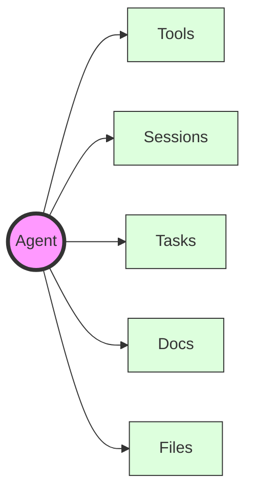

## Overview

Agents in Julep are:
- simple stateful entities
- the main components of your AI applications
- they have access to [tools](/docs/concepts/tools), [sessions](/docs/concepts/sessions) and [multi-step tasks](/docs/concepts/tasks)
- you can associate [docs](/docs/concepts/docs) (for retrieval) and [files](/docs/concepts/files) (for storage) with an agent
- you can create [tasks](/docs/concepts/tasks) and start executing them
- you can add one or more agents to a [session](/docs/concepts/sessions) and chat with them (enabling multi-agent conversations)

## Agent Configuration Options

When creating an agent, you can specify several configuration options:

| Option | Type | Description |
|--------|------|-------------|
| `name` | string | The name of your agent |
| `model` | string | The language model to use (e.g., "claude-3.5-sonnet", "gpt-4") |
| `about` | string | A description of your agent's purpose and capabilities |
| `instructions` | string \| array | Instructions for the agent to follow |
| `metadata` | object | Additional metadata for your agent |
| `tools` | array | List of tools the agent can use |

> You can find supported models [here](/docs/concepts/models)
> You can find supported tools [here](/docs/concepts/tools)



## Anatomy of an Agent


This is what an agent looks like. You can create an agent using either the Python or Node.js SDK:

<CodeGroup>
    ```yaml YAML
    name: "My Agent"
    model: "claude-3.5-sonnet"
    about: "A helpful AI assistant that specializes in data analysis"
    instructions: "You are a helpful AI assistant that specializes in data analysis"
    metadata:
      type: "data-analysis"
    tools:
      - name: "calculate_total"
        description: "Calculate the total of a list of numbers"
        function:
          parameters:
            type: "object"
            properties:
              numbers:
                type: "array"
                items:
                  type: "number"
    ```

    ```python Python
    from julep import Julep

    client = Julep(api_key="your_api_key")

    agent = client.agents.create(
        name="My Agent",
        model="claude-3.5-sonnet",
        about="A helpful AI assistant that specializes in data analysis",
        instructions="You are a helpful AI assistant that specializes in data analysis",
        metadata={"type": "data-analysis"},
        tools=[
            {
                "name": "calculate_total",
                "description": "Calculate the total of a list of numbers",
                "function": {
                    "parameters": {"type": "object", "properties": {"numbers": {"type": "array", "items": {"type": "number"}}}}
                }
            }
        ]
    )
    ```

    ```javascript JavaScript
    import { Julep } from '@julep/sdk';

    const client = new Julep({ apiKey: 'your_api_key' });

    const agent = await client.agents.create({
        name: "My Agent",
        model: "claude-3.5-sonnet",
        about: "A helpful AI assistant that specializes in data analysis",
        instructions: "You are a helpful AI assistant that specializes in data analysis",
        metadata: {"type": "data-analysis"},
        tools: [
            {
                "name": "calculate_total",
                "description": "Calculate the total of a list of numbers",
                "function": {
                    "parameters": {"type": "object", "properties": {"numbers": {"type": "array", "items": {"type": "number"}}}}
                }
            }
        ]
    });
    ```
</CodeGroup>

## What's Next?

- [Creating an Agent](/docs/building-blocks/agents/creating-agents)
- [Agent Tools](/docs/building-blocks/agents/agent-tools)
- [Agent Tasks](/docs/building-blocks/agents/agent-tasks)
- [Agent Sessions](/docs/building-blocks/agents/agent-sessions)
- [Agent Docs](/docs/building-blocks/agents/agent-docs)