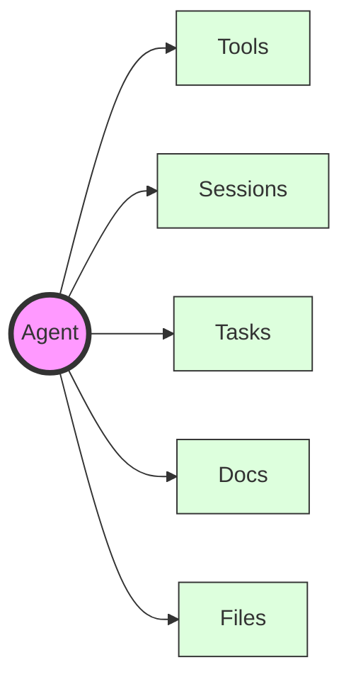

Agents are conceptual entities that encapsulate all the configurations and settings of an LLM, enabling it to adopt unique personas and execute distinct tasks within an application.

- Simple stateful entities
- The main components of your AI applications
- They have access to [tools](/docs/concepts/tools), [sessions](/docs/concepts/sessions) and [multi-step tasks](/docs/concepts/tasks)
- You can associate [docs](/docs/concepts/docs) (for retrieval) and [files](/docs/advanced/files) (for storage) with an agent
- You can create [tasks](/docs/concepts/tasks) and start executing them
- You can add one or more agents to a [session](/docs/concepts/sessions) and chat with them (enabling multi-agent conversations)

## Agent Configuration Options

When creating an agent, you can specify several configuration options:

| Option | Type | Description | Default |
|--------|------|-------------|---------|
| `name` | string | The name of your agent | Required |
| `canonical_name` | string | A unique identifier for your agent | `null` |
| `about` | string | A description of your agent's purpose and capabilities | `""` |
| `model` | string | The language model to use (e.g., "claude-3.5-sonnet", "gpt-4") | `""` |
| `instructions` | string or list[string] | Instructions for the agent to follow | `[]` |
| `metadata` | object | Additional metadata for your agent | `null` |
| `default_settings` | object | Model configuration settings. Check [supported models](/docs/integrations/supported-models) for more details | `null` |

<Info>
You can find supported models [here](/docs/integrations/supported-models)
</Info>

<Info>
You can find supported tools [here](/docs/concepts/tools)
</Info>



## Anatomy of an Agent

This is what an agent looks like. You can create an agent using either the Python or Node.js SDK:

<CodeGroup>
    ```yaml
    name: "My Agent"
    model: "claude-3.5-sonnet"
    about: "A helpful AI assistant that specializes in data analysis"
    instructions: "You are a helpful AI assistant that specializes in data analysis"
    metadata:
      type: "data-analysis"
    tools:
      - name: "calculate_total"
        description: "Calculate the total of a list of numbers"
        function:
          parameters:
            type: "object"
            properties:
              numbers:
                type: "array"
                items:
                  type: "number"
    ```

</CodeGroup>

## Creating an Agent

You can create an agent using the `create` method.

<CodeGroup>
 ```python Python
    from julep import Julep

    client = Julep(api_key="your_api_key")

    agent = client.agents.create(
        name="My Agent",
        model="claude-3.5-sonnet",
        about="A helpful AI assistant that specializes in data analysis",
        instructions="You are a helpful AI assistant that specializes in data analysis",
        metadata={"type": "data-analysis"},
        tools=[
            {
                "name": "calculate_total",
                "description": "Calculate the total of a list of numbers",
                "function": {
                    "parameters": {"type": "object", "properties": {"numbers": {"type": "array", "items": {"type": "number"}}}}
                }
            }
        ]
    )
    ```

    ```javascript JavaScript
    import { Julep } from '@julep/sdk';

    const client = new Julep({ apiKey: 'your_api_key' });

    const agent = await client.agents.create({
        name: "My Agent",
        model: "claude-3.5-sonnet",
        about: "A helpful AI assistant that specializes in data analysis",
        instructions: "You are a helpful AI assistant that specializes in data analysis",
        metadata: {"type": "data-analysis"},
        tools: [
            {
                "name": "calculate_total",
                "description": "Calculate the total of a list of numbers",
                "function": {
                    "parameters": {"type": "object", "properties": {"numbers": {"type": "array", "items": {"type": "number"}}}}
                }
            }
        ]
    });
    ```
</CodeGroup>
## Retrieving an Agent

You can retrieve an agent in two ways:

<Tabs>
  <Tab title="Using Agent ID">
    Use the agent's unique ID to fetch a specific agent:

    ```python Python
    agent_id = "9bb48ef4-b6f7-4dd8-a5ea-ab775e2e8d1b"
    client.agents.get(agent_id).json()
    ```

    Example response:

    ```python Response
    {
      "name": "Ellipsis",
      "about": "Ellipsis is an AI powered code reviewer. It can review code, provide feedback, suggest improvements, and answer questions about code.",
      "created_at": "2024-04-29T05:45:30.091656Z", 
      "updated_at": "2024-04-29T05:45:30.091657Z",
      "id": "9bb48ef4-b6f7-4dd8-a5ea-ab775e2e8d1b",
      "default_settings": {
        "frequency_penalty": 0,
        "length_penalty": 1,
        "presence_penalty": 0,
        "repetition_penalty": 1,
        "temperature": 0.7,
        "top_p": 1,
        "min_p": 0.01,
        "preset": null
      },
      "model": "gpt-4",
      "metadata": {"db_uuid": "1234"},
      "instructions": [
        "On every pull request, Review the changes made in the code. Summarize the changes made in the PR and add a comment",
        "Scrutinize the changes very deeply for potential bugs, errors, security vulnerabilities. Assume the worst case scenario and explain your reasoning for the same."
      ]
    }
    ```
  </Tab>

  <Tab title="Using Metadata Filters">
    Filter and retrieve agents based on metadata:

    ```python Python
    client.agents.list(metadata_filter={"db_uuid": "1234"})
    ```

    Example response:

    <CodeBlock>
    ```python Response
    [Agent(
        name='Ellipsis',
        about='Ellipsis is an AI-powered code reviewer. It can review code, provide feedback, suggest improvements, and answer questions about code.',
        created_at=datetime.datetime(2024, 4, 29, 5, 45, 30, 91656, tzinfo=datetime.timezone.utc),
        updated_at=datetime.datetime(2024, 4, 29, 5, 45, 30, 91657, tzinfo=datetime.timezone.utc),
        id='9bb48ef4-b6f7-4dd8-a5ea-ab775e2e8d1b',
        default_settings=None,
        model='gpt-4',
        metadata=AgentMetadata(),
        instructions=[
            'On every pull request, Review the changes made in the code. Summarize the changes made in the PR and add a comment',
            'Scrutinize the changes very deeply for potential bugs, errors, and security vulnerabilities. Assume the worst-case scenario and explain your reasoning for the same.'
        ]
    )]
    ```
    </CodeBlock>
  </Tab>
</Tabs>

<Tip>
    Check out the API reference [here](/docs/api-reference/agents) for more details on different operations you can perform on agents.
</Tip>

<Tip>
    Check out the SDK reference [here](/docs/sdk/agents) for more details on different operations you can perform on agents.
</Tip>

## Relationship of an Agent with other Concepts

In Julep agent can be associated with the following concepts:

<CardGroup cols={2}>
<Card title="Tools" icon="hammer" href="#agents-and-tools">
    Tools
</Card>

<Card title="Sessions" icon="list-check" href="#agents-and-sessions">
    Sessions
</Card>
</CardGroup>

### Agents and Sessions

Place an agent in a session to start a conversation with it.


### Agents and Tools

Place a tool in an agent to enable it to perform tasks.

## Next Steps

- [Agent Tools](/docs/concepts/tools)
- [Agent Tasks](/docs/concepts/tasks)
- [Agent Sessions](/docs/concepts/sessions)
- [Agent Docs](/docs/concepts/docs)
- [Agent Files](/docs/advanced/files)