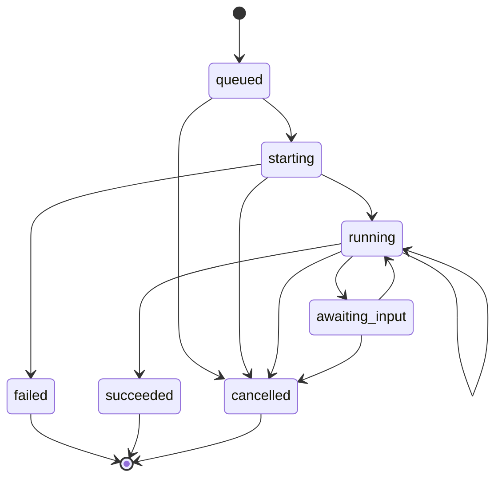

## Overview

Executions in Julep represent instances of tasks that have been initiated with specific inputs. They embody the lifecycle of a task, managing its progression through various states from initiation to completion. Understanding executions is crucial for effectively managing and monitoring the behavior of your AI agents and their workflows.

## Components

Executions are comprised of several key components that work together to manage and monitor the state of a task:

- **Execution ID**: A unique identifier for each execution instance.
- **Task ID**: The identifier of the task being executed.
- **Input**: The inputs provided to the task at the time of execution.
- **Status**: The current state of the execution (e.g., queued, running, succeeded).
- **Output**: The result produced by the execution upon completion.
- **Transitions**: The sequence of state changes that the execution undergoes.

### Execution Configuration options

| Option               | Type            | Description                                                | Default        |
|----------------------|-----------------|------------------------------------------------------------|----------------|
| `task_id`            | string          | The ID of the task to execute                              | **Required**   |
| `input`              | object          | The input to the task                                      | **Required**   |
| `metadata`           | object          | Additional metadata for the execution instance             | `null`         |


## Lifecycle of an Execution

An execution follows a well-defined lifecycle, transitioning through various states from start to finish. Understanding these states helps in monitoring and managing task executions effectively.

### Execution Statuses

Executions can exist in one of the following statuses:

| **Status**       | **Description**                                          |
| ---------------- | -------------------------------------------------------- |
| `queued`         | The execution is queued and waiting to start.            |
| `starting`       | The execution is starting.                               |
| `running`        | The execution is currently running.                      |
| `awaiting_input` | The execution is suspended and awaiting user input to resume. |
| `succeeded`      | The execution has completed successfully.                |
| `failed`         | The execution has failed due to an error.                |
| `cancelled`      | The execution has been cancelled by the user or system.  |

### Execution State Machine

The state transitions of an execution are governed by a state machine that ensures proper progression and handling of different scenarios.



## Execution State Transitions

Executions in Julep follow a specific state transition model. The transitions are governed by both the execution status and the transition type:

- **Init**: The execution is initialized.
- **Start**: The execution begins.
- **Step**: A step within the execution is executed.
- **Wait**: The execution is waiting for an external input.
- **Resume**: The execution resumes after waiting.
- **Finish**: The execution completes successfully.
- **Error**: The execution encounters an error.
- **Cancel**: The execution is cancelled.

### Transition Types

| **Transition Type** | **Description**                                     |
| -------------------- | --------------------------------------------------- |
| `init`               | Initializes the execution.                         |
| `start`              | Starts the execution process.                      |
| `step`               | Executes a step within the task.                   |
| `wait`               | Pauses execution waiting for external input.       |
| `resume`             | Resumes execution after a wait.                    |
| `finish`             | Marks the execution as successfully completed.     |
| `error`              | Marks the execution as failed due to an error.      |
| `cancel`             | Cancels the execution.                              |

## Creating an Execution

To create an execution for a specific task, use the following method in the SDKs.

<CodeGroup>
    ```python Python
    from julep import Julep
    import yaml
    client = Julep(api_key="YOUR_API_KEY")
    
    # Execute the task (assuming the task is already created)
    execution = client.executions.create(
        task_id="task_id",
        input={
            "parameter1": "value1",
            "parameter2": "value2"
        }
    )

    print(f"Execution ID: {execution.id}")
    ```

    ```javascript Node.js
    const { Julep } = require('@julep/sdk');
    const client = new Julep({ apiKey: 'YOUR_API_KEY' });
    // Execute the task (assuming the task is already created)
    const execution = await client.executions.create({
        task_id: "task_id",
        input: {
            parameter1: 'value1',
            parameter2: 'value2'
        }
    });

    console.log("Execution ID:", execution.id);
    ```
</CodeGroup>

## Monitoring an Execution

After initiating an execution, it's essential to monitor its progress and handle its completion or failure appropriately.

<CodeGroup>
    ```python Python
    import time
    from julep import Julep

    client = Julep(api_key="YOUR_API_KEY")
    execution_id = "YOUR_EXECUTION_ID"

    while True:
        result = client.executions.get(execution_id)
        print(f"Status: {result.status}")
        print(f"Current output: {result.output}")

        if result.status in ["succeeded", "failed", "cancelled"]:
            if result.status == "succeeded":
                print("Execution succeeded with output:", result.output)
            else:
                print("Execution ended with status:", result.status)
            break

        time.sleep(5)  # Wait for 5 seconds before polling again
    ```

    ```javascript Node.js
    const { Julep } = require('@julep/sdk');

    const client = new Julep({ apiKey: 'YOUR_API_KEY' });
    const executionId = 'YOUR_EXECUTION_ID';

    while (true) {
        const result = await client.executions.get(executionId);
        console.log(`Status: ${result.status}`);
        console.log(`Current output: ${result.output}`);
        if (["succeeded", "failed", "cancelled"].includes(result.status)) {
            if (result.status === "succeeded") {
                console.log("Execution succeeded with output:", result.output);
            } else {
                console.log("Execution ended with status:", result.status);
            }
            break;
        }
        await new Promise(resolve => setTimeout(resolve, 5000)); // Wait for 5 seconds before polling again
    }
    ```
</CodeGroup>

To view more details about the status of the execution and how it is transitioning between states, you can use list the transitions of an execution.

Example:

<CodeGroup>
    ```python Python
    from julep import Julep

    client = Julep(api_key="YOUR_API_KEY")
    execution_id = "YOUR_EXECUTION_ID"

    transitions = client.executions.transitions.list(execution_id)
    print(transitions.items)
    ```

    ```javascript Node.js
    const { Julep } = require('@julep/sdk');

    const client = new Julep({ apiKey: 'YOUR_API_KEY' });
    const executionId = 'YOUR_EXECUTION_ID';

    const transitions = await client.executions.transitions.list(executionId);
    console.log(transitions.items);
    ```
</CodeGroup>

## Updating/Cancelling an Execution

To update or cancel an execution, you can use the `change_status` method in the SDKs.

Example:

<CodeGroup>
    ```python Python
    from julep import Julep

    client = Julep(api_key="YOUR_API_KEY")
    execution_id = "YOUR_EXECUTION_ID"

    # To cancel an execution
    client.executions.change_status(execution_id=execution_id, status="cancelled")
    # To resume an execution with specific input
    client.executions.change_status(
        execution_id=execution_id,
        status="running",
        input={
            "parameter1": "value1",
            "parameter2": "value2"
        }
    )
    ```

    ```javascript Node.js
    const { Julep } = require('@julep/sdk');

    const client = new Julep({ apiKey: 'YOUR_API_KEY' });
    const executionId = 'YOUR_EXECUTION_ID';

    // To cancel an execution
    await client.executions.changeStatus(executionId, 'cancelled');
    // To resume an execution with specific input
    await client.executions.changeStatus(
        executionId,
        'running',
        {
            input: {
                "parameter1": "value1",
                "parameter2": "value2"
            }
        }
    );
    ```
</CodeGroup>

## Best Practices

<CardGroup cols={3}>
    <Card title="Handle All Statuses" icon="check">
        <ul>
            <li>1. Ensure your application gracefully handles all possible execution statuses, including `failed` and `cancelled`.</li>
        </ul>
    </Card>
    <Card title="Polling Interval" icon="clock">
        <ul>
            <li>1. Choose an appropriate polling interval to balance responsiveness and API usage.</li>
        </ul>
    </Card>
    <Card title="Logging" icon="file">
        <ul>
            <li>1. Maintain detailed logs of execution statuses and outputs for auditing and debugging purposes.</li>
        </ul>
    </Card>
</CardGroup>