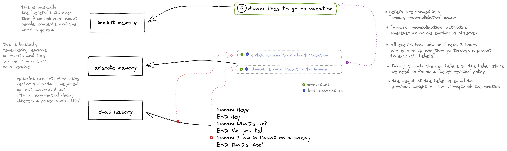

# Overview

## Overview

Julep AI offers a unique and user-friendly API for interacting with our finetuned large language model, "Samantha-1". Samantha-1 stands out with its consistent, fun personality, granular control using screenplay-inspired "sections", and a stateful API that manages context, history, and prompts on behalf of the users.

Samantha-1 is our newest LLM with a refreshing, emotive personality by default. It's available as a stateful API that learns from user interactions. We automatically mine "beliefs" in the background and inject them into future conversations.

### Features

* **Distinct Personality**: Samantha-1 offers a fun and consistent personality, making interactions more engaging and enjoyable for users.
* **Granular Control**: Inspired by screenplay writing, our model uses "sections" that provide users with an unprecedented level of control over the conversation flow.
* **Stateful API**: Our user-friendly API allows developers to interact with Samantha-1 directly while taking care of context, history, and prompt management automatically.

### Memory

Our API — Samantha — manages user conversation history and builds an internal memory about them. It automatically mines and stores "beliefs" in the background and strategically injects them into future conversations.

This memory capability enables Samantha to provide richer, more context-aware conversations, bringing a personal touch to applications like therapeutic support, personal coaching, companionship, and gaming.

***

## Motivation

With the growing need for AI-enabled conversation interfaces, we identified a gap in the market for a solution that is both easy to integrate and provides granular control over the conversation. With Samantha-1 and our stateful API, we aim to fill this gap, providing a service that is robust, customizable, and user-friendly.

### Why Samantha

The idea of building an AI that not only knows us but grows with us is fascinating, and something I believe has the potential to revolutionize how we interact with technology. To achieve this, we realized we needed two things: an AI model with emotive and empathetic capabilities and a sophisticated memory system that could continually learn from users.

Before Samantha, we had built an AI sales agent for Shopify stores. While working on this project, we realized the need for continual learning to tailor conversations and find relevant user recommendations. We also found that existing models from OpenAI et al. weren't adaptable at all for creating consistent and expressive personalities.&#x20;

So, we ended up creating Samantha initially for ourselves. However, as we shared what we were building, many people told us that they \*really\* wanted to use it for their own applications. That's when we realized the potential of Samantha and decided to transform it into a more accessible API.

***

## Use Cases

* **Personal Assistants**: Create AI personal assistants with a fun and consistent personality.
* **Customer Service**: Automate customer service with a system that can remember past interactions and respond accordingly.
* **Empathetic systems**: For use cases such as therapeutic support, personal coaching, and companionship.
* **Games and Interactive Media**: Create engaging characters and interactive dialogues for games and media.
* **Community Engagement:** Connect and empower users to engage with brand communities on channels such as WhatsApp

<figure><figcaption></figcaption></figure>
