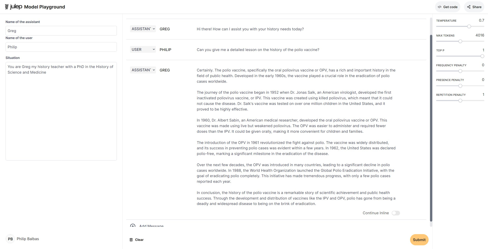
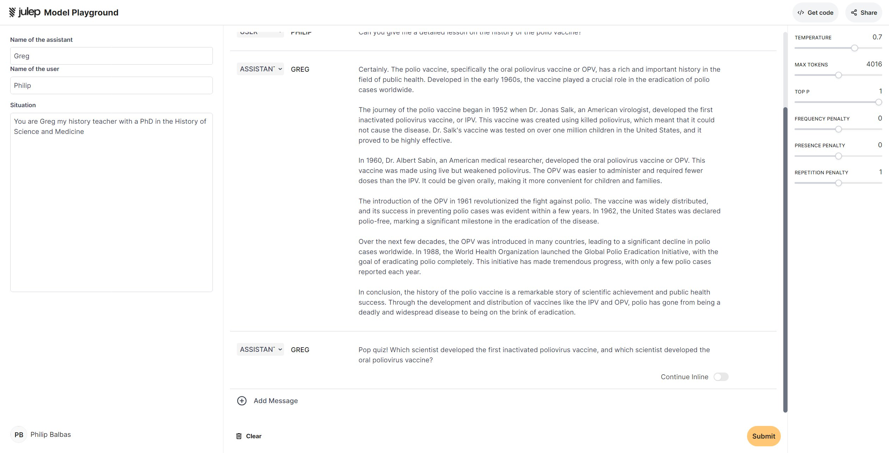

# Model Playground

## Introduction

This guide will walk you through the process of utilizing the Model Playground for the Samantha model. This tool allows you to interact with a powerful language model, generating text based on your inputs.

***

## Signing up

To begin using the Model Playground, you must first sign up for an account. Follow these steps:

<figure></figure>

1. Visit the [Model Playground platform](http://platform.julep.ai).
2. Click on the "Sign in With google" button.

## Navigating the Dashboard

<figure></figure>

After logging in, you will be directed to the dashboard. Here, you can find various options and features available to you. Take some time to familiarize yourself with the layout and navigation.

## Using Model Playground

The Model Playground allows you to interact with Samantha. Follow these steps to effectively utilize it:

<figure></figure>

<figure></figure>

1. Select parameters such as temperature, max tokens and top p.
2. Inputting text prompts
   1. In the provided text boxes, you can modify the user name, assistant name and situation.
   2. Click on "Add Message", select the message role, and input the prompt message
3. Interpreting output
   1. Once you've inputted your prompt, click on the "Submit" button.
   2. The model will then generate text based on your prompt and parameters.

## Using the "continue" feature

<figure></figure>

<figure></figure>

1. To use the "continue" feature, select either the assistant or thought roles.
2. Enter a prompt that you want to the model to fill.
3. Click on the "Submit" button and the model will fill out the rest.

## Copying and Sharing Results

<figure></figure>

<figure></figure>

If you're satisfied with the generated text, you can copy the code for use in your codebases or share it with others.+

1. Click on the "Get code" button or the "Share" button on the top left side.
2. Click on "Copy"

## Conclusion

Congratulations! You've successfully learned how to use the Model Playground for an Samantha. Continue exploring and experimenting with different prompts and parameters to unlock the full potential of this powerful tool.
